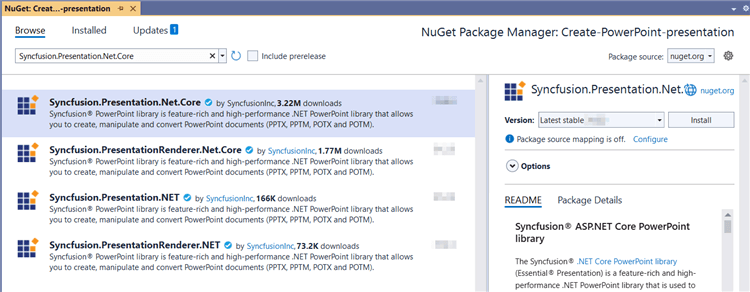
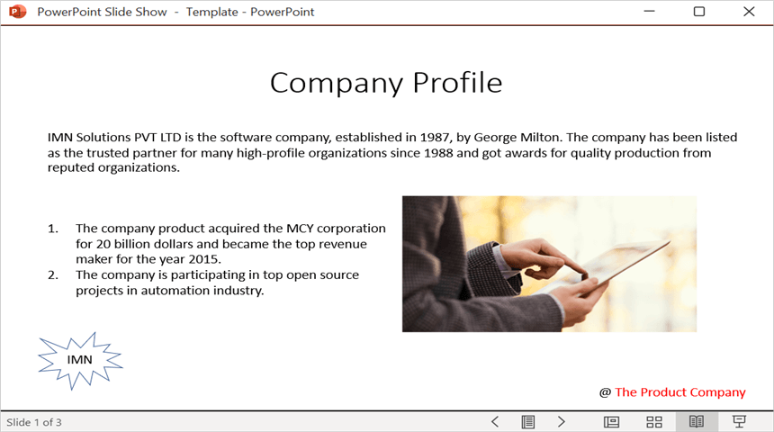

# Open and save Presentation in ASP.NET Core Web API

Syncfusion&reg; PowerPoint is a [.NET PowerPoint library](https://www.syncfusion.com/document-processing/powerpoint-framework/net) used to create, read, and edit **PowerPoint presentation** programmatically without **Microsoft PowerPoint** or interop dependencies. Using this library, you can **open and save a Presentation in ASP.NET Core Web API**.

## Steps to Open and save a Presentation programmatically:

The below steps illustrate creating a simple PowerPoint Presentation in ASP.NET Core Web API.

Step 1: Create a new C# ASP.NET Core Web API project.

Step 2: Install the [Syncfusion.Presentation.Net.Core](https://www.nuget.org/packages/Syncfusion.Presentation.Net.Core/) NuGet package as a reference to your project from [NuGet.org](https://www.nuget.org).

N> Starting with v16.2.0.x, if you reference Syncfusion&reg; assemblies from trial setup or from the NuGet feed, you also have to add "Syncfusion.Licensing" assembly reference and include a license key in your projects. Please refer to this [link](https://help.syncfusion.com/common/essential-studio/licensing/overview) to know about registering Syncfusion&reg; license key in your application to use our components.

Step 3: Add a new API controller empty file in the project.

Step 4: Include the following namespaces in the **ValuesController.cs** file.





using Microsoft.AspNetCore.Mvc;
using Syncfusion.Presentation;





Step 5: Add a new action method DownloadPresentation in **ValuesController.cs** and include the below code snippet to create an PowerPoint Presentation and download it.





[HttpGet]
[Route("api/PowerPoint")]
public IActionResult DownloadPresentation()
{
    try
    {
        var fileDownloadName = "Output.pptx";
        const string contentType = "application/vnd.openxmlformats-officedocument.presentationml.presentation";
        var stream = OpenandSavePresentation();
        stream.Position = 0;
        return File(stream, contentType, fileDownloadName);
    }
    catch (Exception ex)
    {
        return BadRequest("Error occurred while creating PowerPoint file: " + ex.Message);
    }
}
 
 



Step 6: Implement the `OpenandSavePresentation` method in `ValuesController.cs`.
 




 public static MemoryStream OpenandSavePresentation()
 {
    IPresentation pptxDoc = Presentation.Open(Path.GetFullPath(@"Data/Template.pptx"));
    //Get the first slide from the PowerPoint presentation.
    ISlide slide = pptxDoc.Slides[0];
    //Get the first shape of the slide.
    IShape shape = slide.Shapes[0] as IShape;
    //Change the text of the shape.
    if (shape.TextBody.Text == "Company History")
        shape.TextBody.Text = "Company Profile";
    // Save the PowerPoint Presentation as stream
    MemoryStream stream = new MemoryStream();
    pptxDoc.Save(stream);
    pptxDoc.Close();
    stream.Position = 0;
    return stream;
}





Step 7: Build the project.

Click on Build → Build Solution or press <kbd>Ctrl</kbd>+<kbd>Shift</kbd>+<kbd>B</kbd> to build the project.

Step 8: Run the project.

Click the Start button (green arrow) or press <kbd>F5</kbd> to run the app.

A complete working sample is available on [GitHub](https://github.com/SyncfusionExamples/PowerPoint-Examples/tree/master/Getting-started/ASP.NET-Core-Web-API/Create-PowerPoint-presentation).

## Steps for accessing the Web API using HTTP requests

Step 1: Create a console application.

N> Ensure your ASP.NET Core Web API is running on the specified port before running this client. Adjust the port number if your Web API runs on a different port (check the ASP.NET Core app's launch settings).

Step 2: Add the below code snippet in the **Program.cs** file for accessing the Web API using HTTP requests. 

This method sends a GET request to the Web API endpoint to retrieve and save the generated PowerPoint Presentation.





// Create an HttpClient instance
using (HttpClient client = new HttpClient())
{
    try
    {
        // Send a GET request to a URL
        HttpResponseMessage response = await client.GetAsync("https://localhost:7055/api/Values/api/PowerPoint");

        // Check if the response is successful
        if (response.IsSuccessStatusCode)
        {
            // Read the content as a string
            Stream responseBody = await response.Content.ReadAsStreamAsync();
            FileStream fileStream = File.Create("../../../Output/Output.pptx");
            responseBody.CopyTo(fileStream);
            fileStream.Close();
        }
        else
        {
            Console.WriteLine("HTTP error status code: " + response.StatusCode);
        }
    }
    catch (HttpRequestException e)
    {
        Console.WriteLine("Request exception: " + e.Message);
    }
}





Step 3: Build the project.

Click on Build → Build Solution or press <kbd>Ctrl</kbd>+<kbd>Shift</kbd>+<kbd>B</kbd> to build the project.

Step 4: Run the project.

Click the Start button (green arrow) or press <kbd>F5</kbd> to run the app.

A complete working sample is available on [GitHub](https://github.com/SyncfusionExamples/PowerPoint-Examples/tree/master/Getting-started/ASP.NET-Core-Web-API/Client-Application).

Upon executing the program, the **PowerPoint Presentation** will be generated as follows.

Click [here](https://www.syncfusion.com/document-processing/powerpoint-framework/net-core) to explore the rich set of Syncfusion&reg; PowerPoint Library (Presentation) features. 

