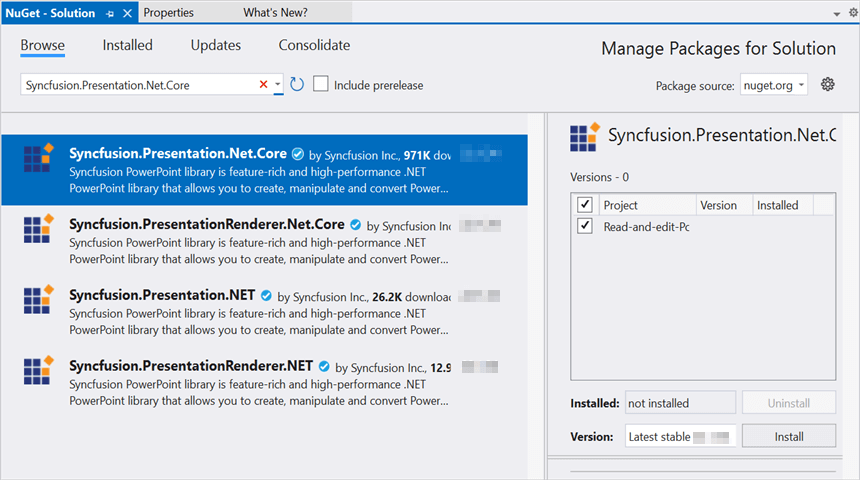

# Open and save Presentation in ASP.NET Core

Syncfusion PowerPoint is a [.NET Core PowerPoint library](https://www.syncfusion.com/document-processing/powerpoint-framework/net-core) used to create, read, edit and convert PowerPoint documents programmatically without **Microsoft PowerPoint** or interop dependencies. Using this library, you can **open and save a Presentation in ASP.NET Core**.

## Steps to open and save PowerPoint Presentation programmatically

Step 1: Create a new C# ASP.NET Core Web application project.

Step 2: Install the [Syncfusion.Presentation.Net.Core](https://www.nuget.org/packages/Syncfusion.Presentation.Net.Core/) NuGet package as reference to your .NET Standard applications from [NuGet.org](https://www.nuget.org/).

N> Starting with v16.2.0.x, if you reference Syncfusion assemblies from trial setup or from the NuGet feed, you also have to add "Syncfusion.Licensing" assembly reference and include a license key in your projects. Please refer to this [link](https://help.syncfusion.com/common/essential-studio/licensing/overview) to know about registering Syncfusion license key in your application to use our components.
Step 3: Include the following namespaces in **HomeController.cs**.




using Syncfusion.Presentation;




Step 4: A default action method named Index will be present in **HomeController.cs**. Right click on Index method and select **Go To View** where you will be directed to its associated view page **Index.cshtml**.

Step 5: Add a new button in the **Index.cshtml** as shown below.




@{
    Html.BeginForm("OpenAndSavePresentation", "Home", FormMethod.Get);
    {
        

            <input type="submit" value="Open and Save Presentation" style="width:150px;height:27px" />
        

    }
    Html.EndForm();
}




Step 6: Add a new action method **OpenAndSavePresentation** in HomeController.cs and include the below code snippet to **open an existing Presentation in ASP.NET Core**.




FileStream fileStreamPath = new(Path.GetFullPath(@"Data/Template.pptx"), FileMode.Open, FileAccess.Read, FileShare.ReadWrite);
//Open an existing PowerPoint presentation.
IPresentation pptxDoc = Presentation.Open(fileStreamPath);




Step 7: Add below code snippet demonstrates accessing a shape from a slide and changing the text within it.




//Get the first slide from the PowerPoint presentation.
ISlide slide = pptxDoc.Slides[0];
//Get the first shape of the slide.
IShape shape = slide.Shapes[0] as IShape;
//Change the text of the shape.
if (shape.TextBody.Text == "Company History")
shape.TextBody.Text = "Company Profile";




Step 8: Add below code example to **save the PowerPoint Presentation in ASP.NET Core**.




//Save the PowerPoint Presentation as stream.
MemoryStream pptxStream = new();
pptxDoc.Save(pptxStream);
pptxStream.Position = 0;
//Download Powerpoint document in the browser.
return File(pptxStream, "application/powerpoint", "Result.pptx");




You can download a complete working sample from [GitHub](https://github.com/SyncfusionExamples/PowerPoint-Examples/tree/master/Read-and-save-PowerPoint-presentation/Open-and-save-PowerPoint/ASP.NET-Core)

By executing the program, you will get the **PowerPoint document** as follows.

Click [here](https://www.syncfusion.com/document-processing/powerpoint-framework/net-core) to explore the rich set of Syncfusion PowerPoint Library (Presentation) features. 