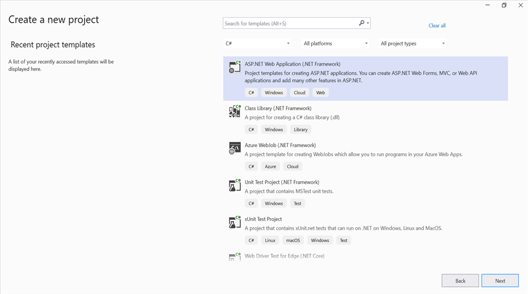
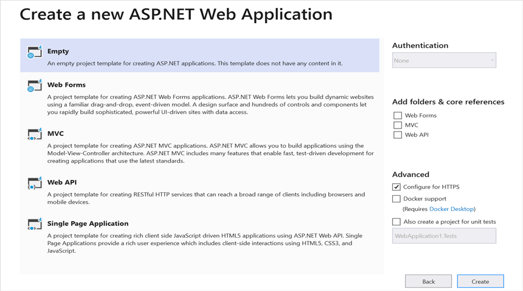
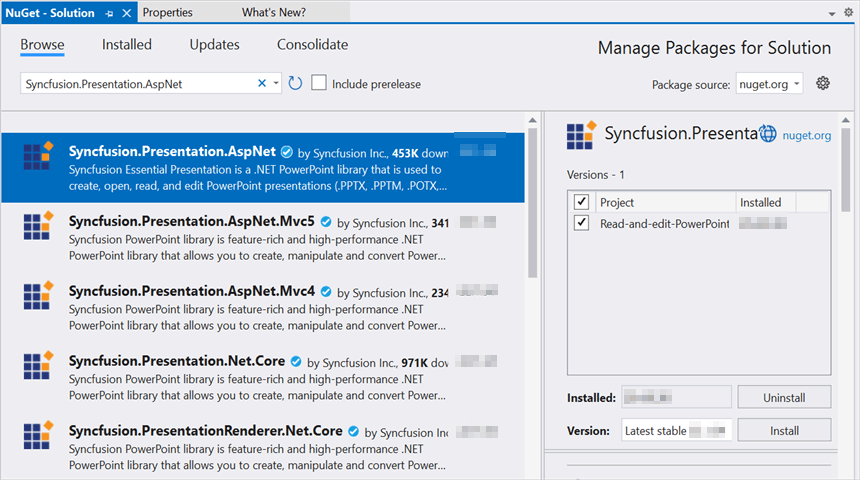

# Open and save Presentation in ASP.NET

N> The ASP.NET Web Forms platform is deprecated. You can use the same product from the ASP.NET Core platform. For more information on migrating the [.NET PowerPoint Library](https://www.syncfusion.com/document-sdk/net-powerpoint-library) from .NET Framework to .NET Core, refer [here](https://help.syncfusion.com/document-processing/powerpoint/powerpoint-library/net/faqs/migrate-from-net-framework-to-net-core). This content is retained for legacy support.

Syncfusion&reg; PowerPoint is a [.NET PowerPoint library](https://www.syncfusion.com/document-sdk/net-powerpoint-library) used to create, read, edit and convert PowerPoint documents programmatically without **Microsoft PowerPoint** or interop dependencies. Using this library, you can **open and save a PowerPoint presentation in ASP.NET**.

## Steps to open and save PowerPoint Presentation programmatically

Step 1: In Visual Studio, create a new C# **ASP.NET Web Forms Application** project.

Step 2: Select the **Empty** template to create the project. After the project is created, add a new **Web Form** item named `MainPage.aspx` (right-click the project → **Add** → **New Item** → **Web Form**).

Step 3: Install the [Syncfusion.Presentation.AspNet](https://www.nuget.org/packages/Syncfusion.Presentation.AspNet/) NuGet package as a reference to your .NET Framework application from [NuGet.org](https://www.nuget.org/).

N> Starting with v16.2.0.x, if you reference Syncfusion&reg; assemblies from the trial setup or from the NuGet feed, you must also add the `Syncfusion.Licensing` assembly reference and include a license key in your projects. Refer to this [link](https://help.syncfusion.com/common/essential-studio/licensing/overview) to learn about registering the Syncfusion&reg; license key in your application.

Step 4: Open `MainPage.aspx.cs` and include the following namespaces, then add the `MainPage` partial class declaration that the `MainPage.aspx` markup inherits from.



using System;
using System.Web.UI;
using Syncfusion.Presentation;

namespace Read_and_edit_PowerPoint_presentation
{
    public partial class MainPage : Page
    {
    }
}



Step 5: Add a new button in the **MainPage.aspx** as shown below.




<%@ Page Language="C#" AutoEventWireup="true" CodeBehind="MainPage.aspx.cs" Inherits="Read_and_edit_PowerPoint_presentation.WebForm1" %>
<!DOCTYPE html>
<html xmlns="http://www.w3.org/1999/xhtml">
<head runat="server">
<title>Open and Save Presentation</title>
</head>
<body>
    <form id="form1" runat="server">
        

            <asp:Button ID="Button1" runat="server" Text="Open and Save Presentation" OnClick="OnButtonClicked" />
        

    </form>
</body>
</html>




Step 6: Add the `OnButtonClicked` handler in `MainPage.aspx.cs` to open an existing PowerPoint presentation, edit a shape, and stream the result to the client. The complete handler is shown below.



protected void OnButtonClicked(object sender, EventArgs e)
{
    // Open an existing PowerPoint presentation
    IPresentation pptxDoc = Presentation.Open(Server.MapPath("~/App_Data/Template.pptx"));

    // Get the first slide from the PowerPoint presentation
    ISlide slide = pptxDoc.Slides[0];
    // Get the first shape of the slide
    IShape shape = slide.Shapes[0] as IShape;
    // Change the text of the shape
    if (shape != null && shape.TextBody != null && shape.TextBody.Text == "Company History")
    {
        shape.TextBody.Text = "Company Profile";
    }

    // Save the PowerPoint presentation to the HTTP response (downloads the file in the browser)
    pptxDoc.Save("Result.pptx", FormatType.Pptx, Response);
    // Close the PowerPoint presentation to release resources
    pptxDoc.Close();
    Response.End();
}



**Step 7:** Run the application and click **Open and Save Presentation**. The browser downloads `Result.pptx`, which contains the modified text on the first slide.

You can download a complete working sample from [GitHub](https://github.com/SyncfusionExamples/PowerPoint-Examples/tree/master/Read-and-save-PowerPoint-presentation/Open-and-save-PowerPoint/ASP.NET).

By executing the program, you will get the **PowerPoint document** as follows.

Looking for the full .NET PowerPoint Library component overview, features, pricing, and documentation? Visit the  [.NET PowerPoint Library](https://www.syncfusion.com/document-sdk/net-powerpoint-library) page.