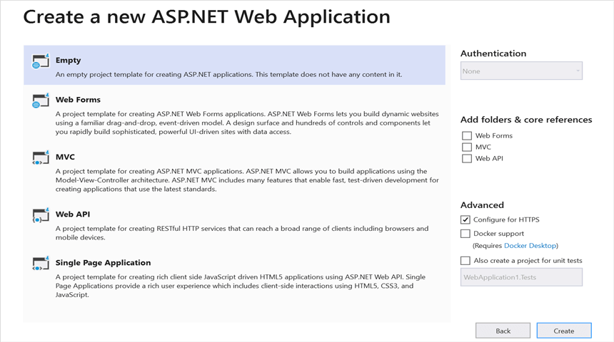
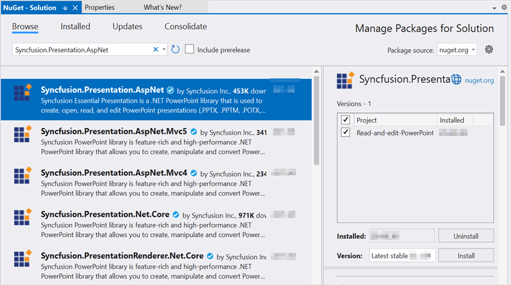

# Open and save Presentation in ASP.NET

Syncfusion® PowerPoint is a [.NET PowerPoint library](https://www.syncfusion.com/document-processing/powerpoint-framework/net) used to create, read, edit and convert PowerPoint documents programmatically without **Microsoft PowerPoint** or interop dependencies. Using this library, you can **open and save a Presentation in ASP.NET**.

N> This ASP.NET Web Form platform is deprecated, you can use the same product from ASP.NET Core platform. For more information on migrating the .NET Word library from .NET Framework to .NET Core, refer [here](https://help.syncfusion.com/document-processing/powerpoint/powerpoint-library/net/faqs/migrate-from-net-framework-to-net-core).

## Steps to open and save PowerPoint Presentation programmatically

Step 1: Create a new C# ASP.NET Web application project.

Step 2: Select the **Empty** template to create the project.

Step 3: Install the [Syncfusion.Presentation.AspNet](https://www.nuget.org/packages/Syncfusion.Presentation.AspNet/) NuGet package as reference to your .NET Standard applications from [NuGet.org](https://www.nuget.org/).

N> Starting with v16.2.0.x, if you reference Syncfusion® assemblies from trial setup or from the NuGet feed, you also have to add "Syncfusion.Licensing" assembly reference and include a license key in your projects. Please refer to this [link](https://help.syncfusion.com/common/essential-studio/licensing/overview) to know about registering Syncfusion® license key in your application to use our components.

Step 4: Include the following namespaces in **MainPage.aspx.cs**.




using Syncfusion.Presentation;




Step 5: Add a new button in the **MainPage.aspx** as shown below.




<%@ Page Language="C#" AutoEventWireup="true" CodeBehind="MainPage.aspx.cs" Inherits="Read_and_edit_PowerPoint_presentation.WebForm1" %>
<!DOCTYPE html>
<html xmlns="http://www.w3.org/1999/xhtml">
<head runat="server">
<title></title>
</head>
<body>
    <form id="form1" runat="server">
        

       <asp:Button ID="Button1" runat="server" Text="Open and Save Presentation" OnClick="OnButtonClicked" />
       

    </form>
</body>
</html>




Step 6: Include the below code snippets in the click event of the button in **MainPage.aspx.cs**, to **open an existing PowerPoint Presentation in ASP.NET**.




//Open an existing PowerPoint presentation
IPresentation pptxDoc = Presentation.Open(Server.MapPath("~/App_Data/Template.pptx"));




Step 7: Add below code snippet demonstrates accessing a shape from a slide and changing the text within it.




//Gets the first slide from the PowerPoint presentation
ISlide slide = pptxDoc.Slides[0];
//Gets the first shape of the slide
IShape shape = slide.Shapes[0] as IShape;
//Change the text of the shape
if (shape.TextBody.Text == "Company History")
    shape.TextBody.Text = "Company Profile";




Step 8: Add below code example to **save the PowerPoint Presentation in ASP.NET**.




//Save the PowerPoint presentation
pptxDoc.Save("Result.pptx", FormatType.Pptx, Response);
//Close the PowerPoint presentation
pptxDoc.Close();




You can download a complete working sample from [GitHub](https://github.com/SyncfusionExamples/PowerPoint-Examples/tree/master/Read-and-save-PowerPoint-presentation/Open-and-save-PowerPoint/ASP.NET).

By executing the program, you will get the **PowerPoint document** as follows.

Click [here](https://www.syncfusion.com/document-processing/powerpoint-framework/net) to explore the rich set of Syncfusion® PowerPoint Library (Presentation) features.