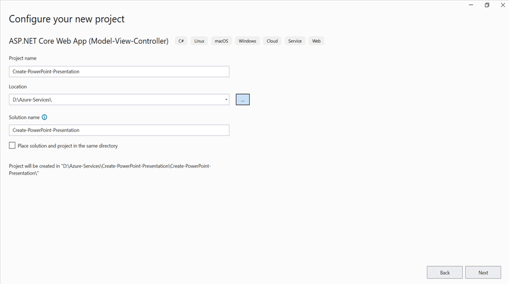
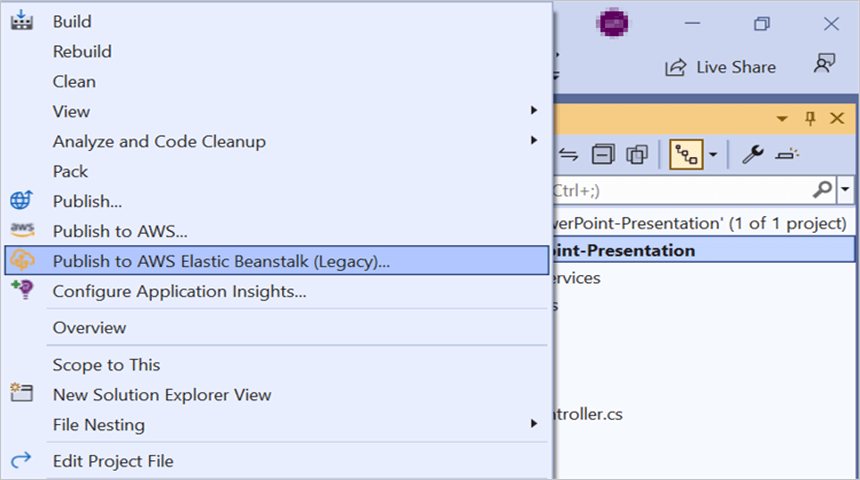
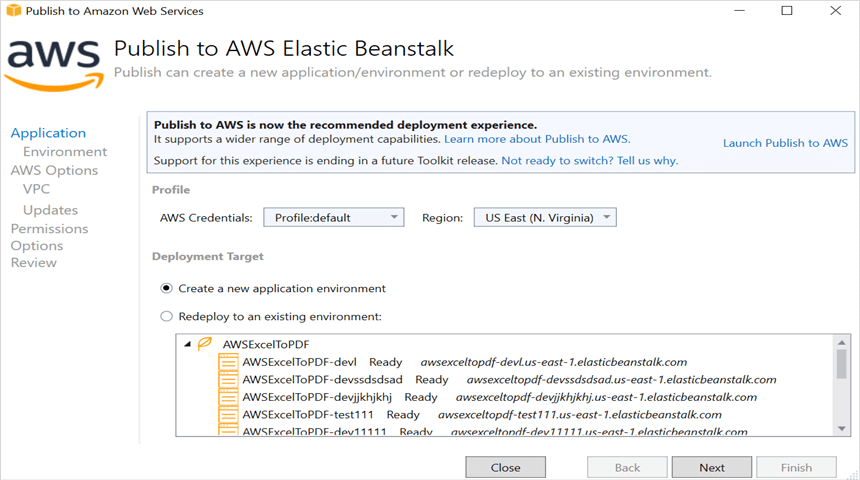
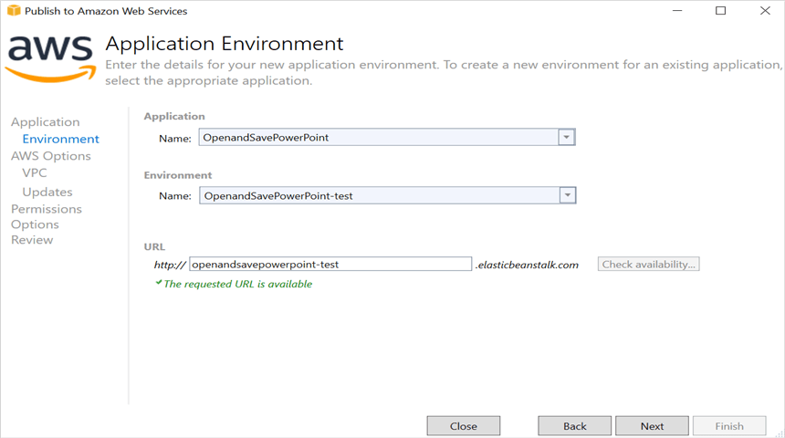
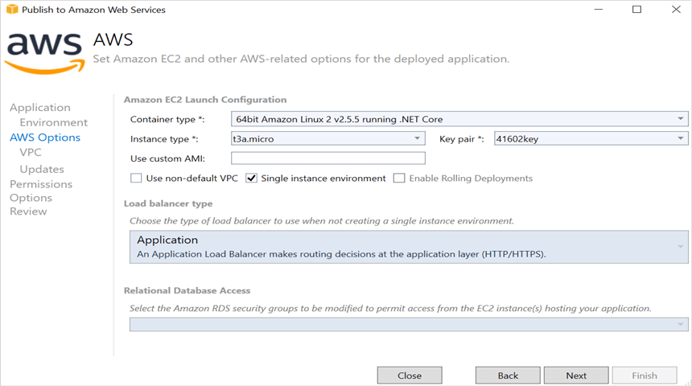
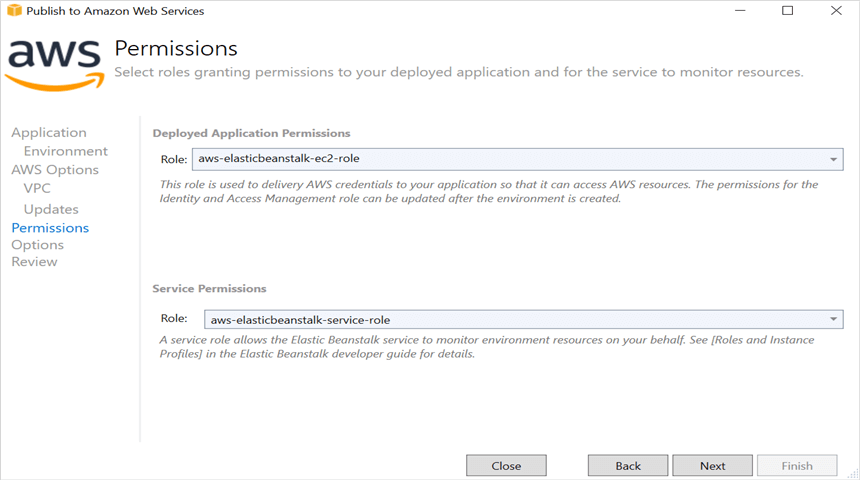
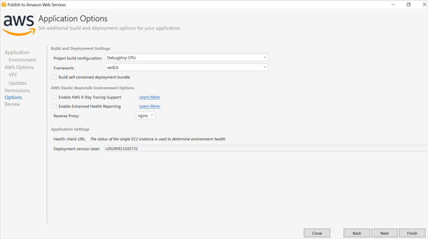
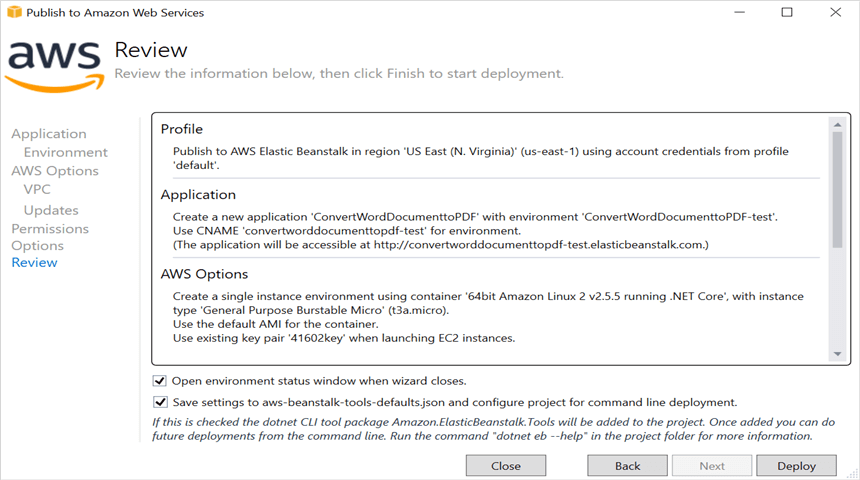
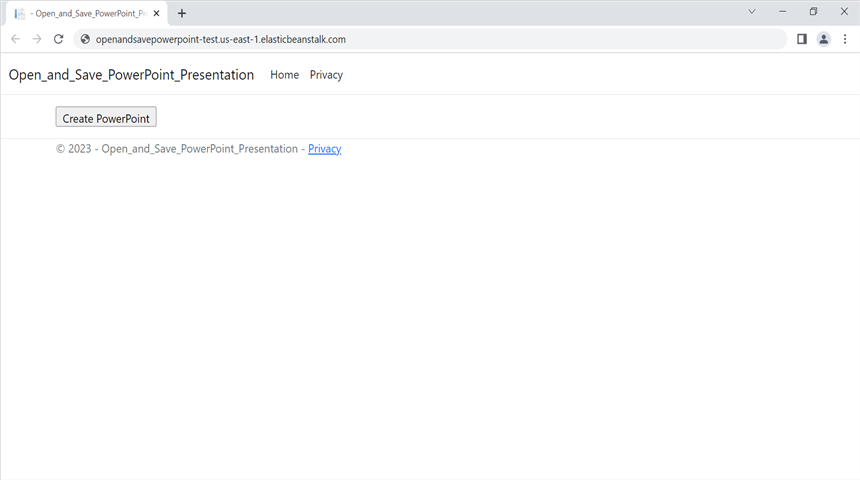

# Open and Save Presentation in AWS Elastic Beanstalk

Syncfusion&reg; PowerPoint is a [.NET Core PowerPoint library](https://www.syncfusion.com/document-sdk/net-powerpoint-library) used to create, read, edit and convert PowerPoint documents programmatically without **Microsoft PowerPoint** or interop dependencies. Using this library, you can **open and save a Presentation in AWS Elastic Beanstalk**.

## Steps to open and save a Presentation in AWS Elastic Beanstalk

Step 1: Create a new ASP.NET Core Web App (Model-View-Controller).

Step 2: Create a project name and select the location.

Step 3: Click **Create** button.

Step 4: Install the [Syncfusion.Presentation.Net.Core](https://www.nuget.org/packages/Syncfusion.Presentation.Net.Core) NuGet package as a reference to your project from [NuGet.org](https://www.nuget.org/).

N> Starting with v16.2.0.x, if you reference Syncfusion&reg; assemblies from trial setup or from the NuGet feed, you also have to add "Syncfusion.Licensing" assembly reference and include a license key in your projects. Please refer to this [link](https://help.syncfusion.com/common/essential-studio/licensing/overview) to know about registering Syncfusion&reg; license key in your application to use our components.

Step 5: Add a new button in **Views/Home/Index.cshtml** as shown below.




@{
    Html.BeginForm("CreatePowerPoint", "Home", FormMethod.Get);
    {
        

            <input type="submit" value="Create PowerPoint" style="width:150px;height:27px" />
        

    }
    Html.EndForm();
}




Step 6: Include the following namespaces in **HomeController.cs**.




using Microsoft.AspNetCore.Mvc;
using Syncfusion.Presentation;
using System.IO;




Step 7: Add a new action method **CreatePowerPoint** in HomeController.cs (the class must inherit from `Controller`) and include the below code snippet to **open an existing PowerPoint Presentation from the wwwroot folder**.




public IActionResult CreatePowerPoint()
{
    //Open an existing PowerPoint presentation using the file path overload.
    using IPresentation pptxDoc = Presentation.Open(Path.GetFullPath("wwwroot/Data/Input.pptx"));

    //Get the first slide from the PowerPoint presentation.
    ISlide slide = pptxDoc.Slides[0];
    //Get the first shape of the slide.
    IShape shape = slide.Shapes[0] as IShape;
    //Change the text of the shape.
    if (shape.TextBody.Text == "Company History")
        shape.TextBody.Text = "Company Profile";

    //Save the PowerPoint Presentation as stream.
    MemoryStream pptxStream = new();
    pptxDoc.Save(pptxStream);
    pptxStream.Position = 0;
    //Download Powerpoint document in the browser.
    return File(pptxStream, "application/powerpoint", "Result.pptx");
}




## Steps to publish to AWS Elastic Beanstalk

N> Before publishing, ensure you have an active **AWS account**, have installed the **AWS Toolkit for Visual Studio** (from **Extensions > Manage Extensions** or the [AWS download page](https://aws.amazon.com/visualstudio/)), and have configured your AWS credentials in the toolkit.

Step 1: Right-click the project and select **Publish to AWS Elastic Beanstalk (Legacy)** option.

Step 2: Select the **Deployment Target** as **Create a new application environment** and click **Next** button.

Step 3: Choose the **Environment Name** in the dropdown list and the **URL** will be automatically assigned. Check that the URL is available; if so, click **Next**. Otherwise, change the **URL**.

Step 4: Select the **t3a.micro** instance type from the dropdown list and click **Next**.

Step 5: Click the **Next** button to proceed further.

Step 6: Click the **Next** button.

Step 7: Click the **Deploy** button to deploy the sample on AWS Elastic Beanstalk.

Step 8: After changing the status from **Updating** to **Environment is healthy**, click the **URL**.

Step 9: After opening the provided **URL**, click **Create PowerPoint** button to download the PowerPoint document.

You can download a complete working sample from [GitHub](https://github.com/SyncfusionExamples/PowerPoint-Examples/tree/master/Read-and-save-PowerPoint-presentation/Open-and-save-PowerPoint/AWS/AWS_Elastic_Beanstalk).

By executing the program, you will get the **PowerPoint document** as follows.

Looking for the full .NET PowerPoint Library component overview, features, pricing, and documentation? Visit the  [.NET PowerPoint Library](https://www.syncfusion.com/document-sdk/net-powerpoint-library) page.

## See also

* [Create a PowerPoint document in AWS Elastic Beanstalk](Create-PowerPoint-Presentation-in-AWS-Elastic-Beanstalk)
* [Open and save a Presentation in AWS](Open-and-Save-PowerPoint-Presentation-in-AWS)
* [Open and save a Presentation in AWS Lambda](Open-and-Save-PowerPoint-Presentation-in-AWS-Lambda)
* [Open and save a Presentation in AWS S3 Cloud Storage](Open-and-Save-PowerPoint-Presentation-in-AWS-S3-Cloud-Storage)
