# Open and save PowerPoint presentation in AWS Lambda

Syncfusion&reg; PowerPoint is a [.NET Core PowerPoint library](https://www.syncfusion.com/document-sdk/net-powerpoint-library) used to create, read, edit and convert PowerPoint documents programmatically without **Microsoft PowerPoint** or interop dependencies. Using this library, you can **open and save a PowerPoint presentation in AWS Lambda**.

## Prerequisites

* An active **Amazon Web Services (AWS) account**. If you do not have one, [create an account](https://aws.amazon.com/) before starting.
* **Visual Studio** with the [AWS Toolkit for Visual Studio](https://aws.amazon.com/visualstudio/) extension installed.
* A Syncfusion license key. Refer to this [link](https://help.syncfusion.com/common/essential-studio/licensing/overview) to know about registering a Syncfusion&reg; license key in your application.
* A sample input file (for example, `Template.pptx`) placed in the project as described in Step 4.

## Steps to open and save a PowerPoint presentation in AWS Lambda

Step 1: In Visual Studio, create a new **AWS Lambda project** (.NET Core) using the **AWS Lambda Project** template. In the project creation dialog, name the project (for example, `OpenAndSavePowerPointLambda`) and click **Create**.

Step 2: Select Blueprint as Empty Function and click **Finish**.
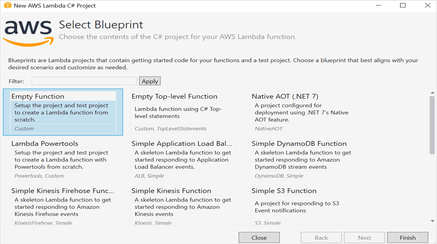

Step 3: Install the [Syncfusion.Presentation.Net.Core](https://www.nuget.org/packages/Syncfusion.Presentation.Net.Core) NuGet package as a reference to your project from [NuGet.org](https://www.nuget.org/).

N> Starting with v16.2.0.x, if you reference Syncfusion&reg; assemblies from trial setup or from the NuGet feed, you also have to add the `Syncfusion.Licensing` assembly reference and include a license key in your projects. Please refer to this [link](https://help.syncfusion.com/common/essential-studio/licensing/overview) to know about registering a Syncfusion&reg; license key in your application to use our components.

N> Register the Syncfusion license key at the beginning of the `FunctionHandler` in **Function.cs** before performing any Syncfusion library operations. Refer to the [license key generation](https://help.syncfusion.com/common/essential-studio/licensing/how-to-generate) and [application registration](https://help.syncfusion.com/common/essential-studio/licensing/how-to-register-in-an-application) guides for details. A minimal registration is shown below.




//Register the Syncfusion license key before using any Syncfusion types.
Syncfusion.Licensing.SyncfusionLicenseProvider.RegisterLicense("YOUR_LICENSE_KEY");




Step 4: Create a folder (for example, `Data`) in the project, copy the required input files (for example, `Template.pptx`) into it, and include those files in the project. The files are bundled with the Lambda deployment package.
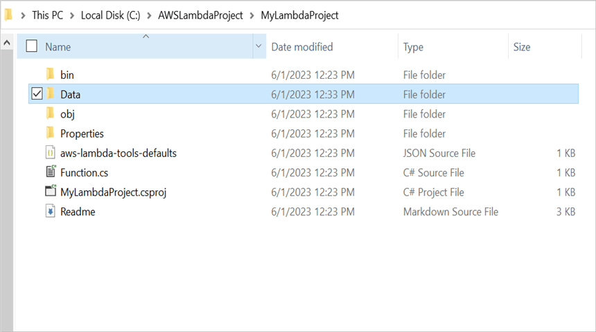

Step 5: Set the **copy to output directory** to **Copy if newer** to all the data files.
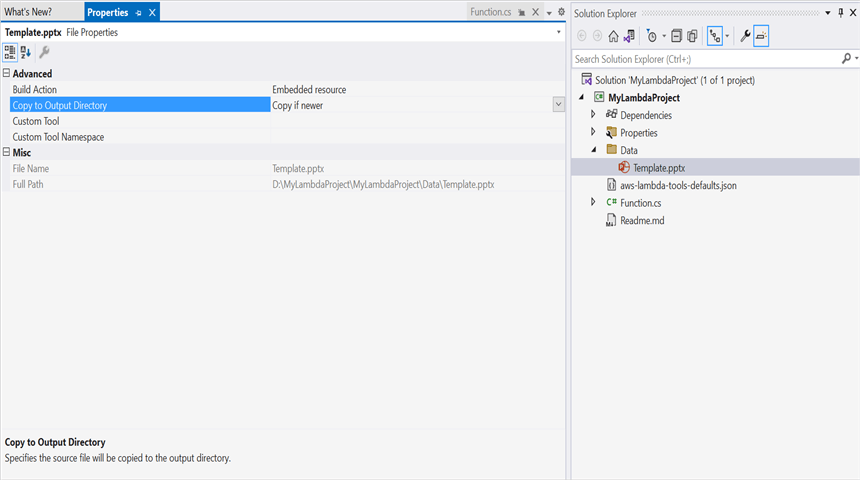

Step 6: Include the following namespaces in **Function.cs** file.




using System;
using System.IO;
using Syncfusion.Presentation;
using Syncfusion.Licensing;




Step 7: Add the following complete code in **Function.cs** to **open, edit, and save a PowerPoint presentation in AWS Lambda**.




public string FunctionHandler(string input)
{
    //Register the Syncfusion license before using any Syncfusion types.
    SyncfusionLicenseProvider.RegisterLicense("YOUR_LICENSE_KEY");

    //Get the input file from the bundled Data folder in the deployment package.
    string filePath = Path.GetFullPath(@"Data/Template.pptx");
    //Open an existing PowerPoint presentation.
    using IPresentation pptxDoc = Presentation.Open(filePath);

    //Get the first slide from the PowerPoint presentation.
    ISlide slide = pptxDoc.Slides[0];
    //Get the first shape of the slide and update its text.
    if (slide.Shapes[0] is IShape shape && shape.TextBody != null)
    {
        if (shape.TextBody.Text == "Company History")
            shape.TextBody.Text = "Company Profile";
    }

    //Save the PowerPoint presentation to a memory stream and return it as a base64 string.
    using MemoryStream stream = new MemoryStream();
    pptxDoc.Save(stream);
    return Convert.ToBase64String(stream.ToArray());
}




Step 8: Right-click the project and select **Publish to AWS Lambda**.

N> Before publishing, ensure that an IAM execution role with the **AWSLambdaBasicExecutionRole** managed policy (or equivalent) is available in your AWS account so Step 10 can attach it. See [AWS Lambda execution role](https://docs.aws.amazon.com/lambda/latest/dg/lambda-intro-execution-role.html) for setup.

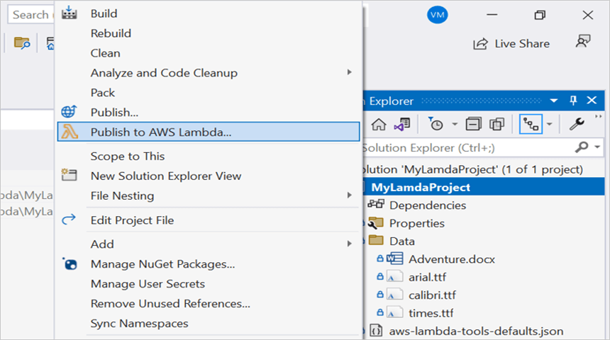

Step 9: In the Upload Lambda Function window, create a new AWS profile (or select an existing one), enter a name for the Lambda function to publish, and then click **Next**.
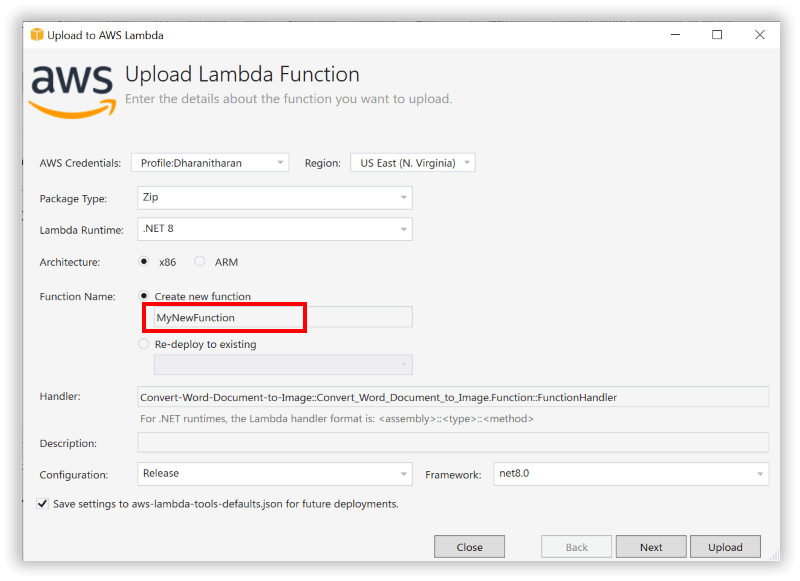

Step 10: In the Advanced Function Details window, select a **Role Name** based on an AWS managed policy. After selecting the role, click the **Upload** button to deploy your application.

Step 11: After deploying the application, you can see the published Lambda function in the **AWS console**.
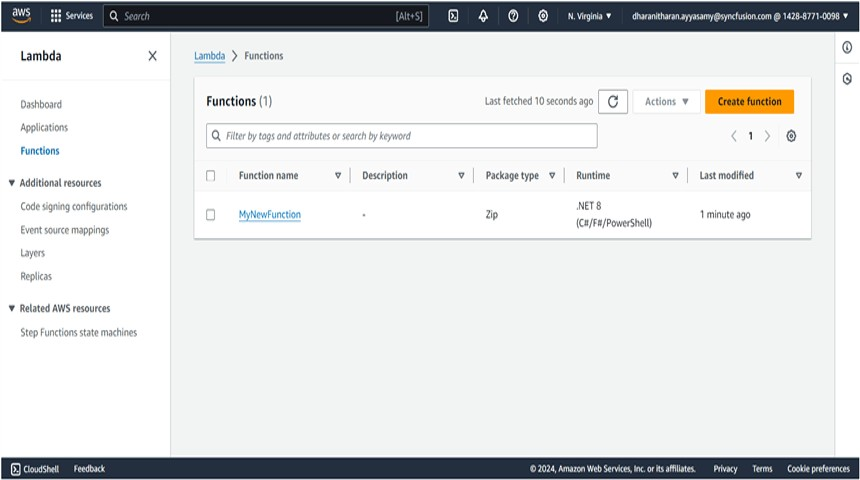

Step 12: In the AWS console, open the Lambda function's **General configuration** and increase the **Memory** (recommended at least 512 MB) and **Timeout** (for example, 1-5 minutes) so that PowerPoint operations have enough resources and time to complete.
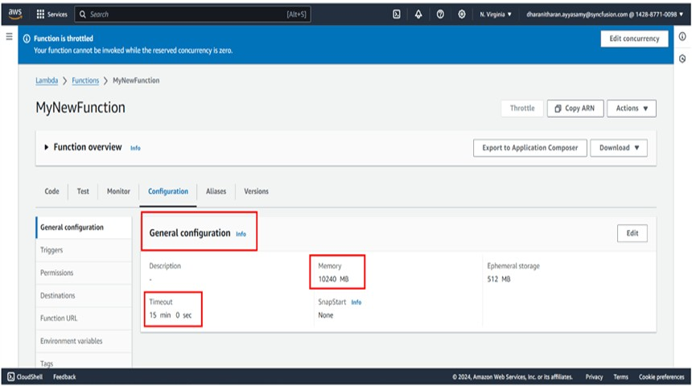

## Steps to post the request to AWS Lambda

Step 1: Create a new **Console App (.NET)** project in Visual Studio.

Step 2: Install the following **NuGet packages** in your application from [NuGet.org](https://www.nuget.org/).

* [AWSSDK.Core](https://www.nuget.org/packages/AWSSDK.Core/)
* [AWSSDK.Lambda](https://www.nuget.org/packages/AWSSDK.Lambda/)
* [Newtonsoft.Json](https://www.nuget.org/packages/Newtonsoft.Json/)
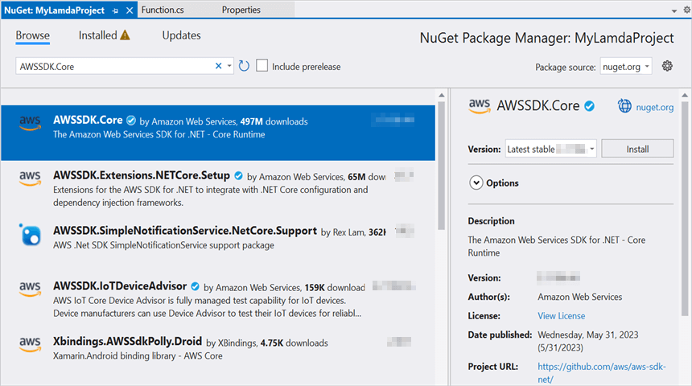
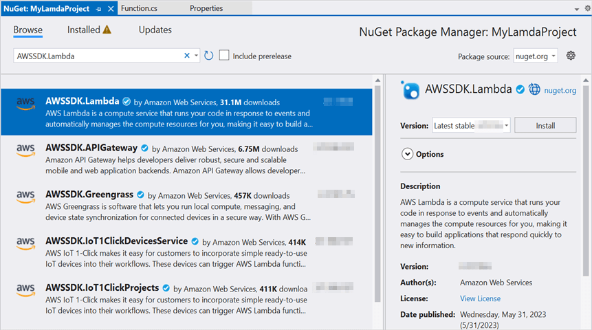
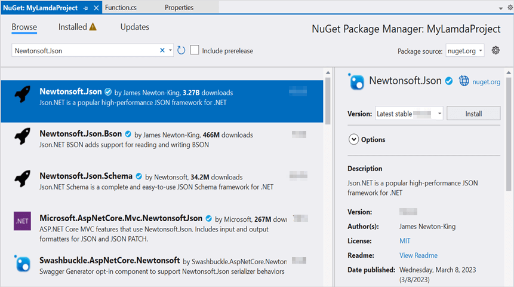

N> For production use, do not hard-code AWS credentials in source. Instead, load them from environment variables, the AWS shared credentials file, or an IAM role attached to the host. See [AWS credentials best practices](https://docs.aws.amazon.com/sdk-for-net/latest/developer-guide/creds-assign.html) for details.

Step 3: Include the following namespaces in **Program.cs** file.




using System;
using System.IO;
using Amazon;
using Amazon.Lambda;
using Amazon.Lambda.Model;
using Newtonsoft.Json;




Step 4: Add the following code snippet in **Program.cs** to invoke the published AWS Lambda function using the function name and access keys. Replace `"awsaccessKeyID"` and `"awsSecretAccessKey"` with your own credentials, and update `MyNewFunction` and `RegionEndpoint.USEast2` to match your deployment.




//Create a new AmazonLambdaClient.
AmazonLambdaClient client = new AmazonLambdaClient("awsaccessKeyID", "awsSecretAccessKey", RegionEndpoint.USEast2);
//Create a new InvokeRequest with the published function name.
InvokeRequest invoke = new InvokeRequest
{
    FunctionName = "MyNewFunction",
    InvocationType = InvocationType.RequestResponse,
    Payload = "\"Test\""
};
//Get the InvokeResponse from the client InvokeRequest.
InvokeResponse response = client.Invoke(invoke);
//Read the response stream.
using var stream = new StreamReader(response.Payload);
using JsonReader reader = new JsonTextReader(stream);
var serializer = new JsonSerializer();
var responseText = serializer.Deserialize(reader);
//Convert the base64 string into a PowerPoint document.
byte[] bytes = Convert.FromBase64String(responseText.ToString());
using (FileStream fileStream = new FileStream("Sample.pptx", FileMode.Create))
{
    using BinaryWriter writer = new BinaryWriter(fileStream);
    writer.Write(bytes, 0, bytes.Length);
}




Step 5: Build and run the console project (press **F5** in Visual Studio, or run `dotnet run` from the project folder). On Windows, you can open the saved `Sample.pptx` from the output directory; on Linux/macOS or in headless environments, copy the file locally and open it manually.

By executing the program, you will get the **PowerPoint document** as follows.

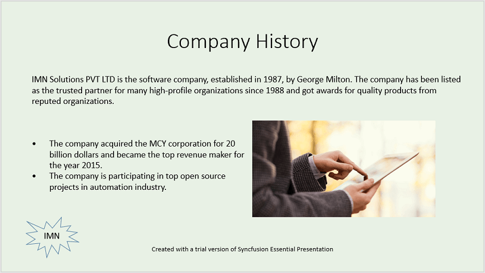

## See also

From GitHub, you can download the [console application](https://github.com/SyncfusionExamples/PowerPoint-Examples/tree/master/Read-and-save-PowerPoint-presentation/Open-and-save-PowerPoint/AWS/Console_Application) and [AWS Lambda](https://github.com/SyncfusionExamples/PowerPoint-Examples/tree/master/Read-and-save-PowerPoint-presentation/Open-and-save-PowerPoint/AWS/AWS_Lambda) project.

Looking for the full .NET PowerPoint library component overview, features, pricing, and documentation? Visit the [.NET PowerPoint library](https://www.syncfusion.com/document-sdk/net-powerpoint-library) page. 
