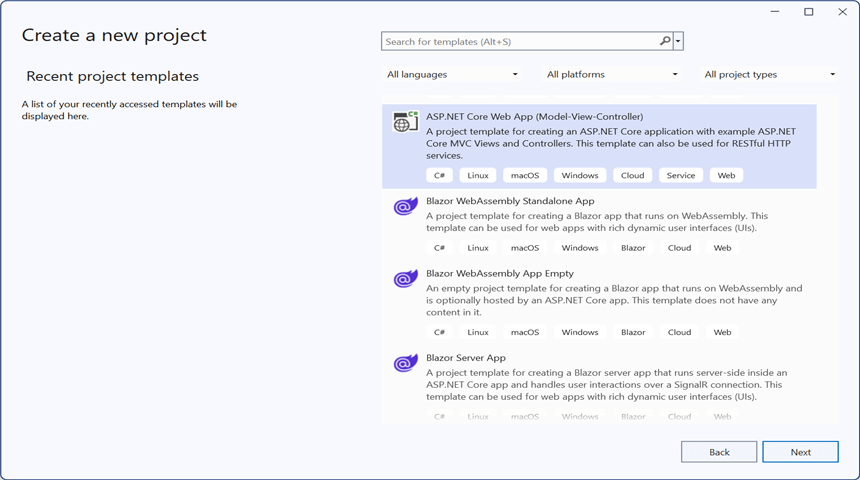
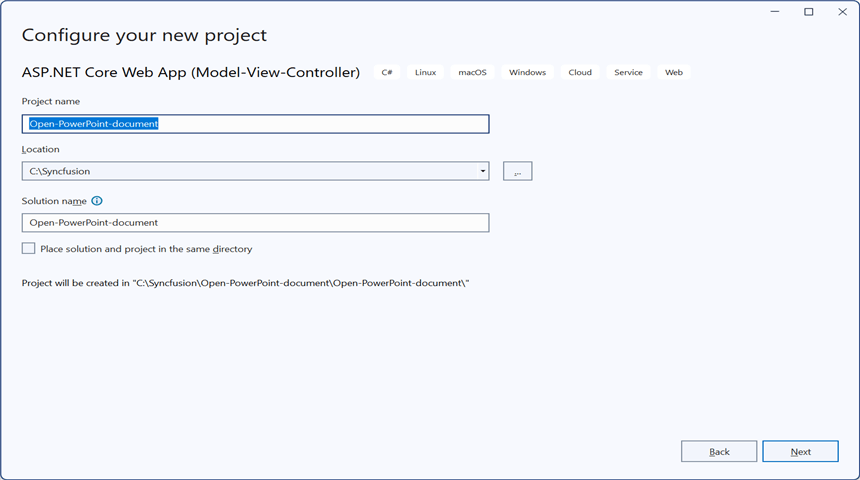
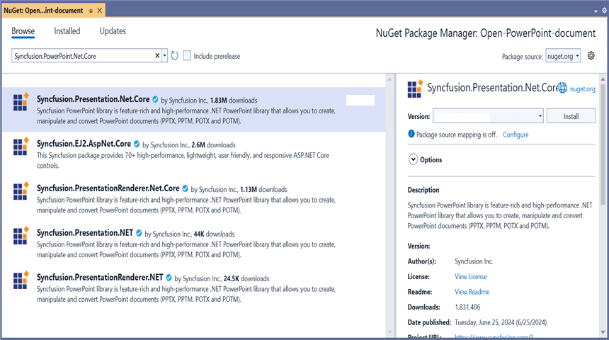
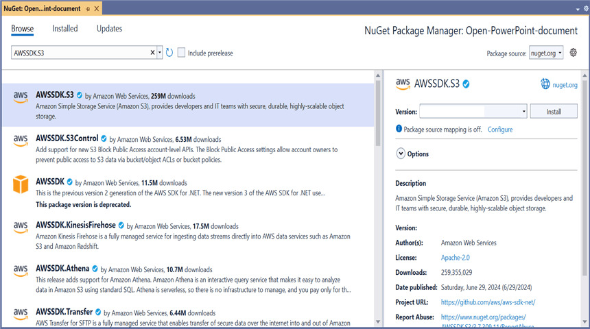
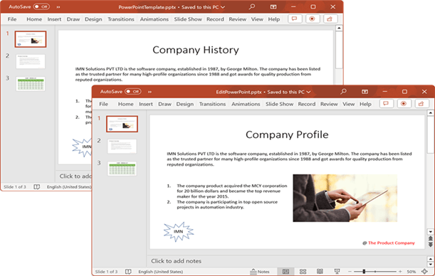
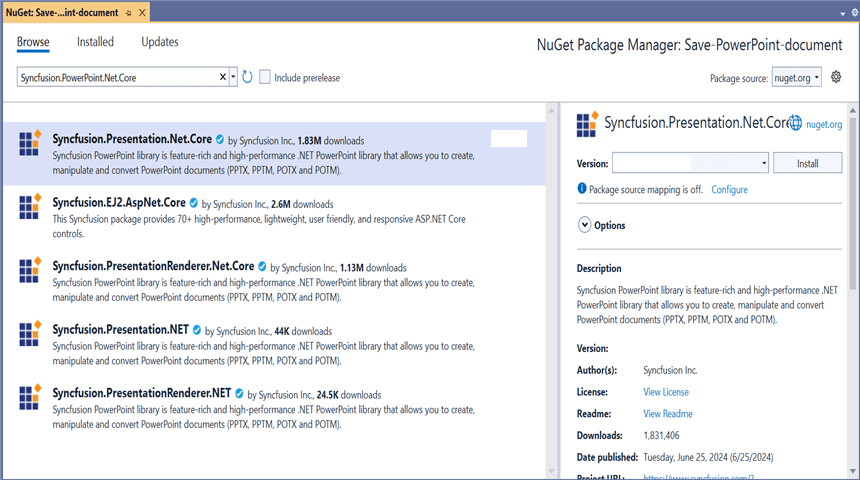
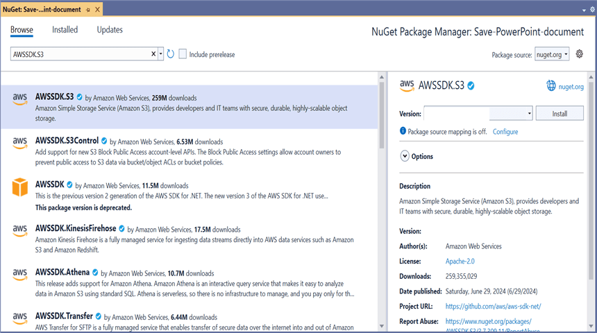
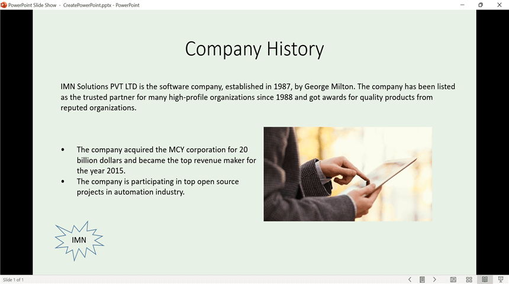

# Open and Save a Presentation in AWS S3 Cloud Storage

## Prerequisites  

* **[AWS S3 Cloud Storage](https://docs.aws.amazon.com/AmazonS3/latest/userguide/Welcome.html)** is required.
* An **active AWS account** with permission to read from and write to an S3 bucket. If you do not have one, see [Create an AWS account](https://repost.aws/knowledge-center/create-and-activate-aws-account).
* An **IAM user** with `AmazonS3FullAccess` (or equivalent scoped) permissions and the **access key ID** and **secret access key**. For setup steps, see [Create an IAM user](https://docs.aws.amazon.com/IAM/latest/UserGuide/id_users_create.html) and [Manage access keys for an IAM user](https://docs.aws.amazon.com/IAM/latest/UserGuide/id_credentials_access-keys.html).
* **.NET 8.0 or later**.
* A **target S3 bucket** to read from or write to. See [Create your first S3 bucket](https://docs.aws.amazon.com/AmazonS3/latest/userguide/GetStartedWithS3.html#creating-bucket).

## Open a Presentation from AWS S3

Steps to open a Presentation from AWS S3 Cloud Storage.

Step 1: Create an ASP.NET Core Web Application (Model-View-Controller).

Step 2: Name the project.

Step 3: Install the following **NuGet packages** in your application from [NuGet.org](https://www.nuget.org/).

* [Syncfusion.Presentation.Net.Core](https://www.nuget.org/packages/Syncfusion.Presentation.Net.Core)
* [AWSSDK.S3](https://www.nuget.org/packages/AWSSDK.S3)

Step 4: Add a new button to **Index.cshtml** as shown below.

  

@{Html.BeginForm("EditDocument", "Home", FormMethod.Get);
    {
        

            <input type="submit" value="Edit Document" style="width:150px;height:27px" />
        

    }
    Html.EndForm();
}



Step 5: Include the following namespaces in **HomeController.cs**.



using Amazon;
using Amazon.S3;
using Amazon.S3.Model;
using Syncfusion.Presentation;



Step 6: Add the following code snippet in **HomeController.cs** to **open a Presentation from AWS S3 Cloud Storage**.



public async Task<IActionResult> EditDocument()
{
    try
    {
        //Retrieve the document from AWS S3
        MemoryStream stream = await GetDocumentFromS3();

        //Set the position to the beginning of the MemoryStream
        stream.Position = 0;

        //Create an instance of PowerPoint Presentation file
        using (IPresentation pptxDocument = Presentation.Open(stream))
        {
            //Get the first slide from the PowerPoint presentation
            ISlide slide = pptxDocument.Slides[0];

            //Get the first shape of the slide
            IShape shape = slide.Shapes[0] as IShape;

            //Change the text of the shape
            if (shape.TextBody.Text == "Company History")
                shape.TextBody.Text = "Company Profile";

            //Saving the PowerPoint file to a MemoryStream 
            MemoryStream outputStream = new MemoryStream();
            pptxDocument.Save(outputStream);

            //Download the PowerPoint file in the browser
            FileStreamResult fileStreamResult = new FileStreamResult(outputStream, "application/powerpoint");
            fileStreamResult.FileDownloadName = "EditPowerPoint.pptx";
            return fileStreamResult;
        }
    }
    catch (AmazonS3Exception ex)
    {
        //Amazon S3-specific error (e.g., AccessDenied, NoSuchKey)
        Console.WriteLine($"S3 error: {ex.ErrorCode} - {ex.Message}");
        return Content("Error occurred while retrieving the file from S3.");
    }
    catch (Exception ex)
    {
        Console.WriteLine($"Error: {ex.Message}");
        return Content("Error occurred while processing the file.");
    }
}



### Download a File from AWS S3 Cloud Storage

The following helper method downloads a Presentation from AWS S3 Cloud Storage and returns it as a `MemoryStream` positioned at the beginning.



/// 

/// Downloads the PowerPoint file from the configured AWS S3 bucket.
/// 

/// <returns>A <see cref="MemoryStream"/> containing the PowerPoint file, positioned at the beginning.</returns>
public async Task<MemoryStream> GetDocumentFromS3()
{
    //Your AWS Storage Account bucket name 
    string bucketName = "your-bucket-name";

    //Name of the PowerPoint file you want to load from AWS S3
    string key = "PowerPointTemplate.pptx";

    //Configure AWS credentials and region
    var region = Amazon.RegionEndpoint.USEast1;
    var credentials = new Amazon.Runtime.BasicAWSCredentials("your-access-key", "your-secret-key");
    var config = new AmazonS3Config
    {
        RegionEndpoint = region
    };

    try
    {
        using (var client = new AmazonS3Client(credentials, config))
        {
            //Create a MemoryStream to copy the file content
            MemoryStream stream = new MemoryStream();

            //Download the file from S3 into the MemoryStream
            var response = await client.GetObjectAsync(new GetObjectRequest
            {
                BucketName = bucketName,
                Key = key
            });

            //Copy the response stream to the MemoryStream
            await response.ResponseStream.CopyToAsync(stream);

            //Reset the position so the caller can read the stream from the beginning
            stream.Position = 0;

            return stream;
        }
    }
    catch (Exception ex)
    {
        Console.WriteLine($"Error retrieving document from S3: {ex.Message}");
        throw;
    }
}



You can download a complete working sample from [GitHub](https://github.com/SyncfusionExamples/PowerPoint-Examples/tree/master/Read-and-save-PowerPoint-presentation/Open-and-save-PowerPoint/AWS-S3-Bucket/Open-PowerPoint-document).

By executing the program, you will get the **Presentation** as follows.

## Save a Presentation to AWS S3

Steps to save a Presentation to AWS S3 Cloud Storage.

Step 1: Create an ASP.NET Core Web Application (Model-View-Controller).

Step 2: Name the project.

Step 3: Install the following **NuGet packages** in your application from [NuGet.org](https://www.nuget.org/).

* [Syncfusion.Presentation.Net.Core](https://www.nuget.org/packages/Syncfusion.Presentation.Net.Core)
* [AWSSDK.S3](https://www.nuget.org/packages/AWSSDK.S3)

Step 4: Add a new button to **Index.cshtml** as shown below.

  

@{Html.BeginForm("UploadDocument", "Home", FormMethod.Get);
    {
        

            <input type="submit" value="Upload Document" style="width:150px;height:27px" />
        

    }
    Html.EndForm();
}



Step 5: Include the following namespaces in **HomeController.cs**.



using Amazon;
using Amazon.S3;
using Amazon.S3.Transfer;
using Syncfusion.Drawing;
using Syncfusion.Presentation;



Step 6: Add the following code snippet in **HomeController.cs** to **save a Presentation to AWS S3 Cloud Storage**.



public async Task<IActionResult> UploadDocument()
{
    //Create a new instance of PowerPoint Presentation file
    using (IPresentation pptxDocument = Presentation.Create())
    {
        //Add a new slide to the file and apply a background color
        ISlide slide = pptxDocument.Slides.Add(SlideLayoutType.TitleOnly);

        //Specify the fill type and fill color for the slide background
        slide.Background.Fill.FillType = FillType.Solid;
        slide.Background.Fill.SolidFill.Color = ColorObject.FromArgb(232, 241, 229);

        //Add title content to the slide by accessing the title placeholder of the TitleOnly layout slide
        IShape titleShape = slide.Shapes[0] as IShape;
        titleShape.TextBody.AddParagraph("Company History").HorizontalAlignment = HorizontalAlignmentType.Center;

        //Add description content to the slide by adding a new text box
        IShape descriptionShape = slide.AddTextBox(53.22, 141.73, 874.19, 77.70);
        descriptionShape.TextBody.Text = "IMN Solutions PVT LTD is the software company, established in 1987, by George Milton. The company has been listed as the trusted partner for many high-profile organizations since 1988 and got awards for quality products from reputed organizations.";

        //Add bullet points to the slide
        IShape bulletPointsShape = slide.AddTextBox(53.22, 270, 437.90, 116.32);

        //Add a paragraph for a bullet point
        IParagraph firstPara = bulletPointsShape.TextBody.AddParagraph("The company acquired the MCY corporation for 20 billion dollars and became the top revenue maker for the year 2015.");

        //Format how the bullets should be displayed
        firstPara.ListFormat.Type = ListType.Bulleted;
        firstPara.LeftIndent = 35;
        firstPara.FirstLineIndent = -35;

        //Add another paragraph for the next bullet point
        IParagraph secondPara = bulletPointsShape.TextBody.AddParagraph("The company is participating in top open source projects in automation industry.");

        //Format how the bullets should be displayed
        secondPara.ListFormat.Type = ListType.Bulleted;
        secondPara.LeftIndent = 35;
        secondPara.FirstLineIndent = -35;

        //Get a picture as a stream
        using (FileStream pictureStream = new FileStream("Image.jpg", FileMode.Open))
        {
            //Add the picture to the slide by specifying its size and position
            slide.Shapes.AddPicture(pictureStream, 499.79, 238.59, 364.54, 192.16);
        }

        //Add an auto-shape to the slide
        IShape stampShape = slide.Shapes.AddShape(AutoShapeType.Explosion1, 48.93, 430.71, 104.13, 80.54);

        //Format the auto-shape by setting the fill type and text
        stampShape.Fill.FillType = FillType.None;
        stampShape.TextBody.AddParagraph("IMN").HorizontalAlignment = HorizontalAlignmentType.Center;

        //Save the PowerPoint to a MemoryStream
        using (MemoryStream stream = new MemoryStream())
        {
            pptxDocument.Save(stream);
            //Reset the position so the upload reads from the beginning
            stream.Position = 0;

            //Upload the document to AWS S3
            await UploadDocumentToS3(stream);
        }
    }

    return Ok("PowerPoint uploaded to AWS S3 Storage.");
}



### Upload a File to AWS S3 Cloud Storage

The following helper method uploads a Presentation stream to AWS S3 Cloud Storage.



/// 

/// Uploads the PowerPoint stream to the configured AWS S3 bucket.
/// 

/// <param name="stream">The PowerPoint file content to upload. The stream is read from its current position.</param>
/// <returns>A task that represents the asynchronous upload operation.</returns>
public async Task UploadDocumentToS3(MemoryStream stream)
{
    //Your AWS Storage Account bucket name 
    string bucketName = "your-bucket-name";

    //Name of the PowerPoint file you want to upload
    string key = "CreatePowerPoint.pptx";

    //Configure AWS credentials and region
    var region = Amazon.RegionEndpoint.USEast1;
    var credentials = new Amazon.Runtime.BasicAWSCredentials("your-access-key", "your-secret-key");
    var config = new AmazonS3Config
    {
        RegionEndpoint = region
    };

    using (var client = new AmazonS3Client(credentials, config))
    {
        var fileTransferUtility = new TransferUtility(client);

        try
        {
            //Upload the stream to AWS S3
            await fileTransferUtility.UploadAsync(stream, bucketName, key);
            Console.WriteLine("Upload completed successfully");
        }
        catch (AmazonS3Exception e)
        {
            Console.WriteLine("Error encountered on server. Message:'{0}' when writing an object", e.Message);
        }
        catch (Exception e)
        {
            Console.WriteLine("Unknown encountered on server. Message:'{0}' when writing an object", e.Message);
        }
    }
}



You can download a complete working sample from [GitHub](https://github.com/SyncfusionExamples/PowerPoint-Examples/tree/master/Read-and-save-PowerPoint-presentation/Open-and-save-PowerPoint/AWS-S3-Bucket/Save-PowerPoint-document).

By executing the program, you will get the **Presentation** as follows.

## See Also

* [Open and Save a PowerPoint Presentation in Azure Blob Storage](Open-and-Save-PowerPoint-Presentation-in-Azure)
* [Open and Save a PowerPoint Presentation in Google Cloud Storage](Open-and-Save-PowerPoint-Presentation-in-Google-Cloud-Platform)
* [Create a PowerPoint Presentation in AWS](Create-PowerPoint-Presentation-in-AWS)
* [Loading and Saving a PowerPoint Presentation](Loading-and-Saving-the-Presentation)
