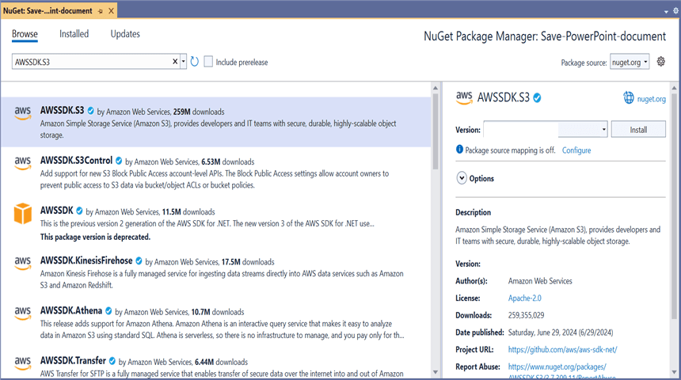

# Open and Save Presentation in AWS S3 Cloud Storage

## Prerequisites  

* **[AWS S3 Cloud Storage](https://docs.aws.amazon.com/AmazonS3/latest/userguide/Welcome.html)** is required.

## Open Presentation document from AWS S3

Steps to open a Presentation document from AWS S3 Cloud Storage.

Step 1: Create a new ASP.NET Core Web Application (Model-View-Controller).

Step 2: Name the project.

Step 3: Install the following **Nuget packages** in your application from [NuGet.org](https://www.nuget.org/).

* [Syncfusion.Presentation.Net.Core](https://www.nuget.org/packages/Syncfusion.Presentation.Net.Core)
* [AWSSDK.S3](https://www.nuget.org/packages/AWSSDK.S3)

Step 4: Add a new button in the **Index.cshtml** as shown below.

  

@{Html.BeginForm("EditDocument", "Home", FormMethod.Get);
    {
        

            <input type="submit" value="Edit Document" style="width:150px;height:27px" />
        

    }
    Html.EndForm();
}



Step 5: Include the following namespaces in **HomeController.cs**.



using Amazon.S3;
using Syncfusion.Presentation;



Step 6: Include the below code snippet in **HomeController.cs** to **open a Presentation document from AWS S3 Cloud Storage**.



public async Task<IActionResult> EditDocument()
{
    //Your AWS Storage Account bucket name 
    string bucketName = "your-bucket-name";

    //Name of the PowerPoint file you want to load from AWS S3
    string key = "PowerPointTemplate.pptx";

    try
    {
        //Retrieve the document from AWS S3
        MemoryStream stream = await GetDocumentFromS3(bucketName, key);

        //Set the position to the beginning of the MemoryStream
        stream.Position = 0;

        //Create an instance of PowerPoint Presentation file
        using (IPresentation pptxDocument = Presentation.Open(stream))
        {
            //Get the first slide from the PowerPoint presentation
            ISlide slide = pptxDocument.Slides[0];

            //Get the first shape of the slide
            IShape shape = slide.Shapes[0] as IShape;

            //Change the text of the shape
            if (shape.TextBody.Text == "Company History")
                shape.TextBody.Text = "Company Profile";

            //Saving the PowerPoint document to a MemoryStream 
            MemoryStream outputStream = new MemoryStream();
            pptxDocument.Save(outputStream);

            //Set the position as '0'
            outputStream.Position = 0;

            //Download the PowerPoint file in the browser
            FileStreamResult fileStreamResult = new FileStreamResult(outputStream, "application/powerpoint");
            fileStreamResult.FileDownloadName = "EditPowerPoint.pptx";
            return fileStreamResult;
        }
    }
    catch (Exception ex)
    {
        Console.WriteLine($"Error: {ex.Message}");
        return Content("Error occurred while processing the file.");
    }
}



### Get Presentation document from AWS S3 cloud storage

This is the helper method to get Presentation document from AWS S3 cloud storage.



public async Task<MemoryStream> GetDocumentFromS3(string bucketName, string key)
{
    //Configure AWS credentials and region
    var region = Amazon.RegionEndpoint.USEast1;
    var credentials = new Amazon.Runtime.BasicAWSCredentials("your-access-key", "your-secret-key");
    var config = new AmazonS3Config
    {
        RegionEndpoint = region
    };

    try
    {
        using (var client = new AmazonS3Client(credentials, config))
        {
            //Create a MemoryStream to copy the file content
            MemoryStream stream = new MemoryStream();

            //Download the file from S3 into the MemoryStream
            var response = await client.GetObjectAsync(new Amazon.S3.Model.GetObjectRequest
            {
                BucketName = bucketName,
                Key = key
            });

            //Copy the response stream to the MemoryStream
            await response.ResponseStream.CopyToAsync(stream);

            return stream;

        }
    }
    catch (Exception ex)
    {
        Console.WriteLine($"Error retrieving document from S3: {ex.Message}");
        throw; // or handle the exception as needed
    }
}



You can download a complete working sample from [GitHub]().

The input Presentation document used in the sample looks like below.

By executing the program, you will get the **Presentation document** as follows.

## Save Presentation document to AWS S3

Steps to save a Presentation document to AWS S3 Cloud Storage.

Step 1: Create a new ASP.NET Core Web Application (Model-View-Controller).

Step 2: Name the project.

Step 3: Install the following **Nuget packages** in your application from [NuGet.org](https://www.nuget.org/).

* [Syncfusion.Presentation.Net.Core](https://www.nuget.org/packages/Syncfusion.Presentation.Net.Core)
* [AWSSDK.S3](https://www.nuget.org/packages/AWSSDK.S3)

Step 4: Add a new button in the **Index.cshtml** as shown below.

  

@{Html.BeginForm("UploadDocument", "Home", FormMethod.Get);
    {
        

            <input type="submit" value="Upload Document" style="width:150px;height:27px" />
        

    }
    Html.EndForm();
}



Step 5: Include the following namespaces in **HomeController.cs**.



using Amazon.S3;
using Amazon.S3.Transfer;
using Syncfusion.Presentation;



Step 6: Include the below code snippet in **HomeController.cs** to **save a Presentation document to AWS S3 Cloud Storage**.



public async Task<IActionResult> UploadDocument()
{
    //Create a new instance of PowerPoint Presentation file
    IPresentation pptxDocument = Presentation.Create();

    //Add a new slide to file and apply background color
    ISlide slide = pptxDocument.Slides.Add(SlideLayoutType.TitleOnly);

    //Specify the fill type and fill color for the slide background 
    slide.Background.Fill.FillType = FillType.Solid;
    slide.Background.Fill.SolidFill.Color = ColorObject.FromArgb(232, 241, 229);

    //Add title content to the slide by accessing the title placeholder of the TitleOnly layout-slide
    IShape titleShape = slide.Shapes[0] as IShape;
    titleShape.TextBody.AddParagraph("Company History").HorizontalAlignment = HorizontalAlignmentType.Center;

    //Add description content to the slide by adding a new TextBox
    IShape descriptionShape = slide.AddTextBox(53.22, 141.73, 874.19, 77.70);
    descriptionShape.TextBody.Text = "IMN Solutions PVT LTD is the software company, established in 1987, by George Milton. The company has been listed as the trusted partner for many high-profile organizations since 1988 and got awards for quality products from reputed organizations.";

    //Add bullet points to the slide
    IShape bulletPointsShape = slide.AddTextBox(53.22, 270, 437.90, 116.32);

    //Add a paragraph for a bullet point
    IParagraph firstPara = bulletPointsShape.TextBody.AddParagraph("The company acquired the MCY corporation for 20 billion dollars and became the top revenue maker for the year 2015.");

    //Format how the bullets should be displayed
    firstPara.ListFormat.Type = ListType.Bulleted;
    firstPara.LeftIndent = 35;
    firstPara.FirstLineIndent = -35;

    //Add another paragraph for the next bullet point
    IParagraph secondPara = bulletPointsShape.TextBody.AddParagraph("The company is participating in top open source projects in automation industry.");

    //Format how the bullets should be displayed
    secondPara.ListFormat.Type = ListType.Bulleted;
    secondPara.LeftIndent = 35;
    secondPara.FirstLineIndent = -35;

    //Gets a picture as stream
    FileStream pictureStream = new FileStream("Image.jpg", FileMode.Open);

    //Adds the picture to a slide by specifying its size and position.
    slide.Shapes.AddPicture(pictureStream, 499.79, 238.59, 364.54, 192.16);

    //Add an auto-shape to the slide
    IShape stampShape = slide.Shapes.AddShape(AutoShapeType.Explosion1, 48.93, 430.71, 104.13, 80.54);

    //Format the auto-shape color by setting the fill type and text
    stampShape.Fill.FillType = FillType.None;
    stampShape.TextBody.AddParagraph("IMN").HorizontalAlignment = HorizontalAlignmentType.Center;

    //Saves the PowerPoint document to MemoryStream
    MemoryStream stream = new MemoryStream();
    pptxDocument.Save(stream);
    stream.Position = 0;

    //Your AWS Storage Account bucket name 
    string bucketName = "your-bucket-name";

    //Name of the PowerPoint file you want to upload
    string key = "CreatePowerPoint.pptx";

    //Upload the document to AWS S3
    await UploadDocumentToS3(bucketName, key, stream);

    return Ok("PowerPoint document uploaded to AWS S3 Storage.");
}



### Upload Presentation document to AWS S3 cloud storage

This is the helper method to upload Presentation document to AWS S3 cloud storage.



public async Task<MemoryStream> UploadDocumentToS3(string bucketName, string key, MemoryStream stream)
{
    //Configure AWS credentials and region
    var region = Amazon.RegionEndpoint.USEast1;
    var credentials = new Amazon.Runtime.BasicAWSCredentials("your-access-key", "your-secret-key");
    var config = new AmazonS3Config
    {
        RegionEndpoint = region
    };

    using (var client = new AmazonS3Client(credentials, config))
    {
        var fileTransferUtility = new TransferUtility(client);

        try
        {
            //Upload the stream to AWS S3
            await fileTransferUtility.UploadAsync(stream, bucketName, key);
            Console.WriteLine("Upload completed successfully");
        }
        catch (AmazonS3Exception e)
        {
            Console.WriteLine("Error encountered on server. Message:'{0}' when writing an object", e.Message);
        }
        catch (Exception e)
        {
            Console.WriteLine("Unknown encountered on server. Message:'{0}' when writing an object", e.Message);
        }
    }
    return stream;
}



You can download a complete working sample from [GitHub]().

By executing the program, you will get the **Presentation document** as follows.

