# Open and save PowerPoint in Azure App Service on Windows

Syncfusion&reg; PowerPoint is a [.NET Core PowerPoint library](https://www.syncfusion.com/document-sdk/net-powerpoint-library) used to create, read, edit and convert PowerPoint documents programmatically without **Microsoft PowerPoint** or interop dependencies. Using this library, you can **open and save a PowerPoint in Azure App Service on Windows**.

## Steps to Open and save PowerPoint in Azure App Service on Windows

Step 1: Create a new ASP.NET Core Web App (Model-View-Controller).
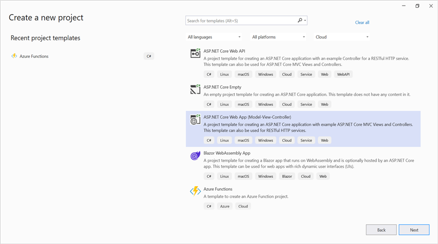

Step 2: Create a project name and select the location.
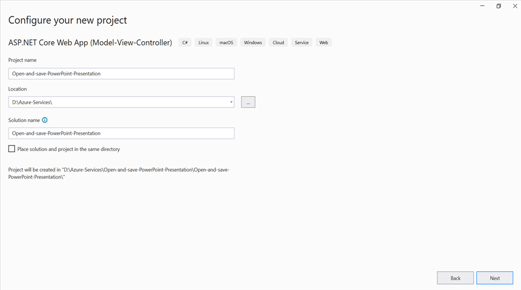

Step 3: Click **Create** button.
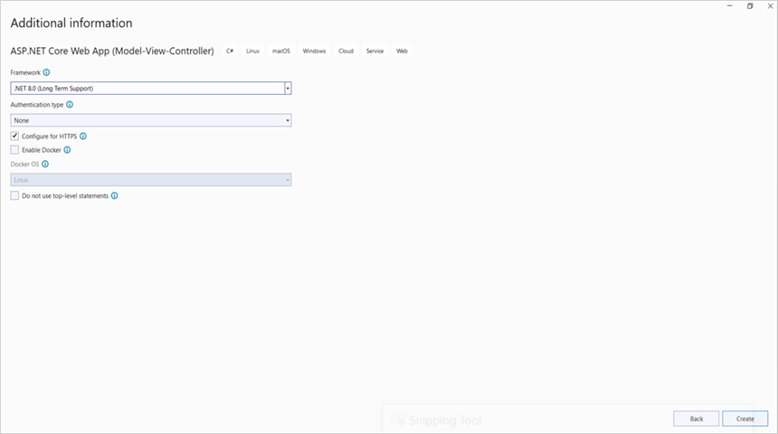

Step 4: Install the [Syncfusion.Presentation.Net.Core](https://www.nuget.org/packages/Syncfusion.Presentation.Net.Core) NuGet package as a reference to your project from [NuGet.org](https://www.nuget.org/). This package targets .NET 8.0 and later (.NET 8.0 recommended).

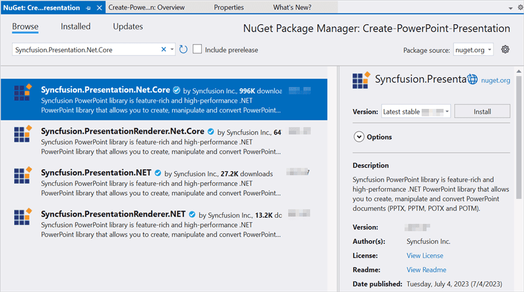

N> Starting with v16.2.0.x, if you reference Syncfusion&reg; assemblies from trial setup or from the NuGet feed, you also have to add "Syncfusion.Licensing" assembly reference and include a license key in your projects. Please refer to this [link](https://help.syncfusion.com/common/essential-studio/licensing/overview) to know about registering Syncfusion&reg; license key in your application to use our components.

Step 5: Add a new button in the **Index.cshtml** as shown below.




@{
    Html.BeginForm("OpenAndSavePowerPoint", "Home", FormMethod.Get);
    {
        

            <input type="submit" value="Open and Save PowerPoint" style="width:220px;height:27px" />
        

    }
    Html.EndForm();
}




Step 6: Include the following namespaces in **HomeController.cs**.




using System.IO;
using Microsoft.AspNetCore.Hosting;
using Microsoft.AspNetCore.Mvc;
using Syncfusion.Presentation;




Step 7: Add a new action method `OpenAndSavePowerPoint` in **HomeController.cs** and include the following code snippet to **open an existing PowerPoint presentation, edit it, and save the result in Azure App Service on Windows**.




private readonly IWebHostEnvironment _hostingEnvironment;
public HomeController(IWebHostEnvironment hostingEnvironment)
{
    _hostingEnvironment = hostingEnvironment;
}

public ActionResult OpenAndSavePowerPoint()
{
    //Open an existing PowerPoint presentation using the file path.
    string pptxPath = Path.Combine(_hostingEnvironment.WebRootPath, "Data/Template.pptx");
    using IPresentation pptxDoc = Presentation.Open(pptxPath);

    //Get the first slide from the PowerPoint presentation.
    ISlide slide = pptxDoc.Slides[0];
    //Get the first shape of the slide.
    IShape shape = slide.Shapes[0] as IShape;
    //Change the text of the shape.
    if (shape.TextBody.Text == "Company History")
        shape.TextBody.Text = "Company Profile";

    //Save the PowerPoint Presentation as stream.
    MemoryStream pptxStream = new();
    pptxDoc.Save(pptxStream);
    pptxStream.Position = 0;

    //Download PowerPoint document in the browser.
    return File(pptxStream, "application/vnd.openxmlformats-officedocument.presentationml.presentation", "Result.pptx");
}




## Steps to publish to Azure App Service on Windows

The following steps publish the ASP.NET Core Web App created above to Azure App Service on Windows.

Step 1: Right-click the project and select the **Publish** option.
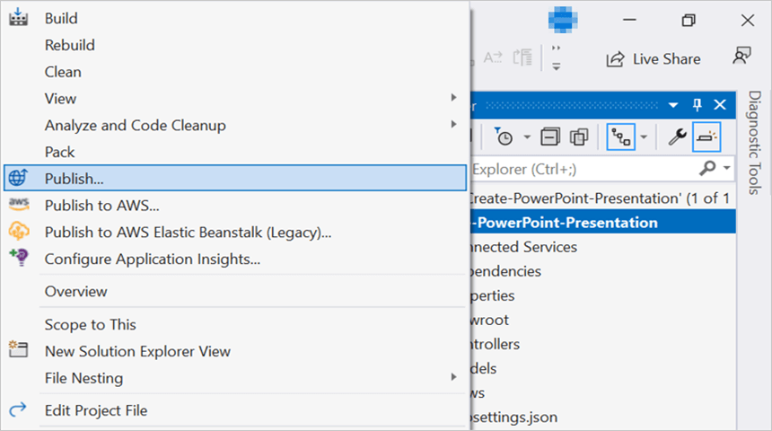

Step 2: Click the **Add a Publish Profile** button.
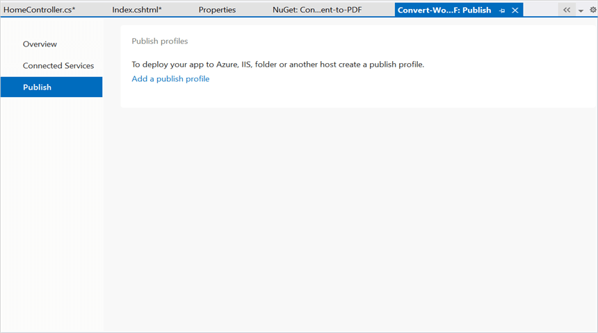

Step 3: Select the publish target as **Azure**.
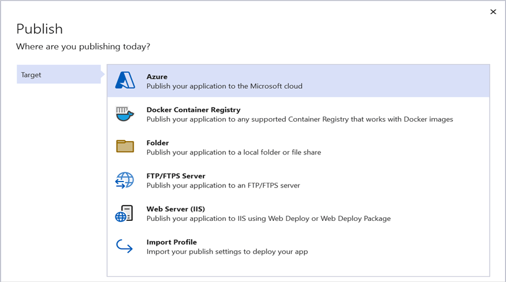

Step 4: Select the Specific target as **Azure App Service (Windows)**.

Step 5: To create a new app service, click the **Create new** option.
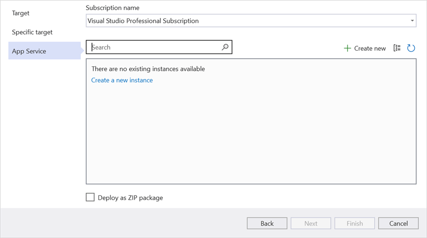

Step 6: Click the **Create** button to proceed with **App Service** creation.
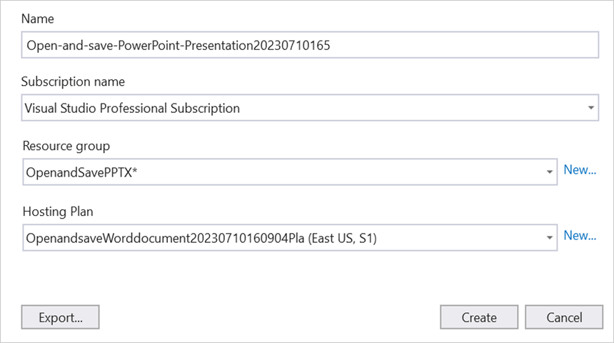

Step 7: Click the **Finish** button to finalize the **App Service** creation.
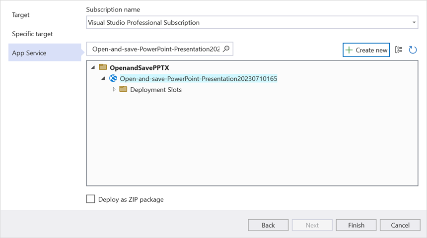

Step 8: Click the **Close** button.
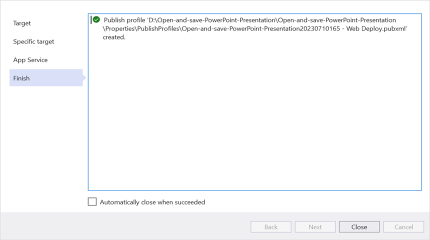

Step 9: Click the **Publish** button.
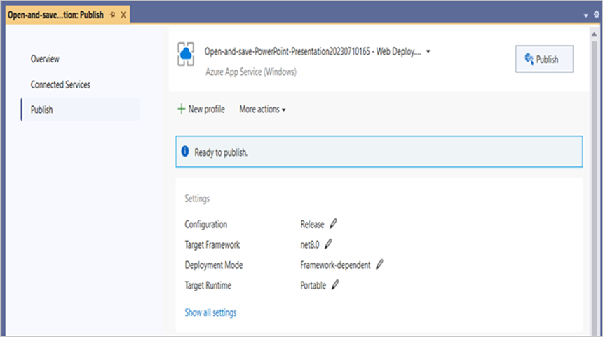

Step 10: Publishing has succeeded.
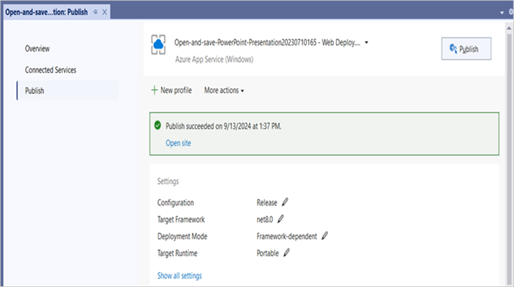

Step 11: The published webpage will open in the browser.
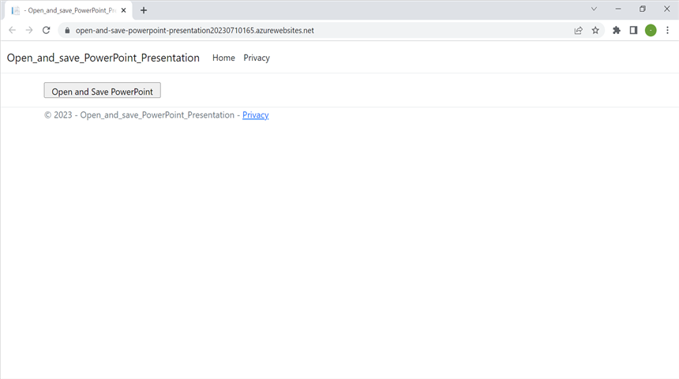

Step 12: Click **Open and Save PowerPoint** to download the edited PowerPoint document as follows.

You can download a complete working sample from [GitHub](https://github.com/SyncfusionExamples/PowerPoint-Examples/tree/master/Read-and-save-PowerPoint-presentation/Open-and-save-PowerPoint/Azure/Azure_App_Service).

Looking for the full .NET PowerPoint Library component overview, features, pricing, and documentation? Visit the  [.NET PowerPoint Library](https://www.syncfusion.com/document-sdk/net-powerpoint-library) page. 

