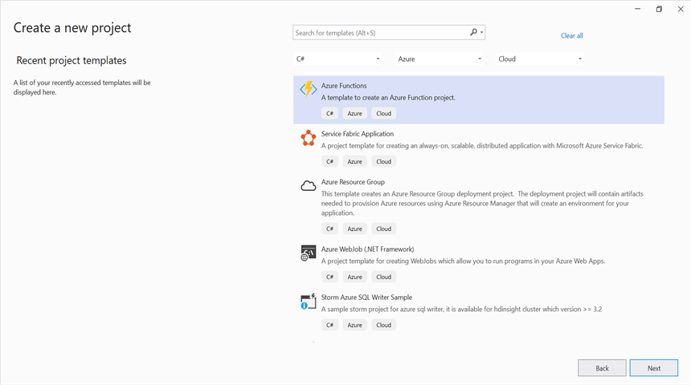
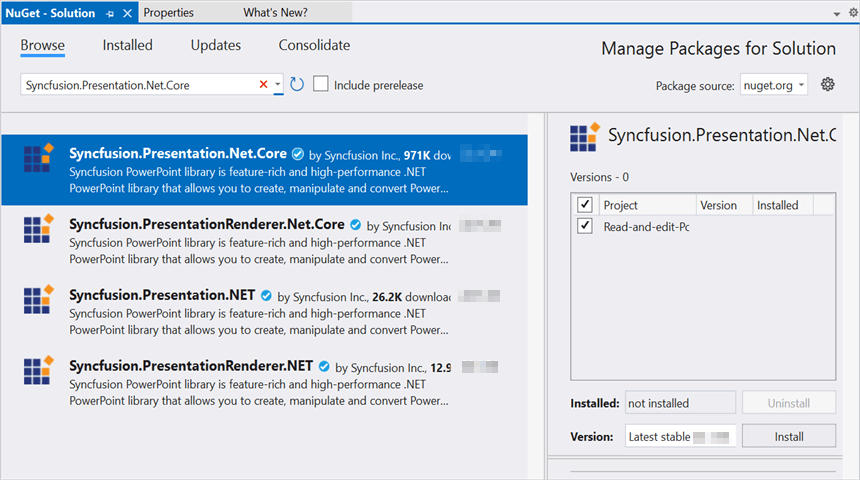
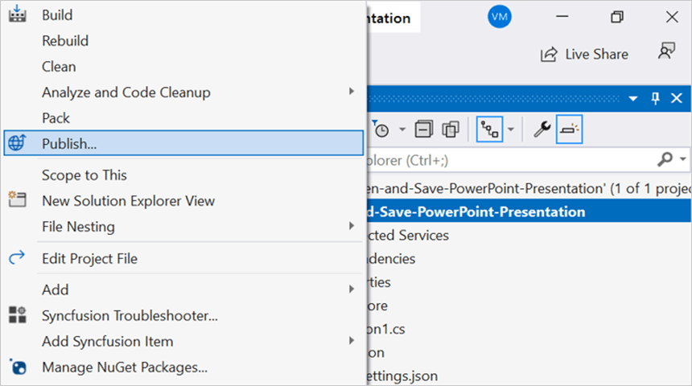
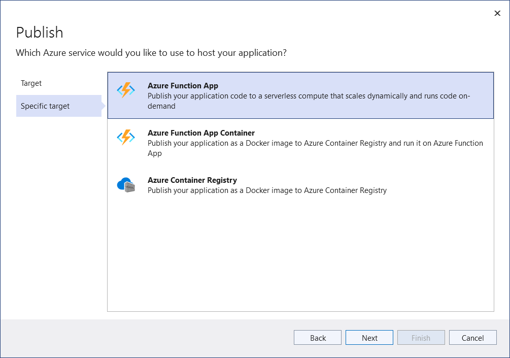
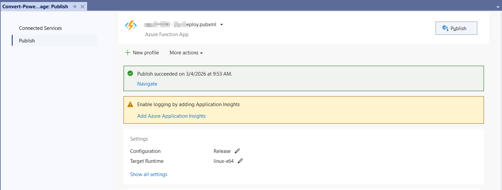

# Open and save Presentation in Azure Functions Flex Consumption

Syncfusion&reg; PowerPoint is a [.NET Core PowerPoint library](https://www.syncfusion.com/document-sdk/net-powerpoint-library) used to create, read, edit, and convert PowerPoint documents programmatically without **Microsoft PowerPoint** or interop dependencies. Using this library, you can **open and save a PowerPoint Presentation in Azure Functions deployed on the Flex Consumption plan**.

N> **Prerequisites:** An active [Azure subscription](https://azure.microsoft.com/en-us/free/), Visual Studio 2022 (or later) with the **Azure development** workload installed, and the latest **Azure Functions Core Tools**. This article targets the **Azure Functions Flex Consumption** plan with the **.NET 8.0 (Long Term Support)** isolated worker model.

## Steps to open and save Presentation in Azure Functions Flex Consumption

Step 1: Create a new Azure Functions project. Select the **Azure Functions** template and choose the **HTTP trigger** function type.

Step 2: Configure the project name and select the location.

Step 3: Select the function worker as **.NET 8.0 (Long Term Support)** (isolated worker) and choose a Flex Consumption hosting plan that supports the isolated worker model.

Step 4: Install the [Syncfusion.Presentation.Net.Core](https://www.nuget.org/packages/Syncfusion.Presentation.Net.Core) NuGet package as a reference to your project from [NuGet.org](https://www.nuget.org/).

N> Starting with v16.2.0.x, if you reference Syncfusion&reg; assemblies from the trial setup or from the NuGet feed, you also have to add the **Syncfusion.Licensing** assembly reference and include a license key in your project. Please refer to this [link](https://help.syncfusion.com/common/essential-studio/licensing/overview) to know about registering the Syncfusion&reg; license key in your application to use our components.

Step 5: Include the following namespaces in the **Function1.cs** file.




using System.IO;
using Microsoft.AspNetCore.Http;
using Microsoft.AspNetCore.Mvc;
using Microsoft.Azure.Functions.Worker;
using Microsoft.Extensions.Logging;
using Syncfusion.Presentation;




Step 6: Add the following complete **Run** method to the **Function1** class to open the existing PowerPoint Presentation, modify a shape on the first slide, and return the modified Presentation in the HTTP response. The function uses an **HTTP trigger** with `AuthorizationLevel.Function`; the client posts a `Template.pptx` (any sample PowerPoint file) in the request body. The `Presentation.Open(Stream)` / `Save(Stream)` overloads are used because the function has no local file path; the path-based overloads (`Presentation.Open("File.pptx")`, `presentation.Save("File.pptx")`) are not applicable in this serverless scenario.




[Function("Function1")]
public async Task<IActionResult> Run([HttpTrigger(AuthorizationLevel.Function, "post")] HttpRequest req)
{
    try
    {
        // Register the Syncfusion license key (only required once per app domain).
        Syncfusion.Licensing.SyncfusionLicenseProvider.RegisterLicense("YOUR_LICENSE_KEY");

        // Create a memory stream to hold the incoming request body (PowerPoint Presentation bytes)
        await using MemoryStream inputStream = new MemoryStream();
        // Copy the request body into the memory stream
        await req.Body.CopyToAsync(inputStream);
        // Check if the stream is empty (no file content received)
        if (inputStream.Length == 0)
            return new BadRequestObjectResult("No file content received in request body.");
        // Reset stream position to the beginning for reading
        inputStream.Position = 0;
        // Load the PowerPoint Presentation from the stream
        using IPresentation pptxDoc = Presentation.Open(inputStream);
        // Get the first slide from the PowerPoint presentation
        ISlide slide = pptxDoc.Slides[0];
        // Get the first shape of the slide (with null-checks for shapes that have no text body)
        IShape shape = slide.Shapes[0];
        if (shape != null && shape.TextBody != null && shape.TextBody.Text == "Company History")
        {
            // Change the text of the shape
            shape.TextBody.Text = "Company Profile";
        }
        // Save the modified PowerPoint Presentation to a memory stream
        using MemoryStream memoryStream = new MemoryStream();
        pptxDoc.Save(memoryStream);
        memoryStream.Position = 0;
        return new FileContentResult(memoryStream.ToArray(), "application/vnd.openxmlformats-officedocument.presentationml.presentation")
        {
            FileDownloadName = "presentation.pptx"
        };
    }
    catch (Exception ex)
    {
        // Log the error with details for troubleshooting
        _logger.LogError(ex, "Error opening and saving PowerPoint Presentation.");
        // Return a 500 Internal Server Error response (do not leak the full exception to the client)
        return new ContentResult
        {
            StatusCode = 500,
            Content = $"An error occurred while processing the request: {ex.Message}",
            ContentType = "text/plain; charset=utf-8"
        };
    }
}




Step 7: Right-click the project and select **Publish**. Then, create a new profile in the **Publish** window.

Step 8: Select the target as **Azure** and click the **Next** button.

Step 9: Select the specific target as **Azure Function App** and click the **Next** button.

Step 10: Click the **Create new** button.

Step 11: Click the **Create** button.

Step 12: After the Function App is created, click the **Finish** button.

Step 13: Click the **Publish** button.

Step 14: Publishing has succeeded.

Step 15: Go to the Azure portal and select **Function App**. After the function is running, click **Get Function URL** and copy it. Then, paste the URL into the client sample in the next section (which will request the Azure Function to open and save a PowerPoint Presentation using the template PowerPoint document). The output PowerPoint Presentation is shown below.

## Steps to post the request to Azure Functions

Step 1: Create a .NET 8.0 console application to request the Azure Functions API. Add a folder named **Data** to the project and place a sample PowerPoint file named `Input.pptx` inside it.

Step 2: Add the following code snippet into the **Main** method to post the request to Azure Functions with the template PowerPoint document and save the returned PowerPoint Presentation to disk.




    static async Task Main()
    {
        try
        {
            Console.Write("Please enter your Azure Functions URL : ");
            string url = Console.ReadLine();
            if (string.IsNullOrEmpty(url)) return;
            // Create a new HttpClient instance for sending HTTP requests
            using var http = new HttpClient();
            // Read all bytes from the input PowerPoint file 
            byte[] bytes = await File.ReadAllBytesAsync(@"Data/Input.pptx");
            // Wrap the file bytes into a ByteArrayContent object for HTTP transmission
            using var content = new ByteArrayContent(bytes);
            // Set the content type header to indicate binary data
            content.Headers.ContentType = new System.Net.Http.Headers.MediaTypeHeaderValue("application/octet-stream");
            // Send a POST request to the provided Azure Functions URL with the file content
            using var res = await http.PostAsync(url, content);
            // Read the response body as a byte array
            var resBytes = await res.Content.ReadAsByteArrayAsync();
            // Extract the media type from the response headers
            string mediaType = res.Content.Headers.ContentType?.MediaType ?? string.Empty;
            // Decide the output file path the response is an image or txt         
            string outputPath = mediaType.Contains("presentation", StringComparison.OrdinalIgnoreCase)
                || mediaType.Contains("powerpoint", StringComparison.OrdinalIgnoreCase)
                || mediaType.Equals("application/vnd.openxmlformats-officedocument.presentationml.presentation", StringComparison.OrdinalIgnoreCase)
                ? Path.GetFullPath(@"../../../Output/Output.pptx")
                : Path.GetFullPath(@"../../../function-error.txt");
            // Write the response bytes to the output file 
            await File.WriteAllBytesAsync(outputPath, resBytes);
            Console.WriteLine($"Saved: {outputPath}");
        }
        catch (Exception ex)
        {
            // Log the error so callers can diagnose failures without crashing the process
            Console.Error.WriteLine($"Error posting request to Azure Functions: {ex.Message}");
        }
    }




From GitHub, you can download the [console application](https://github.com/SyncfusionExamples/PowerPoint-Examples/tree/master/Read-and-save-PowerPoint-presentation/Open-and-save-PowerPoint/Azure/Azure_Functions/Console_App_Flex_Consumption) and [Azure Functions Flex Consumption](https://github.com/SyncfusionExamples/PowerPoint-Examples/tree/master/Read-and-save-PowerPoint-presentation/Open-and-save-PowerPoint/Azure/Azure_Functions/Azure_Functions_Flex_Consumption).

Looking for the full .NET PowerPoint Library component overview, features, pricing, and documentation? Visit the  [.NET PowerPoint Library](https://www.syncfusion.com/document-sdk/net-powerpoint-library) page. 

