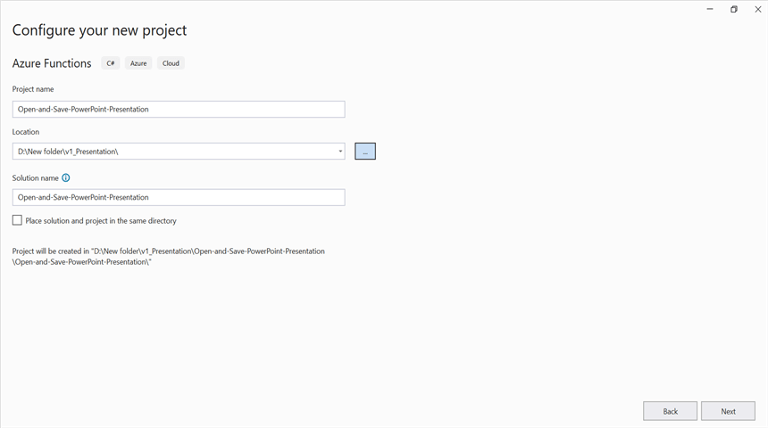
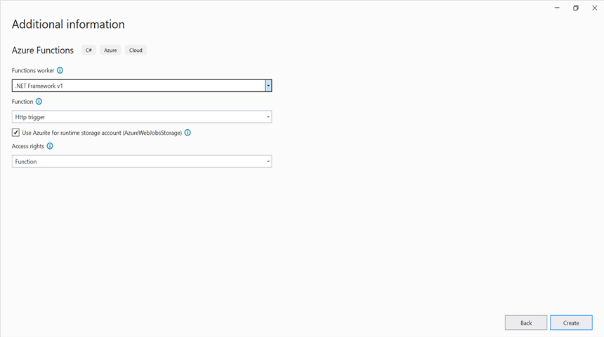
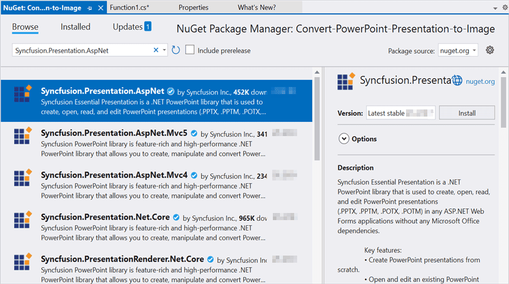
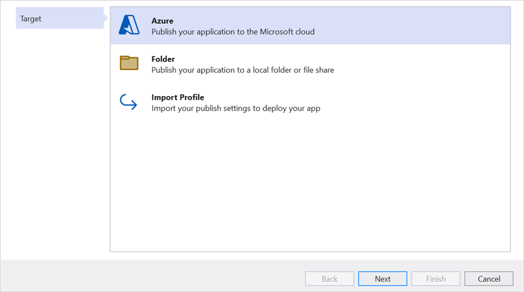
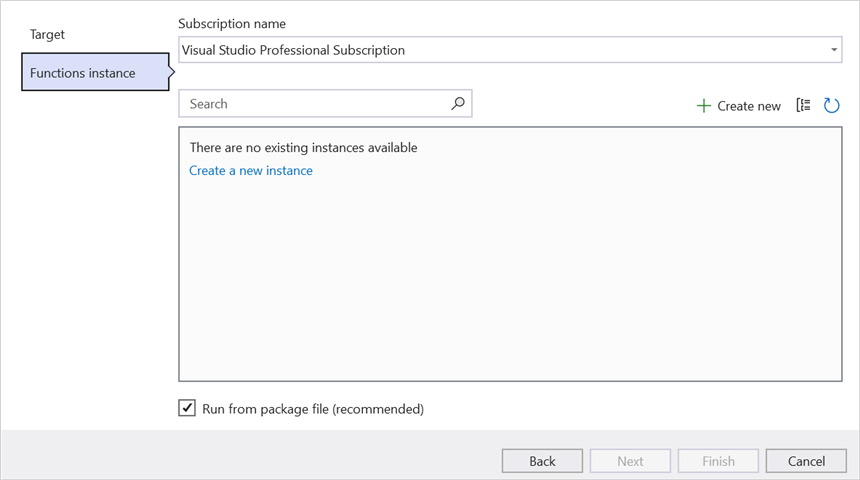
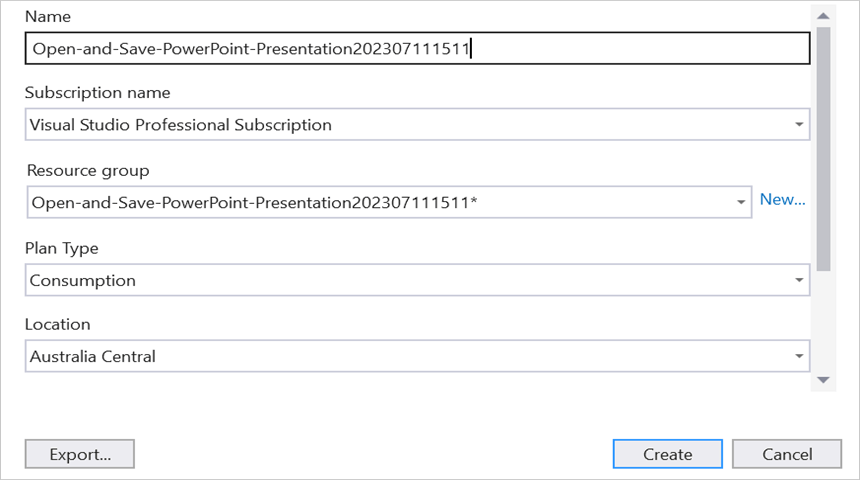
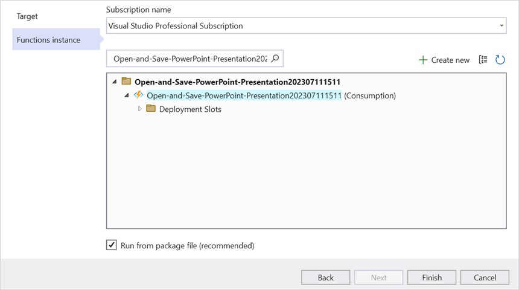
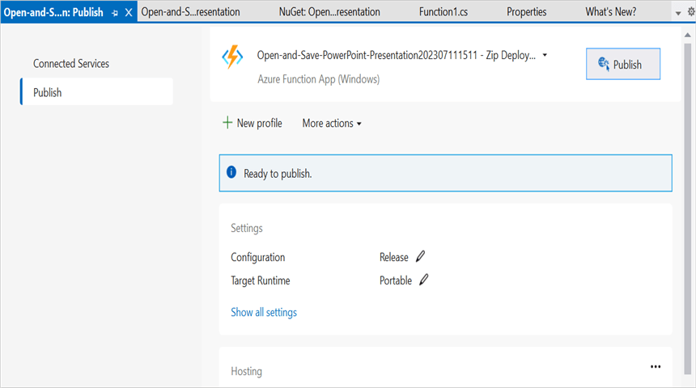
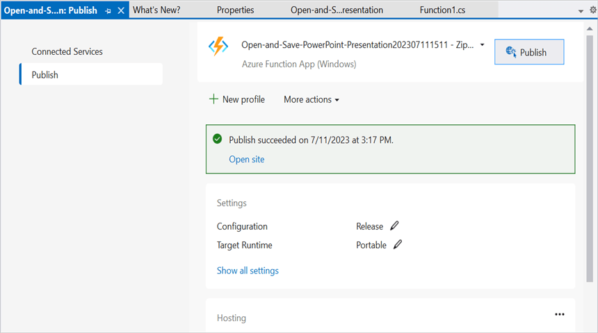

# Open and save Presentation in Azure Functions v1

Syncfusion&reg; PowerPoint is a [.NET PowerPoint library](https://www.syncfusion.com/document-sdk/net-powerpoint-library) used to create, read, edit, and convert PowerPoint documents programmatically without **Microsoft PowerPoint** or interop dependencies. Using this library, you can **open and save a PowerPoint Presentation in Azure Functions v1**.

N> **Deprecation notice:** The Azure Functions v1 (.NET Framework) runtime was retired by Microsoft in November 2022. The steps below remain valid for existing projects, but for new development we recommend [Azure Functions v4](Open-and-Save-PowerPoint-Presentation-in-Azure-Functions-v4).

## Steps to open and save Presentation in Azure Functions v1

Step 1: Create a new Azure Functions project. Select the **Azure Functions** template and choose the **Http trigger** function type.

Step 2: Configure the project name and select the location.

Step 3: Select the function worker as **.NET Framework**. 

Step 4: Install the [Syncfusion.Presentation.AspNet](https://www.nuget.org/packages/Syncfusion.Presentation.AspNet) NuGet package as a reference to your project from [NuGet.org](https://www.nuget.org/). This package targets .NET Framework 4.6.2 and later.

N> Starting with v16.2.0.x, if you reference Syncfusion&reg; assemblies from the trial setup or from the NuGet feed, you also have to add the **Syncfusion.Licensing** assembly reference and include a license key in your project. Please refer to this [link](https://help.syncfusion.com/common/essential-studio/licensing/overview) to know about registering the Syncfusion&reg; license key in your application to use our components.

Step 5: Include the following namespaces in the **Function1.cs** file.




using System.IO;
using System.Net;
using System.Net.Http;
using System.Net.Http.Headers;
using System.Threading.Tasks;
using Syncfusion.Presentation;




Step 6: Add the following complete **Run** method to the **Function1** class to open the existing PowerPoint Presentation, modify a shape on the first slide, and return the modified Presentation in the HTTP response.




[FunctionName("Function1")]
public static async Task<HttpResponseMessage> Run(
    [HttpTrigger(AuthorizationLevel.Function, "post", Route = null)] HttpRequestMessage req,
    TraceWriter log)
{
    //Register the Syncfusion license key (only required once per app domain).
    Syncfusion.Licensing.SyncfusionLicenseProvider.RegisterLicense("YOUR_LICENSE_KEY");

    //Get the input PowerPoint document as a stream from the request.
    Stream stream = await req.Content.ReadAsStreamAsync();

    //Open the existing PowerPoint Presentation.
    using (IPresentation pptxDoc = Presentation.Open(stream))
    {
        //Access the first slide and modify a shape.
        ISlide slide = pptxDoc.Slides[0];
        IShape shape = slide.Shapes[0] as IShape;
        if (shape != null && shape.TextBody != null && shape.TextBody.Text == "Company History")
        {
            shape.TextBody.Text = "Company Profile";
        }

        //Save the modified PowerPoint Presentation to a memory stream.
        using (MemoryStream memoryStream = new MemoryStream())
        {
            pptxDoc.Save(memoryStream);
            memoryStream.Position = 0;

            //Build the HTTP response with the modified Presentation as an attachment.
            HttpResponseMessage response = new HttpResponseMessage(HttpStatusCode.OK);
            response.Content = new ByteArrayContent(memoryStream.ToArray());
            response.Content.Headers.ContentDisposition = new ContentDispositionHeaderValue("attachment")
            {
                FileName = "Sample.pptx"
            };
            response.Content.Headers.ContentType = new MediaTypeHeaderValue("application/vnd.openxmlformats-officedocument.presentationml.presentation");
            return response;
        }
    }
}




Step 7: Right-click the project and select **Publish**. Then, create a new profile in the **Publish** window.

Step 8: Select the target as **Azure** and click the **Next** button.

Step 9: Click the **Create new** button.

Step 10: Click the **Create** button. 

Step 11: After the app service is created, click the **Finish** button. 

Step 12: Click the **Publish** button.

Step 13: Publishing has succeeded.

Step 14: Go to the Azure portal and select **App Services**. After the function is running, click **Get function URL** and copy it. Then, paste the URL into the client sample in the next section (which will request the Azure Functions to open and save a PowerPoint Presentation using the template PowerPoint document). You will get the output PowerPoint Presentation as follows.

## Steps to post the request to Azure Functions

This console application posts a sample `Template.pptx` (any existing PowerPoint Presentation) to the Azure Function and saves the modified Presentation returned by the function as `Sample.pptx`.

Step 1: Create a .NET Framework console application (targeting .NET Framework 4.6.2 or later) to request the Azure Functions API. Add a folder named **Data** to the project and place a sample PowerPoint file named `Template.pptx` inside it.

Step 2: Add the following code snippet into the **Main** method to post the request to Azure Functions with the template PowerPoint document and save the returned PowerPoint Presentation to disk.




try
{
    //Read the template PowerPoint file.
    using (FileStream fs = new FileStream(@"../../Data/Template.pptx", FileMode.Open, FileAccess.Read, FileShare.Read))
    using (MemoryStream inputStream = new MemoryStream())
    {
        fs.CopyTo(inputStream);
        inputStream.Position = 0;

        Console.WriteLine("Please enter your Azure Functions URL:");
        string functionURL = Console.ReadLine();

        //Create HttpWebRequest with the hosted Azure Functions URL.
        HttpWebRequest req = (HttpWebRequest)WebRequest.Create(functionURL);
        //Set request method as POST.
        req.Method = "POST";
        //Get the request stream and write the PowerPoint file stream into it.
        using (Stream requestStream = req.GetRequestStream())
        {
            byte[] buffer = inputStream.ToArray();
            requestStream.Write(buffer, 0, buffer.Length);
        }

        //Get the response from the Azure Functions.
        using (HttpWebResponse res = (HttpWebResponse)req.GetResponse())
        {
            //Save the returned PowerPoint file stream to disk.
            using (FileStream fileStream = File.Create("Sample.pptx"))
            {
                res.GetResponseStream().CopyTo(fileStream);
            }
        }
    }
}
catch (Exception ex)
{
    Console.WriteLine("Error posting request to Azure Functions: " + ex.Message);
    throw;
}




From GitHub, you can download the [console application (.NET Framework client that posts the template PowerPoint to the Azure Function)](https://github.com/SyncfusionExamples/PowerPoint-Examples/tree/master/Read-and-save-PowerPoint-presentation/Open-and-save-PowerPoint/Azure/Azure_Functions/Console_Application) and the [Azure Functions v1 project (.NET Framework Http trigger that opens, edits, and returns the PowerPoint Presentation)](https://github.com/SyncfusionExamples/PowerPoint-Examples/tree/master/Read-and-save-PowerPoint-presentation/Open-and-save-PowerPoint/Azure/Azure_Functions/Azure_Functions_v1).

Looking for the full .NET PowerPoint Library component overview, features, pricing, and documentation? Visit the [.NET PowerPoint Library](https://www.syncfusion.com/document-sdk/net-powerpoint-library) page. 

