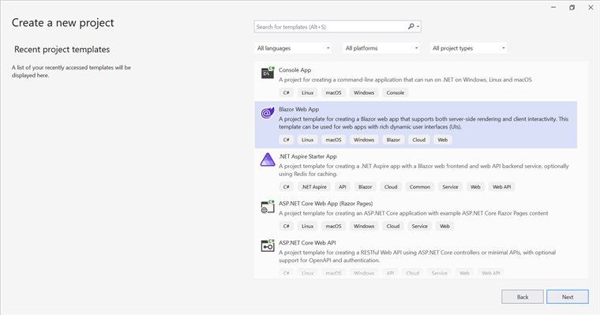
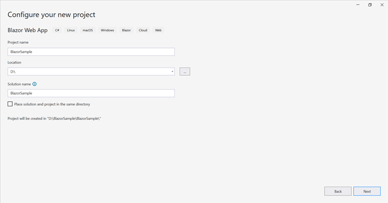
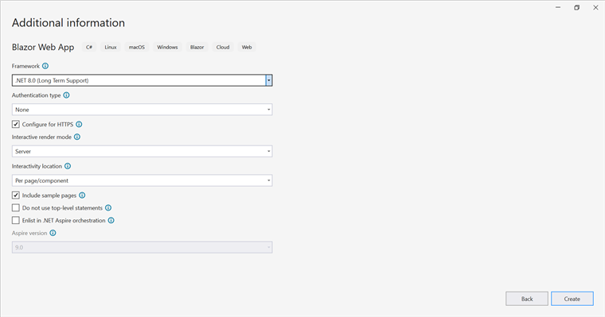
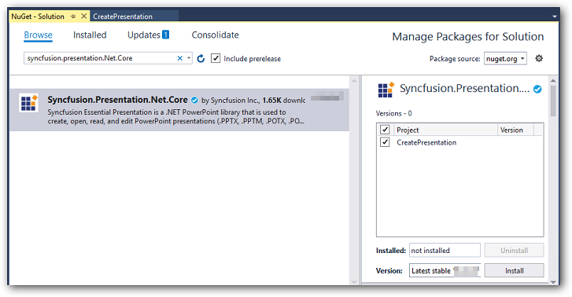
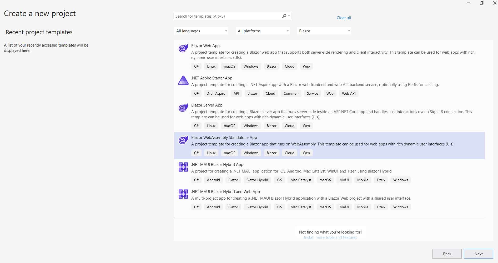

# Open and Save PowerPoint Presentation in Blazor

Syncfusion&reg; PowerPoint is a [.NET Core PowerPoint library](https://www.syncfusion.com/document-sdk/net-powerpoint-library) used to create, read, edit and convert PowerPoint documents programmatically without **Microsoft PowerPoint** or interop dependencies. Using this library, you can **open and save a Presentation in Blazor**.

This document covers the following Blazor app models:

*   [**Blazor Web App Server**](#blazor-web-app-server-application)
*   [**WASM Standalone**](#wasm-standalone-application)

## Blazor Web App Server Application

**Prerequisites:**

*   Visual Studio 2022 or later.
*   Install [.NET 8 SDK](https://dotnet.microsoft.com/en-us/download/dotnet/8.0) or later.

Step 1: Create a new C# Blazor Web app project.
*   Select "Blazor Web App" from the template and click **Next**.

*   Name the project and click **Next**.

*   Select the framework and click **Create** button.

Step 2: Install the `Syncfusion.Presentation.Net.Core` NuGet package.
Install the [Syncfusion.Presentation.Net.Core](https://www.nuget.org/packages/Syncfusion.Presentation.Net.Core/) NuGet package as reference to the project from [NuGet.org](https://www.nuget.org/).

N> Starting with v16.2.0.x, if Syncfusion&reg; assemblies are referenced from trial setup or from the NuGet feed, the "Syncfusion.Licensing" assembly reference must also be added and a license key included in projects. Please refer to this [link](https://help.syncfusion.com/common/essential-studio/licensing/overview) to know about registering Syncfusion&reg; license key in an application to use Syncfusion components.

Step 3: Create a Razor file named `Presentation.razor` in the `Pages` folder, which is located inside the `Components` folder.
Include the following directives and namespaces in the file. The `@rendermode InteractiveServer` directive enables interactive server-side rendering for this component.




@rendermode InteractiveServer
@page "/Presentation"
@using System.IO
@using Open_and_save_PowerPoint
@inject Open_and_save_PowerPoint.Data.PowerPointService service
@inject Microsoft.JSInterop.IJSRuntime JS




N> The namespace `Open_and_save_PowerPoint` corresponds to the default project name chosen in Step 1. Replace it with your actual project namespace if it differs.

Step 4: Add a button to `Presentation.razor`.
Include the following code to create a new button that triggers the presentation processing:




<h2>Syncfusion PowerPoint Library (Essential Presentation)</h2>

The Syncfusion Blazor PowerPoint library (Essential Presentation) used to create, read, edit, and convert PowerPoint files in applications without Microsoft Office dependencies.

<button class="btn btn-primary" @onclick="@OpenAndSavePresentation">Open and Save Presentation</button>




Step 5: Implement the `OpenAndSavePresentation` method in `Presentation.razor`.
Add the following code to create and download the **Presentation document**.




@code {
    MemoryStream documentStream;
    /// 

    /// Generate and download the PowerPoint Presentation
    /// 

    protected async Task OpenAndSavePresentation()
    {
        documentStream = service.OpenAndSavePresentation();
        await JS.SaveAs("Result.pptx", documentStream.ToArray());
    }
}




Step 6: Create a new cs file `PowerPointService` in the `Data` folder.
Include the following namespace in the file.




using Syncfusion.Presentation;




Step 7: Implement the `OpenAndSavePresentation` method in `PowerPointService.cs`.
Create a new method named `OpenAndSavePresentation` that returns a `MemoryStream` in the `PowerPointService` class, and include the following complete code to **open, edit, and save a PowerPoint Presentation in Blazor Web App Server**.




public MemoryStream OpenAndSavePresentation()
{
    // Open an existing PowerPoint Presentation using the file-path overload.
    using (IPresentation pptxDoc = Presentation.Open("wwwroot/Template.pptx"))
    {
        // Get the first slide from the PowerPoint Presentation.
        ISlide slide = pptxDoc.Slides[0];
        // Get the first shape of the slide and update its text.
        IShape shape = slide.Shapes[0];
        if (shape != null && shape.TextBody != null && shape.TextBody.Text == "Company History")
        {
            shape.TextBody.Text = "Company Profile";
        }

        // Save the PowerPoint Presentation to a memory stream.
        MemoryStream pptxStream = new MemoryStream();
        pptxDoc.Save(pptxStream);
        pptxStream.Position = 0;
        // Return the PowerPoint document stream for download in the browser.
        return pptxStream;
    }
}




Step 8: Add the service in `Program.cs`.
Add the following line to the `Program.cs` file to register `PowerPointService` as a scoped service in the Blazor application.




builder.Services.AddScoped<Open_and_save_PowerPoint.Data.PowerPointService>();



         
Step 9: Create `FileUtils.cs` for JavaScript interoperability.
Create a new class file named `FileUtils` in the project and add the following code to invoke the JavaScript action for file download in the browser.




public static class FileUtils
{
    public static ValueTask<object> SaveAs(this IJSRuntime js, string filename, byte[] data)
    => js.InvokeAsync<object>(
        "saveAsFile",
        filename,
        Convert.ToBase64String(data));
}




Step 10: Add the following JavaScript function to `App.razor`.
Add this function in the `App.razor` file located in the project root (for Blazor Web App Server, `App.razor` is in the project root, not in the `Pages` folder).







Step 11: Add the navigation link.
Add the following code snippet to the Navigation menu's Razor file in the `Layout` folder.





 

    <NavLink class="nav-link" href="presentation">
         Generate Presentation
    </NavLink>





Step 12: Build the project.

Click on **Build** → **Build Solution** or press <kbd>Ctrl</kbd>+<kbd>Shift</kbd>+<kbd>B</kbd> to build the project.

Step 13: Run the project.

Click the Start button (green arrow) or press <kbd>F5</kbd> to run the application. After the page loads, click **Open and Save Presentation** in the browser. The modified file will be downloaded as `Result.pptx`.

A complete working sample is available on [GitHub](https://github.com/SyncfusionExamples/PowerPoint-Examples/tree/master/Read-and-save-PowerPoint-presentation/Open-and-save-PowerPoint/Blazor/Blazor-Web-App-Server).

Upon executing the program, the **PowerPoint document** will be generated as follows.

Looking for the full .NET PowerPoint Library component overview, features, pricing, and documentation? Visit the  [.NET PowerPoint Library](https://www.syncfusion.com/document-sdk/net-powerpoint-library) page.

## WASM Standalone Application

**Prerequisites:**

*   Visual Studio 2022 or later.
*   Install [.NET 8 SDK](https://dotnet.microsoft.com/en-us/download/dotnet/8.0) or later.

Step 1: Create a new C# Blazor WASM Standalone app project.
Select "Blazor WebAssembly Standalone App" from the template and click the **Next** button.

Step 2: Install the `Syncfusion.Presentation.Net.Core` NuGet package.
To **create a PowerPoint document in WASM Standalone app**, install [Syncfusion.Presentation.Net.Core](https://www.nuget.org/packages/Syncfusion.Presentation.Net.Core) to the Blazor project.

N> Starting with v16.2.0.x, if Syncfusion&reg; assemblies are referenced from trial setup or from the NuGet feed, the "Syncfusion.Licensing" assembly reference must also be added and a license key included in projects. Please refer to this [link](https://help.syncfusion.com/common/essential-studio/licensing/overview) to know about registering Syncfusion&reg; license key in an application to use Syncfusion components.

Step 3: Create a Razor file named `Presentation.razor` in the `Pages` folder.
Add the following namespaces in the file.




@page "/presentation"
@inject Microsoft.JSInterop.IJSRuntime JS
@inject HttpClient client
@using Syncfusion.Presentation
@using System.IO




Step 4: Add a button to `Presentation.razor`.
Include the following code to create a new button that triggers the presentation processing:




<h2>Syncfusion PowerPoint Library (Essential Presentation)</h2>

The Syncfusion Blazor PowerPoint library (Essential Presentation) used to create, read, edit, and convert PowerPoint files in applications without Microsoft Office dependencies.

<button class="btn btn-primary" @onclick="@OpenAndSavePresentation">Open and Save Presentation</button>




Step 5: Implement the `OpenAndSavePresentation` method in `Presentation.razor`.
Create a new `async` method named `OpenAndSavePresentation` and include the following complete code to **open, edit, and save a PowerPoint Presentation in Blazor WASM Standalone app**. WASM does not have access to the file system, so the template is fetched via `HttpClient` and the result is saved to a `MemoryStream` before download.




@code {
    /// 

    /// Generate and download the PowerPoint Presentation
    /// 

    protected async Task OpenAndSavePresentation()
    {
        // Fetch the template file from the wwwroot folder via HTTP.
        using (Stream inputStream = await client.GetStreamAsync("Data/Template.pptx"))
        {
            // Open the existing PowerPoint Presentation from the input stream.
            using (IPresentation pptxDoc = Syncfusion.Presentation.Presentation.Open(inputStream))
            {
                // Get the first slide from the PowerPoint Presentation.
                ISlide slide = pptxDoc.Slides[0];
                // Get the first shape of the slide and update its text.
                IShape shape = slide.Shapes[0];
                if (shape != null && shape.TextBody != null && shape.TextBody.Text == "Company History")
                {
                    shape.TextBody.Text = "Company Profile";
                }

                // Save the PowerPoint Presentation to a memory stream.
                MemoryStream pptxStream = new MemoryStream();
                pptxDoc.Save(pptxStream);
                pptxStream.Position = 0;
                // Download the PowerPoint document in the browser.
                await JS.SaveAs("Sample.pptx", pptxStream.ToArray());
            }
        }
    }
}




Step 6: Create `FileUtils.cs` for JavaScript interoperability.
Create a new class file named `FileUtils` in the project and add the following code to invoke the JavaScript action for file download in the browser.




public static class FileUtils
{
    public static ValueTask<object> SaveAs(this IJSRuntime js, string filename, byte[] data)
        => js.InvokeAsync<object>(
            "saveAsFile",
            filename,
            Convert.ToBase64String(data));
}




Step 7: Add the following JavaScript function to `index.html`.
Add this function in the `index.html` file located in `wwwroot`.







Step 8: Add the navigation link.
Add the following code snippet to the Navigation menu's Razor file in the `Layout` folder.





 

    <NavLink class="nav-link" href="presentation">
         Generate Presentation
    </NavLink>





Step 9: Build the project.

Click on **Build** → **Build Solution** or press <kbd>Ctrl</kbd>+<kbd>Shift</kbd>+<kbd>B</kbd> to build the project.

Step 10: Run the project.

Click the Start button (green arrow) or press <kbd>F5</kbd> to run the application. After the page loads, click **Open and Save Presentation** in the browser. The modified file will be downloaded as `Sample.pptx`.

A complete working sample is available on [GitHub](https://github.com/SyncfusionExamples/PowerPoint-Examples/tree/master/Read-and-save-PowerPoint-presentation/Open-and-save-PowerPoint/Blazor/WASM-Standalone-App).

Upon executing the program, the **PowerPoint document** will be generated as follows.

N> While the PowerPoint library works in WASM Standalone app, server-side deployment is recommended. WASM Standalone app deployment increases the application payload size.

Kindly explore the [supported and unsupported features of PowerPoint library in Blazor](https://help.syncfusion.com/document-processing/powerpoint/powerpoint-library/net/supported-and-unsupported-features).

Looking for the full .NET PowerPoint Library component overview, features, pricing, and documentation? Visit the  [.NET PowerPoint Library](https://www.syncfusion.com/document-sdk/net-powerpoint-library) page.