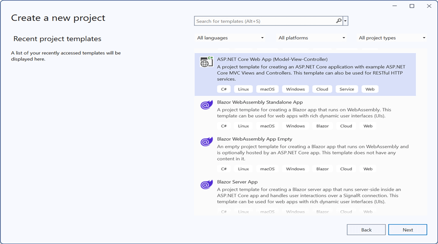
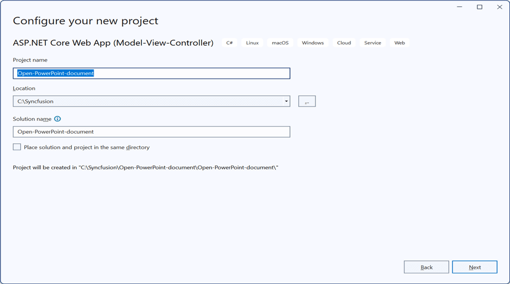
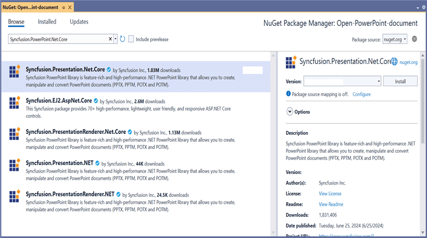
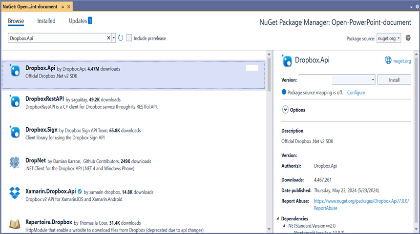
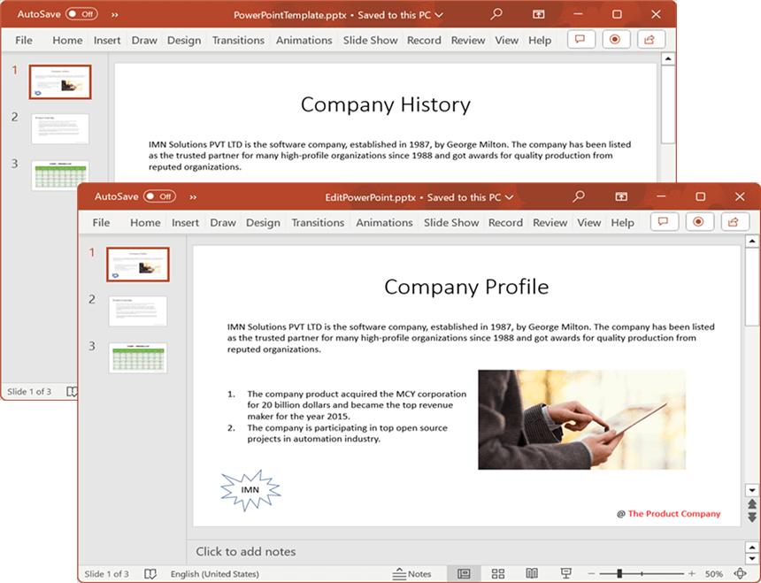
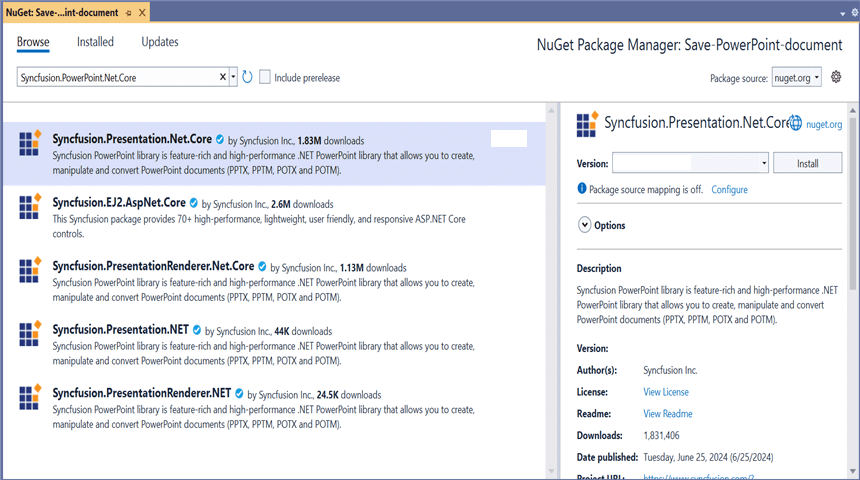
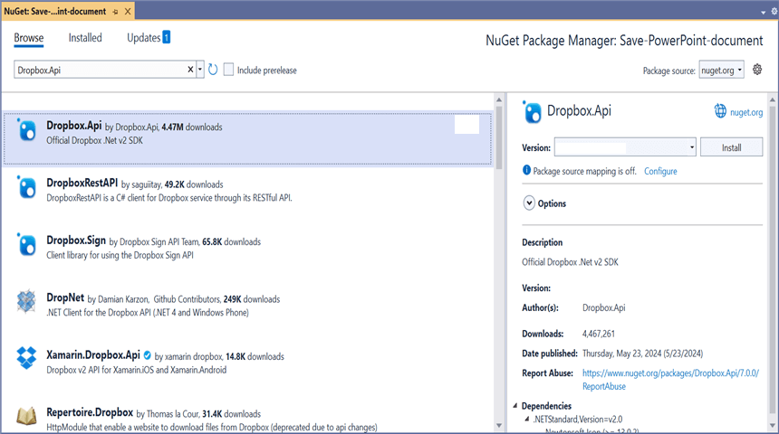

# Open and Save Presentation in DropBox Cloud Storage

## Prerequisites  

* Create a DropBox API App, by following the official documentation provided by DropBox [link](https://www.dropbox.com/developers/documentation/dotnet#tutorial). The process involves visiting the DropBox Developer website and using their App Console to set up your API app. This app will allow you to interact with DropBox programmatically, enabling secure access to files and data.

## Open Presentation from DropBox Cloud Storage

Steps to open a Presentation from DropBox Cloud Storage.

Step 1: Create a new ASP.NET Core Web Application (Model-View-Controller).

Step 2: Name the project.

Step 3: Install the following **Nuget packages** in your application from [NuGet.org](https://www.nuget.org/).

* [Syncfusion.Presentation.Net.Core](https://www.nuget.org/packages/Syncfusion.Presentation.Net.Core)
* [Dropbox.Api](https://www.nuget.org/packages/Dropbox.Api)

Step 4: Add a new button in the **Index.cshtml** as shown below.

  

@{Html.BeginForm("EditDocument", "Home", FormMethod.Get);
    {
        

            <input type="submit" value="Edit Document" style="width:150px;height:27px" />
        

    }
    Html.EndForm();
}



Step 5: Include the following namespaces in **HomeController.cs**.



using Dropbox.Api;
using Syncfusion.Presentation;



Step 6: Include the below code snippet in **HomeController.cs** to **open a Presentation from DropBox Cloud Storage**.



public async Task<IActionResult> EditDocument()
{
    try
    {
        //Retrieve the document from DropBox
        MemoryStream stream = await GetDocumentFromDropBox();

        //Set the position to the beginning of the MemoryStream
        stream.Position = 0;

        //Create an instance of PowerPoint Presentation file
        using (IPresentation pptxDocument = Presentation.Open(stream))
        {
            //Get the first slide from the PowerPoint presentation
            ISlide slide = pptxDocument.Slides[0];

            //Get the first shape of the slide
            IShape shape = slide.Shapes[0] as IShape;

            //Change the text of the shape
            if (shape.TextBody.Text == "Company History")
                shape.TextBody.Text = "Company Profile";

            //Saving the PowerPoint file to a MemoryStream 
            MemoryStream outputStream = new MemoryStream();
            pptxDocument.Save(outputStream);

            //Download the PowerPoint file in the browser
            FileStreamResult fileStreamResult = new FileStreamResult(outputStream, "application/powerpoint");
            fileStreamResult.FileDownloadName = "EditPowerPoint.pptx";
            return fileStreamResult;
        }
    }
    catch (Exception ex)
    {
        Console.WriteLine($"Error: {ex.Message}");
        return Content("Error occurred while processing the file.");
    }
}



### Download file from DropBox cloud storage

This is the helper method to download Presentation from DropBox cloud storage.



/// 

/// Download file from DropBox cloud storage
/// 

/// <returns></returns>
public async Task<MemoryStream> GetDocumentFromDropBox()
{
    //Define the access token for authentication with the Dropbox API
    var accessToken = "Access_Token";

    //Define the file path in Dropbox where the file is located. For ex: "/Template.pptx" or "/Apps/Template.pptx"
    var filePathInDropbox = "FilePath";

    try
    {
        //Create a new DropboxClient instance using the provided access token
        using (var dbx = new DropboxClient(accessToken))
        {
            //Start a download request for the specified file in Dropbox
            using (var response = await dbx.Files.DownloadAsync(filePathInDropbox))
            {
                //Get the content of the downloaded file as a stream
                var content = await response.GetContentAsStreamAsync();

                MemoryStream stream = new MemoryStream();
                content.CopyTo(stream);
                return stream;
            }
        }
    }
    catch (Exception ex)
    {
        Console.WriteLine($"Error retrieving document from DropBox: {ex.Message}");
        throw; // or handle the exception as needed
    }
}



You can download a complete working sample from [GitHub](https://github.com/SyncfusionExamples/PowerPoint-Examples/tree/master/Read-and-save-PowerPoint-presentation/Open-and-save-PowerPoint/DropBox-Cloud-Storage/Open-PowerPoint-document).

By executing the program, you will get the **Presentation** as follows.

## Save Presentation to DropBox Cloud Storage

Steps to save a Presentation to DropBox Cloud Storage.

Step 1: Create a new ASP.NET Core Web Application (Model-View-Controller).

Step 2: Name the project.

Step 3: Install the following **Nuget packages** in your application from [NuGet.org](https://www.nuget.org/).

* [Syncfusion.Presentation.Net.Core](https://www.nuget.org/packages/Syncfusion.Presentation.Net.Core)
* [Dropbox.Api](https://www.nuget.org/packages/Dropbox.Api)

Step 4: Add a new button in the **Index.cshtml** as shown below.

  

@{Html.BeginForm("UploadDocument", "Home", FormMethod.Get);
    {
        

            <input type="submit" value="Upload Document" style="width:150px;height:27px" />
        

    }
    Html.EndForm();
}



Step 5: Include the following namespaces in **HomeController.cs**.



using Dropbox.Api.Files;
using Dropbox.Api;
using Syncfusion.Presentation;



Step 6: Include the below code snippet in **HomeController.cs** to **save a Presentation to DropBox Cloud Storage**.



public async Task<IActionResult> UploadDocument()
{
    //Create a new instance of PowerPoint Presentation file
    IPresentation pptxDocument = Presentation.Create();

    //Add a new slide to file and apply background color
    ISlide slide = pptxDocument.Slides.Add(SlideLayoutType.TitleOnly);

    //Specify the fill type and fill color for the slide background 
    slide.Background.Fill.FillType = FillType.Solid;
    slide.Background.Fill.SolidFill.Color = ColorObject.FromArgb(232, 241, 229);

    //Add title content to the slide by accessing the title placeholder of the TitleOnly layout-slide
    IShape titleShape = slide.Shapes[0] as IShape;
    titleShape.TextBody.AddParagraph("Company History").HorizontalAlignment = HorizontalAlignmentType.Center;

    //Add description content to the slide by adding a new TextBox
    IShape descriptionShape = slide.AddTextBox(53.22, 141.73, 874.19, 77.70);
    descriptionShape.TextBody.Text = "IMN Solutions PVT LTD is the software company, established in 1987, by George Milton. The company has been listed as the trusted partner for many high-profile organizations since 1988 and got awards for quality products from reputed organizations.";

    //Add bullet points to the slide
    IShape bulletPointsShape = slide.AddTextBox(53.22, 270, 437.90, 116.32);

    //Add a paragraph for a bullet point
    IParagraph firstPara = bulletPointsShape.TextBody.AddParagraph("The company acquired the MCY corporation for 20 billion dollars and became the top revenue maker for the year 2015.");

    //Format how the bullets should be displayed
    firstPara.ListFormat.Type = ListType.Bulleted;
    firstPara.LeftIndent = 35;
    firstPara.FirstLineIndent = -35;

    //Add another paragraph for the next bullet point
    IParagraph secondPara = bulletPointsShape.TextBody.AddParagraph("The company is participating in top open source projects in automation industry.");

    //Format how the bullets should be displayed
    secondPara.ListFormat.Type = ListType.Bulleted;
    secondPara.LeftIndent = 35;
    secondPara.FirstLineIndent = -35;

    //Gets a picture as stream
    FileStream pictureStream = new FileStream("Image.jpg", FileMode.Open);

    //Adds the picture to a slide by specifying its size and position.
    slide.Shapes.AddPicture(pictureStream, 499.79, 238.59, 364.54, 192.16);

    //Add an auto-shape to the slide
    IShape stampShape = slide.Shapes.AddShape(AutoShapeType.Explosion1, 48.93, 430.71, 104.13, 80.54);

    //Format the auto-shape color by setting the fill type and text
    stampShape.Fill.FillType = FillType.None;
    stampShape.TextBody.AddParagraph("IMN").HorizontalAlignment = HorizontalAlignmentType.Center;

    //Saves the PowerPoint to MemoryStream
    MemoryStream stream = new MemoryStream();
    pptxDocument.Save(stream);

    //Upload the document to DropBox
    await UploadDocumentToDropBox(stream);

    return Ok("PowerPoint uploaded to DropBox Cloud Storage.");
}



### Upload file to DropBox cloud storage

This is the helper method to upload Presentation to DropBox cloud storage.



/// 

/// Upload file to Dropbox
/// 

/// <param name="stream"></param>
/// <returns></returns>
public async Task<MemoryStream> UploadDocumentToDropBox(MemoryStream stream)
{
    //Define the access token for authentication with the Dropbox API
    var accessToken = "Access_Token";

    //Define the file path in Dropbox where the file should be saved. For ex: "/Template.pptx" or "/Apps/Template.pptx"
    var filePathInDropbox = "FilePath";

    try
    {
        //Create a new DropboxClient instance using the provided access token
        using (var dbx = new DropboxClient(accessToken))
        {
            //Upload the file to Dropbox
            var uploadResult = await dbx.Files.UploadAsync(filePathInDropbox, WriteMode.Overwrite.Instance, body: new MemoryStream(stream.ToArray()));
        }
        Console.WriteLine("Upload completed successfully");
    }

    catch (Exception e)
    {
        Console.WriteLine("Unknown encountered on server. Message:'{0}' when writing an object", e.Message);
    }
    return stream;
}



You can download a complete working sample from [GitHub](https://github.com/SyncfusionExamples/PowerPoint-Examples/tree/master/Read-and-save-PowerPoint-presentation/Open-and-save-PowerPoint/DropBox-Cloud-Storage/Save-PowerPoint-document).

By executing the program, you will get the **Presentation** as follows.

