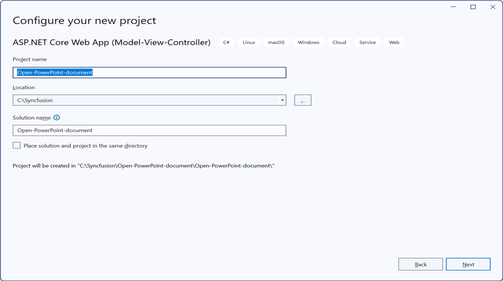
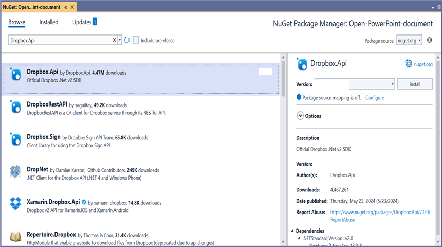
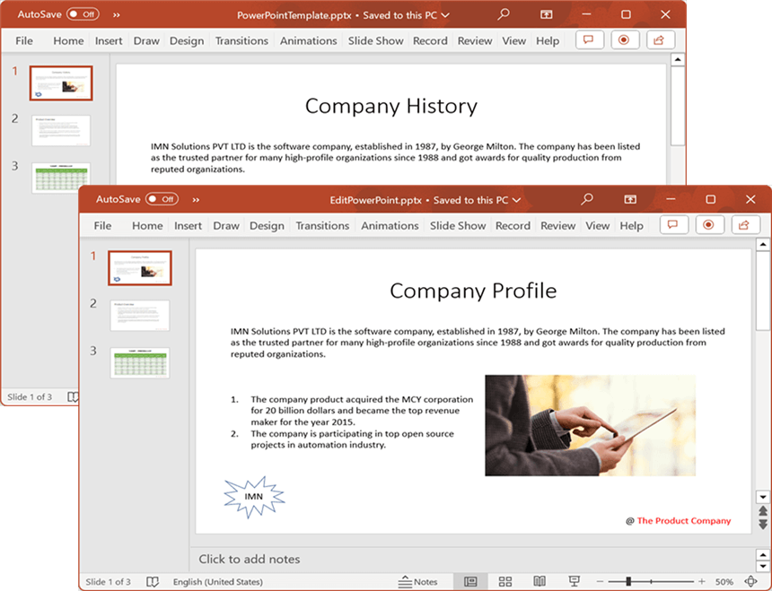
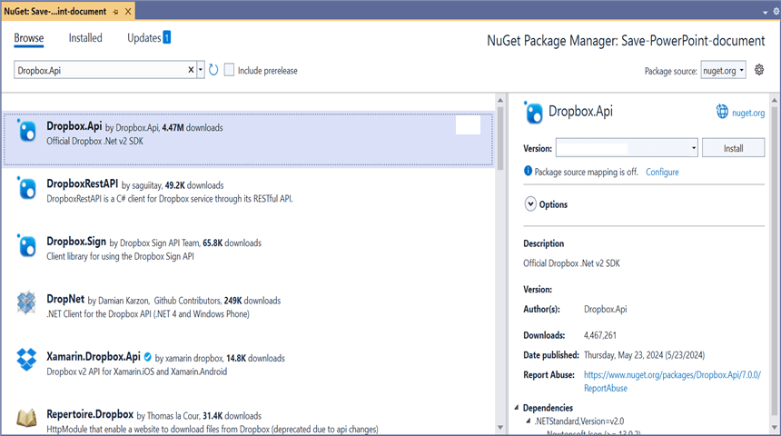

# Open and Save Presentation in Dropbox Cloud Storage

## Prerequisites

* Create a Dropbox API App from the [Dropbox App Console](https://www.dropbox.com/developers/apps). In the App Console, set the required permission scope to `files.content.read` (for opening) and `files.content.write` (for saving), then generate an **access token** for the app. This token authenticates programmatic access to your Dropbox account.
* Store the access token securely using `appsettings.json`, environment variables, or the Secret Manager — do not hard-code it in production code.

## Open Presentation from Dropbox Cloud Storage

Steps to open a Presentation from Dropbox Cloud Storage.

Step 1: Create a new ASP.NET Core Web Application (Model-View-Controller).

Step 2: Name the project.

Step 3: Install the following **Nuget packages** in your application from [NuGet.org](https://www.nuget.org/).

* [Syncfusion.Presentation.Net.Core](https://www.nuget.org/packages/Syncfusion.Presentation.Net.Core)
* [Dropbox.Api](https://www.nuget.org/packages/Dropbox.Api)

Step 4: Add a new form in **Index.cshtml** that posts to the `EditDocument` action, as shown below.

  

@{Html.BeginForm("EditDocument", "Home", FormMethod.Get);
    {
        

            <input type="submit" value="Edit Document" style="width:150px;height:27px" />
        

    }
    Html.EndForm();
}



Step 5: Include the following namespaces in **HomeController.cs**.



using System.IO;
using Dropbox.Api;
using Dropbox.Api.Files;
using Syncfusion.Presentation;



Step 6: Include the below code snippet in **HomeController.cs** to **open a Presentation from Dropbox Cloud Storage**.



public async Task<IActionResult> EditDocument()
{
    try
    {
        //Retrieve the document from Dropbox
        MemoryStream stream = await GetDocumentFromDropBox();

        //Set the position to the beginning of the MemoryStream
        stream.Position = 0;

        //Create an instance of PowerPoint Presentation file
        using (IPresentation pptxDocument = Presentation.Open(stream))
        {
            //Get the first slide from the PowerPoint presentation
            ISlide slide = pptxDocument.Slides[0];

            //Get the first shape of the slide
            IShape shape = slide.Shapes[0] as IShape;

            //Change the text of the shape
            if (shape.TextBody.Text == "Company History")
                shape.TextBody.Text = "Company Profile";

            //Saving the PowerPoint file to a MemoryStream 
            MemoryStream outputStream = new MemoryStream();
            pptxDocument.Save(outputStream);

            //Download the PowerPoint file in the browser
            FileStreamResult fileStreamResult = new FileStreamResult(outputStream, "application/powerpoint");
            fileStreamResult.FileDownloadName = "EditPowerPoint.pptx";
            return fileStreamResult;
        }
    }
    catch (Exception ex)
    {
        Console.WriteLine($"Error: {ex.Message}");
        return Content("Error occurred while processing the file.");
    }
}



### Download file from Dropbox cloud storage

This is the helper method to download a Presentation from Dropbox cloud storage.



/// 

/// Download file from Dropbox cloud storage
/// 

/// <returns></returns>
public async Task<MemoryStream> GetDocumentFromDropBox()
{
    //TODO: Replace with your Dropbox access token. In production, read this from configuration or a secret store.
    var accessToken = "Access_Token";

    //Define the file path in Dropbox where the file is located. For ex: "/Template.pptx" or "/Apps/Template.pptx"
    var filePathInDropbox = "/PowerPointTemplate.pptx";

    try
    {
        //Create a new DropboxClient instance using the provided access token
        using (var dbx = new DropboxClient(accessToken))
        {
            //Start a download request for the specified file in Dropbox
            using (var response = await dbx.Files.DownloadAsync(filePathInDropbox))
            {
                //Get the content of the downloaded file as a stream
                var content = await response.GetContentAsStreamAsync();

                MemoryStream stream = new MemoryStream();
                content.CopyTo(stream);
                return stream;
            }
        }
    }
    catch (Exception ex)
    {
        Console.WriteLine($"Error retrieving document from Dropbox: {ex.Message}");
        throw; // or handle the exception as needed
    }
}



You can download a complete working sample from [GitHub](https://github.com/SyncfusionExamples/PowerPoint-Examples/tree/master/Read-and-save-PowerPoint-presentation/Open-and-save-PowerPoint/DropBox-Cloud-Storage/Open-PowerPoint-document).

By executing the program, you will get the **Presentation** as follows.

## Save Presentation to Dropbox Cloud Storage

Steps to save a Presentation to Dropbox Cloud Storage.

Step 1: Create a new ASP.NET Core Web Application (Model-View-Controller).

Step 2: Name the project.

Step 3: Install the following **Nuget packages** in your application from [NuGet.org](https://www.nuget.org/).

* [Syncfusion.Presentation.Net.Core](https://www.nuget.org/packages/Syncfusion.Presentation.Net.Core)
* [Dropbox.Api](https://www.nuget.org/packages/Dropbox.Api)

Step 4: Add a new form in **Index.cshtml** that posts to the `UploadDocument` action, as shown below.

  

@{Html.BeginForm("UploadDocument", "Home", FormMethod.Get);
    {
        

            <input type="submit" value="Upload Document" style="width:150px;height:27px" />
        

    }
    Html.EndForm();
}



Step 5: Include the following namespaces in **HomeController.cs**.



using System.IO;
using Dropbox.Api.Files;
using Dropbox.Api;
using Syncfusion.Drawing;
using Syncfusion.Presentation;



Step 6: Include the below code snippet in **HomeController.cs** to **save a Presentation to Dropbox Cloud Storage**.



public async Task<IActionResult> UploadDocument()
{
    //Create a new instance of PowerPoint Presentation file
    using (IPresentation pptxDocument = Presentation.Create())
    {
        //Add a new slide to file and apply background color
        ISlide slide = pptxDocument.Slides.Add(SlideLayoutType.TitleOnly);

        //Specify the fill type and fill color for the slide background
        slide.Background.Fill.FillType = FillType.Solid;
        slide.Background.Fill.SolidFill.Color = ColorObject.FromArgb(232, 241, 229);

        //Add title content to the slide by accessing the title placeholder of the TitleOnly layout-slide
        IShape titleShape = slide.Shapes[0] as IShape;
        titleShape.TextBody.AddParagraph("Company History").HorizontalAlignment = HorizontalAlignmentType.Center;

        //Add description content to the slide by adding a new TextBox
        IShape descriptionShape = slide.AddTextBox(53.22, 141.73, 874.19, 77.70);
        descriptionShape.TextBody.Text = "IMN Solutions PVT LTD is the software company, established in 1987, by George Milton. The company has been listed as the trusted partner for many high-profile organizations since 1988 and got awards for quality products from reputed organizations.";

        //Add bullet points to the slide
        IShape bulletPointsShape = slide.AddTextBox(53.22, 270, 437.90, 116.32);

        //Add a paragraph for a bullet point
        IParagraph firstPara = bulletPointsShape.TextBody.AddParagraph("The company acquired the MCY corporation for 20 billion dollars and became the top revenue maker for the year 2015.");

        //Format how the bullets should be displayed
        firstPara.ListFormat.Type = ListType.Bulleted;
        firstPara.LeftIndent = 35;
        firstPara.FirstLineIndent = -35;

        //Add another paragraph for the next bullet point
        IParagraph secondPara = bulletPointsShape.TextBody.AddParagraph("The company is participating in top open source projects in automation industry.");

        //Format how the bullets should be displayed
        secondPara.ListFormat.Type = ListType.Bulleted;
        secondPara.LeftIndent = 35;
        secondPara.FirstLineIndent = -35;

        //Gets a picture as a stream (Image.jpg is shipped with the GitHub sample under Data/)
        using (FileStream pictureStream = new FileStream(Path.GetFullPath("Data/Image.jpg"), FileMode.Open))
        {
            //Adds the picture to a slide by specifying its size and position.
            slide.Shapes.AddPicture(pictureStream, 499.79, 238.59, 364.54, 192.16);
        }

        //Add an auto-shape to the slide
        IShape stampShape = slide.Shapes.AddShape(AutoShapeType.Explosion1, 48.93, 430.71, 104.13, 80.54);

        //Format the auto-shape color by setting the fill type and text
        stampShape.Fill.FillType = FillType.None;
        stampShape.TextBody.AddParagraph("IMN").HorizontalAlignment = HorizontalAlignmentType.Center;

        //Saves the PowerPoint to MemoryStream
        MemoryStream stream = new MemoryStream();
        pptxDocument.Save(stream);

        //Reset the stream position so the upload reads from the beginning
        stream.Position = 0;

        //Upload the document to Dropbox
        await UploadDocumentToDropBox(stream);

        return Ok("PowerPoint uploaded to Dropbox Cloud Storage.");
    }
}



### Upload file to Dropbox cloud storage

This is the helper method to upload a Presentation to Dropbox cloud storage.



/// 

/// Upload file to Dropbox
/// 

/// <param name="stream">MemoryStream containing the PowerPoint file to upload</param>
public async Task UploadDocumentToDropBox(MemoryStream stream)
{
    //TODO: Replace with your Dropbox access token. In production, read this from configuration or a secret store.
    var accessToken = "Access_Token";

    //Define the file path in Dropbox where the file should be saved. For ex: "/Template.pptx" or "/Apps/Template.pptx"
    var filePathInDropbox = "FilePath";

    try
    {
        //Create a new DropboxClient instance using the provided access token
        using (var dbx = new DropboxClient(accessToken))
        {
            //Upload the file to Dropbox, overwriting any existing file at the same path.
            //Use WriteMode.Add.Instance instead of Overwrite to receive a conflict if the file already exists.
            await dbx.Files.UploadAsync(filePathInDropbox, WriteMode.Overwrite.Instance, body: stream);
        }
        Console.WriteLine("Upload completed successfully");
    }
    catch (Exception e)
    {
        Console.WriteLine("Unknown encountered on server. Message:'{0}' when writing an object", e.Message);
    }
}



You can download a complete working sample from [GitHub](https://github.com/SyncfusionExamples/PowerPoint-Examples/tree/master/Read-and-save-PowerPoint-presentation/Open-and-save-PowerPoint/DropBox-Cloud-Storage/Save-PowerPoint-document).

By executing the program, the resulting PowerPoint file is uploaded to Dropbox and the page returns a success message.

