# Open and save Presentation in Google App Engine

Syncfusion&reg; PowerPoint is a [.NET Core PowerPoint library](https://www.syncfusion.com/document-sdk/net-powerpoint-library) used to create, read, edit and convert PowerPoint documents programmatically without **Microsoft PowerPoint** or interop dependencies. Using this library, you can **open and save a PowerPoint Presentation in Google App Engine**.

## Prerequisites

- A Google Cloud account with a created GCP project and billing enabled.
- The **App Engine Admin API** enabled in the [Google Cloud Console](https://console.cloud.google.com/).
- The [gcloud CLI](https://cloud.google.com/sdk/docs/install) installed locally.
- [.NET SDK 8.0](https://dotnet.microsoft.com/download/dotnet/8.0) or later installed.
- [Visual Studio 2022](https://visualstudio.microsoft.com/) with the **ASP.NET and web development** workload installed.
- A valid Syncfusion&reg; license key. Refer to this [link](https://help.syncfusion.com/common/essential-studio/licensing/overview) to know about registering a Syncfusion&reg; license key in your application.

## Set up App Engine

Step 1: Open the **Google Cloud Console** and click the **Activate Cloud Shell** button.
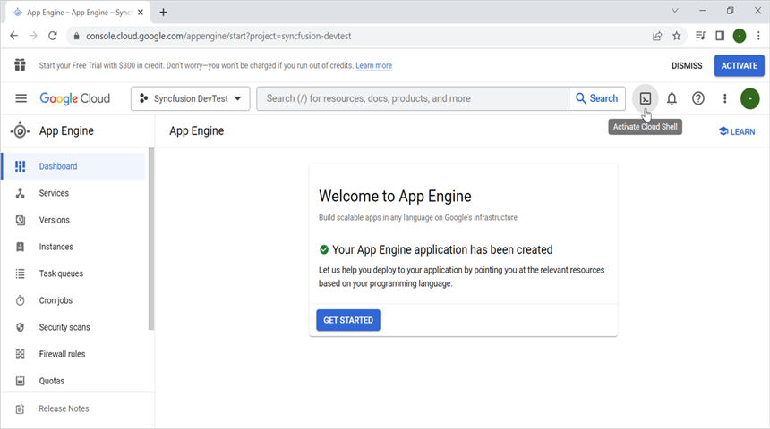

Step 2: Click the **Cloud Shell Editor** button to view the **Workspace**.
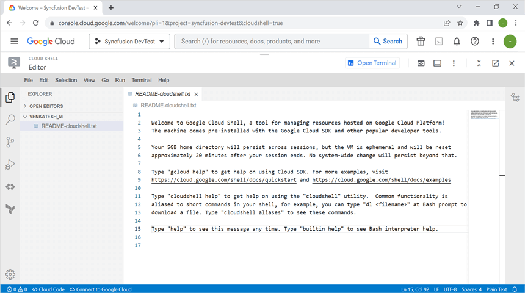

Step 3: Open the **Cloud Shell Terminal** and run the following **command** to confirm authentication.




gcloud auth list




Step 4: Click the **Authorize** button.

## Create an application for App Engine

Step 1: Open Visual Studio and select the **ASP.NET Core Web App (Model-View-Controller)** template.

Step 2: Configure the project name as **Open-and-save-PowerPoint-Presentation** (this name is referenced later in the Dockerfile `ENTRYPOINT`).
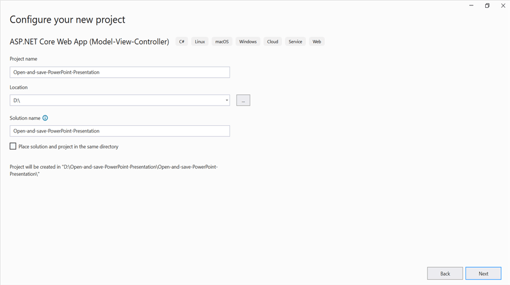

Step 3: Click the **Create** button.

Step 4: Install the [Syncfusion.Presentation.Net.Core](https://www.nuget.org/packages/Syncfusion.Presentation.Net.Core) NuGet package as a reference to your project from [NuGet.org](https://www.nuget.org/).
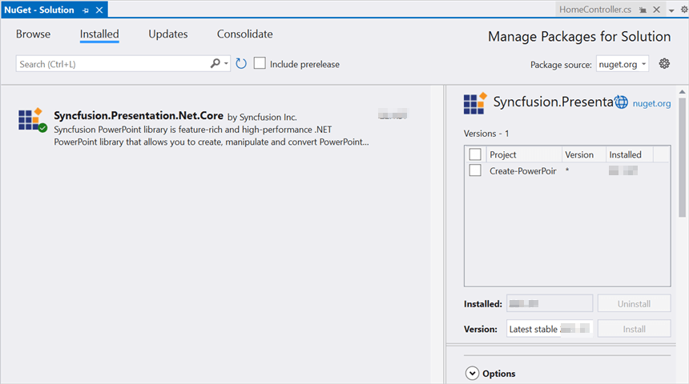

N> Starting with v16.2.0.x, if you reference Syncfusion&reg; assemblies from trial setup or from the NuGet feed, you also have to add "Syncfusion.Licensing" assembly reference and include a license key in your projects. Please refer to this [link](https://help.syncfusion.com/common/essential-studio/licensing/overview) to know about registering Syncfusion&reg; license key in your application to use our components.

Step 5: Include the following namespaces in the **HomeController.cs** file.




using Microsoft.AspNetCore.Mvc;
using Syncfusion.Presentation;
using System.IO;




Step 6: A default action method named `Index` will be present in `HomeController.cs`. Right-click the `Index` method and select **Go To View**, which opens the associated view page **Index.cshtml**.

Step 7: Add a new button in **Index.cshtml** as shown below.




@{
    Html.BeginForm("OpenAndSavePowerPoint", "Home", FormMethod.Get);
    {
        

            <input type="submit" value="Open and Save PowerPoint" style="width:220px;height:27px" />
        

    }
    Html.EndForm();
}




Step 8: Create a `Data` folder in the project root and add a sample PowerPoint file named `Template.pptx`. Then add the following item to the `.csproj` file so the file is copied to the publish output directory.



<ItemGroup>
  <Content Update="Data\Template.pptx">
    <CopyToOutputDirectory>PreserveNewest</CopyToOutputDirectory>
  </Content>
</ItemGroup>



Step 9: Add a new action method **OpenAndSavePowerPoint** in `HomeController.cs` and include the following code snippet to **open the PowerPoint document** using the file path overload.




//Open an existing PowerPoint presentation using the file path overload.
using IPresentation pptxDoc = Presentation.Open(Path.GetFullPath("Data/Template.pptx"));




Step 10: Add the following code snippet to access a shape from a slide and change the text within it. Ensure that the first shape on the first slide of `Template.pptx` contains the text "Company History" before running the sample.




//Get the first slide from the PowerPoint presentation.
ISlide slide = pptxDoc.Slides[0];
//Get the first shape of the slide.
IShape shape = slide.Shapes[0] as IShape;
//Change the text of the shape.
if (shape != null && shape.TextBody != null && shape.TextBody.Text == "Company History")
    shape.TextBody.Text = "Company Profile";




Step 11: Add the following code example to **save the PowerPoint Presentation** and return it to the browser.




//Save the PowerPoint Presentation as a stream.
MemoryStream pptxStream = new();
pptxDoc.Save(pptxStream);
pptxStream.Position = 0;
//Download the PowerPoint document in the browser. The framework disposes the stream after the response is sent.
return File(pptxStream, "application/vnd.openxmlformats-officedocument.presentationml.presentation", "Result.pptx");




## Test the application in Cloud Shell

Step 1: Open the **Cloud Shell editor**.

Step 2: Drag and drop the sample from your local machine into the **Workspace**.
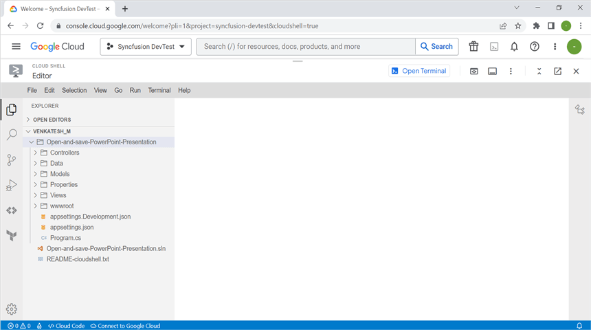

N> If you have your sample application on your local machine, drag and drop it into the Workspace. The sample is created locally in Visual Studio, so this step is required to upload it to Cloud Shell.

Step 3: Open the **Cloud Shell Terminal** and run the following **command** to view the files and directories within the current Workspace.




ls




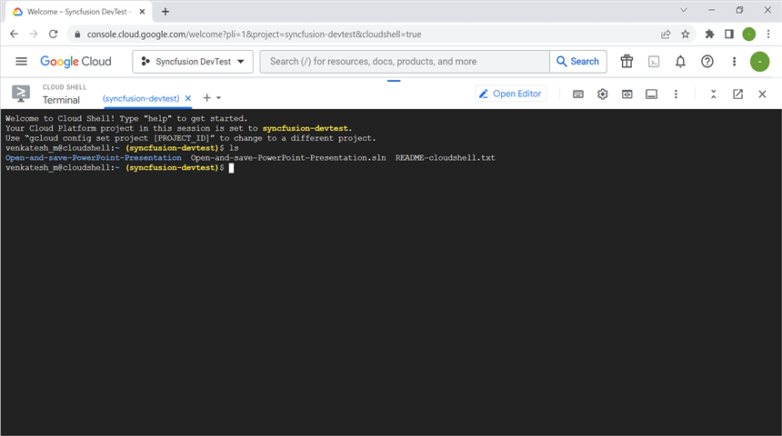

Step 4: Run the following **command** to navigate to the sample you want to run.




cd Open-and-save-PowerPoint-Presentation




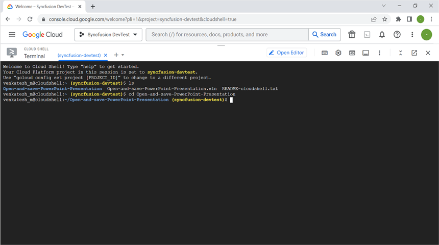

Step 5: Run the application using the following command. The URL must bind to `0.0.0.0` so the Cloud Shell Web Preview can proxy the request.




dotnet run --urls=http://0.0.0.0:8080




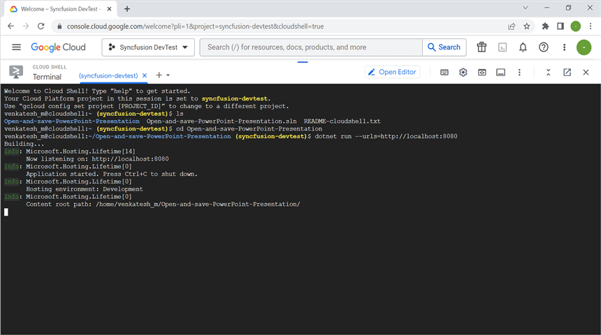

Step 6: Verify that the application is running properly by accessing **Web View** -> **Preview on port 8080**.
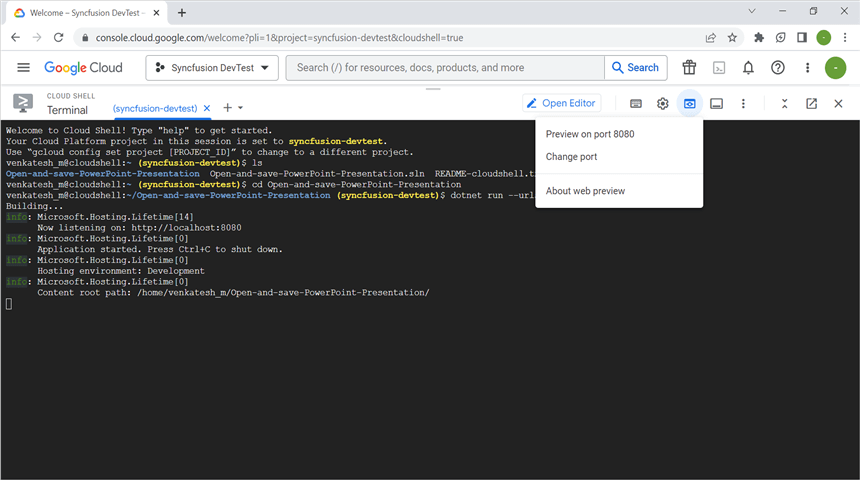

Step 7: Click the **Open and Save PowerPoint** button on the preview page to download the modified `Result.pptx`.
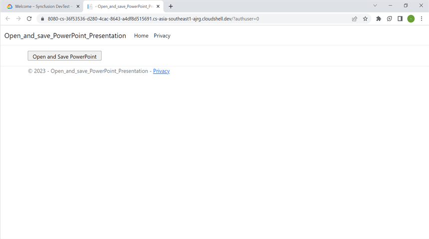

Step 8: Close the preview page, return to the terminal, and press **Ctrl+C** to stop the process.
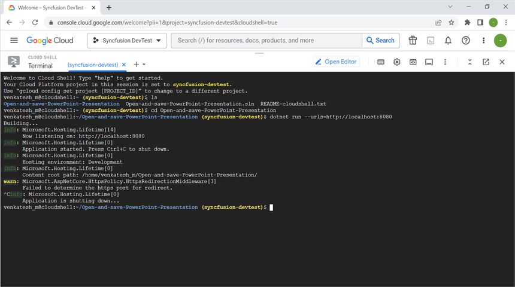

## Publish the application

Step 1: Run the following command in **Cloud Shell Terminal** to publish the application.




dotnet publish -c Release




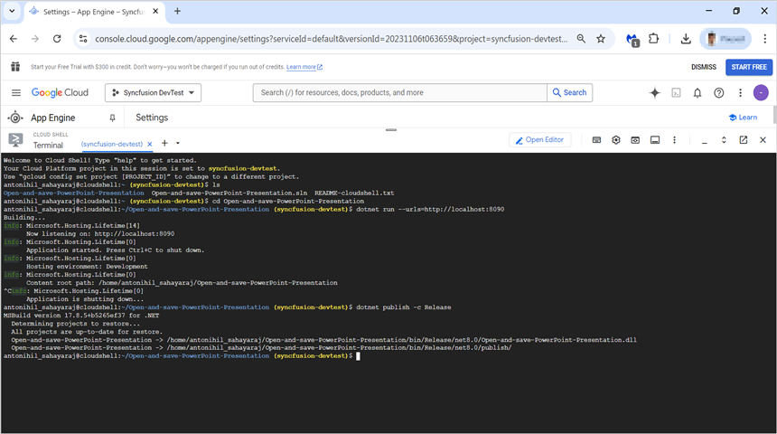

Step 2: Run the following command in the **Cloud Shell Terminal** to navigate to the publish folder.



cd bin/Release/net8.0/publish/




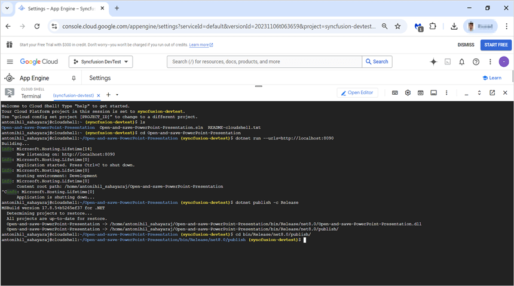

## Configure app.yaml and docker file

Step 1: Add the `app.yaml` file to the publish folder with the following contents.




cat <<EOT >> app.yaml
env: flex
runtime: custom
EOT




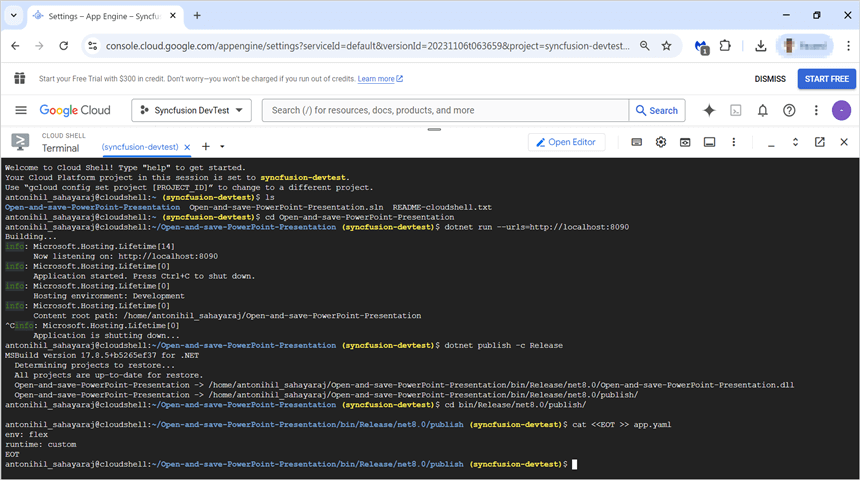

Step 2: Add the `Dockerfile` to the publish folder with the following contents. The `ENTRYPOINT` DLL name must match the project assembly name (`Open-and-save-PowerPoint-Presentation.dll`).




cat <<EOT >> Dockerfile
FROM mcr.microsoft.com/dotnet/aspnet:8.0
RUN apt-get update -y && apt-get install libfontconfig -y
COPY . /app
EXPOSE 8080
ENV ASPNETCORE_URLS=http://*:8080
WORKDIR /app
ENTRYPOINT [ "dotnet", "Open-and-save-PowerPoint-Presentation.dll"]
EOT




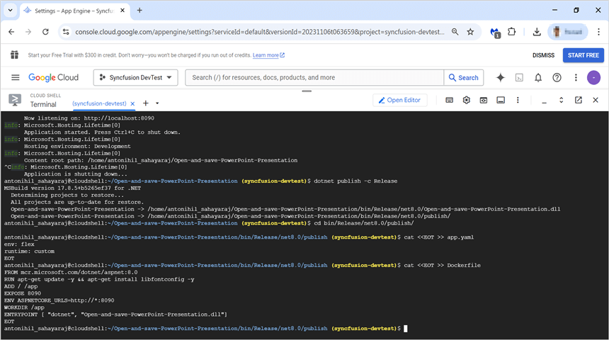

Step 3: Verify that the `Dockerfile` and `app.yaml` files have been added to the Workspace.
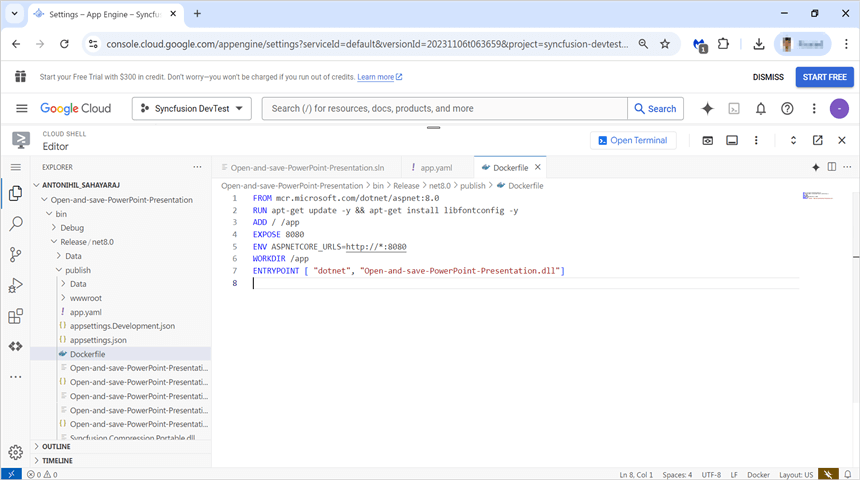

## Deploy to App Engine

Step 1: Run the following command in the **Cloud Shell Terminal** to deploy the application to App Engine. If this is the first deploy, the command will prompt you to choose a region; select the region closest to your users. Then retrieve the deployed app's URL from the terminal output.




gcloud app deploy --version v1




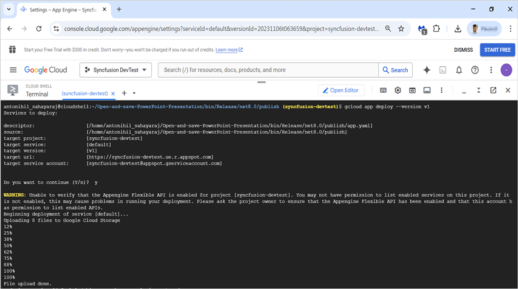

Step 2: Open the deployed **URL** to access the application.
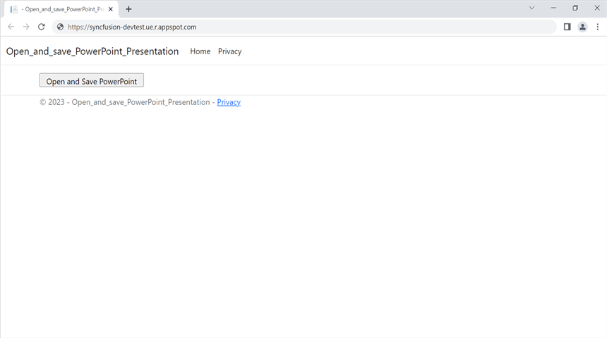

You can download a complete working sample from [GitHub](https://github.com/SyncfusionExamples/PowerPoint-Examples/tree/master/Read-and-save-PowerPoint-presentation/Open-and-save-PowerPoint/GCP/Google_App_Engine).

By executing the program, you will get the **PowerPoint document** as follows. The file is downloaded by the browser when the **Open and Save PowerPoint** button is clicked on the deployed page.

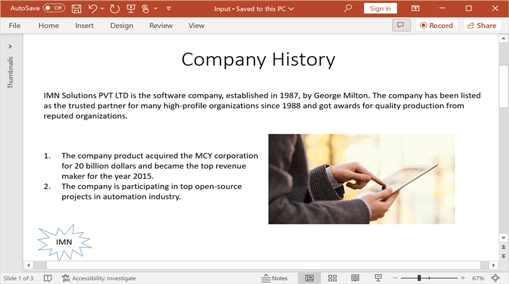

Looking for the full .NET PowerPoint Library component overview, features, pricing, and documentation? Visit the [.NET PowerPoint Library](https://www.syncfusion.com/document-sdk/net-powerpoint-library) page. 
