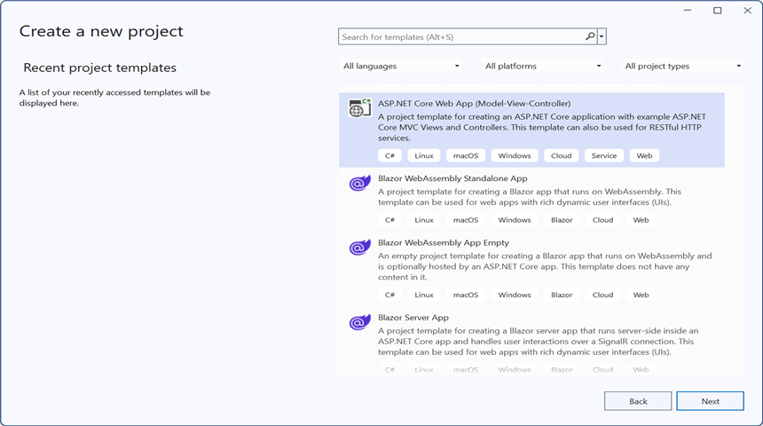
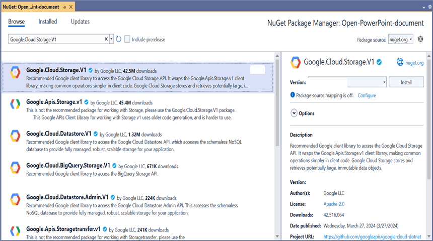
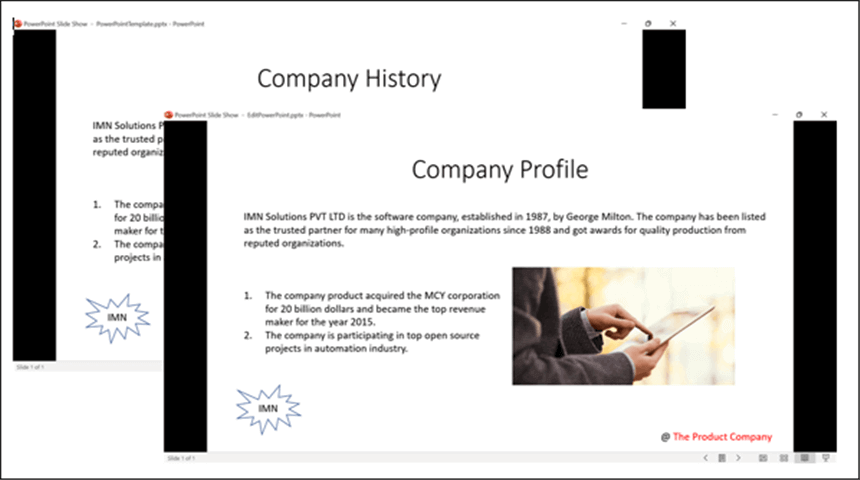
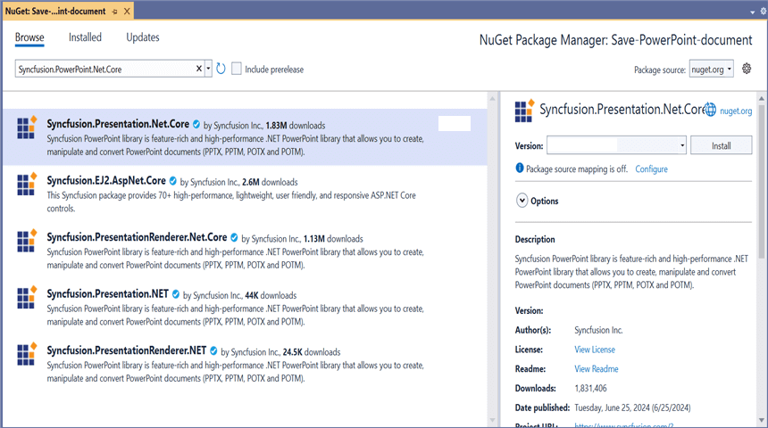
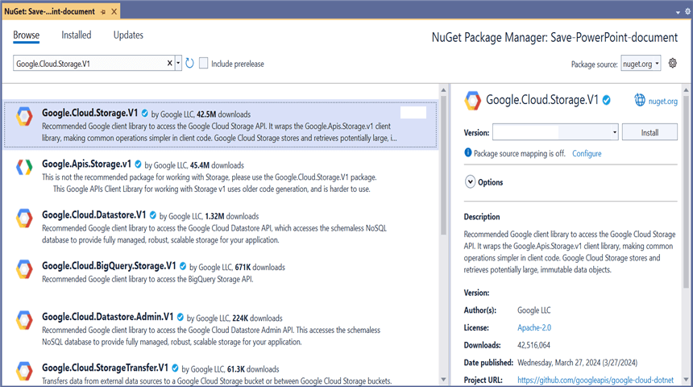
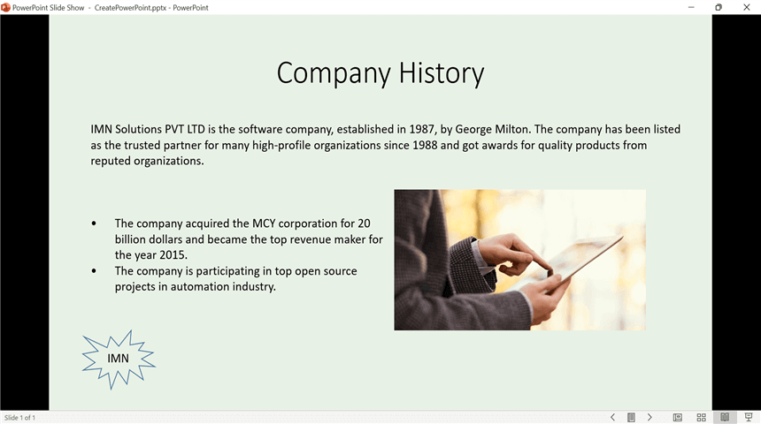

# Open and Save a Presentation in Google Cloud Storage

## Prerequisites  

* **[Google Cloud Storage](https://docs.cloud.google.com/storage/docs/creating-buckets)** is required.

* A **[service account](https://cloud.google.com/iam/docs/service-accounts-create)** and its **[service account key](https://cloud.google.com/iam/docs/keys-create-delete#creating)** are required.

* The **Google Cloud Storage API** must be enabled in the Google Cloud Console. For steps, see [Enable Google Cloud services](https://cloud.google.com/service-usage/docs/enable-disable).

* The service account must be granted the **Storage Object Viewer** role (to download) and **Storage Object Creator** role (to upload) on the target bucket. For steps, see [Manage access to buckets](https://cloud.google.com/storage/docs/access-control/using-iam-permissions).

* **.NET 8.0 or later**.

* Place the downloaded service account key file (`credentials.json`) in the project root and set **Copy to Output Directory** to **Copy if newer** so the relative path resolves at runtime.

## Open a Presentation from Google Cloud Storage

Steps to open a Presentation from Google Cloud Storage.

Step 1: Create an ASP.NET Core Web Application (Model-View-Controller).

Step 2: Name the project.

Step 3: Install the following **NuGet packages** in your application from [NuGet.org](https://www.nuget.org/).

* [Syncfusion.Presentation.Net.Core](https://www.nuget.org/packages/Syncfusion.Presentation.Net.Core)
* [Google.Cloud.Storage.V1](https://www.nuget.org/packages/Google.Cloud.Storage.V1)

Step 4: Add a new button to **Index.cshtml** as shown below.

  

@{Html.BeginForm("EditDocument", "Home", FormMethod.Get);
    {
        

            <input type="submit" value="Edit Document" style="width:150px;height:27px" />
        

    }
    Html.EndForm();
}



Step 5: Include the following namespaces in **HomeController.cs**.



using System.IO;
using System.Threading.Tasks;
using Google.Apis.Auth.OAuth2;
using Google.Cloud.Storage.V1;
using Microsoft.AspNetCore.Mvc;
using Syncfusion.Presentation;



Step 6: Add the following code snippet to **HomeController.cs** to **open a Presentation from Google Cloud Storage**.



public async Task<IActionResult> EditDocument()
{
    try
    {
        //Download the file from Google Cloud Storage
        MemoryStream memoryStream = await GetDocumentFromGoogle();

        //Save the downloaded file to a temp path so the path-based overload can be used
        string tempFilePath = Path.Combine(Path.GetTempPath(), "PowerPointTemplate.pptx");
        using (FileStream fileStream = new FileStream(tempFilePath, FileMode.Create, FileAccess.Write))
        {
            memoryStream.CopyTo(fileStream);
        }

        //Create an instance of the PowerPoint Presentation file using a file path
        using (IPresentation pptxDocument = Presentation.Open(tempFilePath))
        {
            //Get the first slide from the PowerPoint presentation
            ISlide slide = pptxDocument.Slides[0];

            //Get the first shape of the slide
            IShape shape = slide.Shapes[0] as IShape;

            //Change the text of the shape
            if (shape.TextBody.Text == "Company History")
                shape.TextBody.Text = "Company Profile";

            //Save the PowerPoint file to a path
            string outputPath = Path.Combine(Path.GetTempPath(), "EditPowerPoint.pptx");
            pptxDocument.Save(outputPath);

            //Read the saved file into a MemoryStream to return as a download
            MemoryStream outputStream = new MemoryStream();
            using (FileStream fileStream = new FileStream(outputPath, FileMode.Open, FileAccess.Read))
            {
                fileStream.CopyTo(outputStream);
            }
            outputStream.Position = 0;

            //Download the PowerPoint file in the browser
            FileStreamResult fileStreamResult = new FileStreamResult(outputStream, "application/powerpoint");
            fileStreamResult.FileDownloadName = "EditPowerPoint.pptx";
            return fileStreamResult;
        }
    }
    catch (FileNotFoundException ex)
    {
        return NotFound($"The specified Presentation was not found in the bucket: {ex.Message}");
    }
    catch (Google.GoogleApiException ex) when (ex.HttpStatusCode == System.Net.HttpStatusCode.Forbidden)
    {
        return StatusCode(403, "Access to the Google Cloud Storage bucket was denied. Verify the service account has the Storage Object Viewer role.");
    }
    catch (Exception ex)
    {
        return StatusCode(500, $"An error occurred while opening the Presentation: {ex.Message}");
    }
}



### Download a file from Google Cloud Storage

This is the helper method to download a Presentation from Google Cloud Storage.



/// 

/// Download a file from Google Cloud Storage.
/// 

/// <returns>A MemoryStream containing the file contents. The caller is responsible for disposing the returned stream.</returns>
public async Task<MemoryStream> GetDocumentFromGoogle()
{
    //Your bucket name
    string bucketName = "Your_bucket_name";

    //Your service account key file path (relative to the project output directory)
    string keyPath = "credentials.json";

    //Name of the file to download from the Google Cloud Storage bucket
    string fileName = "PowerPointTemplate.pptx";

    //Create Google Credential from the service account key file with the required scopes
    GoogleCredential credential = GoogleCredential.FromFile(keyPath)
        .CreateScoped(StorageClient.DefaultScopes);

    //Instantiate a storage client to interact with Google Cloud Storage
    StorageClient storageClient = await StorageClient.CreateAsync(credential);

    //Download a file from Google Cloud Storage
    MemoryStream memoryStream = new MemoryStream();
    await storageClient.DownloadObjectAsync(bucketName, fileName, memoryStream);
    memoryStream.Position = 0;

    return memoryStream;
}



You can download a complete working sample from [GitHub](https://github.com/SyncfusionExamples/PowerPoint-Examples/tree/master/Read-and-save-PowerPoint-presentation/Open-and-save-PowerPoint/Google-Cloud-Storage/Open-PowerPoint-document).

By executing the program, you will get the PowerPoint presentation as follows.

## Save a Presentation to Google Cloud Storage

Steps to save a Presentation to Google Cloud Storage.

Step 1: Create an ASP.NET Core Web Application (Model-View-Controller).

Step 2: Name the project.

Step 3: Install the following **NuGet packages** in your application from [NuGet.org](https://www.nuget.org/).

* [Syncfusion.Presentation.Net.Core](https://www.nuget.org/packages/Syncfusion.Presentation.Net.Core)
* [Google.Cloud.Storage.V1](https://www.nuget.org/packages/Google.Cloud.Storage.V1)

Step 4: Add a new button to **Index.cshtml** as shown below.

  

@{Html.BeginForm("UploadDocument", "Home", FormMethod.Get);
    {
        

            <input type="submit" value="Upload Document" style="width:150px;height:27px" />
        

    }
    Html.EndForm();
}



Step 5: Include the following namespaces in **HomeController.cs**.



using System.IO;
using System.Threading.Tasks;
using Google.Apis.Auth.OAuth2;
using Google.Cloud.Storage.V1;
using Microsoft.AspNetCore.Mvc;
using Syncfusion.Drawing;
using Syncfusion.Presentation;



Step 6: Add the following code snippet to **HomeController.cs** to **save a Presentation to Google Cloud Storage**.



public async Task<IActionResult> UploadDocument()
{
    try
    {
        //Create a new instance of a PowerPoint Presentation file
        using (IPresentation pptxDocument = Presentation.Create())
        {
            //Add a new slide to the file and apply a background color
            ISlide slide = pptxDocument.Slides.Add(SlideLayoutType.TitleOnly);

            //Specify the fill type and fill color for the slide background
            slide.Background.Fill.FillType = FillType.Solid;
            slide.Background.Fill.SolidFill.Color = ColorObject.FromArgb(232, 241, 229);

            //Add title content to the slide by accessing the title placeholder of the TitleOnly layout slide
            IShape titleShape = slide.Shapes[0] as IShape;
            titleShape.TextBody.AddParagraph("Company History").HorizontalAlignment = HorizontalAlignmentType.Center;

            //Add description content to the slide by adding a new TextBox
            IShape descriptionShape = slide.AddTextBox(53.22, 141.73, 874.19, 77.70);
            descriptionShape.TextBody.Text = "IMN Solutions PVT LTD is the software company, established in 1987, by George Milton. The company has been listed as the trusted partner for many high-profile organizations since 1988 and got awards for quality products from reputed organizations.";

            //Add bullet points to the slide
            IShape bulletPointsShape = slide.AddTextBox(53.22, 270, 437.90, 116.32);

            //Add a paragraph for a bullet point
            IParagraph firstPara = bulletPointsShape.TextBody.AddParagraph("The company acquired the MCY corporation for 20 billion dollars and became the top revenue maker for the year 2015.");

            //Format how the bullets should be displayed
            firstPara.ListFormat.Type = ListType.Bulleted;
            firstPara.LeftIndent = 35;
            firstPara.FirstLineIndent = -35;

            //Add another paragraph for the next bullet point
            IParagraph secondPara = bulletPointsShape.TextBody.AddParagraph("The company is participating in top open source projects in automation industry.");

            //Format how the bullets should be displayed
            secondPara.ListFormat.Type = ListType.Bulleted;
            secondPara.LeftIndent = 35;
            secondPara.FirstLineIndent = -35;

            //Get a picture as a stream
            using (FileStream pictureStream = new FileStream("Image.jpg", FileMode.Open, FileAccess.Read))
            {
                //Add the picture to a slide by specifying its size and position
                slide.Shapes.AddPicture(pictureStream, 499.79, 238.59, 364.54, 192.16);
            }

            //Add an auto-shape to the slide
            IShape stampShape = slide.Shapes.AddShape(AutoShapeType.Explosion1, 48.93, 430.71, 104.13, 80.54);

            //Format the auto-shape color by setting the fill type and text
            stampShape.Fill.FillType = FillType.None;
            stampShape.TextBody.AddParagraph("IMN").HorizontalAlignment = HorizontalAlignmentType.Center;

            //Save the PowerPoint to a MemoryStream
            using (MemoryStream stream = new MemoryStream())
            {
                pptxDocument.Save(stream);
                stream.Position = 0;

                //Upload the file to Google Cloud Storage
                await UploadDocumentToGoogle(stream);
            }
        }

        return Ok("PowerPoint uploaded to Google Cloud Storage.");
    }
    catch (FileNotFoundException ex)
    {
        return NotFound($"The image file was not found: {ex.Message}");
    }
    catch (Google.GoogleApiException ex) when (ex.HttpStatusCode == System.Net.HttpStatusCode.Forbidden)
    {
        return StatusCode(403, "Access to the Google Cloud Storage bucket was denied. Verify the service account has the Storage Object Creator role.");
    }
    catch (Exception ex)
    {
        return StatusCode(500, $"An error occurred while uploading the Presentation: {ex.Message}");
    }
}



### Upload a file to Google Cloud Storage

This is the helper method to upload a Presentation to Google Cloud Storage.



/// 

/// Upload a file to Google Cloud Storage.
/// 

/// <param name="stream">The MemoryStream that contains the file to upload. The stream is left at position 0 and is not disposed by this method.</param>
/// <returns>A task that represents the asynchronous upload operation.</returns>
public async Task UploadDocumentToGoogle(MemoryStream stream)
{
    //Your bucket name
    string bucketName = "Your_bucket_name";

    //Your service account key file path (relative to the project output directory)
    string keyPath = "credentials.json";

    //Name of the file to save in Google Cloud Storage
    string fileName = "CreatePowerPoint.pptx";

    //Content type for a .pptx file
    string contentType = "application/vnd.openxmlformats-officedocument.presentationml.presentation";

    //Create Google Credential from the service account key file with the required scopes
    GoogleCredential credential = GoogleCredential.FromFile(keyPath)
        .CreateScoped(StorageClient.DefaultScopes);

    //Instantiate a storage client to interact with Google Cloud Storage
    StorageClient storageClient = await StorageClient.CreateAsync(credential);

    //Ensure the stream is at the beginning before uploading
    stream.Position = 0;

    //Upload the file to Google Cloud Storage
    await storageClient.UploadObjectAsync(bucketName, fileName, contentType, stream);
}



You can download a complete working sample from [GitHub](https://github.com/SyncfusionExamples/PowerPoint-Examples/tree/master/Read-and-save-PowerPoint-presentation/Open-and-save-PowerPoint/Google-Cloud-Storage/Save-PowerPoint-document).

By executing the program, the Presentation is saved to the configured Google Cloud Storage bucket and the API returns the message **"PowerPoint uploaded to Google Cloud Storage."**

## See also

* [Open and Save a Presentation in AWS S3 Cloud Storage](Open-and-Save-PowerPoint-Presentation-in-AWS-S3-Cloud-Storage.md)
* [Open and Save a Presentation in Azure Blob Cloud Storage](Open-and-Save-PowerPoint-Presentation-in-Azure-Blob-Cloud-Storage.md)
