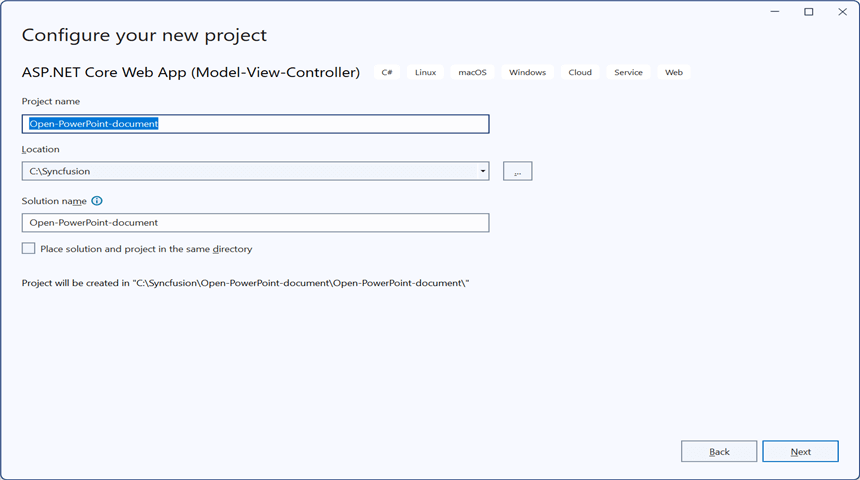
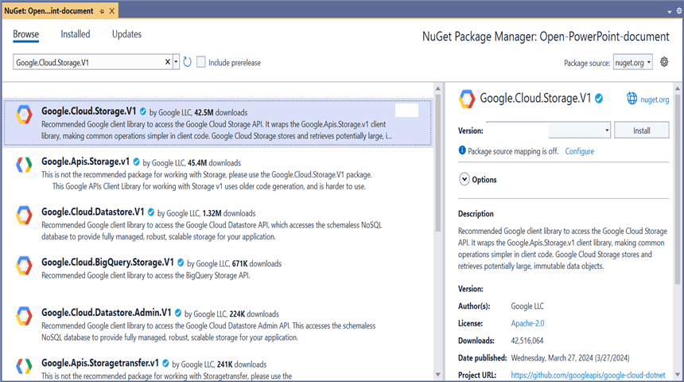
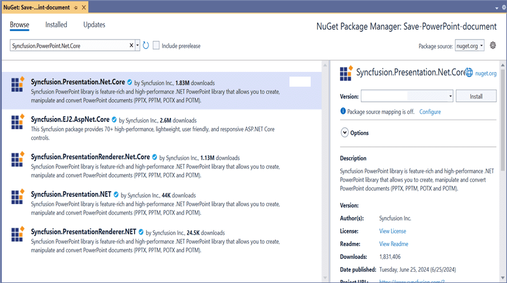
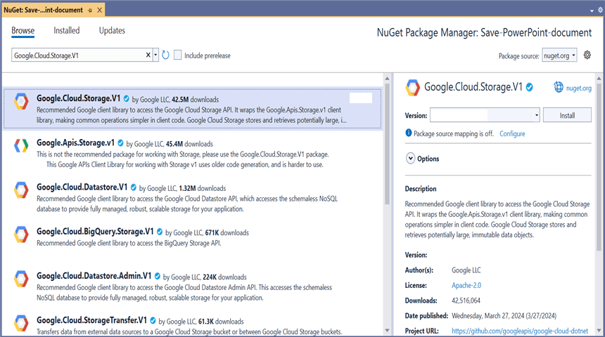

# Open and Save Presentation in Google Cloud Storage

## Prerequisites  

* **[Google cloud storage](https://cloud.google.com/storage/docs/creating-buckets)** is required. 

* **[Service account](https://cloud.google.com/iam/docs/service-accounts-create)** is required.

* **[Service account key](https://cloud.google.com/iam/docs/keys-create-delete#creating)** is required.

## Open Presentation from Google Cloud Storage

Steps to open a Presentation from Google Cloud Storage.

Step 1: Create a new ASP.NET Core Web Application (Model-View-Controller).

Step 2: Name the project.

Step 3: Install the following **Nuget packages** in your application from [NuGet.org](https://www.nuget.org/).

* [Syncfusion.Presentation.Net.Core](https://www.nuget.org/packages/Syncfusion.Presentation.Net.Core)
* [Google.Cloud.Storage.V1](https://www.nuget.org/packages/Google.Cloud.Storage.V1)

Step 4: Add a new button in the **Index.cshtml** as shown below.

  

@{Html.BeginForm("EditDocument", "Home", FormMethod.Get);
    {
        

            <input type="submit" value="Edit Document" style="width:150px;height:27px" />
        

    }
    Html.EndForm();
}



Step 5: Include the following namespaces in **HomeController.cs**.



using Google.Apis.Auth.OAuth2;
using Google.Cloud.Storage.V1;
using Syncfusion.Presentation;



Step 6: Include the below code snippet in **HomeController.cs** to **open a Presentation from Google Cloud Storage**.



public async Task<IActionResult> EditDocument()
{
    //Download the file from Google
    MemoryStream memoryStream = await GetDocumentFromGoogle();

    //Create an instance of PowerPoint Presentation file
    using (IPresentation pptxDocument = Presentation.Open(memoryStream))
    {
        //Get the first slide from the PowerPoint presentation
        ISlide slide = pptxDocument.Slides[0];

        //Get the first shape of the slide
        IShape shape = slide.Shapes[0] as IShape;

        //Change the text of the shape
        if (shape.TextBody.Text == "Company History")
            shape.TextBody.Text = "Company Profile";

        //Saving the PowerPoint to a MemoryStream 
        MemoryStream outputStream = new MemoryStream();
        pptxDocument.Save(outputStream);

        //Download the PowerPoint file in the browser
        FileStreamResult fileStreamResult = new FileStreamResult(outputStream, "application/powerpoint");
        fileStreamResult.FileDownloadName = "EditPowerPoint.pptx";
        return fileStreamResult;
    }
}



### Download file from Google cloud storage

This is the helper method to download Presentation from Google cloud storage.



/// 

/// Download file from Google
/// 

/// <returns></returns>
public async Task<MemoryStream> GetDocumentFromGoogle()
{
    try
    {
        //Your bucket name
        string bucketName = "Your_bucket_name";

        //Your service account key file path
        string keyPath = "credentials.json";

        //Name of the file to download from the Google Cloud Storage
        string fileName = "PowerPointTemplate.pptx";

        //Create Google Credential from the service account key file
        GoogleCredential credential = GoogleCredential.FromFile(keyPath);

        //Instantiates a storage client to interact with Google Cloud Storage
        StorageClient storageClient = StorageClient.Create(credential);

        //Download a file from Google Cloud Storage
        MemoryStream memoryStream = new MemoryStream();
        await storageClient.DownloadObjectAsync(bucketName, fileName, memoryStream);
        memoryStream.Position = 0;

        return memoryStream;
    }
    catch (Exception ex)
    {
        Console.WriteLine($"Error retrieving document from Google Cloud Storage: {ex.Message}");
        throw; // or handle the exception as needed
    }
}



You can download a complete working sample from [GitHub]().

By executing the program, you will get the **Presentation** as follows.

## Save Presentation to Google Cloud Storage

Steps to save a Presentation to Google Cloud Storage.

Step 1: Create a new ASP.NET Core Web Application (Model-View-Controller).

Step 2: Name the project.

Step 3: Install the following **Nuget packages** in your application from [NuGet.org](https://www.nuget.org/).

* [Syncfusion.Presentation.Net.Core](https://www.nuget.org/packages/Syncfusion.Presentation.Net.Core)
* [Google.Cloud.Storage.V1](https://www.nuget.org/packages/Google.Cloud.Storage.V1)

Step 4: Add a new button in the **Index.cshtml** as shown below.

  

@{Html.BeginForm("UploadDocument", "Home", FormMethod.Get);
    {
        

            <input type="submit" value="Upload Document" style="width:150px;height:27px" />
        

    }
    Html.EndForm();
}



Step 5: Include the following namespaces in **HomeController.cs**.



using Google.Apis.Auth.OAuth2;
using Google.Cloud.Storage.V1;
using Syncfusion.Presentation;



Step 6: Include the below code snippet in **HomeController.cs** to **save a Presentation to Google Cloud Storage**.



public async Task<IActionResult> UploadDocument()
{
    //Create a new instance of PowerPoint Presentation file
    IPresentation pptxDocument = Presentation.Create();

    //Add a new slide to file and apply background color
    ISlide slide = pptxDocument.Slides.Add(SlideLayoutType.TitleOnly);

    //Specify the fill type and fill color for the slide background 
    slide.Background.Fill.FillType = FillType.Solid;
    slide.Background.Fill.SolidFill.Color = ColorObject.FromArgb(232, 241, 229);

    //Add title content to the slide by accessing the title placeholder of the TitleOnly layout-slide
    IShape titleShape = slide.Shapes[0] as IShape;
    titleShape.TextBody.AddParagraph("Company History").HorizontalAlignment = HorizontalAlignmentType.Center;

    //Add description content to the slide by adding a new TextBox
    IShape descriptionShape = slide.AddTextBox(53.22, 141.73, 874.19, 77.70);
    descriptionShape.TextBody.Text = "IMN Solutions PVT LTD is the software company, established in 1987, by George Milton. The company has been listed as the trusted partner for many high-profile organizations since 1988 and got awards for quality products from reputed organizations.";

    //Add bullet points to the slide
    IShape bulletPointsShape = slide.AddTextBox(53.22, 270, 437.90, 116.32);

    //Add a paragraph for a bullet point
    IParagraph firstPara = bulletPointsShape.TextBody.AddParagraph("The company acquired the MCY corporation for 20 billion dollars and became the top revenue maker for the year 2015.");

    //Format how the bullets should be displayed
    firstPara.ListFormat.Type = ListType.Bulleted;
    firstPara.LeftIndent = 35;
    firstPara.FirstLineIndent = -35;

    //Add another paragraph for the next bullet point
    IParagraph secondPara = bulletPointsShape.TextBody.AddParagraph("The company is participating in top open source projects in automation industry.");

    //Format how the bullets should be displayed
    secondPara.ListFormat.Type = ListType.Bulleted;
    secondPara.LeftIndent = 35;
    secondPara.FirstLineIndent = -35;

    //Gets a picture as stream
    FileStream pictureStream = new FileStream("Image.jpg", FileMode.Open);

    //Adds the picture to a slide by specifying its size and position.
    slide.Shapes.AddPicture(pictureStream, 499.79, 238.59, 364.54, 192.16);

    //Add an auto-shape to the slide
    IShape stampShape = slide.Shapes.AddShape(AutoShapeType.Explosion1, 48.93, 430.71, 104.13, 80.54);

    //Format the auto-shape color by setting the fill type and text
    stampShape.Fill.FillType = FillType.None;
    stampShape.TextBody.AddParagraph("IMN").HorizontalAlignment = HorizontalAlignmentType.Center;

    //Saves the PowerPoint to MemoryStream
    MemoryStream stream = new MemoryStream();
    pptxDocument.Save(stream);            

    //Upload the file to Google
    await UploadDocumentToGoogle(stream);

    return Ok("PowerPoint uploaded to Google Cloud Storage.");
}



### Upload file to Google cloud storage

This is the helper method to upload Presentation to Google cloud storage.



/// 

/// Upload file to Google
/// 

/// <param name="stream"></param>
/// <returns></returns>
public async Task<MemoryStream> UploadDocumentToGoogle(MemoryStream stream)
{
    try
    {
        //Your bucket name
        string bucketName = "Your_bucket_name";

        //Your service account key file path
        string keyPath = "credentials.json";

        //Name of the file to upload to Google Cloud Storage
        string fileName = "CreatePowerPoint.pptx";

        //Create Google Credential from the service account key file
        GoogleCredential credential = GoogleCredential.FromFile(keyPath);

        //Instantiates a storage client to interact with Google Cloud Storage
        StorageClient storageClient = StorageClient.Create(credential);

        //Uploads a file to Google Cloud Storage
        storageClient.UploadObject(bucketName, fileName, null, stream);

        Console.WriteLine("Upload completed successfully");
    }
    catch (Exception e)
    {
        Console.WriteLine("Unknown encountered on server. Message:'{0}' when writing an object", e.Message);
    }
    return stream;
}



You can download a complete working sample from [GitHub]().

By executing the program, you will get the **Presentation** as follows.

