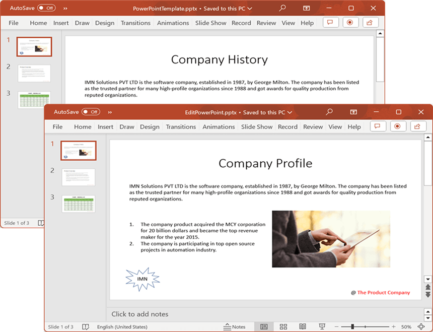

# Open and Save Presentation in Google Drive Cloud Storage

## Prerequisites  

* You must set up a project in the Google Developers Console and enable the Google Drive API. Obtain the necessary credentials to access the API. For more information, view the official [link](https://developers.google.com/drive/api/guides/enable-sdk).

## Open Presentation from Google Drive Cloud Storage

Steps to open a Presentation from Google Drive Cloud Storage.

Step 1: Create a new ASP.NET Core Web Application (Model-View-Controller).

Step 2: Name the project.

Step 3: Install the following **Nuget packages** in your application from [NuGet.org](https://www.nuget.org/).

* [Syncfusion.Presentation.Net.Core](https://www.nuget.org/packages/Syncfusion.Presentation.Net.Core)
* [Google.Apis.Drive.v3](https://www.nuget.org/packages/Google.Apis.Drive.v3)

Step 4: Add a new button in the **Index.cshtml** as shown below.

  

@{Html.BeginForm("EditDocument", "Home", FormMethod.Get);
    {
        

            <input type="submit" value="Edit Document" style="width:150px;height:27px" />
        

    }
    Html.EndForm();
}



Step 5: Include the following namespaces in **HomeController.cs**.



using Google.Apis.Auth.OAuth2;
using Google.Apis.Drive.v3;
using Google.Apis.Services;
using Google.Apis.Util.Store;
using Syncfusion.Presentation;



Step 6: Include the below code snippet in **HomeController.cs** to **open a Presentation from Google Drive Cloud Storage**.



public async Task<IActionResult> EditDocument()
{
    try
    {
        //Retrieve the document from Google Drive
        MemoryStream stream = await GetDocumentFromGoogleDrive();

        //Set the position to the beginning of the MemoryStream
        stream.Position = 0;

        //Create an instance of PowerPoint Presentation file
        using (IPresentation pptxDocument = Presentation.Open(stream))
        {
            //Get the first slide from the PowerPoint presentation
            ISlide slide = pptxDocument.Slides[0];

            //Get the first shape of the slide
            IShape shape = slide.Shapes[0] as IShape;

            //Change the text of the shape
            if (shape.TextBody.Text == "Company History")
                shape.TextBody.Text = "Company Profile";

            //Saving the PowerPoint file to a MemoryStream 
            MemoryStream outputStream = new MemoryStream();
            pptxDocument.Save(outputStream);

            //Download the PowerPoint file in the browser
            FileStreamResult fileStreamResult = new FileStreamResult(outputStream, "application/powerpoint");
            fileStreamResult.FileDownloadName = "EditPowerPoint.pptx";
            return fileStreamResult;
        }
    }
    catch (Exception ex)
    {
        Console.WriteLine($"Error: {ex.Message}");
        return Content("Error occurred while processing the file.");
    }
}



### Download file from Google Drive cloud storage

This is the helper method to download Presentation from Google Drive cloud storage.



/// 

/// Download file from Google Drive cloud storage
/// 

/// <returns></returns>
public async Task<MemoryStream> GetDocumentFromGoogleDrive()
{
    UserCredential credential;
    string[] Scopes = { DriveService.Scope.DriveReadonly };
    string ApplicationName = "YourAppName";

    //Specify the file ID of the file you want to open
    string fileId = "YOUR_FILE_ID";

    try
    {
        //Load Google Drive API credentials from a file
        using (var credentialsStream = new FileStream("credentials.json", FileMode.Open, FileAccess.Read))
        {
            string credPath = "token.json";
            credential = GoogleWebAuthorizationBroker.AuthorizeAsync(GoogleClientSecrets.Load(credentialsStream).Secrets, Scopes, "user", CancellationToken.None, new FileDataStore(credPath, true)).Result;
        }

        //Create a new instance of Google Drive service
        var service = new DriveService(new BaseClientService.Initializer()
        {
            HttpClientInitializer = credential,
            ApplicationName = ApplicationName,
        });                

        //Download the file from Google Drive
        var request = service.Files.Get(fileId);
        var stream = new MemoryStream();
        request.Download(stream);

        return stream;                
    }
    catch (Exception ex)
    {
        Console.WriteLine($"Error retrieving document from Google Drive: {ex.Message}");
        throw; // or handle the exception as needed
    }
}



You can download a complete working sample from [GitHub]().

By executing the program, you will get the **Presentation** as follows.

## Save Presentation to Google Drive Cloud Storage

Steps to save a Presentation to Google Drive Cloud Storage.

Step 1: Create a new ASP.NET Core Web Application (Model-View-Controller).

Step 2: Name the project.

Step 3: Install the following **Nuget packages** in your application from [NuGet.org](https://www.nuget.org/).

* [Syncfusion.Presentation.Net.Core](https://www.nuget.org/packages/Syncfusion.Presentation.Net.Core)
* [Google.Apis.Drive.v3](https://www.nuget.org/packages/Google.Apis.Drive.v3)

Step 4: Add a new button in the **Index.cshtml** as shown below.

  

@{Html.BeginForm("UploadDocument", "Home", FormMethod.Get);
    {
        

            <input type="submit" value="Upload Document" style="width:150px;height:27px" />
        

    }
    Html.EndForm();
}



Step 5: Include the following namespaces in **HomeController.cs**.



using Google.Apis.Auth.OAuth2;
using Google.Apis.Drive.v3;
using Google.Apis.Services;
using Google.Apis.Util.Store;
using Syncfusion.Presentation;



Step 6: Include the below code snippet in **HomeController.cs** to **save a Presentation to Google Drive Cloud Storage**.



public async Task<IActionResult> UploadDocument()
{
    //Create a new instance of PowerPoint Presentation file
    IPresentation pptxDocument = Presentation.Create();

    //Add a new slide to file and apply background color
    ISlide slide = pptxDocument.Slides.Add(SlideLayoutType.TitleOnly);

    //Specify the fill type and fill color for the slide background 
    slide.Background.Fill.FillType = FillType.Solid;
    slide.Background.Fill.SolidFill.Color = ColorObject.FromArgb(232, 241, 229);

    //Add title content to the slide by accessing the title placeholder of the TitleOnly layout-slide
    IShape titleShape = slide.Shapes[0] as IShape;
    titleShape.TextBody.AddParagraph("Company History").HorizontalAlignment = HorizontalAlignmentType.Center;

    //Add description content to the slide by adding a new TextBox
    IShape descriptionShape = slide.AddTextBox(53.22, 141.73, 874.19, 77.70);
    descriptionShape.TextBody.Text = "IMN Solutions PVT LTD is the software company, established in 1987, by George Milton. The company has been listed as the trusted partner for many high-profile organizations since 1988 and got awards for quality products from reputed organizations.";

    //Add bullet points to the slide
    IShape bulletPointsShape = slide.AddTextBox(53.22, 270, 437.90, 116.32);

    //Add a paragraph for a bullet point
    IParagraph firstPara = bulletPointsShape.TextBody.AddParagraph("The company acquired the MCY corporation for 20 billion dollars and became the top revenue maker for the year 2015.");

    //Format how the bullets should be displayed
    firstPara.ListFormat.Type = ListType.Bulleted;
    firstPara.LeftIndent = 35;
    firstPara.FirstLineIndent = -35;

    //Add another paragraph for the next bullet point
    IParagraph secondPara = bulletPointsShape.TextBody.AddParagraph("The company is participating in top open source projects in automation industry.");

    //Format how the bullets should be displayed
    secondPara.ListFormat.Type = ListType.Bulleted;
    secondPara.LeftIndent = 35;
    secondPara.FirstLineIndent = -35;

    //Gets a picture as stream
    FileStream pictureStream = new FileStream("Image.jpg", FileMode.Open);

    //Adds the picture to a slide by specifying its size and position.
    slide.Shapes.AddPicture(pictureStream, 499.79, 238.59, 364.54, 192.16);

    //Add an auto-shape to the slide
    IShape stampShape = slide.Shapes.AddShape(AutoShapeType.Explosion1, 48.93, 430.71, 104.13, 80.54);

    //Format the auto-shape color by setting the fill type and text
    stampShape.Fill.FillType = FillType.None;
    stampShape.TextBody.AddParagraph("IMN").HorizontalAlignment = HorizontalAlignmentType.Center;

    //Saves the PowerPoint document to MemoryStream
    MemoryStream stream = new MemoryStream();
    pptxDocument.Save(stream);

    //Upload the document to Google Drive
    await UploadDocumentToGoogleDrive(stream);

    return Ok("PowerPoint uploaded to Google Drive Cloud Storage.");
}



### Upload file to Google Drive cloud storage

This is the helper method to upload Presentation to Google Drive cloud storage.



/// 

/// Upload file to Google Drive
/// 

/// <param name="stream"></param>
/// <returns></returns>
public async Task<MemoryStream> UploadDocumentToGoogleDrive(MemoryStream stream)
{
    UserCredential credential;
    string[] Scopes = { DriveService.Scope.Drive };
    string ApplicationName = "YourAppName";
    FilesResource.CreateMediaUpload request;

    try
    {
        //Load Google Drive API credentials from a file
        using (var credentialsStream = new FileStream("credentials.json", FileMode.Open, FileAccess.Read))
        {
            string credPath = "token.json";
            credential = GoogleWebAuthorizationBroker.AuthorizeAsync(GoogleClientSecrets.Load(credentialsStream).Secrets, Scopes, "user", CancellationToken.None, new FileDataStore(credPath, true)).Result;
        }

        //Create a new instance of Google Drive service
        var service = new DriveService(new BaseClientService.Initializer()
        {
            HttpClientInitializer = credential,
            ApplicationName = ApplicationName,
        });

        //Create metadata for the file to be uploaded
        var fileMetadata = new Google.Apis.Drive.v3.Data.File()
        {
            Name = "CreatePowerPoint.docx", //Name of the file in Google Drive
            MimeType = "application/powerpoint",
        };

        using (var uploadStream = new MemoryStream(stream.ToArray()))
        {
            //Create an upload request for Google Drive
            request = service.Files.Create(fileMetadata, uploadStream, "application/powerpoint");
            //Upload the file
            request.Upload();
        }

        Console.WriteLine("Upload completed successfully");
    }
    catch (Exception e)
    {
        Console.WriteLine("Unknown encountered on server. Message:'{0}' when writing an object", e.Message);
    }
    return stream;
}



You can download a complete working sample from [GitHub]().

By executing the program, you will get the **Presentation** as follows.

