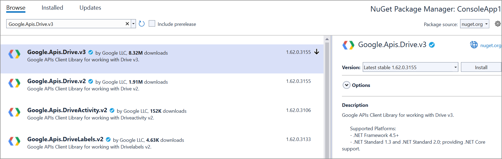
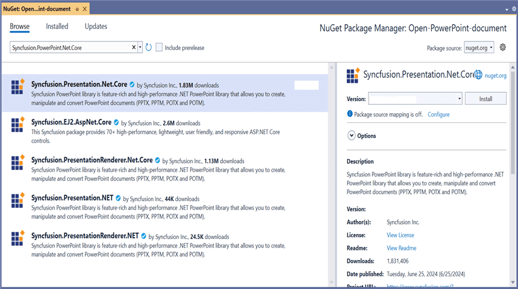

# Open and Save Presentation in Google Drive Cloud Storage

## Prerequisites  

* **[Google Drive Cloud Storage](https://www.google.com/intl/en_in/drive/)** is required.

## Open Presentation from Google Drive

Steps to open a Presentation from Google Drive Cloud Storage.

Step 1: Set up **Google Drive API**.

You must set up a project in the Google Developers Console and enable the Google Drive API. Obtain the necessary credentials to access the API. For more information, view the official [link](https://developers.google.com/drive/api/guides/enable-sdk).

Step 2: Create a new **.NET Core console application** project.

Step 3: Install the [Google.Apis.Drive.v3](https://www.nuget.org/packages/Google.Apis.Drive.v3) NuGet package as a reference to your project from the [NuGet.org](https://www.nuget.org/).

Step 4: Include the following namespaces in the **Program.cs** file.





using Google.Apis.Auth.OAuth2;
using Google.Apis.Drive.v3;
using Google.Apis.Services;
using Google.Apis.Util.Store;





Step 5: Add the below code example to **open a Presentation from Google Drive**.





UserCredential credential;
string[] Scopes = { DriveService.Scope.DriveReadonly };
string ApplicationName = "YourAppName";
// Step 1: Open Google Drive with credentials.
using (var cretendialStream = new FileStream("credentials.json", FileMode.Open, FileAccess.Read))
{
    string credPath = "token.json";
    credential = GoogleWebAuthorizationBroker.AuthorizeAsync(
        GoogleClientSecrets.Load(cretendialStream).Secrets,
        Scopes,
        "user",
        CancellationToken.None,
        new FileDataStore(credPath, true)).Result;
}

// Step 2: Create Drive API service.
var service = new DriveService(new BaseClientService.Initializer()
{
    HttpClientInitializer = credential,
    ApplicationName = ApplicationName,
});

// Step 3: Specify the file ID of the PowerPoint presentation you want to open.
string fileId = "YOUR_FILE_ID"; // Replace with the actual file ID YOUR_FILE_ID.

// Step 4: Download the PowerPoint presentation from Google Drive.
var request = service.Files.Get(fileId);
var stream = new MemoryStream();
request.Download(stream);

// Step 5: Save the PowerPoint presentation locally.
using (FileStream fileStream = new FileStream("Output.pptx", FileMode.Create, FileAccess.Write))
{
    stream.WriteTo(fileStream);
}
//Dispose the dtream.
stream.Dispose();
   




You can download a complete working sample from [GitHub](https://github.com/SyncfusionExamples/PowerPoint-Examples/tree/master/Read-and-save-PowerPoint-presentation/Open-and-save-PowerPoint/Google-Drive/Open-PowerPoint-document).

## Save Presentation to Google Drive

To save a Presentation to Google Drive, you can follow the steps below

Step 1: Set up **Google Drive API**.

You must set up a project in the Google Developers Console and enable the Google Drive API. Obtain the necessary credentials to access the API. For more information, view the official [link](https://developers.google.com/drive/api/guides/enable-sdk).

Step 2: Create a new **.NET Core console application** project.

Step 3: Install the following **Nuget packages** in your application from [NuGet.org](https://www.nuget.org/).

* [Syncfusion.Presentation.Net.Core](https://www.nuget.org/packages/Syncfusion.Presentation.Net.Core)
* [Google.Apis.Drive.v3](https://www.nuget.org/packages/Google.Apis.Drive.v3)

Step 4: Include the following namespaces in the **Program.cs** file.





using Syncfusion.Presentation;
using Google.Apis.Auth.OAuth2;
using Google.Apis.Drive.v3;
using Google.Apis.Services;
using Google.Apis.Util.Store;
using File = Google.Apis.Drive.v3.Data.File;





Step 5: Add the below code example to create a simple Presentation and **save in Google Drive**.





//Create a new instance of PowerPoint Presentation file.
IPresentation pptxDocument = Presentation.Create();

//Add a new slide to file and apply background color.
ISlide slide = pptxDocument.Slides.Add(SlideLayoutType.TitleOnly);

//Specify the fill type and fill color for the slide background .
slide.Background.Fill.FillType = FillType.Solid;
slide.Background.Fill.SolidFill.Color = ColorObject.FromArgb(232, 241, 229);

//Add title content to the slide by accessing the title placeholder of the TitleOnly layout-slide.
IShape titleShape = slide.Shapes[0] as IShape;
titleShape.TextBody.AddParagraph("Company History").HorizontalAlignment = HorizontalAlignmentType.Center;

//Add description content to the slide by adding a new TextBox.
IShape descriptionShape = slide.AddTextBox(53.22, 141.73, 874.19, 77.70);
descriptionShape.TextBody.Text = "IMN Solutions PVT LTD is the software company, established in 1987, by George Milton. The company has been listed as the trusted     partner for many high-profile organizations since 1988 and got awards for quality products from reputed organizations.";

//Add bullet points to the slide.
IShape bulletPointsShape = slide.AddTextBox(53.22, 270, 437.90, 116.32);

//Add a paragraph for a bullet point.
IParagraph firstPara = bulletPointsShape.TextBody.AddParagraph("The company acquired the MCY corporation for 20 billion dollars and became the top revenue maker for the     year 2015.");

//Format how the bullets should be displayed.
firstPara.ListFormat.Type = ListType.Bulleted;
firstPara.LeftIndent = 35;
firstPara.FirstLineIndent = -35;

//Add another paragraph for the next bullet point.
IParagraph secondPara = bulletPointsShape.TextBody.AddParagraph("The company is participating in top open source projects in automation industry.");

//Format how the bullets should be displayed.
secondPara.ListFormat.Type = ListType.Bulleted;
secondPara.LeftIndent = 35;
secondPara.FirstLineIndent = -35;

//Gets a picture as stream.
FileStream pictureStream = new FileStream(Path.GetFullPath("Data/Image.jpg"), FileMode.Open);

//Adds the picture to a slide by specifying its size and position.
slide.Shapes.AddPicture(pictureStream, 499.79, 238.59, 364.54, 192.16);

//Add an auto-shape to the slide.
IShape stampShape = slide.Shapes.AddShape(AutoShapeType.Explosion1, 48.93, 430.71, 104.13, 80.54);

//Format the auto-shape color by setting the fill type and text.
stampShape.Fill.FillType = FillType.None;
stampShape.TextBody.AddParagraph("IMN").HorizontalAlignment = HorizontalAlignmentType.Center;

//Saves the PowerPoint to MemoryStream.
MemoryStream stream = new MemoryStream();
pptxDocument.Save(stream);

// Load Google Drive API credentials from a file.
UserCredential credential;
string[] Scopes = { DriveService.Scope.Drive };
string ApplicationName = "YourAppName";

using (var stream1 = new FileStream("credentials.json", FileMode.Open, FileAccess.Read))//Replace with your actual credentials.json
{
    string credPath = "token.json";
    // Authorize the Google Drive API access
    credential = GoogleWebAuthorizationBroker.AuthorizeAsync(
        GoogleClientSecrets.Load(stream1).Secrets,
        Scopes,
        "user",
        CancellationToken.None,
        new FileDataStore(credPath, true)).Result;
}
// Create a new instance of Google Drive service.
var service = new DriveService(new BaseClientService.Initializer()
{
    HttpClientInitializer = credential,
    ApplicationName = ApplicationName,
});

// Create metadata for the file to be uploaded.
var fileMetadata = new File()
{
    Name = "Output.pptx", // Name of the file in Google Drive
    MimeType = "application/powerpoint",
};
FilesResource.CreateMediaUpload request;

// Create a memory stream from the PowerPoint presentation.
using (var fs = new MemoryStream(stream.ToArray()))
{
    // Create an upload request for Google Drive.
    request = service.Files.Create(fileMetadata, fs, "application/powerpoint");
    // Upload the file.
    request.Upload();
}
//Dispose the stream.
stream.Dispose();
pptxDocument.Close();





You can download a complete working sample from [GitHub](https://github.com/SyncfusionExamples/PowerPoint-Examples/tree/master/Read-and-save-PowerPoint-presentation/Open-and-save-PowerPoint/Google-Drive/Save-PowerPoint-document).

By executing the program, you will get the **PowerPoint presentation** as follows.

