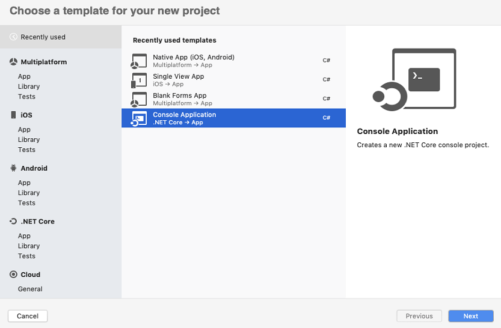
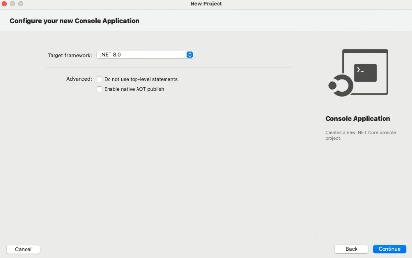
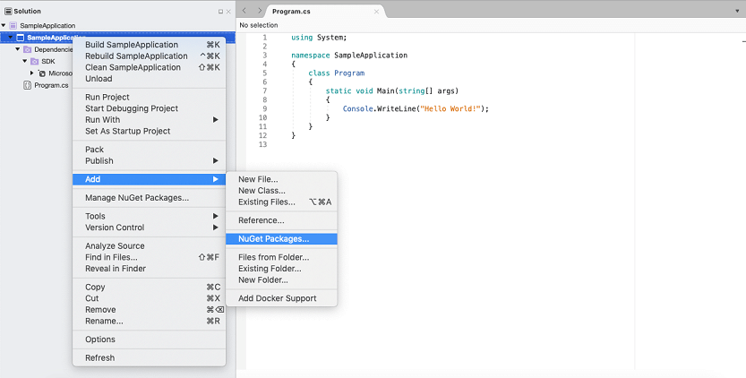
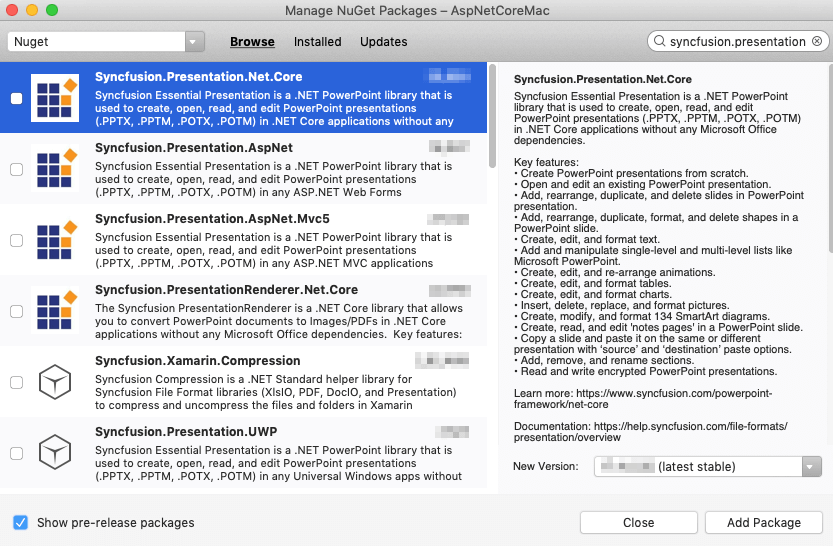

# Open and save a PowerPoint presentation on macOS

Syncfusion<sup>&reg;</sup> PowerPoint is a [.NET Core PowerPoint library](https://www.syncfusion.com/document-sdk/net-powerpoint-library) used to create, read, edit, and convert PowerPoint documents programmatically without **Microsoft PowerPoint** or interop dependencies. Using this library, you can **open and save a PowerPoint presentation in a .NET Core application on macOS**.

## Steps to open and save a PowerPoint presentation programmatically

Step 1: Create a new C# **.NET Core console application** in your IDE.


Step 2: Select the target .NET framework


Step 3: Install the [Syncfusion.Presentation.Net.Core](https://www.nuget.org/packages/Syncfusion.Presentation.Net.Core/) NuGet package as reference to your .NET Standard applications from [NuGet.org](https://www.nuget.org/).




N> If you reference Syncfusion<sup>&reg;</sup> assemblies from the trial setup or from the NuGet feed, you must add the `Syncfusion.Licensing` assembly reference and include a license key in your projects. Please refer to this [link](https://help.syncfusion.com/common/essential-studio/licensing/overview) to learn about registering a Syncfusion<sup>&reg;</sup> license key in your application.

Step 4: Include the following namespaces in the **Program.cs** file.




using Syncfusion.Presentation;




Step 5: Add the following code snippet in the **Program.cs** file to **open an existing PowerPoint presentation in a .NET Core application on macOS**.




//Open an existing PowerPoint presentation
IPresentation pptxDoc = Presentation.Open("Sample.pptx")




Step 6: The following code snippet demonstrates accessing a shape from a slide and changing the text within it. The sample assumes the first shape on the first slide is a text shape that contains the text "Company History".




//Gets the first slide from the PowerPoint presentation
ISlide slide = pptxDoc.Slides[0];
//Gets the first shape of the slide
IShape shape = slide.Shapes[0];
//Change the text of the shape
if (shape.TextBody != null && shape.TextBody.Text == "Company History")
{
    shape.TextBody.Text = "Company Profile";
}




Step 7: The following code example saves the PowerPoint presentation in a .NET Core application on macOS.




//Save the PowerPoint presentation
pptxDoc.Save("Output.pptx");
//Close the PowerPoint presentation
pptxDoc.Close();




You can download a complete working sample from [GitHub](https://github.com/SyncfusionExamples/PowerPoint-Examples/tree/master/Read-and-save-PowerPoint-presentation/Open-and-save-PowerPoint/Mac).

Step 9: Build and run the application from the project directory using the following command:

```
dotnet run
```

By executing the program, you will get the **PowerPoint document** as follows.


Looking for the full .NET PowerPoint Library component overview, features, pricing, and documentation? Visit the [.NET PowerPoint Library](https://www.syncfusion.com/document-sdk/net-powerpoint-library) page.

## See Also

- [Open and save a PowerPoint presentation in a .NET Core console application](Open-and-Save-PowerPoint-in-Console-application)
- [Open and save a PowerPoint presentation in Windows Forms](Open-and-Save-PowerPoint-Presentation-in-Windows-Forms)
- [Open and save a PowerPoint presentation in ASP.NET Core](Open-and-Save-PowerPoint-Presentation-in-ASP-NET-Core)