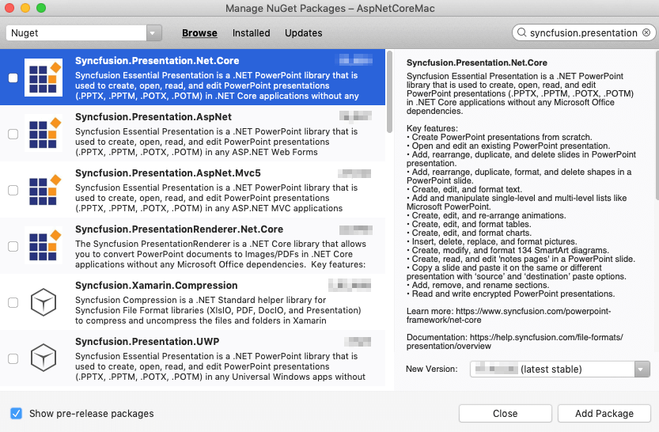

# Open and save Presentation on macOS

Syncfusion&reg; PowerPoint is a [.NET Core PowerPoint library](https://www.syncfusion.com/document-processing/powerpoint-framework/net-core) used to create, read, edit and convert PowerPoint documents programmatically without **Microsoft PowerPoint** or interop dependencies. Using this library, you can **open and save a Presentation in .NET Core application on macOS**.

## Steps to open and save PowerPoint Presentation programmatically

Step 1: Create a new C# .NET Core console application.

Step 2: Select the project version.

Step 3: Install the [Syncfusion.Presentation.Net.Core](https://www.nuget.org/packages/Syncfusion.Presentation.Net.Core/) NuGet package as reference to your .NET Standard applications from [NuGet.org](https://www.nuget.org/).

N> Starting with v16.2.0.x, if you reference 
Syncfusion&reg; assemblies from trial setup or from the NuGet feed, you also have to add "Syncfusion.Licensing" assembly reference and include a license key in your projects. Please refer to this [link](https://help.syncfusion.com/common/essential-studio/licensing/overview) to know about registering 
Syncfusion&reg; license key in your application to use our components.

Step 4: Include the following Namespaces in the **Program.cs** file.




using Syncfusion.Presentation;




Step 5: Add the following code snippet in **Program.cs** file to **open an existing Presentation in .NET Core application on macOS**.




//Open an existing PowerPoint presentation
IPresentation pptxDoc = Presentation.Open(new FileStream("Sample.pptx",FileMode.Open));




Step 6: Add below code snippet demonstrates accessing a shape from a slide and changing the text within it.




//Gets the first slide from the PowerPoint presentation
ISlide slide = pptxDoc.Slides[0];
//Gets the first shape of the slide
IShape shape = slide.Shapes[0] as IShape;
//Change the text of the shape
if(shape.TextBody.Text == "Company History")
    shape.TextBody.Text = "Company Profile";




Step 7: Add below code example to **save the PowerPoint Presentation in .NET Core application on macOS**.




//Save the PowerPoint presentation as stream
FileStream outputStream = new FileStream("Output.pptx", FileMode.Create);
pptxDoc.Save(outputStream);
outputStream.Position = 0;
outputStream.Flush();
outputStream.Dispose();
//Close the PowerPoint presentation
pptxDoc.Close();




You can download a complete working sample from [GitHub](https://github.com/SyncfusionExamples/PowerPoint-Examples/tree/master/Read-and-save-PowerPoint-presentation/Open-and-save-PowerPoint/Mac).

By executing the program, you will get the **PowerPoint document** as follows.

Click [here](https://www.syncfusion.com/document-processing/powerpoint-framework/net-core) to explore the rich set of 
Syncfusion&reg; PowerPoint Library (Presentation) features.