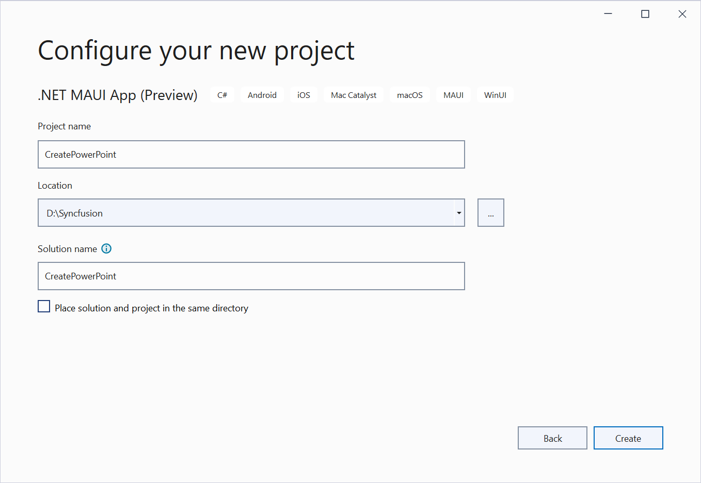
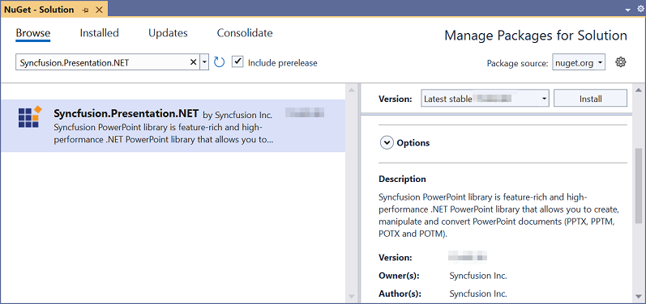

# Open and save Presentation in .NET MAUI

Syncfusion&reg; PowerPoint is a [.NET PowerPoint library](https://www.syncfusion.com/powerpoint-framework/maui/powerpoint-library) used to create, read, edit, and convert PowerPoint documents programmatically without **Microsoft PowerPoint** or interop dependencies. Using this library, you can **open and save a PowerPoint presentation in .NET MAUI**.

## Prerequisites
To create .NET Multi-platform App UI (.NET MAUI) apps, the following are required:

- **Visual Studio 2022** or later.
- **.NET 8** (or later) with the **.NET Multi-platform App UI development** workload installed. Verify the workload is installed by running `dotnet workload list`, or modify the Visual Studio installation and select the workload.
- The **.NET MAUI App** template (no longer labeled "Preview") must be available in Visual Studio.

For more details, refer [here](https://learn.microsoft.com/en-us/dotnet/maui/get-started/installation?view=net-maui-10.0&tabs=visual-studio).

## Steps to open and save PowerPoint presentation programmatically

Step 1: Create a new C# .NET MAUI app. Select **.NET MAUI App** from the template list and click the **Next** button.

Step 2: Enter the project name and click **Create**.

Step 3: Install the [Syncfusion.Presentation.NET](https://www.nuget.org/packages/Syncfusion.Presentation.NET) NuGet package as a reference to your project from [NuGet.org](https://www.nuget.org/).

N> Starting with v16.2.0.x, if you reference Syncfusion&reg; assemblies from the trial setup or from the NuGet feed, you must also add a reference to the `Syncfusion.Licensing` assembly and include a license key in your project. Please refer to this [link](https://help.syncfusion.com/common/essential-studio/licensing/overview) to know about registering a Syncfusion&reg; license key in your application to use our components. Register the license key once at application startup, for example in `App.xaml.cs` or `MauiProgram.cs`:

Step 4: Add a new button to the **MainPage.xaml** as shown below.




<ContentPage xmlns="http://schemas.microsoft.com/dotnet/2021/maui"
             xmlns:x="http://schemas.microsoft.com/winfx/2009/xaml"
             x:Class="ReadPowerPoint.MainPage"
             BackgroundColor="{DynamicResource SecondaryColor}">
    <ScrollView>
        <Grid RowSpacing="25" RowDefinitions="Auto,Auto,Auto,Auto,*"
              Padding="{OnPlatform iOS='30,60,30,30', Default='30'}">
            <Button 
                Text="Open and Save Presentation"
                FontAttributes="Bold"
                Grid.Row="0"
                SemanticProperties.Hint="Open and Save Presentation"
                Clicked="OpenAndSavePresentation"
                HorizontalOptions="Center" />
        </Grid>
    </ScrollView>
</ContentPage>




Step 5: Add the corresponding event handler stub to **MainPage.xaml.cs**. The `Clicked` attribute in the XAML references this method.




// Empty handler wired up by the XAML Clicked attribute.
private void OpenAndSavePresentation(object sender, EventArgs e)
{
}




Step 6: Include the following namespaces in the **MainPage.xaml.cs** file.




using System.IO;
using System.Reflection;
using Syncfusion.Presentation;




Step 8: Add the following code snippet inside the **OpenAndSavePresentation** method in `MainPage.xaml.cs` to **open an existing PowerPoint presentation in .NET MAUI**.




//Resolves the assembly that contains the embedded Sample.pptx resource.
Assembly assembly = typeof(MainPage).Assembly;
//Opens an existing PowerPoint presentation from an embedded resource.
using IPresentation pptxDoc = Presentation.Open(assembly.GetManifestResourceStream("ReadAndEditPowerPoint.Resources.Sample.pptx"));




N> The manifest resource name must match the project's default namespace followed by the folder and file name (for example, `ReadAndEditPowerPoint.Resources.Sample.pptx`). To verify the exact name, call `assembly.GetManifestResourceNames()`.

Step 9: Add the following code snippet to access a shape on the first slide and change the text within it.




//Gets the first slide from the PowerPoint presentation.
ISlide slide = pptxDoc.Slides[0];
//Gets the first shape of the slide.
IShape shape = slide.Shapes[0] as IShape;
//Modifies the text of the shape when a text body exists.
if (shape != null && shape.TextBody != null && shape.TextBody.Text == "Company History")
{
    shape.TextBody.Text = "Company Profile";
}




Step 10: Add the following code example to **save the PowerPoint presentation in .NET MAUI**. The presentation is written to a memory stream, then handed to the `SaveService` helper which saves the file to the device and opens it with the platform's default viewer.




//Saves the presentation to a memory stream.
MemoryStream stream = new MemoryStream();
pptxDoc.Save(stream);
pptxDoc.Close();
stream.Position = 0;
//Saves the memory stream as a file and opens it with the platform default viewer.
SaveService saveService = new SaveService();
saveService.SaveAndView("Output.pptx", "application/vnd.openxmlformats-officedocument.presentationml.presentation", stream);




You can download a complete working sample from [GitHub](https://github.com/SyncfusionExamples/PowerPoint-Examples/tree/master/Read-and-save-PowerPoint-presentation/Open-and-save-PowerPoint/.NET-MAUI).

By executing the program, the resulting **PowerPoint presentation** is saved to the device and opened with the platform's default viewer, as shown below.

## Helper files for .NET MAUI

Refer to the following helper files and add them to the mentioned project. These helper files allow you to save the stream as a physical file and open the file for viewing on the corresponding platform.

<table>
  <tr>
  <td>
    <b>Folder Name</b>
  </td>
  <td>
    <b>File Name</b>
  </td>
  <td>
    <b>Summary</b>
  </td>
  </tr>
  <tr>
  <td>
    {{'[.NET MAUI Project](https://github.com/SyncfusionExamples/PowerPoint-Examples/tree/master/Read-and-save-PowerPoint-presentation/Open-and-save-PowerPoint/.NET-MAUI/Read-and-edit-presentation)'| markdownify }}
  </td>
  <td>
    {{'[SaveService.cs](https://github.com/SyncfusionExamples/PowerPoint-Examples/blob/master/Read-and-save-PowerPoint-presentation/Open-and-save-PowerPoint/.NET-MAUI/Read-and-edit-presentation/Services/SaveService.cs)'| markdownify }}
  </td>
  <td>Represents the base class for the save operation.
  </td>
  </tr>
  <tr>
  <td>
    {{'[Windows](https://github.com/SyncfusionExamples/PowerPoint-Examples/tree/master/Read-and-save-PowerPoint-presentation/Open-and-save-PowerPoint/.NET-MAUI/Read-and-edit-presentation/Platforms/Windows)'| markdownify }}
  </td>
  <td>
    {{'[SaveWindows.cs](https://github.com/SyncfusionExamples/PowerPoint-Examples/blob/master/Read-and-save-PowerPoint-presentation/Open-and-save-PowerPoint/.NET-MAUI/Read-and-edit-presentation/Platforms/Windows/SaveWindows.cs)'| markdownify }}
  </td>
  <td>Save implementation for Windows.
  </td>
  </tr>
  <tr>
  <td>
    {{'[Android](https://github.com/SyncfusionExamples/PowerPoint-Examples/tree/master/Read-and-save-PowerPoint-presentation/Open-and-save-PowerPoint/.NET-MAUI/Read-and-edit-presentation/Platforms/Android)'| markdownify }}
  </td>
  <td>
    {{'[SaveAndroid.cs](https://github.com/SyncfusionExamples/PowerPoint-Examples/blob/master/Read-and-save-PowerPoint-presentation/Open-and-save-PowerPoint/.NET-MAUI/Read-and-edit-presentation/Platforms/Android/SaveAndroid.cs)'| markdownify }}
  </td>
  <td>Save implementation for Android.
  </td>
  </tr>
  <tr>
  <td>
    {{'[Mac Catalyst](https://github.com/SyncfusionExamples/PowerPoint-Examples/tree/master/Read-and-save-PowerPoint-presentation/Open-and-save-PowerPoint/.NET-MAUI/Read-and-edit-presentation/Platforms/MacCatalyst)'| markdownify }}
  </td>
  <td>
    {{'[SaveMac.cs](https://github.com/SyncfusionExamples/PowerPoint-Examples/blob/master/Read-and-save-PowerPoint-presentation/Open-and-save-PowerPoint/.NET-MAUI/Read-and-edit-presentation/Platforms/MacCatalyst/SaveMac.cs)'| markdownify }}
  </td>
  <td>Save implementation for Mac Catalyst.
  </td>
  </tr>
  <tr>
  <td rowspan="2">
    {{'[iOS](https://github.com/SyncfusionExamples/PowerPoint-Examples/tree/master/Read-and-save-PowerPoint-presentation/Open-and-save-PowerPoint/.NET-MAUI/Read-and-edit-presentation/Platforms/iOS)'| markdownify }}
  </td>
  <td>
    {{'[SaveIOS.cs](https://github.com/SyncfusionExamples/PowerPoint-Examples/blob/master/Read-and-save-PowerPoint-presentation/Open-and-save-PowerPoint/.NET-MAUI/Read-and-edit-presentation/Platforms/iOS/SaveIOS.cs)'| markdownify }}
  </td>
  <td>
    Save implementation for iOS.
  </td>
  </tr>
  <tr>
  <td>
    {{'[PreviewControllerDS.cs](https://github.com/SyncfusionExamples/PowerPoint-Examples/blob/master/Read-and-save-PowerPoint-presentation/Open-and-save-PowerPoint/.NET-MAUI/Read-and-edit-presentation/Platforms/iOS/PreviewControllerDS.cs)'| markdownify }} {{'[QLPreviewItemFileSystem.cs](https://github.com/SyncfusionExamples/PowerPoint-Examples/blob/master/Read-and-save-PowerPoint-presentation/Open-and-save-PowerPoint/.NET-MAUI/Read-and-edit-presentation/Platforms/iOS/QLPreviewItemFileSystem.cs)'| markdownify }}
  </td>
  <td>
    Helper classes for viewing the <b>PowerPoint presentation</b> on iOS.
  </td>
  </tr>
</table>

## Next steps

- [Create a PowerPoint presentation from scratch](Create-PowerPoint-in-Console-application.md)
- [Edit comments and shapes in an existing PowerPoint presentation](Comments.md)

Looking for the full .NET PowerPoint Library component overview, features, pricing, and documentation? Visit the [.NET PowerPoint Library](https://www.syncfusion.com/document-sdk/net-powerpoint-library) page. 
