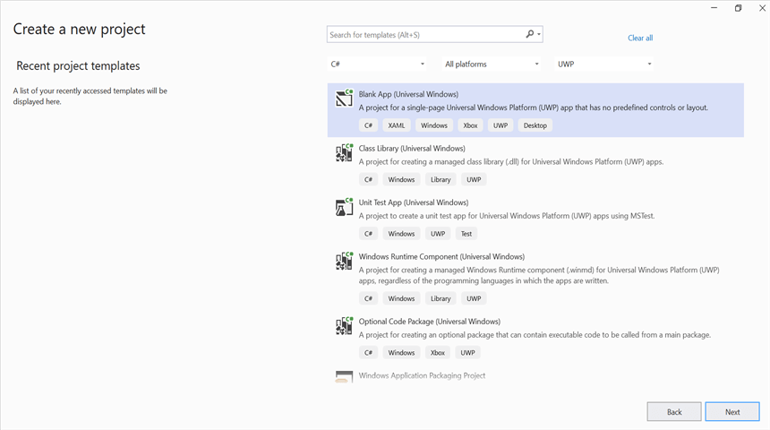
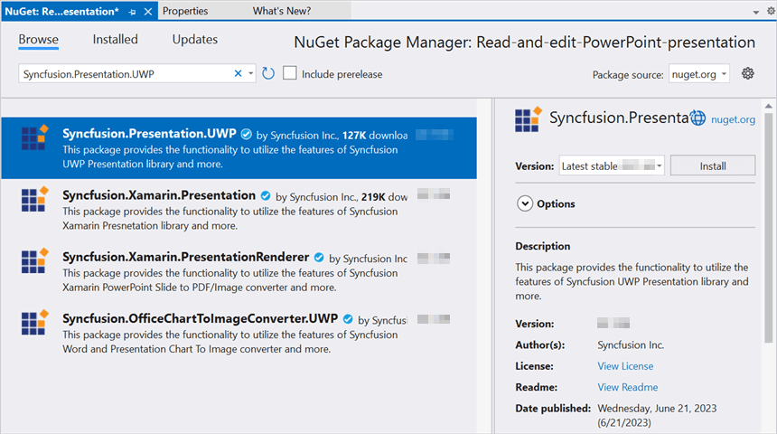

# Open and save Presentation in UWP

Syncfusion&reg; PowerPoint is a [UWP PowerPoint library](https://www.syncfusion.com/powerpoint-framework/uwp/powerpoint-library) used to create, read, edit and convert PowerPoint documents programmatically without **Microsoft PowerPoint** or interop dependencies. Using this library, you can **open and save a PowerPoint presentation in UWP**.

## Prerequisites

- Visual Studio 2022 or later with the **.NET desktop development** and **Universal Windows Platform development** workloads installed.
- Windows 10 SDK (minimum build 17763 or later) to develop UWP applications.

## Steps to open and save PowerPoint presentation programmatically

Step 1: In Visual Studio, create a new C# **Blank App (Universal Windows)** project.

Step 2: Install the [Syncfusion.Presentation.UWP](https://www.nuget.org/packages/Syncfusion.Presentation.UWP/) NuGet package as a reference to your UWP application from [NuGet.org](https://www.nuget.org/).

N> Starting with v16.2.0.x, if you reference Syncfusion&reg; assemblies from trial setup or from the NuGet feed, you also have to add "Syncfusion.Licensing" assembly reference and include a license key in your projects. Please refer to this [link](https://help.syncfusion.com/common/essential-studio/licensing/overview) to know about registering Syncfusion&reg; license key in your application to use our components.

Step 3: Add a new button in the MainPage.xaml as shown below.




<Page
    x:Class="Read_and_edit_PowerPoint_presentation.MainPage"
    xmlns="http://schemas.microsoft.com/winfx/2006/xaml/presentation"
    xmlns:x="http://schemas.microsoft.com/winfx/2006/xaml"
    xmlns:local="using:Read_and_edit_PowerPoint_presentation"
    xmlns:d="http://schemas.microsoft.com/expression/blend/2008"
    xmlns:mc="http://schemas.openxmlformats.org/markup-compatibility/2006"
    mc:Ignorable="d"
    Background="{ThemeResource ApplicationPageBackgroundThemeBrush}">
    <Grid>
        <Button x:Name="button" Content="Open and Save Presentation" Click="OnButtonClicked" HorizontalAlignment="Center" VerticalAlignment="Center"/>
    </Grid>
</Page>




Step 4: Include the following namespaces in the **MainPage.xaml.cs** file.




using System.Collections.Generic;
using System.Reflection;
using Syncfusion.Presentation;
using Windows.Storage;
using Windows.Storage.Pickers;




Step 5: Add an existing **Template.pptx** file to the project's **Assets** folder. In **Solution Explorer**, right-click the **Assets** folder, select **Add → Existing Item**, choose **Template.pptx**, and set its **Build Action** to **Embedded Resource** in the Properties window. Then add the following code snippet in the click event of the button in `MainPage.xaml.cs` to **open an existing PowerPoint presentation in UWP**.




//"App" is the class of the UWP project.
Assembly assembly = typeof(App).GetTypeInfo().Assembly;
//Open an existing PowerPoint presentation
IPresentation pptxDoc = Presentation.Open(assembly.GetManifestResourceStream("Read_and_edit_PowerPoint_presentation.Assets.Template.pptx"));




Step 6: Add the following code snippet, which demonstrates accessing a shape from a slide and changing the text within it.




//Gets the first slide from the PowerPoint presentation
ISlide slide = pptxDoc.Slides[0];
//Gets the first shape of the slide
IShape shape = slide.Shapes[0] as IShape;
//Change the text of the shape
if (shape.TextBody.Text == "Company History")
    shape.TextBody.Text = "Company Profile";




Step 7: Add the following code snippet to save and close the presentation. The `IPresentation.SaveAsync` method saves the file in **.pptx** format by default; the same approach supports saving as other PowerPoint formats such as **.pptm** and **.ppsx** by selecting the appropriate file type in the picker.




//Initializes FileSavePicker
FileSavePicker savePicker = new FileSavePicker();
savePicker.SuggestedStartLocation = PickerLocationId.Desktop;
savePicker.SuggestedFileName = "Result";
savePicker.FileTypeChoices.Add("PowerPoint Files", new List<string>() { ".pptx" });
//Creates a storage file from FileSavePicker
StorageFile storageFile = await savePicker.PickSaveFileAsync();
//Saves changes to the specified storage file (skip if the user cancels the picker)
if (storageFile != null)
    await pptxDoc.SaveAsync(storageFile);
//Close the PowerPoint presentation
pptxDoc.Close();




By executing the program, you will get the **PowerPoint presentation** as follows.

You can download a complete working sample from [GitHub](https://github.com/SyncfusionExamples/PowerPoint-Examples/tree/master/Read-and-save-PowerPoint-presentation/Open-and-save-PowerPoint/UWP).

Looking for the full .NET PowerPoint Library component overview, features, pricing, and documentation? Visit the  [.NET PowerPoint Library](https://www.syncfusion.com/document-sdk/net-powerpoint-library) page. 
