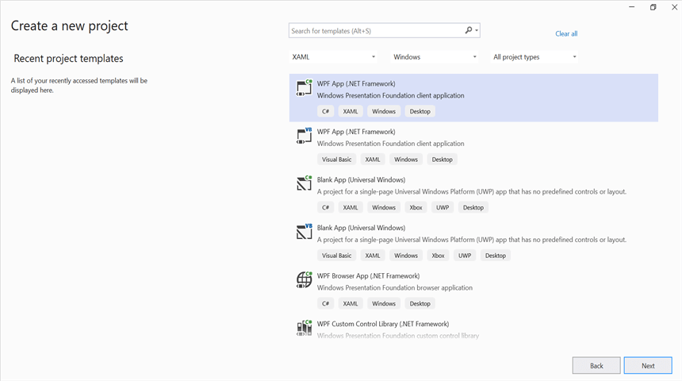
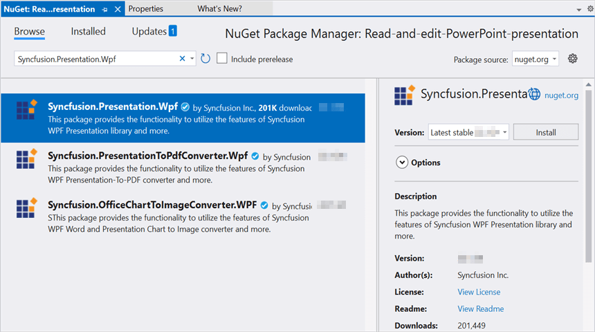

# Open and save Presentation in WPF

Syncfusion&reg; PowerPoint is a [.NET PowerPoint library](https://www.syncfusion.com/document-sdk/net-powerpoint-library) used to create, read, edit, and convert PowerPoint documents programmatically without **Microsoft PowerPoint** or interop dependencies. Using this library, you can **open and save a PowerPoint presentation in WPF**.

## Steps to open and save PowerPoint Presentation programmatically

Step 1: Create a new C# **WPF Application** project in Visual Studio.

Step 2: Install the [Syncfusion.Presentation.Wpf](https://www.nuget.org/packages/Syncfusion.Presentation.Wpf/) NuGet package as a reference to your application from [NuGet.org](https://www.nuget.org/).

N> Starting with v16.2.0.x, if you reference Syncfusion&reg; assemblies from trial setup or from the NuGet feed, you also have to add "Syncfusion.Licensing" assembly reference and include a license key in your projects. Please refer to this [link](https://help.syncfusion.com/common/essential-studio/licensing/overview) to know about registering Syncfusion&reg; license key in your application to use our components.

Step 3: Add a new button in the **MainWindow.xaml** as shown below.




<Window x:Class="Open_and_save_PowerPoint_presentation.MainWindow"
        xmlns="http://schemas.microsoft.com/winfx/2006/xaml/presentation"
        xmlns:x="http://schemas.microsoft.com/winfx/2006/xaml"
        xmlns:d="http://schemas.microsoft.com/expression/blend/2008"
        xmlns:mc="http://schemas.openxmlformats.org/markup-compatibility/2006"
        xmlns:local="clr-namespace:Open_and_save_PowerPoint_presentation"
        mc:Ignorable="d"
        Title="MainWindow" Height="450" Width="800">
    <Grid>
        <Button x:Name="button" Content="Open and save presentation" Click="OpenAndSavePresentation" HorizontalAlignment="Center" VerticalAlignment="Center"/>
    </Grid>
</Window>




Step 4: Include the following namespaces in the **MainWindow.xaml.cs** file, and add the empty `OpenAndSavePresentation` click handler that the XAML references:




using Syncfusion.Presentation;
using System.IO;



Step 5: Add the empty `OpenAndSavePresentation` click handler that the XAML references in **MainWindow.xaml.cs**



public partial class MainWindow : System.Windows.Window
{
    public MainWindow()
    {
        InitializeComponent();
    }

    private void OpenAndSavePresentation(object sender, System.Windows.RoutedEventArgs e)
    {
        // The body is filled in the next step.
    }
}




Step 6: Add the following code inside `OpenAndSavePresentation` to **open an existing PowerPoint presentation in WPF**:




//Open an existing PowerPoint presentation.
using (IPresentation pptxDoc = Presentation.Open("Data/Template.pptx"))
{
    //Gets the first slide from the PowerPoint presentation
    ISlide slide = pptxDoc.Slides[0];
    //Gets the first shape of the slide
    IShape shape = slide.Shapes[0] as IShape;
    //Change the text of the shape
    if (shape.TextBody.Text == "Company History")
        shape.TextBody.Text = "Company Profile";

    //Save the PowerPoint presentation to the file system.
    pptxDoc.Save("Result.pptx");
}




You can download a complete working sample from [GitHub](https://github.com/SyncfusionExamples/PowerPoint-Examples/tree/master/Read-and-save-PowerPoint-presentation/Open-and-save-PowerPoint/WPF).

By executing the program, you will get the PowerPoint presentation as follows.

Looking for the full .NET PowerPoint Library component overview, features, pricing, and documentation? Visit the  [.NET PowerPoint Library](https://www.syncfusion.com/document-sdk/net-powerpoint-library) page.
