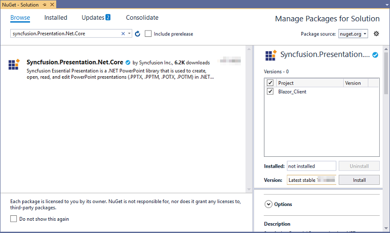
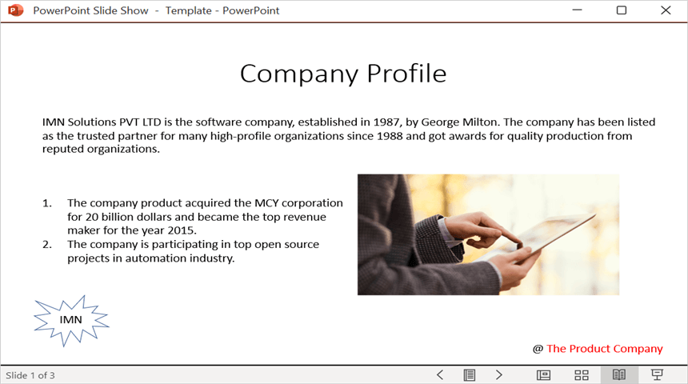
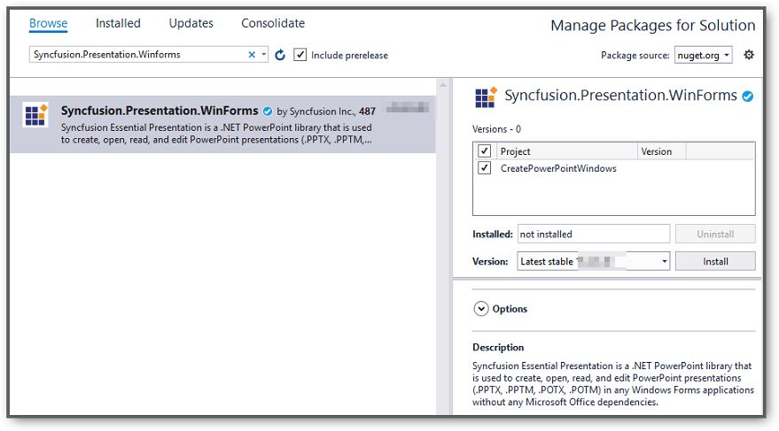

# Open and save Presentation in Console application

Syncfusion&reg; PowerPoint is a [.NET PowerPoint library](https://www.syncfusion.com/document-sdk/net-powerpoint-library) used to create, read, and edit **PowerPoint presentations** programmatically without **Microsoft PowerPoint** or interop dependencies. Using this library, you can **open and save a Presentation in a Console application**.

## Open and save Presentation in .NET Core / .NET (Latest)

The following steps illustrate how to open and save a PowerPoint presentation in a .NET Core (or .NET 6.0+/Latest) console application.

Step 1: Create a new **.NET Core console application** project. Select a supported target framework **.NET 8.0**, or later.

Step 2: Install the [Syncfusion.Presentation.Net.Core](https://www.nuget.org/packages/Syncfusion.Presentation.Net.Core/) NuGet package as a reference to your project from [NuGet.org](https://www.nuget.org/).

N> Starting with v16.2.0.x, if you reference Syncfusion&reg; assemblies from the trial setup or from the NuGet feed, you also have to add the "Syncfusion.Licensing" assembly reference and include a license key in your project. Please refer to this [link](https://help.syncfusion.com/common/essential-studio/licensing/overview) to learn about registering the Syncfusion&reg; license key in your application to use our components.

Step 3: Include the following namespaces in **Program.cs** file.




using Syncfusion.Presentation;




Step 4: Add the following code snippet in **Program.cs** to **open an existing presentation in a .NET Core console application**.




//Open an existing PowerPoint presentation.
using (IPresentation pptxDoc = Presentation.Open("Sample.pptx"))
{
    //Get the first slide from the PowerPoint presentation.
    ISlide slide = pptxDoc.Slides[0];
    //Get the first shape of the slide.
    IShape shape = slide.Shapes[0] as IShape;
    //Change the text of the shape.
    if (shape.TextBody.Text == "Company History")
    {
        shape.TextBody.Text = "Company Profile";
    }

    //Save the PowerPoint presentation to the specified path.
    pptxDoc.Save("Output.pptx");
}




> The `Sample.pptx` file used in this example is included in the GitHub sample linked below. Adjust the text check ("Company History") to match the content in your own presentation.

You can download a complete working sample from [GitHub](https://github.com/SyncfusionExamples/PowerPoint-Examples/tree/master/Read-and-save-PowerPoint-presentation/Open-and-save-PowerPoint/.NET).

Step 7: Build and run the project. In Visual Studio, press **F5** (with debugger) or **Ctrl + F5** (without debugger). From the command line, run `dotnet run` in the project folder.

By executing the program, you will get the **PowerPoint** as follows.

## Open and save PowerPoint Presentation in .NET Framework

The following steps illustrate how to open and save a PowerPoint presentation in a .NET Framework console application.

Step 1: Create a new **.NET Framework console application** project targeting **.NET Framework 4.6.1** or later.

Step 2: Install the [Syncfusion.Presentation.WinForms](https://www.nuget.org/packages/Syncfusion.Presentation.WinForms/) NuGet package as a reference to your .NET Framework console application from [NuGet.org](https://www.nuget.org/).

N> 1. The [Syncfusion.Presentation.WinForms](https://www.nuget.org/packages/Syncfusion.Presentation.WinForms/) is a dependency for Syncfusion&reg; Windows Forms GUI controls and is named with the suffix "WinForms". It contains platform-independent .NET Framework assemblies (compatible with versions 4.0, 4.5, 4.5.1, 4.6, and 4.6.1) for the PowerPoint library and does not include any Windows Forms-related references or code. Therefore, we recommend using this package for .NET Framework console applications.
N> 2. Starting with v16.2.0.x, if you reference Syncfusion&reg; assemblies from the trial setup or from the NuGet feed, you also have to add the "Syncfusion.Licensing" assembly reference and include a license key in your project. Please refer to this [link](https://help.syncfusion.com/common/essential-studio/licensing/overview) to learn about registering the Syncfusion&reg; license key in your application to use our components.

Step 3: Include the following namespaces in **Program.cs** file.




using Syncfusion.Presentation;




Step 4: Add the following code snippet in **Program.cs** to **open an existing presentation in a .NET Framework console application**. Place `Template.pptx` in the project output directory (typically `bin\Debug`) or provide a full path.




//Load or open a PowerPoint presentation.
using (IPresentation pptxDoc = Presentation.Open("Template.pptx"))
{
    //Get the first slide from the PowerPoint presentation.
    ISlide slide = pptxDoc.Slides[0];
    //Get the first shape of the slide.
    IShape shape = slide.Shapes[0] as IShape;
    //Change the text of the shape.
    if (shape.TextBody.Text == "Company History")
    {
        shape.TextBody.Text = "Company Profile";
    }

    //Save the PowerPoint presentation to the specified path.
    pptxDoc.Save("Result.pptx");
}




> The `Template.pptx` file used in this example is included in the GitHub sample linked below. Adjust the text check ("Company History") to match the content in your own presentation.

You can download a complete working sample from [GitHub](https://github.com/SyncfusionExamples/PowerPoint-Examples/tree/master/Read-and-save-PowerPoint-presentation/Open-and-save-PowerPoint/.NET-Framework).

Step 5: Build and run the project. In Visual Studio, press **F5** (with debugger) or **Ctrl + F5** (without debugger). The output `Result.pptx` will be generated in the project output directory.

By executing the program, you will get the **PowerPoint** as follows.

## See Also
[Open and save Presentation in Windows Forms](./Open-and-Save-PowerPoint-Presentation-in-Windows-Forms)
[Open and save Presentation in ASP.NET Core](./Open-and-Save-PowerPoint-Presentation-in-ASP-NET-Core)