# Working with Headers and Footers

## Add Headers and Footers in PowerPoint

### Add Footer to a Slide in PowerPoint

Essential&reg; Presentation library facilitates adding [Footer](https://help.syncfusion.com/cr/document-processing/Syncfusion.Presentation.IHeadersFooters.html#Syncfusion_Presentation_IHeadersFooters_Footer) in a slide of the PowerPoint Presentation. Footers are useful in providing quick information about your document or data. 

The following code example demonstrates how to add a footer to the presentation.




//Creates an instance of Presentation
IPresentation pptxDoc = Presentation.Create();
//Adds a blank slide
ISlide slide = pptxDoc.Slides.Add(SlideLayoutType.Blank);
//Sets the visibility of Footer content in the slide
slide.HeadersFooters.Footer.Visible = true;
//Sets the text to be added to the Footer
slide.HeadersFooters.Footer.Text = "Footer content";
//Adds textbox to the slide
IShape textboxShape = slide.AddTextBox(0, 0, 500, 500);
//Adds paragraph to the textbody of textbox
IParagraph paragraph = textboxShape.TextBody.AddParagraph();
//Adds a TextPart to the paragraph
ITextPart textPart = paragraph.AddTextPart();
//Adds text to the TextPart
textPart.Text = "AdventureWorks Cycles, the fictitious company on which the AdventureWorks sample databases are based, is a large, multinational manufacturing company. The company manufactures and sells metal and composite bicycles to North American, European and Asian commercial markets. While its base operation is located in Washington with 290 employees, several regional sales teams are located throughout their market base.";
//Save the PowerPoint Presentation as stream
FileStream outputStream = new FileStream("Sample.pptx", FileMode.Create);
pptxDoc.Save(outputStream);
//Dispose the image stream
pictureStream.Dispose();
//Closes the Presentation
pptxDoc.Close();



//Creates an instance of Presentation
IPresentation pptxDoc = Presentation.Create();
//Adds a blank slide.
ISlide slide = pptxDoc.Slides.Add(SlideLayoutType.Blank);
//Sets the visibility of Footer content in the slide
slide.HeadersFooters.Footer.Visible = true;
//Sets the text to be added to the Footer
slide.HeadersFooters.Footer.Text = "Footer content";
//Adds textbox to the slide
IShape textboxShape = slide.AddTextBox(0, 0, 500, 500);
//Adds paragraph to the textbody of textbox
IParagraph paragraph = textboxShape.TextBody.AddParagraph();
//Adds a TextPart to the paragraph
ITextPart textPart = paragraph.AddTextPart();
//Adds text to the TextPart
textPart.Text = "AdventureWorks Cycles, the fictitious company on which the AdventureWorks sample databases are based, is a large, multinational manufacturing company. The company manufactures and sells metal and composite bicycles to North American, European and Asian commercial markets. While its base operation is located in Washington with 290 employees, several regional sales teams are located throughout their market base.";
//Saves the Presentation to the file system
pptxDoc.Save("Sample.pptx");
//Closes the Presentation
pptxDoc.Close();



'Creates an instance of Presentation
Dim pptxDoc As IPresentation = Presentation.Create()
'Adds a blank slide
Dim slide As ISlide = pptxDoc.Slides.Add(SlideLayoutType.Blank)
'Sets the visibility of Footer content in the slide
slide.HeadersFooters.Footer.Visible = True
'Sets the text to be added to the Footer
slide.HeadersFooters.Footer.Text = "Footer content"
'Adds textbox to the slide
Dim textboxShape As IShape = slide.AddTextBox(0, 0, 500, 500)
'Adds paragraph to the textbody of textbox
Dim paragraph As IParagraph = textboxShape.TextBody.AddParagraph()
'Adds a TextPart to the paragraph
Dim textPart As ITextPart = paragraph.AddTextPart()
'Adds text to the TextPart
textPart.Text = "AdventureWorks Cycles, the fictitious company on which the AdventureWorks sample databases are based, is a large, multinational manufacturing company. The company manufactures and sells metal and composite bicycles to North American, European and Asian commercial markets. While its base operation is located in Washington with 290 employees, several regional sales teams are located throughout their market base."
'Saves the Presentation to the file system
pptxDoc.Save("Sample.pptx")
'Closes the Presentation
pptxDoc.Close()




By executing the program, you will get the PowerPoint slide as follows.

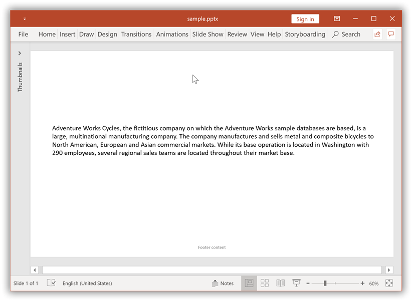

You can download a complete working sample from [GitHub](https://github.com/SyncfusionExamples/PowerPoint-Examples/tree/master/Headers-and-Footers/Add-footer-in-PowerPoint).

### Add Date and Time in PowerPoint Slide

Essential&reg; Presentation library facilitates adding Date and Time to a slide of the PowerPoint Presentation. Date and Time comes with formatting options for date stamp as either it can be updated automatically using computer's clock or stay fixed until you change it.

The following code example demonstrates how to add Date and Time to a slide of the presentation.




//Creates an instance of Presentation
IPresentation pptxDoc = Presentation.Create();
//Adds a blank slide
ISlide slide = pptxDoc.Slides.Add(SlideLayoutType.Blank);
//Sets the visibility of Date and Time in the slide
slide.HeadersFooters.DateAndTime.Visible = true;
//Sets the format of the Date and Time to the Footer
slide.HeadersFooters.DateAndTime.Format = DateTimeFormatType.DateTimehmmssAMPM;
//Adds textbox to the slide
IShape textboxShape = slide.AddTextBox(0, 0, 500, 500);
//Adds paragraph to the textbody of textbox
IParagraph paragraph = textboxShape.TextBody.AddParagraph();
//Adds a TextPart to the paragraph
ITextPart textPart = paragraph.AddTextPart();
//Adds text to the TextPart
textPart.Text = "AdventureWorks Cycles, the fictitious company on which the AdventureWorks sample databases are based, is a large, multinational manufacturing company. The company manufactures and sells metal and composite bicycles to North American, European and Asian commercial markets. While its base operation is located in Washington with 290 employees, several regional sales teams are located throughout their market base.";
//Save the PowerPoint Presentation as stream
FileStream outputStream = new FileStream("Sample.pptx", FileMode.Create);
pptxDoc.Save(outputStream);
//Dispose the image stream
pictureStream.Dispose();
//Closes the Presentation
pptxDoc.Close();



//Creates an instance of Presentation
IPresentation pptxDoc = Presentation.Create();
//Adds a blank slide.
ISlide slide = pptxDoc.Slides.Add(SlideLayoutType.Blank);
//Sets the visibility of Date and Time in the slide
slide.HeadersFooters.DateAndTime.Visible = true;
//Sets the format of the Date and Time to the Footer
slide.HeadersFooters.DateAndTime.Format = DateTimeFormatType.DateTimehmmssAMPM;
//Adds textbox to the slide
IShape textboxShape = slide.AddTextBox(0, 0, 500, 500);
//Adds paragraph to the textbody of textbox
IParagraph paragraph = textboxShape.TextBody.AddParagraph();
//Adds a TextPart to the paragraph
ITextPart textPart = paragraph.AddTextPart();
//Adds text to the TextPart
textPart.Text = "AdventureWorks Cycles, the fictitious company on which the AdventureWorks sample databases are based, is a large, multinational manufacturing company. The company manufactures and sells metal and composite bicycles to North American, European and Asian commercial markets. While its base operation is located in Washington with 290 employees, several regional sales teams are located throughout their market base.";
//Saves the Presentation to the file system
pptxDoc.Save("Sample.pptx");
//Closes the Presentation
pptxDoc.Close();



'Creates an instance of Presentation
Dim pptxDoc As IPresentation = Presentation.Create()
'Adds a blank slide
Dim slide As ISlide = pptxDoc.Slides.Add(SlideLayoutType.Blank)
'Sets the visibility of Date and Time in the slide
slide.HeadersFooters.DateAndTime.Visible = True
'Sets the format of the Date and Time to the Footer
slide.HeadersFooters.DateAndTime.Format = DateTimeFormatType.DateTimehmmssAMPM
'Adds textbox to the slide
Dim textboxShape As IShape = slide.AddTextBox(0, 0, 500, 500)
'Adds paragraph to the textbody of textbox
Dim paragraph As IParagraph = textboxShape.TextBody.AddParagraph()
'Adds a TextPart to the paragraph
Dim textPart As ITextPart = paragraph.AddTextPart()
'Adds text to the TextPart
textPart.Text = "AdventureWorks Cycles, the fictitious company on which the AdventureWorks sample databases are based, is a large, multinational manufacturing company. The company manufactures and sells metal and composite bicycles to North American, European and Asian commercial markets. While its base operation is located in Washington with 290 employees, several regional sales teams are located throughout their market base."
'Saves the Presentation to the file system
pptxDoc.Save("Sample.pptx")
'Closes the Presentation
pptxDoc.Close()




By executing the program, you will get the PowerPoint slide as follows.

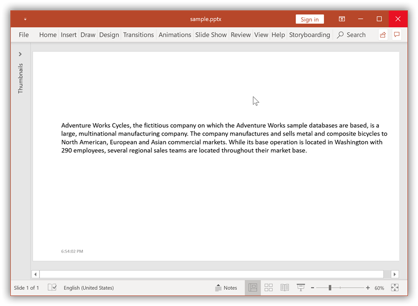

You can download a complete working sample from [GitHub](https://github.com/SyncfusionExamples/PowerPoint-Examples/tree/master/Headers-and-Footers/Add-date-and-time-in-PowerPoint-slide).

### Add Slide Number to PowerPoint Slides

Essential&reg; Presentation library facilitates adding Slide number to a slide of the PowerPoint Presentation. 

The following code example demonstrates how to add Slide number to a slide of the presentation.




//Creates an instance of Presentation
IPresentation pptxDoc = Presentation.Create();
//Adds a blank slide
ISlide slide = pptxDoc.Slides.Add(SlideLayoutType.Blank);
//Sets the visibility of slide number in the slide
slide.HeadersFooters.SlideNumber.Visible = true;
//Adds textbox to the slide
IShape textboxShape = slide.AddTextBox(0, 0, 500, 500);
//Adds paragraph to the textbody of textbox
IParagraph paragraph = textboxShape.TextBody.AddParagraph();
//Adds a TextPart to the paragraph
ITextPart textPart = paragraph.AddTextPart();
//Adds text to the TextPart
textPart.Text = "AdventureWorks Cycles, the fictitious company on which the AdventureWorks sample databases are based, is a large, multinational manufacturing company. The company manufactures and sells metal and composite bicycles to North American, European and Asian commercial markets. While its base operation is located in Washington with 290 employees, several regional sales teams are located throughout their market base.";
//Save the PowerPoint Presentation as stream
FileStream outputStream = new FileStream("Sample.pptx", FileMode.Create);
pptxDoc.Save(outputStream);
//Dispose the image stream
pictureStream.Dispose();
//Closes the Presentation
pptxDoc.Close();



//Creates an instance of Presentation
IPresentation pptxDoc = Presentation.Create();
//Adds a blank slide.
ISlide slide = pptxDoc.Slides.Add(SlideLayoutType.Blank);
//Sets the visibility of slide number in the slide
slide.HeadersFooters.SlideNumber.Visible = true;
//Adds textbox to the slide
IShape textboxShape = slide.AddTextBox(0, 0, 500, 500);
//Adds paragraph to the textbody of textbox
IParagraph paragraph = textboxShape.TextBody.AddParagraph();
//Adds a TextPart to the paragraph
ITextPart textPart = paragraph.AddTextPart();
//Adds text to the TextPart
textPart.Text = "AdventureWorks Cycles, the fictitious company on which the AdventureWorks sample databases are based, is a large, multinational manufacturing company. The company manufactures and sells metal and composite bicycles to North American, European and Asian commercial markets. While its base operation is located in Washington with 290 employees, several regional sales teams are located throughout their market base.";
//Saves the Presentation to the file system
pptxDoc.Save("Sample.pptx");
//Closes the Presentation
pptxDoc.Close();



'Creates an instance of Presentation
Dim pptxDoc As IPresentation = Presentation.Create()
'Adds a blank slide
Dim slide As ISlide = pptxDoc.Slides.Add(SlideLayoutType.Blank)
'Sets the visibility of slide number in the slide
slide.HeadersFooters.SlideNumber.Visible = True
'Adds textbox to the slide
Dim textboxShape As IShape = slide.AddTextBox(0, 0, 500, 500)
'Adds paragraph to the textbody of textbox
Dim paragraph As IParagraph = textboxShape.TextBody.AddParagraph()
'Adds a TextPart to the paragraph
Dim textPart As ITextPart = paragraph.AddTextPart()
'Adds text to the TextPart
textPart.Text = "AdventureWorks Cycles, the fictitious company on which the AdventureWorks sample databases are based, is a large, multinational manufacturing company. The company manufactures and sells metal and composite bicycles to North American, European and Asian commercial markets. While its base operation is located in Washington with 290 employees, several regional sales teams are located throughout their market base."
'Saves the Presentation to the file system
pptxDoc.Save("Sample.pptx")
'Closes the Presentation
pptxDoc.Close()




By executing the program, you will get the PowerPoint slide as follows.

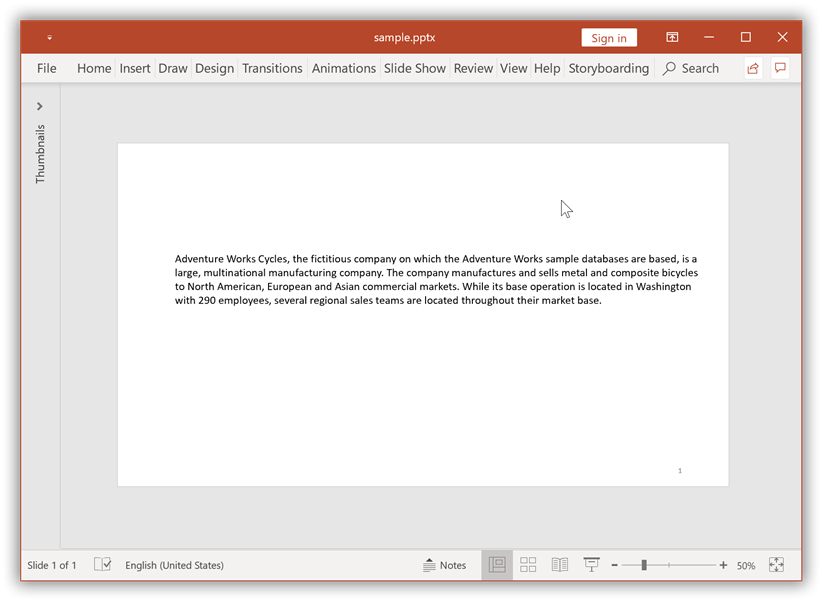

You can download a complete working sample from [GitHub](https://github.com/SyncfusionExamples/PowerPoint-Examples/tree/master/Headers-and-Footers/Add-slide-number-in-PowerPoint-slide).

### Add Footer to Master and Layout slides

Essential&reg; Presentation library facilitates adding Footers to both master and layout slides of the PowerPoint Presentation. If you want to use a different format for the Footers, then a great way to apply the format to all the slides (existing and new slides) is using the Slide Master and Slide layout. Under Slide Master and Slide layout, you can control the styles for footer options and this way you can apply different styles to the slides, or re-locate the Footer shape to any other position based on your requirement

The following code example demonstrates how to add a Footers to the master and layout slides of the presentation.




//Loads or open an PowerPoint Presentation
FileStream inputStream = new FileStream(inputFileName,FileMode.Open);
IPresentation pptxDoc = Presentation.Open(inputStream);
//Access the first master slide in PowerPoint file
IMasterSlide masterSlide = pptxDoc.Masters[0];
//Sets the visibility of Footer content in the Master slide
masterSlide.HeadersFooters.Footer.Visible = true;
//Sets the text to be added to the Footer of the Master slide
masterSlide.HeadersFooters.Footer.Text = "Master Slide Footer";
//Sets the visibility of DateTime Footer in the Master slide
masterSlide.HeadersFooters.DateAndTime.Visible = true;
//Sets the format of the DateTime Footer in the Master slide
masterSlide.HeadersFooters.DateAndTime.Format = DateTimeFormatType.DateTimehmmssAMPM;
//Iterate each layout slide in the Master slide
foreach(ILayoutSlide layoutSlide in masterSlide.LayoutSlides)
{
    //Sets the visibility of Footer content in the Layout slide
    layoutSlide.HeadersFooters.Footer.Visible = true;
    //Sets the text to be added to the Footer of the Layout slide
    layoutSlide.HeadersFooters.Footer.Text = "Layout slide Footer";
    //Sets the visibility of DateTime Footer in Layout slide
    layoutSlide.HeadersFooters.DateAndTime.Visible = true;
    //Sets the format of the DateTime Footer in Layout slide
    layoutSlide.HeadersFooters.DateAndTime.Format = DateTimeFormatType.DateTimeMMddyyhmmAMPM;
}
//Save the PowerPoint Presentation as stream
FileStream outputStream = new FileStream("Sample.pptx", FileMode.Create);
pptxDoc.Save(outputStream);
//Dispose the image stream
pictureStream.Dispose();
//Closes the Presentation
pptxDoc.Close();



//Load or open an PowerPoint Presentation
IPresentation pptxDoc = Presentation.Open("Footer.pptx");
//Access the first master slide in PowerPoint file
IMasterSlide masterSlide = pptxDoc.Masters[0];
//Sets the visibility of Footer content in the Master slide
masterSlide.HeadersFooters.Footer.Visible = true;
//Sets the text to be added to the Footer of the Master slide
masterSlide.HeadersFooters.Footer.Text = "Master Slide Footer";
//Sets the visibility of DateTime Footer in the Master slide
masterSlide.HeadersFooters.DateAndTime.Visible = true;
//Sets the format of the DateTime Footer in the Master slide
masterSlide.HeadersFooters.DateAndTime.Format = DateTimeFormatType.DateTimehmmssAMPM;
//Iterate each layout slide in the Master slide
foreach(ILayoutSlide layoutSlide in masterSlide.LayoutSlides)
{
    //Sets the visibility of Footer content in the Layout slide
    layoutSlide.HeadersFooters.Footer.Visible = true;
    //Sets the text to be added to the Footer of the Layout slide
    layoutSlide.HeadersFooters.Footer.Text = "Layout slide Footer";
    //Sets the visibility of DateTime Footer in Layout slide
    layoutSlide.HeadersFooters.DateAndTime.Visible = true;
    //Sets the format of the DateTime Footer in Layout slide
    layoutSlide.HeadersFooters.DateAndTime.Format = DateTimeFormatType.DateTimeMMddyyhmmAMPM;
}
//Saves the Presentation to the file system
pptxDoc.Save("Sample.pptx");
//Closes the Presentation
pptxDoc.Close();



'Load or open an PowerPoint Presentation
Dim pptxDoc As IPresentation = Presentation.Open("Footer.pptx")
'Access the first master slide in PowerPoint file
Dim masterSlide As IMasterSlide = pptxDoc.Masters(0)
'Sets the visibility of Footer content in the Master slide
masterSlide.HeadersFooters.Footer.Visible = True
'Sets the text to be added to the Footer of the Master slide
masterSlide.HeadersFooters.Footer.Text = "Master Slide Footer"
'Sets the visibility of DateTime Footer in the Master slide
masterSlide.HeadersFooters.DateAndTime.Visible = True
'Sets the format of the DateTime Footer in the Master slide
masterSlide.HeadersFooters.DateAndTime.Format = DateTimeFormatType.DateTimehmmssAMPM
'Iterate each layout slide in the Master slide
For Each layoutSlide As ILayoutSlide In masterSlide.LayoutSlides
    'Sets the visibility of Footer content in the Layout slide
    layoutSlide.HeadersFooters.Footer.Visible = True
    'Sets the text to be added to the Footer of the Layout slide
    layoutSlide.HeadersFooters.Footer.Text = "Layout slide Footer"
    'Sets the visibility of DateTime Footer in Layout slide
    layoutSlide.HeadersFooters.DateAndTime.Visible = True
    'Sets the format of the DateTime Footer in Layout slide
    layoutSlide.HeadersFooters.DateAndTime.Format = DateTimeFormatType.DateTimeMMddyyhmmAMPM
Next
'Saves the Presentation to the file system
pptxDoc.Save("Sample.pptx
'Closes the Presentation
pptxDoc.Close()




By executing the program, you will get the PowerPoint Master slide as follows.

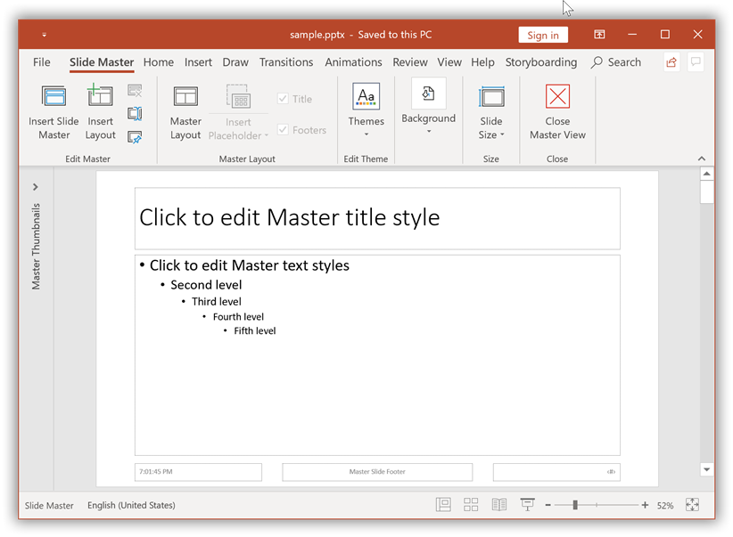

By executing the program, you will get the PowerPoint Layout slide as follows.

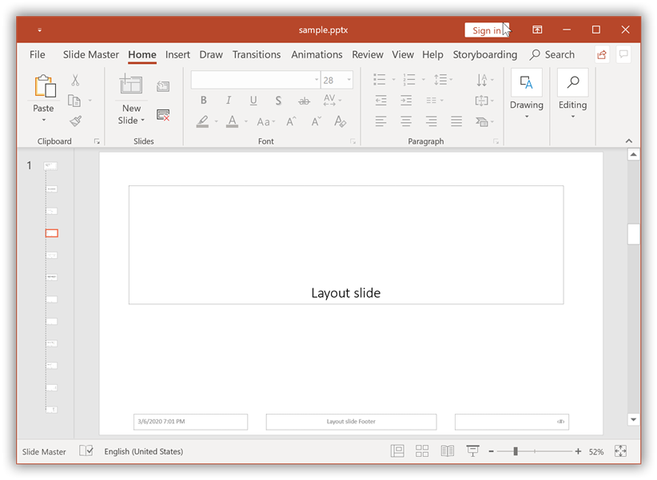

You can download a complete working sample from [GitHub](https://github.com/SyncfusionExamples/PowerPoint-Examples/tree/master/Headers-and-Footers/Add-footer-in-master-and-layout-slides).

### Add Headers and Footers into Notes slide

Essential&reg; Presentation library facilitates adding Headers and Footers to the Notes slide of the PowerPoint Presentation. 

N> 1. As per Microsoft PowerPoint behavior, you can add Header only in Notes slide of the PowerPoint using our Essential&reg; Presentation Library.
N> 2. Header added in Notes slide will be visible only in the Notes page of the PowerPoint viewer. 

The following code example demonstrates how to add a Headers and Footers to the Notes slide of the presentation.




//Creates an instance of Presentation
IPresentation pptxDoc = Presentation.Create();
//Adds new slide with blank slide layout type
ISlide slide = pptxDoc.Slides.Add(SlideLayoutType.Blank);
//Adds new notes slide in the specified slide
INotesSlide notesSlide = slide.AddNotesSlide();
//Sets the visibility of Header in the Notes slide
notesSlide.HeadersFooters.Header.Visible = true;
//Sets the text to be added to the Header of the Notes slide
notesSlide.HeadersFooters.Header.Text = "Header is added to Notes slide";
//Sets the visibility of DateTime Footer in the Notes slide
notesSlide.HeadersFooters.DateAndTime.Visible = true;
//Sets the format of the DateTime Footer in the Notes slide
notesSlide.HeadersFooters.DateAndTime.Format = DateTimeFormatType.DateTimeMMMyy;
//Sets the visibility of Footer content in the Notes slide
notesSlide.HeadersFooters.Footer.Visible = true;
//Sets the text to be added to the Footer of the Notes slide
notesSlide.HeadersFooters.Footer.Text = "Notes slide Footer";
//Save the PowerPoint Presentation as stream
FileStream outputStream = new FileStream("Sample.pptx", FileMode.Create);
pptxDoc.Save(outputStream);
//Dispose the image stream
pictureStream.Dispose();
//Closes the Presentation
pptxDoc.Close();



//Creates an instance of Presentation
IPresentation pptxDoc = Presentation.Create();
//Adds new slide with blank slide layout type
ISlide slide = pptxDoc.Slides.Add(SlideLayoutType.Blank);
//Adds new notes slide in the specified slide
INotesSlide notesSlide = slide.AddNotesSlide();
//Sets the visibility of Header in the Notes slide
notesSlide.HeadersFooters.Header.Visible = true;
//Sets the text to be added to the Header of the Notes slide
notesSlide.HeadersFooters.Header.Text = "Header is added to Notes slide";
//Sets the visibility of DateTime Footer in the Notes slide
notesSlide.HeadersFooters.DateAndTime.Visible = true;
//Sets the format of the DateTime Footer in the Notes slide
notesSlide.HeadersFooters.DateAndTime.Format = DateTimeFormatType.DateTimeMMMyy;
//Sets the visibility of Footer content in the Notes slide
notesSlide.HeadersFooters.Footer.Visible = true;
//Sets the text to be added to the Footer of the Notes slide
notesSlide.HeadersFooters.Footer.Text = "Notes slide Footer";
//Saves the Presentation to the file system
pptxDoc.Save("Sample.pptx");
//Closes the Presentation
pptxDoc.Close();



'Creates an instance of Presentation
Dim pptxDoc As IPresentation = Presentation.Create()
'Adds new slide with blank slide layout type
Dim slide As ISlide = pptxDoc.Slides.Add(SlideLayoutType.Blank)
'Adds new notes slide in the specified slide
Dim notesSlide As INotesSlide = slide.AddNotesSlide()
'Sets the visibility of Header in the Notes slide
notesSlide.HeadersFooters.Header.Visible = True
'Sets the text to be added to the Header of the Notes slide
notesSlide.HeadersFooters.Header.Text = "Header is added to Notes slide"
'Sets the visibility of DateTime Footer in the Notes slide
notesSlide.HeadersFooters.DateAndTime.Visible = True
'Sets the format of the DateTime Footer in the Notes slide
notesSlide.HeadersFooters.DateAndTime.Format = DateTimeFormatType.DateTimeMMMyy
'Sets the visibility of Footer content in the Notes slide
notesSlide.HeadersFooters.Footer.Visible = True
'Sets the text to be added to the Footer of the Notes slide
notesSlide.HeadersFooters.Footer.Text = "Notes slide Footer"
'Saves the Presentation to the file system
pptxDoc.Save("Sample.pptx
'Closes the Presentation
pptxDoc.Close()




By executing the program, you will get the PowerPoint Notes slide as follows.

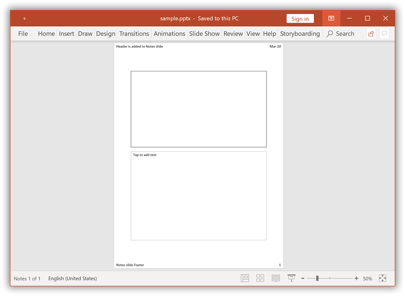

You can download a complete working sample from [GitHub](https://github.com/SyncfusionExamples/PowerPoint-Examples/tree/master/Headers-and-Footers/Add-headers-and-footers-in-Notes).

## Modify Headers and Footers in PowerPoint

### Edit Footer text of an existing Slide

Essential&reg; Presentation library facilitates editing the [Footer](https://help.syncfusion.com/cr/document-processing/Syncfusion.Presentation.IHeadersFooters.html#Syncfusion_Presentation_IHeadersFooters_Footer) text of an existing slide in the PowerPoint Presentation. 

The following code example demonstrates how to edit [Footer](https://help.syncfusion.com/cr/document-processing/Syncfusion.Presentation.IHeadersFooters.html#Syncfusion_Presentation_IHeadersFooters_Footer) text of an existing slide in the presentation.




//Load or open an PowerPoint Presentation
FileStream inputStream = new FileStream(inputFileName,FileMode.Open);
IPresentation pptxDoc = Presentation.Open(inputStream);
//Gets the first slide from the cloned PowerPoint presentation
ISlide slide = pptxDoc.Slides[0];
//Modify the Footer text
slide.HeadersFooters.Footer.Text = "Footer content modified";     
//Save the PowerPoint Presentation as stream
FileStream outputStream = new FileStream("Sample.pptx", FileMode.Create);
pptxDoc.Save(outputStream);
//Dispose the image stream
pictureStream.Dispose();
//Closes the Presentation
pptxDoc.Close();



//Load or open an PowerPoint Presentation
IPresentation pptxDoc = Presentation.Open("Footer.pptx");
//Gets the first slide from the cloned PowerPoint presentation
ISlide slide = pptxDoc.Slides[0];
//Modify the Footer text
slide.HeadersFooters.Footer.Text = "Footer content modified";
//Saves the Presentation to the file system
pptxDoc.Save("Sample.pptx");
//Closes the Presentation
pptxDoc.Close();



'Load or open an PowerPoint Presentation
Dim pptxDoc As IPresentation = Presentation.Open("Footer.pptx")
'Gets the first slide from the PowerPoint presentation
ISlide slide = pptxDoc.Slides[0]
'Modify the Footer text
slide.HeadersFooters.Footer.Text = "Footer content modified"
'Saves the Presentation to the file system
pptxDoc.Save("Sample.pptx
'Closes the Presentation
pptxDoc.Close()




By executing the program, you will get the PowerPoint slide as follows.

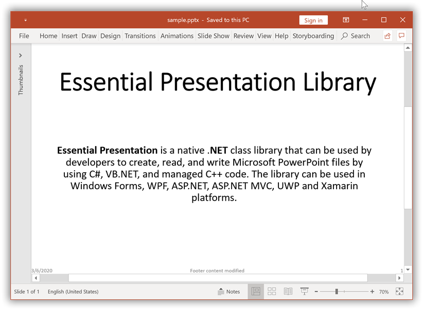

You can download a complete working sample from [GitHub](https://github.com/SyncfusionExamples/PowerPoint-Examples/tree/master/Headers-and-Footers/Edit-footer-text).

### Edit Header text of an existing Notes slide

Essential&reg; Presentation library facilitates editing of Headers for the Notes slide of the PowerPoint Presentation.

N> 1. As per Microsoft PowerPoint behavior, you can edit Header only in Notes slide of the PowerPoint using our Essential&reg; Presentation Library.
N> 2. Header edited in Notes slide will be visible only in the Notes page of the PowerPoint viewer. 

The following code example demonstrates how to edit the Headers for the Notes slide of the presentation.




//Open a PowerPoint presentation. 
IPresentation pptxDoc = Presentation.Open("Header.pptx"); 
//Get the notes slide from the presenatation. 
INotesSlide notesSlide = pptxDoc.Slides[0].NotesSlide; 
//Modify the existing content of the header. 
notesSlide.HeadersFooters.Header.Text = "Header content is modified"; 
//Save the PowerPoint Presentation as stream.
FileStream outputStream = new FileStream("Sample.pptx", FileMode.Create);
pptxDoc.Save(outputStream);
//Close the Presentation.
pptxDoc.Close();



//Open a PowerPoint presentation. 
IPresentation pptxDoc = Presentation.Open("Header.pptx"); 
//Get the notes slide from the presenatation. 
INotesSlide notesSlide = pptxDoc.Slides[0].NotesSlide; 
//Modify the existing content of the header. 
notesSlide.HeadersFooters.Header.Text = "Header content is modified"; 
//Save the modified PowerPoint presentation. 
pptxDoc.Save("Result.pptx"); 
//Close the Presentation.
pptxDoc.Close(); 



'Open a PowerPoint presentation. 
Dim pptxDoc As IPresentation = Presentation.Open("Header.pptx")
'Get the notes slide from the presenatation.
Dim notesSlide As INotesSlide = pptxDoc.Slides(0).NotesSlide
'Modify the existing content of the header. 
notesSlide.HeadersFooters.Header.Text = "Header content is modified"
'Save the modified PowerPoint presentation. 
pptxDoc.Save("Result.pptx")
'Close the Presentation
pptxDoc.Close()




By executing the program, you will get the PowerPoint Notes slide as follows.

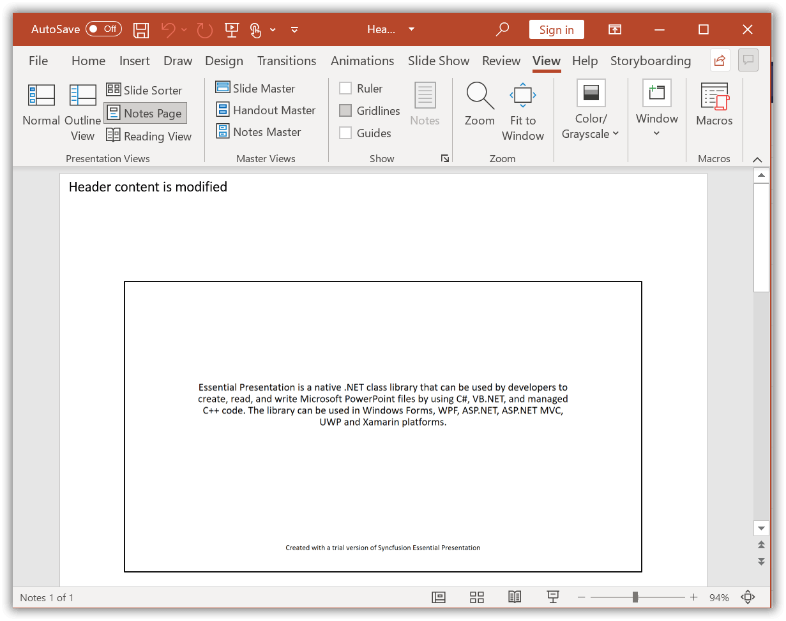

You can download a complete working sample from [GitHub](https://github.com/SyncfusionExamples/PowerPoint-Examples/tree/master/Headers-and-Footers/Edit-header-text).

### Modify Date and Time format of an existing Slide

Essential&reg; Presentation library facilitates modifying the Date and Time of an existing slide in the PowerPoint Presentation. 

The following code example demonstrates how to modify Date and Time of an existing slide in the presentation.




//Load or open an PowerPoint Presentation
FileStream inputStream = new FileStream(inputFileName,FileMode.Open);
IPresentation pptxDoc = Presentation.Open(inputStream);
//Gets the first slide from the cloned PowerPoint presentation
ISlide slide = pptxDoc.Slides[0];
//Modify Date and Time format of the Footer
slide.HeadersFooters.DateAndTime.Format = DateTimeFormatType.DateTimeddddMMMMddyyyy;    
//Save the PowerPoint Presentation as stream
FileStream outputStream = new FileStream("Sample.pptx", FileMode.Create);
pptxDoc.Save(outputStream);
//Dispose the image stream
pictureStream.Dispose();
//Closes the Presentation
pptxDoc.Close();



//Load or open an PowerPoint Presentation
IPresentation pptxDoc = Presentation.Open("Footer.pptx");
//Gets the first slide from the cloned PowerPoint presentation
ISlide slide = pptxDoc.Slides[0];
//Modify Date and Time format of the Footer
slide.HeadersFooters.DateAndTime.Format = DateTimeFormatType.DateTimeddddMMMMddyyyy;
//Saves the Presentation to the file system
pptxDoc.Save("Sample.pptx");
//Closes the Presentation
pptxDoc.Close();



'Load or open an PowerPoint Presentation
Dim pptxDoc As IPresentation = Presentation.Open("Footer.pptx")
'Gets the first slide from the PowerPoint presentation
ISlide slide = pptxDoc.Slides[0]
'Modify Date and Time format of the Footer
slide.HeadersFooters.DateAndTime.Format = DateTimeFormatType.DateTimeddddMMMMddyyyy
'Saves the Presentation to the file system
pptxDoc.Save("Sample.pptx
'Closes the Presentation
pptxDoc.Close()




By executing the program, you will get the PowerPoint slide as follows.

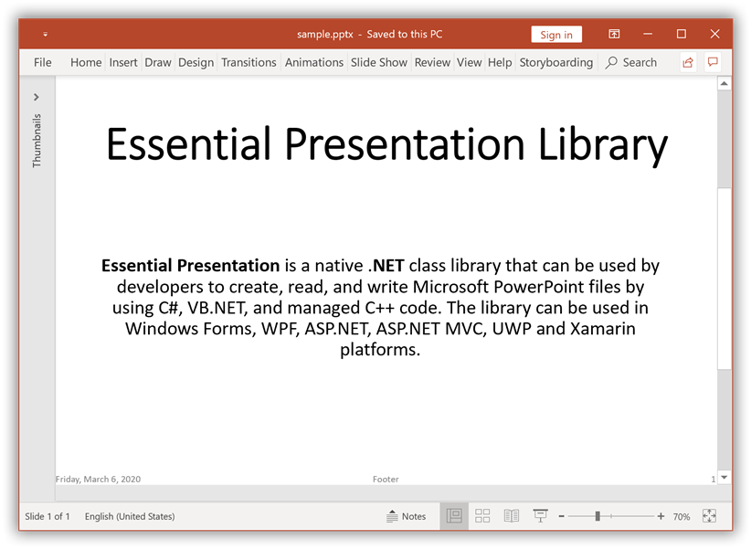

You can download a complete working sample from [GitHub](https://github.com/SyncfusionExamples/PowerPoint-Examples/tree/master/Headers-and-Footers/Modify-date-and-time-format).

### Modify font of the Footer text

Essential&reg; Presentation library facilitates editing font of the [Footer](https://help.syncfusion.com/cr/document-processing/Syncfusion.Presentation.IHeadersFooters.html#Syncfusion_Presentation_IHeadersFooters_Footer) content in slide of the PowerPoint Presentation. 

The following code example demonstrates how to edit font of the [Footer](https://help.syncfusion.com/cr/document-processing/Syncfusion.Presentation.IHeadersFooters.html#Syncfusion_Presentation_IHeadersFooters_Footer) content in slide of the presentation.




//Load or open an PowerPoint Presentation
FileStream inputStream = new FileStream(inputFileName,FileMode.Open);
IPresentation pptxDoc = Presentation.Open(inputStream);
//Gets the first slide from the cloned PowerPoint presentation
ISlide slide = pptxDoc.Slides[0];
//Iterate each shape in slide
foreach(IShape shape in slide.Shapes)
{
    //Check whether the shape is with Placeholder SlideItemType and PlaceholderType as Footer
    if (shape.SlideItemType == SlideItemType.Placeholder && shape.PlaceholderFormat.Type == PlaceholderType.Footer)
    {
        //Change the font name for the Footer content
        shape.TextBody.Paragraphs[0].Font.FontName = "Verdana";
        //Change the font size for the Footer content
        shape.TextBody.Paragraphs[0].Font.FontSize = 18;
    }
}
//Save the PowerPoint Presentation as stream
FileStream outputStream = new FileStream("Sample.pptx", FileMode.Create);
pptxDoc.Save(outputStream);
//Dispose the image stream
pictureStream.Dispose();
//Closes the Presentation
pptxDoc.Close();



//Load or open an PowerPoint Presentation
IPresentation pptxDoc = Presentation.Open("Footer.pptx");
//Gets the first slide from the cloned PowerPoint presentation
ISlide slide = pptxDoc.Slides[0];
//Iterate each shape in slide
foreach(IShape shape in slide.Shapes)
{
    //Check whether the shape is with Placeholder SlideItemType and PlaceholderType as Footer
    if (shape.SlideItemType == SlideItemType.Placeholder && shape.PlaceholderFormat.Type == PlaceholderType.Footer)
    {
        //Change the font name for the Footer content
        shape.TextBody.Paragraphs[0].Font.FontName = "Verdana";
        //Change the font size for the Footer content
        shape.TextBody.Paragraphs[0].Font.FontSize = 18;
    }
}
//Saves the Presentation to the file system
pptxDoc.Save("Sample.pptx");
//Closes the Presentation
pptxDoc.Close();



'Load or open an PowerPoint Presentation
Dim pptxDoc As IPresentation = Presentation.Open("Footer.pptx")
'Gets the first slide from the PowerPoint presentation
ISlide slide = pptxDoc.Slides[0]
'Iterate each shape in slide
For Each shape As IShape In slide.Shapes
    'Check whether the shape is with Placeholder SlideItemType and PlaceholderType as Footer
    If shape.SlideItemType = SlideItemType.Placeholder AndAlso shape.PlaceholderFormat.Type = PlaceholderType.Footer Then
        'Change the font name for the Footer content
        shape.TextBody.Paragraphs(0).Font.FontName = "Verdana"
        'Change the font size for the Footer content
        shape.TextBody.Paragraphs(0).Font.FontSize = 18
    End If
Next
'Saves the Presentation to the file system
pptxDoc.Save("Sample.pptx
'Closes the Presentation
pptxDoc.Close()




By executing the program, you will get the PowerPoint slide as follows.

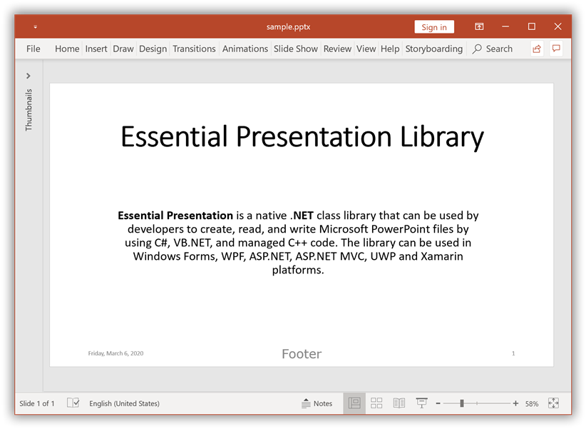

You can download a complete working sample from [GitHub](https://github.com/SyncfusionExamples/PowerPoint-Examples/tree/master/Headers-and-Footers/Modify-footer-text-font).

## Remove Headers and Footers from Title Slides

Essential&reg; Presentation library facilitates removing Footers from all the [Title](https://help.syncfusion.com/cr/document-processing/Syncfusion.Presentation.SlideLayoutType.html) slides in the PowerPoint Presentation. 

The following code example demonstrates how to remove Footers from all the [Title](https://help.syncfusion.com/cr/document-processing/Syncfusion.Presentation.SlideLayoutType.html) slides in the presentation.




//Load or open an PowerPoint Presentation
FileStream inputStream = new FileStream(inputFileName,FileMode.Open);
IPresentation pptxDoc = Presentation.Open(inputStream);

//Iterate each slide in the Presentation
foreach(ISlide slide in pptxDoc.Slides)
{
    //Checks whether the LayoutType of Layout slide is Title
    if (slide.LayoutSlide.LayoutType == SlideLayoutType.Title)
    {
        //Sets the visibility of DateAndTime in the Title slide 
        slide.HeadersFooters.DateAndTime.Visible = false;
        //Sets the visibility of Footer in the Title slide 
        slide.HeadersFooters.Footer.Visible = false;
        //Sets the visibility of SlideNumber in the Title slide 
        slide.HeadersFooters.SlideNumber.Visible = false;
    }
}
//Save the PowerPoint Presentation as stream
FileStream outputStream = new FileStream("Sample.pptx", FileMode.Create);
pptxDoc.Save(outputStream);
//Dispose the image stream
pictureStream.Dispose();
//Closes the Presentation
pptxDoc.Close();



//Load or open an PowerPoint Presentation
IPresentation pptxDoc = Presentation.Open("Footer.pptx");
//Iterate each slide in the Presentation
foreach(ISlide slide in pptxDoc.Slides)
{
    //Checks whether the LayoutType of Layout slide is Title
    if (slide.LayoutSlide.LayoutType == SlideLayoutType.Title)
    {
        //Sets the visibility of DateAndTime in the Title slide 
        slide.HeadersFooters.DateAndTime.Visible = false;
        //Sets the visibility of Footer in the Title slide 
        slide.HeadersFooters.Footer.Visible = false;
        //Sets the visibility of SlideNumber in the Title slide 
        slide.HeadersFooters.SlideNumber.Visible = false;
    }
}
//Saves the Presentation to the file system
pptxDoc.Save("Sample.pptx");
//Closes the Presentation
pptxDoc.Close();



'Load or open an PowerPoint Presentation
Dim pptxDoc As IPresentation = Presentation.Open("Footer.pptx")
'Iterate each slide in the Presentation
For Each slide As ISlide In pptxDoc.Slides
    'Checks whether the LayoutType of Layout slide is Title
    If slide.LayoutSlide.LayoutType = SlideLayoutType.Title Then
        'Sets the visibility of DateAndTime in the Title slide
        slide.HeadersFooters.DateAndTime.Visible = False
        'Sets the visibility of Footer in the Title slide 
        slide.HeadersFooters.Footer.Visible = False
        'Sets the visibility of SlideNumber in the Title slide 
        slide.HeadersFooters.SlideNumber.Visible = False
    End If
Next
'Saves the Presentation to the file system
pptxDoc.Save("Sample.pptx
'Closes the Presentation
pptxDoc.Close()




By executing the program, you will get the PowerPoint slide as follows.

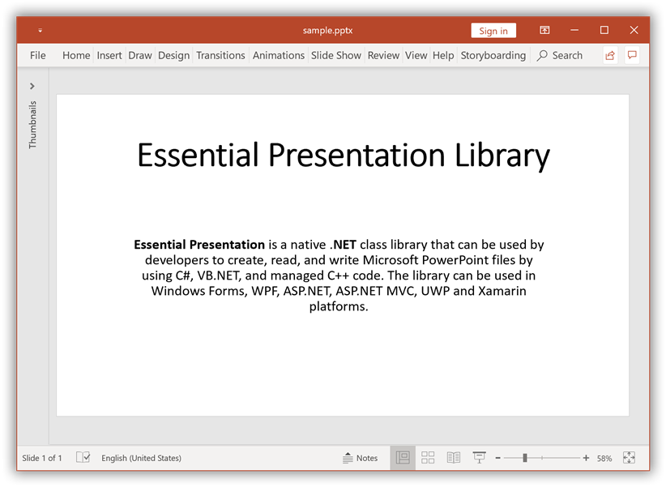

You can download a complete working sample from [GitHub](https://github.com/SyncfusionExamples/PowerPoint-Examples/tree/master/Headers-and-Footers/Remove-footers-from-all-title-slides).

## Online Demo

* Explore how to insert headers and footers in a PowerPoint presentation using the .NET PowerPoint Library (Presentation) in a live demo [here](https://ej2aspnetcore.azurewebsites.net/aspnetcore/powerpoint/headerandfooter#/material3).