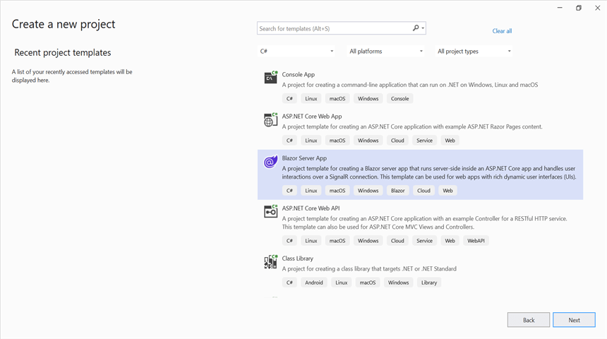
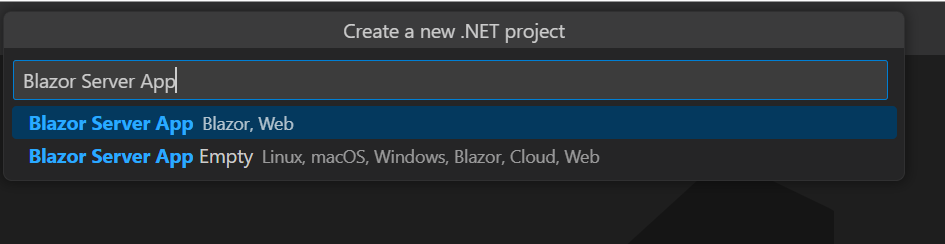

# Create PowerPoint document in Blazor

Syncfusion<sup>&reg;</sup> Essential<sup>&reg;</sup> PowerPoint is a [.NET Core PowerPoint library](https://www.syncfusion.com/document-processing/powerpoint-framework/net-core) used to create, read, and edit **PowerPoint** documents programmatically without **Microsoft PowerPoint** or interop dependencies. Using this library, you can **create a PowerPoint document in Blazor**.

## Server app





**Prerequisites**

* Visual Studio 2022.
* Install [.NET 8 SDK](https://dotnet.microsoft.com/en-us/download/dotnet/8.0) or later.

Step 1: Create a new C# Blazor Server app project. Select Blazor Server App from the template and click the Next button.



Step 2: To **create a PowerPoint document in Server app**, install [Syncfusion.Presentation.Net.Core](https://www.nuget.org/packages/Syncfusion.Presentation.Net.Core) to the Blazor project.


N> Starting with v16.2.0.x, if you reference Syncfusion<sup>&reg;</sup> assemblies from trial setup or from the NuGet feed, you also have to add "Syncfusion.Licensing" assembly reference and include a license key in your projects. Please refer to this [link](https://help.syncfusion.com/common/essential-studio/licensing/overview) to know about registering Syncfusion<sup>&reg;</sup> license key in your application to use our components.

Step 3: Create a razor file with name as **Presentation** under **Pages** folder and include the following namespaces in the file.



@page "/Presentation"
@using System.IO;
@using ServerSideApplication;
@inject ServerSideApplication.Data.PresentationService service
@inject Microsoft.JSInterop.IJSRuntime JS



Step 4: Add the following code to create a new button.





<h2>Syncfusion Presentation library (Essential Presentation)</h2>
<p>Syncfusion Blazor Presentation library (Essential Presentation) used to create, read, edit, and convert Presentation files in your applications without Microsoft Office dependencies.</p>
<button class="btn btn-primary" @onclick="@CreatePowerPoint">Create PowerPoint</button>





Step 5: Add the following code in **Presentation.razor** file to create and download the **Presentation document**.




@code {
    MemoryStream documentStream;
    /// <summary>
    /// Create and download the Presentation document
    /// </summary>
    protected async void CreatePowerPoint()
    {
        documentStream = service.CreatePowerPoint();
        await JS.SaveAs("Sample.pptx", documentStream.ToArray());
    }
}




Step 6: Create a new cs file with name as **PresentationService** under Data folder and include the following namespaces in the file.




using Syncfusion.Presentation;
using System.IO;




Step 7: Create a new MemoryStream method with name as **CreatePowerPoint** and include the following code snippet to **create a PowerPoint document in Blazor** Server app.




public MemoryStream CreatePowerPoint()
{
    //Create a new instance of PowerPoint Presentation file           
    IPresentation pptxDoc = Presentation.Create();
    //Add a new slide to file and apply background color 
    ISlide slide = pptxDoc.Slides.Add(SlideLayoutType.TitleOnly);
    //Specify the fill type and fill color for the slide background         
    slide.Background.Fill.FillType = FillType.Solid;    
    slide.Background.Fill.SolidFill.Color = ColorObject.FromArgb(232, 241, 229);
    //Add title content to the slide by accessing the title placeholder of the  TitleOnly layout-slide 
    IShape titleShape = slide.Shapes[0] as IShape;     
    titleShape.TextBody.AddParagraph("Company History").HorizontalAlignment =  HorizontalAlignmentType.Center;
    //Add description content to the slide by adding a new TextBox IShape  
    IShape descriptionShape = slide.AddTextBox(53.22, 141.73, 874.19, 77.70);      
    descriptionShape.TextBody.Text = "IMN Solutions PVT LTD is the software company, established in 1987, by George Milton. The company has been listed as the trusted  partner for many high-profile organizations since 1988 and got awards for quality products from reputed organizations.";
    //Add bullet points to the slide 
    IShape bulletPointsShape = slide.AddTextBox(53.22, 270, 437.90, 116.32); 
    //Add a paragraph for a bullet point 
    IParagraph firstPara = bulletPointsShape.TextBody.AddParagraph("The company acquired the MCY corporation for 20 billion dollars and became the top revenue maker for the year 2015."); 
    //Format how the bullets should be displayed 
    firstPara.ListFormat.Type = ListType.Bulleted;
    firstPara.LeftIndent = 35;   
    firstPara.FirstLineIndent = -35; 
    //Add another paragraph for the next bullet point 
    IParagraph secondPara = bulletPointsShape.TextBody.AddParagraph("The company is participating in top open source projects in automation industry."); 
    //Format how the bullets should be displayed 
    secondPara.ListFormat.Type = ListType.Bulleted; 
    secondPara.LeftIndent = 35;  
    secondPara.FirstLineIndent = -35;
    //Add an auto-shape to the slide 
    IShape stampShape = slide.Shapes.AddShape(AutoShapeType.Explosion1, 48.93, 430.71, 104.13, 80.54); 
    //Format the auto-shape color by setting the fill type and text   
    stampShape.Fill.FillType = FillType.None;  
    stampShape.TextBody.AddParagraph("IMN").HorizontalAlignment =  HorizontalAlignmentType.Center;
    //Save the PowerPoint Presentation as stream
    MemoryStream stream = new MemoryStream();
    pptxDoc.Save(stream);
    //Close the PowerPoint Presentation as stream
    pptxDoc.Close();
    stream.Position = 0;
    //Download the PowerPoint document in the browser
    JS.SaveAs("Sample.pptx", stream.ToArray());
}




Step 8: Add the following line to the Program.cs file to register the PresentationService as a scoped service in your Blazor application.




builder.Services.AddSingleton<PresentationService>();




Step 9: Create a new class file in the project, with name as FileUtils and add the following code to invoke the JavaScript action to download the file in the browser.





public static class FileUtils
{
    public static ValueTask<object> SaveAs(this IJSRuntime js, string filename, byte[] data)
       => js.InvokeAsync<object>(
           "saveAsFile",
           filename,
           Convert.ToBase64String(data));
}




Step 10: Add the following JavaScript function in the _Host.cshtml in the Pages folder.





<script type="text/javascript">
    function saveAsFile(filename, bytesBase64) {
        if (navigator.msSaveBlob)
        {
            //Download document in Edge browser
            var data = window.atob(bytesBase64);
            var bytes = new Uint8Array(data.length);
            for (var i = 0; i < data.length; i++)
            {
                bytes[i] = data.charCodeAt(i);
            }
            var blob = new Blob([bytes.buffer], { type: "application/octet-stream" });
            navigator.msSaveBlob(blob, filename);
        }
        else
        {
            var link = document.createElement('a');
            link.download = filename;
            link.href = "data:application/octet-stream;base64," + bytesBase64;
            document.body.appendChild(link); // Needed for Firefox
            link.click();
            document.body.removeChild(link);
        }
    }
</script>





Step 11: Add the following code snippet in the razor file of Navigation menu in the Shared folder.





 <li class="nav-item px-3">
    <NavLink class="nav-link" href="presentation">
        <span class="oi oi-list-rich" aria-hidden="true"></span> Generate Presentation
    </NavLink>
</li>





Step 12: Build the project.

Click on Build → Build Solution or press <kbd>Ctrl</kbd>+<kbd>Shift</kbd>+<kbd>B</kbd> to build the project.

Step 13: Run the project.

Click the Start button (green arrow) or press <kbd>F5</kbd> to run the app.

You can download a complete working sample from [GitHub](https://github.com/SyncfusionExamples/PowerPoint-Examples/tree/master/Getting-started/Blazor/Blazor-Server-app).

By executing the program, you will get the **PowerPoint document** as follows.






**Prerequisites:**

* Visual Studio Code.
* Install [.NET 8 SDK](https://dotnet.microsoft.com/en-us/download/dotnet/8.0) or later.
* Open Visual Studio Code and install the [C# for Visual Studio Code extension](https://marketplace.visualstudio.com/items?itemName=ms-dotnettools.csharp) from the Extensions Marketplace.


Step 1: Create a new C# Blazor Server app project.
* Open the command palette by pressing <kbd>Ctrl</kbd>+<kbd>Shift</kbd>+<kbd>P</kbd> and type **.NET:New Project** and enter.
* Choose the **Blazor Server App** template.



* Select the project location, type the project name and press enter.
* Then choose **Create project**.

Step 2: To **create a PowerPoint document in Blazor Server app**, install [Syncfusion.Presentation.Net.Core](https://www.nuget.org/packages/Syncfusion.Presentation.Net.Core) to the Blazor project.
* Press <kbd>Ctrl</kbd> + <kbd>`</kbd> (backtick) to open the integrated terminal in Visual Studio Code.
* Ensure you're in the project root directory where your .csproj file is located.
* Run the command `dotnet add package Syncfusion.Presentation.Net.Core` to install the NuGet package.


N> Starting with v16.2.0.x, if you reference Syncfusion<sup>&reg;</sup> assemblies from trial setup or from the NuGet feed, you also have to add "Syncfusion.Licensing" assembly reference and include a license key in your projects. Please refer to this [link](https://help.syncfusion.com/common/essential-studio/licensing/overview) to know about registering Syncfusion<sup>&reg;</sup> license key in your application to use our components.

Step 3: Create a razor file with name as **Presentation** under **Pages** folder and include the following namespaces in the file.



@page "/Presentation"
@using System.IO;
@using ServerSideApplication;
@inject ServerSideApplication.Data.PresentationService service
@inject Microsoft.JSInterop.IJSRuntime JS



Step 4: Add the following code to create a new button.





<h2>Syncfusion Presentation library (Essential Presentation)</h2>
<p>Syncfusion Blazor Presentation library (Essential Presentation) used to create, read, edit, and convert Presentation files in your applications without Microsoft Office dependencies.</p>
<button class="btn btn-primary" @onclick="@CreatePowerPoint">Create PowerPoint</button>





Step 5: Add the following code in **Presentation.razor** file to create and download the **Presentation document**.




@code {
    MemoryStream documentStream;
    /// <summary>
    /// Create and download the Presentation document
    /// </summary>
    protected async void CreatePowerPoint()
    {
        documentStream = service.CreatePowerPoint();
        await JS.SaveAs("Sample.pptx", documentStream.ToArray());
    }
}




Step 6: Create a new cs file with name as **PresentationService** under Data folder and include the following namespaces in the file.




using Syncfusion.Presentation;
using System.IO;




Step 7: Create a new MemoryStream method with name as **CreatePowerPoint** and include the following code snippet to **create a PowerPoint document in Blazor** Server app.




public MemoryStream CreatePowerPoint()
{
    //Create a new instance of PowerPoint Presentation file           
    IPresentation pptxDoc = Presentation.Create();
    //Add a new slide to file and apply background color 
    ISlide slide = pptxDoc.Slides.Add(SlideLayoutType.TitleOnly);
    //Specify the fill type and fill color for the slide background         
    slide.Background.Fill.FillType = FillType.Solid;    
    slide.Background.Fill.SolidFill.Color = ColorObject.FromArgb(232, 241, 229);
    //Add title content to the slide by accessing the title placeholder of the  TitleOnly layout-slide 
    IShape titleShape = slide.Shapes[0] as IShape;     
    titleShape.TextBody.AddParagraph("Company History").HorizontalAlignment =  HorizontalAlignmentType.Center;
    //Add description content to the slide by adding a new TextBox IShape  
    IShape descriptionShape = slide.AddTextBox(53.22, 141.73, 874.19, 77.70);      
    descriptionShape.TextBody.Text = "IMN Solutions PVT LTD is the software company, established in 1987, by George Milton. The company has been listed as the trusted  partner for many high-profile organizations since 1988 and got awards for quality products from reputed organizations.";
    //Add bullet points to the slide 
    IShape bulletPointsShape = slide.AddTextBox(53.22, 270, 437.90, 116.32); 
    //Add a paragraph for a bullet point 
    IParagraph firstPara = bulletPointsShape.TextBody.AddParagraph("The company acquired the MCY corporation for 20 billion dollars and became the top revenue maker for the year 2015."); 
    //Format how the bullets should be displayed 
    firstPara.ListFormat.Type = ListType.Bulleted;
    firstPara.LeftIndent = 35;   
    firstPara.FirstLineIndent = -35; 
    //Add another paragraph for the next bullet point 
    IParagraph secondPara = bulletPointsShape.TextBody.AddParagraph("The company is participating in top open source projects in automation industry."); 
    //Format how the bullets should be displayed 
    secondPara.ListFormat.Type = ListType.Bulleted; 
    secondPara.LeftIndent = 35;  
    secondPara.FirstLineIndent = -35;
    //Add an auto-shape to the slide 
    IShape stampShape = slide.Shapes.AddShape(AutoShapeType.Explosion1, 48.93, 430.71, 104.13, 80.54); 
    //Format the auto-shape color by setting the fill type and text   
    stampShape.Fill.FillType = FillType.None;  
    stampShape.TextBody.AddParagraph("IMN").HorizontalAlignment =  HorizontalAlignmentType.Center;
    //Save the PowerPoint Presentation as stream
    MemoryStream stream = new MemoryStream();
    pptxDoc.Save(stream);
    //Close the PowerPoint Presentation as stream
    pptxDoc.Close();
    stream.Position = 0;
    //Download the PowerPoint document in the browser
    JS.SaveAs("Sample.pptx", stream.ToArray());
}




Step 8: Add the following line to the Program.cs file to register the PresentationService as a scoped service in your Blazor application.




builder.Services.AddSingleton<PresentationService>();




Step 9: Create a new class file in the project, with name as FileUtils and add the following code to invoke the JavaScript action to download the file in the browser.





public static class FileUtils
{
    public static ValueTask<object> SaveAs(this IJSRuntime js, string filename, byte[] data)
       => js.InvokeAsync<object>(
           "saveAsFile",
           filename,
           Convert.ToBase64String(data));
}




Step 10: Add the following JavaScript function in the _Host.cshtml in the Pages folder.





<script type="text/javascript">
    function saveAsFile(filename, bytesBase64) {
        if (navigator.msSaveBlob)
        {
            //Download document in Edge browser
            var data = window.atob(bytesBase64);
            var bytes = new Uint8Array(data.length);
            for (var i = 0; i < data.length; i++)
            {
                bytes[i] = data.charCodeAt(i);
            }
            var blob = new Blob([bytes.buffer], { type: "application/octet-stream" });
            navigator.msSaveBlob(blob, filename);
        }
        else
        {
            var link = document.createElement('a');
            link.download = filename;
            link.href = "data:application/octet-stream;base64," + bytesBase64;
            document.body.appendChild(link); // Needed for Firefox
            link.click();
            document.body.removeChild(link);
        }
    }
</script>





Step 11: Add the following code snippet in the razor file of Navigation menu in the Shared folder.





 <li class="nav-item px-3">
    <NavLink class="nav-link" href="presentation">
        <span class="oi oi-list-rich" aria-hidden="true"></span> Generate Presentation
    </NavLink>
</li>





Step 12: Build the project.

Run the following command in terminal to build the project.

```
dotnet build
```

Step 13: Run the project.

Run the following command in terminal to run the project.

```
dotnet run
```

You can download a complete working sample from [GitHub](https://github.com/SyncfusionExamples/PowerPoint-Examples/tree/master/Getting-started/Blazor/Blazor-Server-app).

By executing the program, you will get the **PowerPoint document** as follows.






**Prerequisites:**

* JetBrains Rider.
* Install .NET 8 SDK or later.

Step 1. Open JetBrains Rider and create a new Blazor Server app project.
* Launch JetBrains Rider.
* Click new solution on the welcome screen.


* In the new Solution dialog, select Project Type as Web.
* Select the target framework (e.g., .NET 8.0, .NET 9.0).
* Choose template as **Blazor Web App**.
* Enter a project name and specify the location.
* Click create.


Step 2: Install the NuGet package from [NuGet.org](https://www.nuget.org/).
* Click the NuGet icon in the Rider toolbar and type [Syncfusion.Presentation.Net.Core](https://www.nuget.org/packages/Syncfusion.Presentation.Net.Core) in the search bar.
* Ensure that "nuget.org" is selected as the package source.
* Select the latest Syncfusion.Presentation.Net.Core NuGet package from the list.
* Click the + (Add) button to add the package.


* Click the Install button to complete the installation.


N> Starting with v16.2.0.x, if you reference Syncfusion assemblies from trial setup or from the NuGet feed, you also have to add "Syncfusion.Licensing" assembly reference and include a license key in your projects. Please refer to this [link](https://help.syncfusion.com/common/essential-studio/licensing/overview) to know about registering Syncfusion license key in your application to use our components.

Step 3: Create a razor file with name as **Presentation** under **Pages** folder and include the following namespaces in the file.



@page "/Presentation"
@using System.IO;
@using ServerSideApplication;
@inject ServerSideApplication.Data.PresentationService service
@inject Microsoft.JSInterop.IJSRuntime JS



Step 4: Add the following code to create a new button.





<h2>Syncfusion Presentation library (Essential Presentation)</h2>
<p>Syncfusion Blazor Presentation library (Essential Presentation) used to create, read, edit, and convert Presentation files in your applications without Microsoft Office dependencies.</p>
<button class="btn btn-primary" @onclick="@CreatePowerPoint">Create PowerPoint</button>





Step 5: Add the following code in **Presentation.razor** file to create and download the **Presentation document**.




@code {
    MemoryStream documentStream;
    /// <summary>
    /// Create and download the Presentation document
    /// </summary>
    protected async void CreatePowerPoint()
    {
        documentStream = service.CreatePowerPoint();
        await JS.SaveAs("Sample.pptx", documentStream.ToArray());
    }
}




Step 6: Create a new cs file with name as **PresentationService** under Data folder and include the following namespaces in the file.




using Syncfusion.Presentation;
using System.IO;




Step 7: Create a new MemoryStream method with name as **CreatePowerPoint** and include the following code snippet to **create a PowerPoint document in Blazor** Server app.




public MemoryStream CreatePowerPoint()
{
    //Create a new instance of PowerPoint Presentation file           
    IPresentation pptxDoc = Presentation.Create();
    //Add a new slide to file and apply background color 
    ISlide slide = pptxDoc.Slides.Add(SlideLayoutType.TitleOnly);
    //Specify the fill type and fill color for the slide background         
    slide.Background.Fill.FillType = FillType.Solid;    
    slide.Background.Fill.SolidFill.Color = ColorObject.FromArgb(232, 241, 229);
    //Add title content to the slide by accessing the title placeholder of the  TitleOnly layout-slide 
    IShape titleShape = slide.Shapes[0] as IShape;     
    titleShape.TextBody.AddParagraph("Company History").HorizontalAlignment =  HorizontalAlignmentType.Center;
    //Add description content to the slide by adding a new TextBox IShape  
    IShape descriptionShape = slide.AddTextBox(53.22, 141.73, 874.19, 77.70);      
    descriptionShape.TextBody.Text = "IMN Solutions PVT LTD is the software company, established in 1987, by George Milton. The company has been listed as the trusted  partner for many high-profile organizations since 1988 and got awards for quality products from reputed organizations.";
    //Add bullet points to the slide 
    IShape bulletPointsShape = slide.AddTextBox(53.22, 270, 437.90, 116.32); 
    //Add a paragraph for a bullet point 
    IParagraph firstPara = bulletPointsShape.TextBody.AddParagraph("The company acquired the MCY corporation for 20 billion dollars and became the top revenue maker for the year 2015."); 
    //Format how the bullets should be displayed 
    firstPara.ListFormat.Type = ListType.Bulleted;
    firstPara.LeftIndent = 35;   
    firstPara.FirstLineIndent = -35; 
    //Add another paragraph for the next bullet point 
    IParagraph secondPara = bulletPointsShape.TextBody.AddParagraph("The company is participating in top open source projects in automation industry."); 
    //Format how the bullets should be displayed 
    secondPara.ListFormat.Type = ListType.Bulleted; 
    secondPara.LeftIndent = 35;  
    secondPara.FirstLineIndent = -35;
    //Add an auto-shape to the slide 
    IShape stampShape = slide.Shapes.AddShape(AutoShapeType.Explosion1, 48.93, 430.71, 104.13, 80.54); 
    //Format the auto-shape color by setting the fill type and text   
    stampShape.Fill.FillType = FillType.None;  
    stampShape.TextBody.AddParagraph("IMN").HorizontalAlignment =  HorizontalAlignmentType.Center;
    //Save the PowerPoint Presentation as stream
    MemoryStream stream = new MemoryStream();
    pptxDoc.Save(stream);
    //Close the PowerPoint Presentation as stream
    pptxDoc.Close();
    stream.Position = 0;
    //Download the PowerPoint document in the browser
    JS.SaveAs("Sample.pptx", stream.ToArray());
}




Step 8: Add the following line to the Program.cs file to register the PresentationService as a scoped service in your Blazor application.




builder.Services.AddSingleton<PresentationService>();




Step 9: Create a new class file in the project, with name as FileUtils and add the following code to invoke the JavaScript action to download the file in the browser.





public static class FileUtils
{
    public static ValueTask<object> SaveAs(this IJSRuntime js, string filename, byte[] data)
       => js.InvokeAsync<object>(
           "saveAsFile",
           filename,
           Convert.ToBase64String(data));
}




Step 10: Add the following JavaScript function in the _Host.cshtml in the Pages folder.





<script type="text/javascript">
    function saveAsFile(filename, bytesBase64) {
        if (navigator.msSaveBlob)
        {
            //Download document in Edge browser
            var data = window.atob(bytesBase64);
            var bytes = new Uint8Array(data.length);
            for (var i = 0; i < data.length; i++)
            {
                bytes[i] = data.charCodeAt(i);
            }
            var blob = new Blob([bytes.buffer], { type: "application/octet-stream" });
            navigator.msSaveBlob(blob, filename);
        }
        else
        {
            var link = document.createElement('a');
            link.download = filename;
            link.href = "data:application/octet-stream;base64," + bytesBase64;
            document.body.appendChild(link); // Needed for Firefox
            link.click();
            document.body.removeChild(link);
        }
    }
</script>





Step 11: Add the following code snippet in the razor file of Navigation menu in the Shared folder.





 <li class="nav-item px-3">
    <NavLink class="nav-link" href="presentation">
        <span class="oi oi-list-rich" aria-hidden="true"></span> Generate Presentation
    </NavLink>
</li>





Step 12: Build the project.

Click the **Build** button in the toolbar or press <kbd>Ctrl</kbd>+<kbd>Shift</kbd>+<kbd>B</kbd> to build the project.

Step 13: Run the project.

Click the **Run** button (green arrow) in the toolbar or press <kbd>F5</kbd> to run the app.

You can download a complete working sample from [GitHub](https://github.com/SyncfusionExamples/PowerPoint-Examples/tree/master/Getting-started/Blazor/Blazor-Server-app).

By executing the program, you will get the **PowerPoint document** as follows.






Click [here](https://www.syncfusion.com/document-processing/powerpoint-framework/blazor) to explore the rich set of Syncfusion PowerPoint Library (Presentation) features. 

An online sample link to [create a PowerPoint Presentation](https://document.syncfusion.com/demos/powerpoint/default#/tailwind) in ASP.NET Core.

## WASM app





**Prerequisites:**

* Visual Studio 2022.
* Install [.NET 8 SDK](https://dotnet.microsoft.com/en-us/download/dotnet/8.0) or later.

Step 1: Create a new C# Blazor WASM app project. Select Blazor WebAssembly App from the template and click the Next button.


Step 2: To **create a PowerPoint document in WASM app**, install [Syncfusion.Presentation.Net.Core](https://www.nuget.org/packages/Syncfusion.Presentation.Net.Core) to the Blazor project.


N> Starting with v16.2.0.x, if you reference Syncfusion<sup>&reg;</sup> assemblies from trial setup or from the NuGet feed, you also have to add "Syncfusion.Licensing" assembly reference and include a license key in your projects. Please refer to this [link](https://help.syncfusion.com/common/essential-studio/licensing/overview) to know about registering Syncfusion<sup>&reg;</sup> license key in your application to use our components.

Step 3: Create a razor file with name as ``Presentation`` under ``Pages`` folder and add the following namespaces in the file.



@page "/Presentation"
@using Syncfusion.Presentation
@using Syncfusion.OfficeChart
@using System.IO
@inject Microsoft.JSInterop.IJSRuntime JS



Step 4: Add the following code to create a new button.





<h2>Syncfusion Presentation library (Essential Presentation)</h2>
<p>Syncfusion Blazor Presentation library (Essential Presentation) used to create, read, edit, and convert Presentation files in your applications without Microsoft Office dependencies.</p>
<button class="btn btn-primary" @onclick="@CreatePowerPoint">Create PowerPoint</button>





Step 5: Create a new async method with name as ``CreatePowerPoint`` and include the following code snippet to **create a PowerPoint document in Blazor** WASM app.




@functions {
    async void CreatePowerPoint()
    {
        //Create a new instance of PowerPoint Presentation file           
        IPresentation pptxDoc = Presentation.Create();
        //Add a new slide to file and apply background color 
        ISlide slide = pptxDoc.Slides.Add(SlideLayoutType.TitleOnly);
        //Specify the fill type and fill color for the slide background         
        slide.Background.Fill.FillType = FillType.Solid;    
        slide.Background.Fill.SolidFill.Color = ColorObject.FromArgb(232, 241, 229);
        //Add title content to the slide by accessing the title placeholder of the  TitleOnly layout-slide 
        IShape titleShape = slide.Shapes[0] as IShape;     
        titleShape.TextBody.AddParagraph("Company History").HorizontalAlignment =  HorizontalAlignmentType.Center;
        //Add description content to the slide by adding a new TextBox IShape  
        IShape descriptionShape = slide.AddTextBox(53.22, 141.73, 874.19, 77.70);      
        descriptionShape.TextBody.Text = "IMN Solutions PVT LTD is the software company, established in 1987, by George Milton. The company has been listed as the trusted  partner for many high-profile organizations since 1988 and got awards for quality products from reputed organizations.";
        //Add bullet points to the slide 
        IShape bulletPointsShape = slide.AddTextBox(53.22, 270, 437.90, 116.32); 
        //Add a paragraph for a bullet point 
        IParagraph firstPara = bulletPointsShape.TextBody.AddParagraph("The company acquired the MCY corporation for 20 billion dollars and became the top revenue maker for the year 2015."); 
        //Format how the bullets should be displayed 
        firstPara.ListFormat.Type = ListType.Bulleted;
        firstPara.LeftIndent = 35;   
        firstPara.FirstLineIndent = -35; 
        //Add another paragraph for the next bullet point 
        IParagraph secondPara = bulletPointsShape.TextBody.AddParagraph("The company is participating in top open source projects in automation industry."); 
        //Format how the bullets should be displayed 
        secondPara.ListFormat.Type = ListType.Bulleted; 
        secondPara.LeftIndent = 35;  
        secondPara.FirstLineIndent = -35;
        //Add an auto-shape to the slide 
        IShape stampShape = slide.Shapes.AddShape(AutoShapeType.Explosion1, 48.93, 430.71, 104.13, 80.54); 
        //Format the auto-shape color by setting the fill type and text   
        stampShape.Fill.FillType = FillType.None;  
        stampShape.TextBody.AddParagraph("IMN").HorizontalAlignment =  HorizontalAlignmentType.Center;
        //Save the PowerPoint Presentation as stream
        MemoryStream stream = new MemoryStream();
        pptxDoc.Save(stream);
        //Close the PowerPoint Presentation as stream
        pptxDoc.Close();
        stream.Position = 0;
        //Download the PowerPoint document in the browser
        JS.SaveAs("Sample.pptx", stream.ToArray());
    }
}




Step 6: To download the PowerPoint document in browser, create a class file with FileUtils name and add the following code to invoke the JavaScript action to download the file in the browser.




public static class FileUtils
{
    public static ValueTask<object> SaveAs(this IJSRuntime js, string filename, byte[] data)
       => js.InvokeAsync<object>(
           "saveAsFile",
           filename,
           Convert.ToBase64String(data));
}




Step 7: Add the following JavaScript function in the _Host.cshtml in the Pages folder.





<script type="text/javascript">
    function saveAsFile(filename, bytesBase64) {
        if (navigator.msSaveBlob) {
            //Download document in Edge browser
            var data = window.atob(bytesBase64);
            var bytes = new Uint8Array(data.length);
            for (var i = 0; i < data.length; i++) {
                bytes[i] = data.charCodeAt(i);
            }
            var blob = new Blob([bytes.buffer], { type: "application/octet-stream" });
            navigator.msSaveBlob(blob, filename);
        }
        else {
            var link = document.createElement('a');
            link.download = filename;
            link.href = "data:application/octet-stream;base64," + bytesBase64;
            document.body.appendChild(link); // Needed for Firefox
            link.click();
            document.body.removeChild(link);
        }
    }
</script>




Step 8: Add the following code snippet in the razor file of Navigation menu in the Shared folder.





 <li class="nav-item px-3">
    <NavLink class="nav-link" href="presentation">
        <span class="oi oi-list-rich" aria-hidden="true"></span> Generate Presentation
    </NavLink>
</li>





Step 9: Build the project.

Click on Build → Build Solution or <kbd>Ctrl</kbd>+<kbd>Shift</kbd>+<kbd>B</kbd> to build the project.

Step 10: Run the project.

Click the Start button (green arrow) or press <kbd>F5</kbd> to run the app.

You can download a complete working sample from [GitHub](https://github.com/SyncfusionExamples/PowerPoint-Examples/tree/master/Getting-started/Blazor/Blazor-WASM-app).

By executing the program, you will get the **PowerPoint document** as follows.



 



**Prerequisites:**

* Visual Studio Code.
* Install [.NET 8 SDK](https://dotnet.microsoft.com/en-us/download/dotnet/8.0) or later.
* Open Visual Studio Code and install the [C# for Visual Studio Code extension](https://marketplace.visualstudio.com/items?itemName=ms-dotnettools.csharp) from the Extensions Marketplace.

Step 1: Create a new C# Blazor WASM app project.
* Open the command palette by pressing <kbd>Ctrl</kbd>+<kbd>Shift</kbd>+<kbd>P</kbd> and type **.NET:New Project** and enter.
* Choose the **Blazor WebAssembly App** template.


* Select the project location, type the project name and press enter.
* Then choose **Create project**.

Step 2: To **create a PowerPoint document in Blazor WASM app**, install [Syncfusion.Presentation.Net.Core](https://www.nuget.org/packages/Syncfusion.Presentation.Net.Core) to the Blazor project.
* Press <kbd>Ctrl</kbd> + <kbd>`</kbd> (backtick) to open the integrated terminal in Visual Studio Code.
* Ensure you're in the project root directory where your .csproj file is located.
* Run the command `dotnet add package Syncfusion.Presentation.Net.Core` to install the NuGet package.


N> Starting with v16.2.0.x, if you reference Syncfusion<sup>&reg;</sup> assemblies from trial setup or from the NuGet feed, you also have to add "Syncfusion.Licensing" assembly reference and include a license key in your projects. Please refer to this [link](https://help.syncfusion.com/common/essential-studio/licensing/overview) to know about registering Syncfusion<sup>&reg;</sup> license key in your application to use our components.

Step 3: Create a razor file with name as ``Presentation`` under ``Pages`` folder and add the following namespaces in the file.



@page "/Presentation"
@using Syncfusion.Presentation
@using Syncfusion.OfficeChart
@using System.IO
@inject Microsoft.JSInterop.IJSRuntime JS



Step 4: Add the following code to create a new button.





<h2>Syncfusion Presentation library (Essential Presentation)</h2>
<p>Syncfusion Blazor Presentation library (Essential Presentation) used to create, read, edit, and convert Presentation files in your applications without Microsoft Office dependencies.</p>
<button class="btn btn-primary" @onclick="@CreatePowerPoint">Create PowerPoint</button>





Step 5: Create a new async method with name as ``CreatePowerPoint`` and include the following code snippet to **create a PowerPoint document in Blazor** WASM app.




@functions {
    async void CreatePowerPoint()
    {
        //Create a new instance of PowerPoint Presentation file           
        IPresentation pptxDoc = Presentation.Create();
        //Add a new slide to file and apply background color 
        ISlide slide = pptxDoc.Slides.Add(SlideLayoutType.TitleOnly);
        //Specify the fill type and fill color for the slide background         
        slide.Background.Fill.FillType = FillType.Solid;    
        slide.Background.Fill.SolidFill.Color = ColorObject.FromArgb(232, 241, 229);
        //Add title content to the slide by accessing the title placeholder of the  TitleOnly layout-slide 
        IShape titleShape = slide.Shapes[0] as IShape;     
        titleShape.TextBody.AddParagraph("Company History").HorizontalAlignment =  HorizontalAlignmentType.Center;
        //Add description content to the slide by adding a new TextBox IShape  
        IShape descriptionShape = slide.AddTextBox(53.22, 141.73, 874.19, 77.70);      
        descriptionShape.TextBody.Text = "IMN Solutions PVT LTD is the software company, established in 1987, by George Milton. The company has been listed as the trusted  partner for many high-profile organizations since 1988 and got awards for quality products from reputed organizations.";
        //Add bullet points to the slide 
        IShape bulletPointsShape = slide.AddTextBox(53.22, 270, 437.90, 116.32); 
        //Add a paragraph for a bullet point 
        IParagraph firstPara = bulletPointsShape.TextBody.AddParagraph("The company acquired the MCY corporation for 20 billion dollars and became the top revenue maker for the year 2015."); 
        //Format how the bullets should be displayed 
        firstPara.ListFormat.Type = ListType.Bulleted;
        firstPara.LeftIndent = 35;   
        firstPara.FirstLineIndent = -35; 
        //Add another paragraph for the next bullet point 
        IParagraph secondPara = bulletPointsShape.TextBody.AddParagraph("The company is participating in top open source projects in automation industry."); 
        //Format how the bullets should be displayed 
        secondPara.ListFormat.Type = ListType.Bulleted; 
        secondPara.LeftIndent = 35;  
        secondPara.FirstLineIndent = -35;
        //Add an auto-shape to the slide 
        IShape stampShape = slide.Shapes.AddShape(AutoShapeType.Explosion1, 48.93, 430.71, 104.13, 80.54); 
        //Format the auto-shape color by setting the fill type and text   
        stampShape.Fill.FillType = FillType.None;  
        stampShape.TextBody.AddParagraph("IMN").HorizontalAlignment =  HorizontalAlignmentType.Center;
        //Save the PowerPoint Presentation as stream
        MemoryStream stream = new MemoryStream();
        pptxDoc.Save(stream);
        //Close the PowerPoint Presentation as stream
        pptxDoc.Close();
        stream.Position = 0;
        //Download the PowerPoint document in the browser
        JS.SaveAs("Sample.pptx", stream.ToArray());
    }
}




Step 6: To download the PowerPoint document in browser, create a class file with FileUtils name and add the following code to invoke the JavaScript action to download the file in the browser.




public static class FileUtils
{
    public static ValueTask<object> SaveAs(this IJSRuntime js, string filename, byte[] data)
       => js.InvokeAsync<object>(
           "saveAsFile",
           filename,
           Convert.ToBase64String(data));
}




Step 7: Add the following JavaScript function in the _Host.cshtml in the Pages folder.





<script type="text/javascript">
    function saveAsFile(filename, bytesBase64) {
        if (navigator.msSaveBlob) {
            //Download document in Edge browser
            var data = window.atob(bytesBase64);
            var bytes = new Uint8Array(data.length);
            for (var i = 0; i < data.length; i++) {
                bytes[i] = data.charCodeAt(i);
            }
            var blob = new Blob([bytes.buffer], { type: "application/octet-stream" });
            navigator.msSaveBlob(blob, filename);
        }
        else {
            var link = document.createElement('a');
            link.download = filename;
            link.href = "data:application/octet-stream;base64," + bytesBase64;
            document.body.appendChild(link); // Needed for Firefox
            link.click();
            document.body.removeChild(link);
        }
    }
</script>




Step 8: Add the following code snippet in the razor file of Navigation menu in the Shared folder.





 <li class="nav-item px-3">
    <NavLink class="nav-link" href="presentation">
        <span class="oi oi-list-rich" aria-hidden="true"></span> Generate Presentation
    </NavLink>
</li>





Step 9: Build the project.

Run the following command in terminal to build the project.

```
dotnet build
```

Step 10: Run the project.

Run the following command in terminal to run the project.

```
dotnet run
```

You can download a complete working sample from [GitHub](https://github.com/SyncfusionExamples/PowerPoint-Examples/tree/master/Getting-started/Blazor/Blazor-WASM-app).

By executing the program, you will get the **PowerPoint document** as follows.






**Prerequisites:**

* JetBrains Rider.
* Install .NET 8 SDK or later.

Step 1. Open JetBrains Rider and create a new Blazor WASM app project.
* Launch JetBrains Rider.
* Click new solution on the welcome screen.


* In the new Solution dialog, select Project Type as Web.
* Select the target framework (e.g., .NET 8.0, .NET 9.0).
* Choose template as **Blazor WebAssembly Standalone App**.
* Enter a project name and specify the location.
* Click create.


Step 2: Install the NuGet package from [NuGet.org](https://www.nuget.org/).
* Click the NuGet icon in the Rider toolbar and type [Syncfusion.Presentation.Net.Core](https://www.nuget.org/packages/Syncfusion.Presentation.Net.Core) in the search bar.
* Ensure that "nuget.org" is selected as the package source.
* Select the latest Syncfusion.Presentation.Net.Core NuGet package from the list.
* Click the + (Add) button to add the package.


* Click the Install button to complete the installation.


N> Starting with v16.2.0.x, if you reference Syncfusion assemblies from trial setup or from the NuGet feed, you also have to add "Syncfusion.Licensing" assembly reference and include a license key in your projects. Please refer to this [link](https://help.syncfusion.com/common/essential-studio/licensing/overview) to know about registering Syncfusion license key in your application to use our components.

Step 3: Create a razor file with name as ``Presentation`` under ``Pages`` folder and add the following namespaces in the file.



@page "/Presentation"
@using Syncfusion.Presentation
@using Syncfusion.OfficeChart
@using System.IO
@inject Microsoft.JSInterop.IJSRuntime JS



Step 4: Add the following code to create a new button.





<h2>Syncfusion Presentation library (Essential Presentation)</h2>
<p>Syncfusion Blazor Presentation library (Essential Presentation) used to create, read, edit, and convert Presentation files in your applications without Microsoft Office dependencies.</p>
<button class="btn btn-primary" @onclick="@CreatePowerPoint">Create PowerPoint</button>





Step 5: Create a new async method with name as ``CreatePowerPoint`` and include the following code snippet to **create a PowerPoint document in Blazor** WASM app.




@functions {
    async void CreatePowerPoint()
    {
        //Create a new instance of PowerPoint Presentation file           
        IPresentation pptxDoc = Presentation.Create();
        //Add a new slide to file and apply background color 
        ISlide slide = pptxDoc.Slides.Add(SlideLayoutType.TitleOnly);
        //Specify the fill type and fill color for the slide background         
        slide.Background.Fill.FillType = FillType.Solid;    
        slide.Background.Fill.SolidFill.Color = ColorObject.FromArgb(232, 241, 229);
        //Add title content to the slide by accessing the title placeholder of the  TitleOnly layout-slide 
        IShape titleShape = slide.Shapes[0] as IShape;     
        titleShape.TextBody.AddParagraph("Company History").HorizontalAlignment =  HorizontalAlignmentType.Center;
        //Add description content to the slide by adding a new TextBox IShape  
        IShape descriptionShape = slide.AddTextBox(53.22, 141.73, 874.19, 77.70);      
        descriptionShape.TextBody.Text = "IMN Solutions PVT LTD is the software company, established in 1987, by George Milton. The company has been listed as the trusted  partner for many high-profile organizations since 1988 and got awards for quality products from reputed organizations.";
        //Add bullet points to the slide 
        IShape bulletPointsShape = slide.AddTextBox(53.22, 270, 437.90, 116.32); 
        //Add a paragraph for a bullet point 
        IParagraph firstPara = bulletPointsShape.TextBody.AddParagraph("The company acquired the MCY corporation for 20 billion dollars and became the top revenue maker for the year 2015."); 
        //Format how the bullets should be displayed 
        firstPara.ListFormat.Type = ListType.Bulleted;
        firstPara.LeftIndent = 35;   
        firstPara.FirstLineIndent = -35; 
        //Add another paragraph for the next bullet point 
        IParagraph secondPara = bulletPointsShape.TextBody.AddParagraph("The company is participating in top open source projects in automation industry."); 
        //Format how the bullets should be displayed 
        secondPara.ListFormat.Type = ListType.Bulleted; 
        secondPara.LeftIndent = 35;  
        secondPara.FirstLineIndent = -35;
        //Add an auto-shape to the slide 
        IShape stampShape = slide.Shapes.AddShape(AutoShapeType.Explosion1, 48.93, 430.71, 104.13, 80.54); 
        //Format the auto-shape color by setting the fill type and text   
        stampShape.Fill.FillType = FillType.None;  
        stampShape.TextBody.AddParagraph("IMN").HorizontalAlignment =  HorizontalAlignmentType.Center;
        //Save the PowerPoint Presentation as stream
        MemoryStream stream = new MemoryStream();
        pptxDoc.Save(stream);
        //Close the PowerPoint Presentation as stream
        pptxDoc.Close();
        stream.Position = 0;
        //Download the PowerPoint document in the browser
        JS.SaveAs("Sample.pptx", stream.ToArray());
    }
}




Step 6: To download the PowerPoint document in browser, create a class file with FileUtils name and add the following code to invoke the JavaScript action to download the file in the browser.




public static class FileUtils
{
    public static ValueTask<object> SaveAs(this IJSRuntime js, string filename, byte[] data)
       => js.InvokeAsync<object>(
           "saveAsFile",
           filename,
           Convert.ToBase64String(data));
}




Step 7: Add the following JavaScript function in the _Host.cshtml in the Pages folder.





<script type="text/javascript">
    function saveAsFile(filename, bytesBase64) {
        if (navigator.msSaveBlob) {
            //Download document in Edge browser
            var data = window.atob(bytesBase64);
            var bytes = new Uint8Array(data.length);
            for (var i = 0; i < data.length; i++) {
                bytes[i] = data.charCodeAt(i);
            }
            var blob = new Blob([bytes.buffer], { type: "application/octet-stream" });
            navigator.msSaveBlob(blob, filename);
        }
        else {
            var link = document.createElement('a');
            link.download = filename;
            link.href = "data:application/octet-stream;base64," + bytesBase64;
            document.body.appendChild(link); // Needed for Firefox
            link.click();
            document.body.removeChild(link);
        }
    }
</script>




Step 8: Add the following code snippet in the razor file of Navigation menu in the Shared folder.





 <li class="nav-item px-3">
    <NavLink class="nav-link" href="presentation">
        <span class="oi oi-list-rich" aria-hidden="true"></span> Generate Presentation
    </NavLink>
</li>





Step 9: Build the project.

Click the **Build** button in the toolbar or press <kbd>Ctrl</kbd>+<kbd>Shift</kbd>+<kbd>B</kbd> to build the project.

Step 10: Run the project.

Click the **Run** button (green arrow) in the toolbar or press <kbd>F5</kbd> to run the app.

You can download a complete working sample from [GitHub](https://github.com/SyncfusionExamples/PowerPoint-Examples/tree/master/Getting-started/Blazor/Blazor-WASM-app).

By executing the program, you will get the **PowerPoint document** as follows.






N> Even though PowerPoint library works in WASM app, it is recommended to use server deployment. Since the WASM app deployment increases the application payload size. You can also explore our [Blazor PowerPoint library demo](https://blazor.syncfusion.com/demos/powerpoint/getting-started) that shows how to create and modify PowerPoint files from C# with just five lines of code.

Kindly explore the [supported and unsupported features of PowerPoint library in Blazor](https://help.syncfusion.com/document-processing/powerpoint/powerpoint-library/net/supported-and-unsupported-features).

Click [here](https://www.syncfusion.com/document-processing/powerpoint-framework/blazor) to explore the rich set of Syncfusion<sup>&reg;</sup> PowerPoint Library (Presentation) features. 

An online sample link to [create a PowerPoint Presentation](https://document.syncfusion.com/demos/powerpoint/default#/tailwind) in ASP.NET Core.
