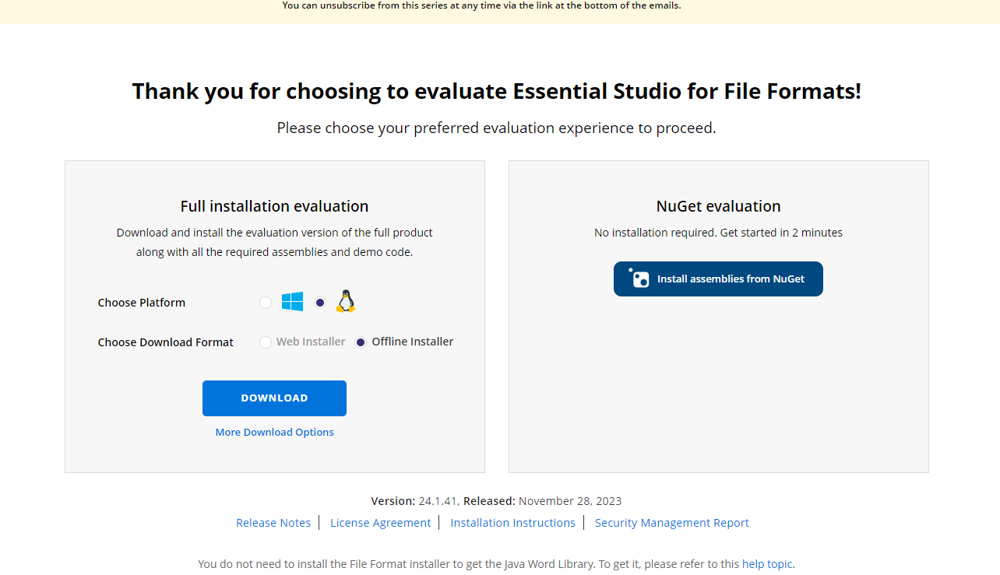
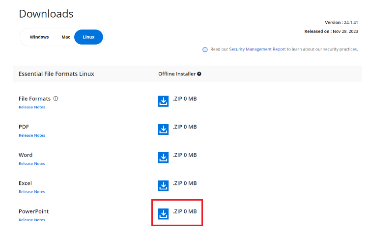
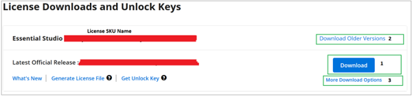

# Download Syncfusion&reg; PowerPoint Linux Installer

The Syncfusion&reg; installer can be downloaded from the [Syncfusion](https://www.syncfusion.com/) website. You can either download the licensed installer or try our trial installer depending on your license.

   -	Trial Installer
   -	Licensed Installer

You can download the Syncfusion&reg; installer from the [Syncfusion.com](https://www.syncfusion.com/) website.

## Download the Trial Version

Our 30-day trial can be downloaded in two ways.

* Download Free Trial Setup
* Start Trials if using components through [NuGet.org](https://www.nuget.org/packages?q=syncfusion)

### Download Free Trial Setup

1. You can evaluate our 30-day free trial by visiting the [Download Free Trial](https://www.syncfusion.com/downloads) page and selecting the product.
2. After completing the required form or logging in with your registered Syncfusion&reg; account, you can download the trial installer from the confirmation page (as shown in the screenshot below).

   
   
3. With a trial license, only the latest version’s trial installer can be downloaded.
4. The Unlock key is not required to install the Syncfusion&reg; PowerPoint Linux trial installer.
5. Before the trial expires, you can download the trial installer at any time from your registered account’s [Trials & Downloads](https://www.syncfusion.com/account/manage-trials/downloads) page (as shown in the screenshot below).
 
   

6. Click the **More Download Options** button to get the PowerPoint Product Offline trial installer, which is available in ZIP format (as shown in the screenshot below).

   

### Start Trials if Using Components Through [NuGet.org](https://www.nuget.org/packages?q=syncfusion)

You should initiate an evaluation if you have already obtained our components through [NuGet.org](https://www.nuget.org/packages?q=syncfusion).

1. You can start your 30-day free trial from the [Start Trial](https://www.syncfusion.com/account/manage-trials/start-trials) page in your account.

   N> You can generate the license key for your active trial products from the [Trials & Downloads](https://www.syncfusion.com/account/manage-trials/downloads) page. This license key will be mandatory to use our trial products in your application. To know more about the License key, refer to this [help topic](https://help.syncfusion.com/common/essential-studio/licensing/overview).
	
    
   
2. To access this page, you must sign up or log in with your Syncfusion&reg; account.
3. Begin your trial by selecting the Syncfusion&reg; product. 

   N> If you've already used a trial for a product and it has not expired, you will not be able to start a new trial for the same product.

4. After starting the trial, go to the [Trials & Downloads](https://www.syncfusion.com/account/manage-trials/downloads) page to get the latest version trial installer. You can generate the [license key](https://help.syncfusion.com/common/essential-studio/licensing/how-to-generate) here at any time before the trial period expires (as shown in the screenshot below). The Unlock key is not required for the Linux installer.

   

5. You can find your current active trial products on the [Trials & Downloads](https://www.syncfusion.com/account/manage-trials/downloads) page.
   

## Download the License Version

1. Syncfusion&reg; licensed products are available on the [License & Downloads](https://www.syncfusion.com/account/downloads) page under your registered Syncfusion&reg; account.
2. You can view all the licenses (both active and expired) associated with your account.
3. You can download the PowerPoint Linux licensed installer by going to **More Download Options** (as shown in the screenshot below).

   
   
4. The Unlock key is not required to install the Syncfusion&reg; PowerPoint Linux licensed installer.   
5. For the Linux OS, the ZIP format is available for download.
   
   

Refer to the [**PowerPoint Linux installer**](https://help.syncfusion.com/document-processing/powerpoint/powerpoint-library/net/installation/linux-installer/how-to-install) page for step-by-step installation guidelines.	
