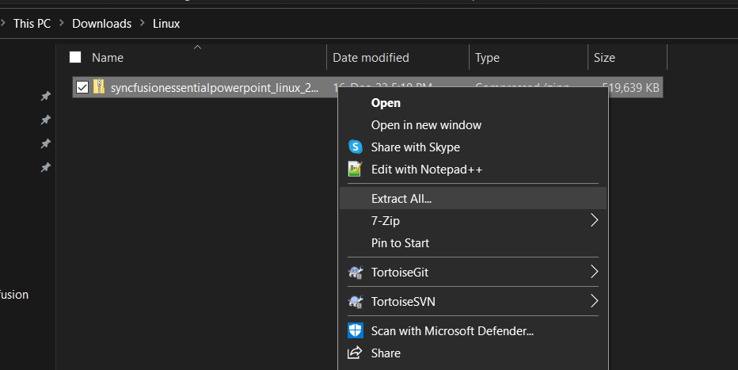
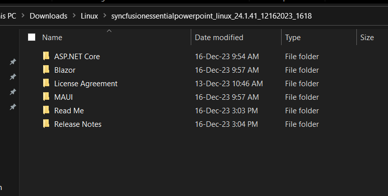

# Installing Syncfusion&reg; PowerPoint Linux Installer

## Overview

This guide walks you through installing the Syncfusion&reg; PowerPoint Linux Installer on a Linux machine. The installer is distributed as a `.zip` archive that contains the demo samples and the NuGet packages required to build the included samples.

## Step-by-Step Installation

The steps below show how to install PowerPoint Linux installer.

1. Extract the Syncfusion&reg; PowerPoint Linux installer(.zip) file. The files are extracted in your machine.

   
   

2. The Linux zip file contains the following folders.

      
   
   N> The Unlock key is not required to install the Linux installer.

4. You can launch the demo source and use the NuGet packages included in the Linux installer.

5. Run the following command in linux machine to deploy the ASP.NET Core samples
 
  **dotnet restore project-name -s \nuget** in order to restore.

## License key registration in samples

After the installation, the license key is required to register the demo source that is included in the Linux installer. To learn about the steps for license registration for the ASP.NET Core - EJ2 samples in the Essential Studio&reg; PowerPoint linux installer, please refer to this.

## Related Links

- [Download the Syncfusion&reg; PowerPoint Linux Installer](how-to-download)
- [Offline Installer for PowerPoint](../offline-installer/how-to-install)
- [Web Installer for PowerPoint](../web-installer/how-to-install)
- [NuGet Packages Required for PowerPoint](../../Assemblies-Required)
- [PowerPoint Getting Started](../../Getting-Started)
- [Syncfusion&reg; Licensing FAQ](https://www.syncfusion.com/sales/communitylicense)