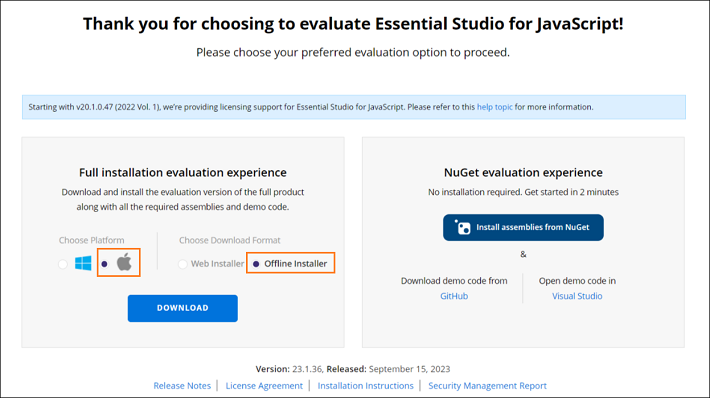
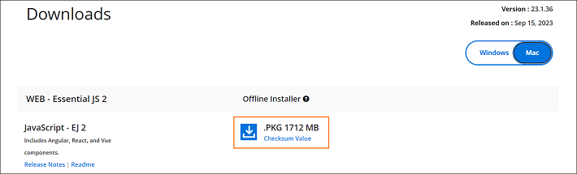
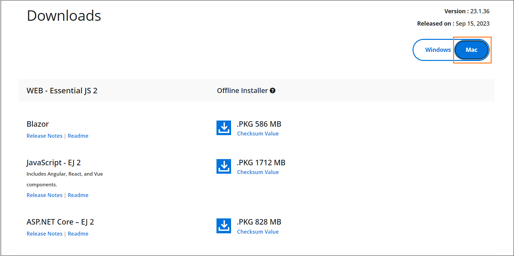

---
layout: post
title: How to Download Syncfusion PowerPoint Mac Installer | Syncfusion
description: Learn how to download the Syncfusion® PowerPoint Mac installer from our website for licensed and trial users.
platform: document-processing
control: Installation and Deployment
documentation: ug
--- 

# How to Download Syncfusion PowerPoint Mac Installer

The Syncfusion&reg; installer can be downloaded from the [Syncfusion](https://www.syncfusion.com/) website. You can either download the licensed installer or try our trial installer depending on your license.

A Syncfusion account is required to download the installer. If you do not have one, you can sign up for free during the download process.

The installer is available in DMG format and supports both Apple Silicon (M1/M2/M3) and Intel-based macOS systems.

## Download the Trial Version

Our 30-day trial can be downloaded in two ways.

* Download Free Trial Setup
* Start Trials if using components through [NuGet.org](https://www.nuget.org/packages?q=syncfusion)

### Download Free Trial Setup

Step 1: You can evaluate our 30-day free trial by visiting the [Download Free Trial](https://www.syncfusion.com/downloads) page and selecting the **Document Processing** product.
Step 2: After completing the required form or logging in with your registered Syncfusion&reg; account, you can download the trial installer from the confirmation page, as shown in the screenshot below.

   
   
Step 3: With a trial license, only the trial installer for the latest version can be downloaded. If you need an older version, contact [Syncfusion Support](https://www.syncfusion.com/support).
Step 4: An unlock key is not required to install the Syncfusion&reg; PowerPoint Mac trial installer.
Step 5: Before the trial expires, you can download the trial installer at any time from your registered account’s [Trials & Downloads](https://www.syncfusion.com/account/manage-trials/downloads) page, as shown in the screenshot below.
 
   

Step 6: Click the **More Download Options** button (labeled in the screenshot above) to get the Syncfusion&reg; PowerPoint Mac trial installer, which is available in DMG format. The DMG file is typically saved to your browser's default download location (usually the **Downloads** folder).

   

### Start Trials if using components through [NuGet.org](https://www.nuget.org/packages?q=syncfusion)

You should initiate an evaluation if you have already obtained our components through [NuGet.org](https://www.nuget.org/packages?q=syncfusion) (for example, the [Syncfusion.Presentation.Net](https://www.nuget.org/packages?q=Syncfusion.Presentation) NuGet package).

Step 1: You can start your 30-day free trial from the [Start Trial](https://www.syncfusion.com/account/manage-trials/start-trials) page from your account.

   

   N> You can generate the license key for your active trial products from [Trials & Downloads](https://www.syncfusion.com/account/manage-trials/downloads) page. This license key will be mandatory to use our trial products in your application. To know more about License key, refer this [help topic](https://help.syncfusion.com/document-processing/licensing/overview).
   
Step 2: To access this page, you must sign up or log in with your Syncfusion&reg; account.
Step 3: Begin your trial by selecting the Syncfusion&reg; product. 

   N> If you've already used the trial products and they haven't expired, you won't be able to start the trial for the same product again.

Step 4: After you've started the trial, go to the [Trials & Downloads](https://www.syncfusion.com/account/manage-trials/downloads) page to get the trial installer for the latest version. You can generate the [unlock key](https://www.syncfusion.com/kb/8069/how-to-generate-unlock-key-for-essentials-studio-products) and [license key](https://help.syncfusion.com/document-processing/licensing/how-to-generate) here at any time before the trial period expires, as shown in the screenshot below.

   

Step 5: You can find your current active trial products on the [Trials & Downloads](https://www.syncfusion.com/account/manage-trials/downloads) page.
   

## Download the License Version

Step 1: Syncfusion&reg; licensed products are available on the [License & Downloads](https://www.syncfusion.com/account/downloads) page under your registered Syncfusion&reg; account.
Step 2: You can view all the licenses (both active and expired licenses) associated with your account.
Step 3: Download the PowerPoint Mac licensed installer by going to **More Download Options** (labeled in the screenshot below) and selecting the macOS DMG file.

   
   
Step 4: An unlock key is not required to install the Syncfusion&reg; PowerPoint Mac licensed installer. However, you must generate a license key before using the product. For more information, refer to the [licensing overview](https://help.syncfusion.com/document-processing/licensing/overview).
Step 5: For macOS, the DMG format is available for download. Choose the build that matches your system architecture (Apple Silicon or Intel), as shown in the screenshot below.
   
   

Step 6: After the DMG is downloaded, double-click the file to mount it, then run the installer package. For step-by-step installation instructions, refer to the [**PowerPoint Mac installation guide**](https://help.syncfusion.com/common/essential-studio/installation/mac-installer/how-to-install).

## See Also

You can also refer to the [**PowerPoint Mac installation guide**](https://help.syncfusion.com/common/essential-studio/installation/mac-installer/how-to-install) for step-by-step installation guidelines.	
