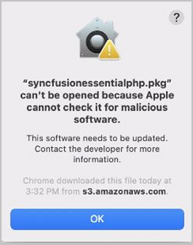
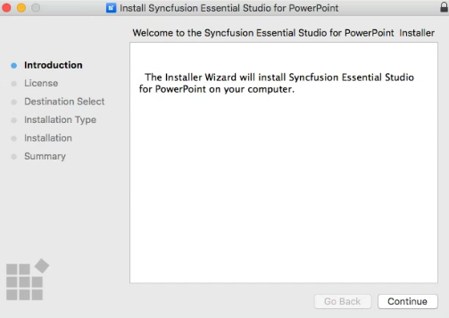
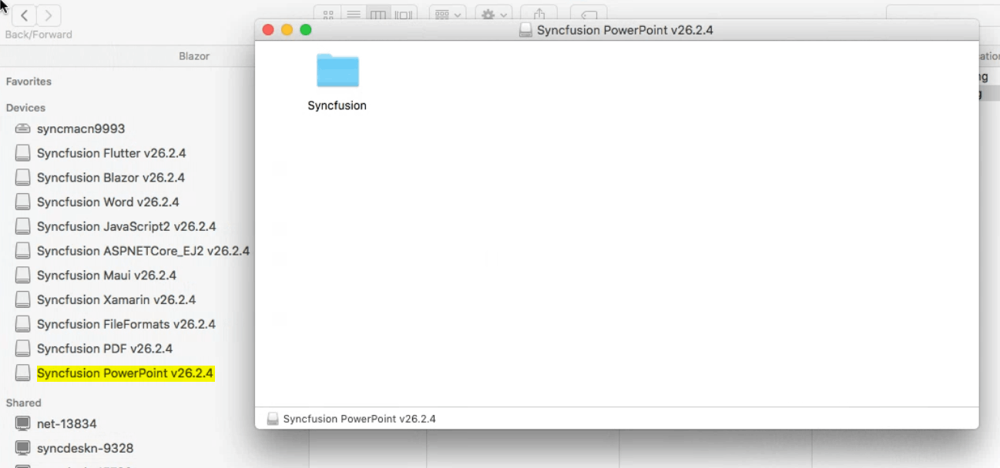
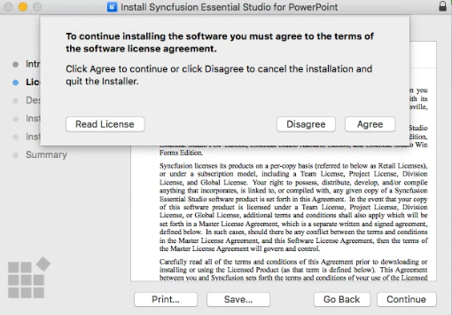
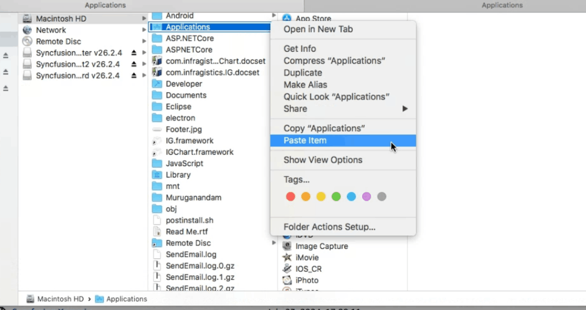
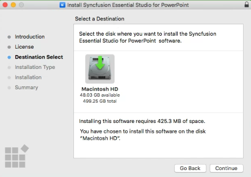
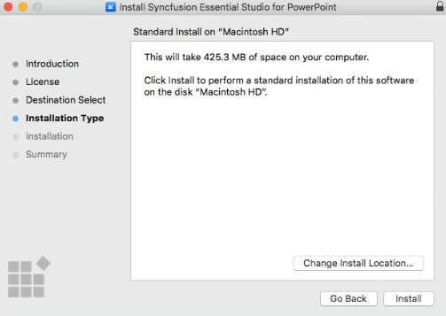

# Installing Syncfusion&reg; PowerPoint Mac installer

## Steps to resolve the warning message in Catalina OS or later

While running the Essential Studio&reg; PowerPoint (Document Processing) Mac Installer on Catalina macOS or later, the alert below is displayed.

If you receive this alert, follow the steps below for the easiest solution.

Step 1: Right-click the downloaded dmg file.

Step 2: Select the **Open With** option and choose **DiskImageMounter (Default)**. The following pop-up appears.

   

Step 3: When you click **Open**, confirm the Gatekeeper prompt and the installer window will open.

## Step-by-step installation

The steps below show how to install the Essential Studio&reg; PowerPoint (Document Processing) Mac Installer.

Step 1: Locate the downloaded dmg file and open the file by double-clicking on it.

   

Step 2: This action automatically mounts the disk image and creates a virtual drive on your desktop or in the Finder sidebar.

   

Step 3: Open the mounted volume and copy the Syncfusion&reg; PowerPoint installer app to the **Applications** folder.

   

   > The Unlock key is not required to install the Mac installer. The Syncfusion&reg; Essential Studio&reg; PowerPoint (Document Processing) Mac Installer can be used for development purposes without registering the Unlock key.

Step 4: Paste the copied installer into the **Applications** folder.

   

Step 5: Open the **Applications** folder and double-click the Syncfusion&reg; PowerPoint installer to launch the setup wizard.

   

Step 6: Follow the on-screen prompts in the installer wizard to complete the installation. When the installation is finished, eject the mounted DMG volume.

   

Step 7: To remove the DMG file, right-click the virtual drive on your desktop or in the Finder sidebar and select **Eject**.

## License key registration in samples

After installation, the license key is required to register the demo samples bundled with the Mac installer. To register the license key for the PowerPoint (Document Processing) samples, see [How to Register a Syncfusion License Key in a Document Processing Application](https://help.syncfusion.com/document-processing/licensing/how-to-register-in-an-application).

## Uninstalling the Mac Installer

To uninstall the Syncfusion&reg; PowerPoint (Document Processing) Mac Installer, open the **Applications** folder, right-click the Syncfusion&reg; PowerPoint installer, and select **Move to Trash**. Empty the Trash to complete the uninstallation.