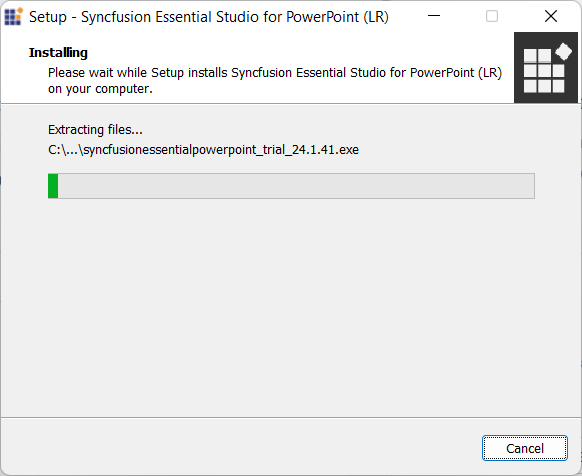
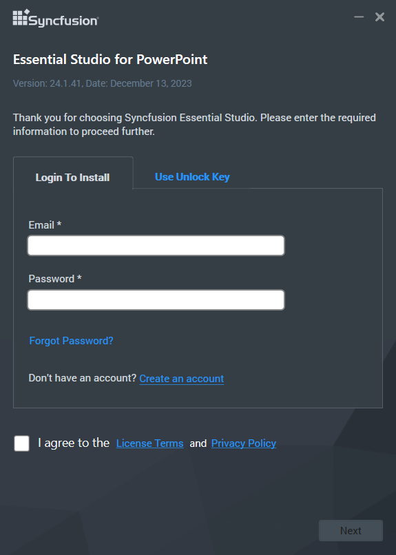
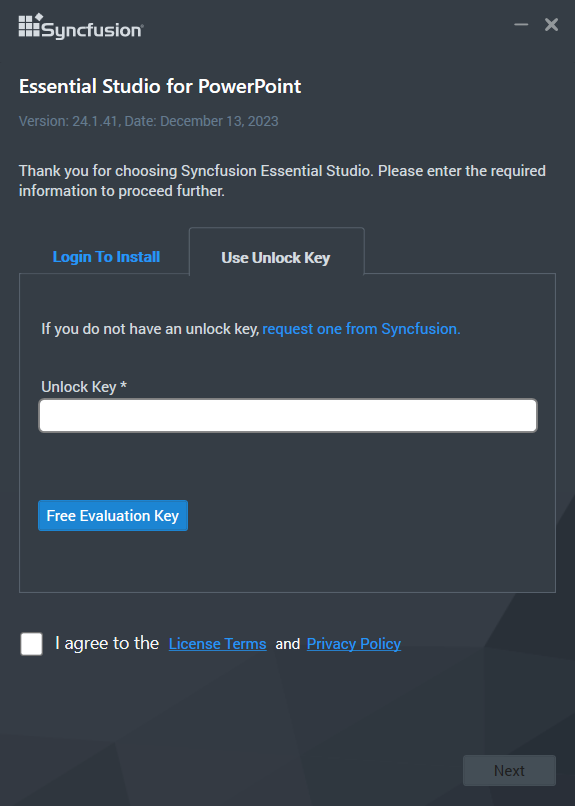
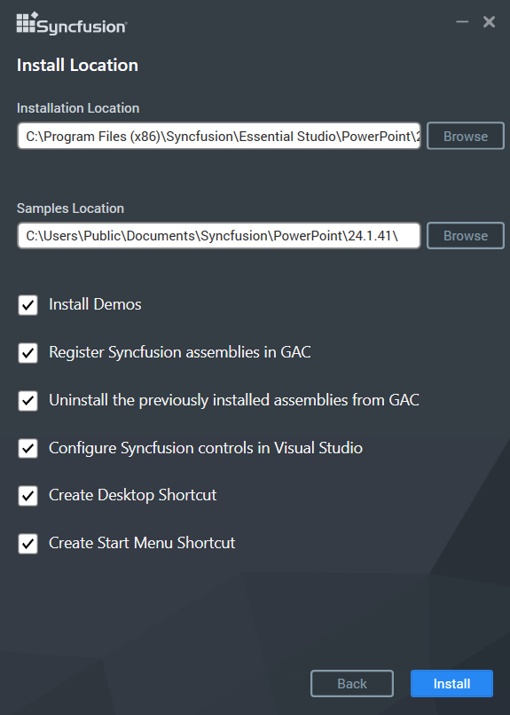
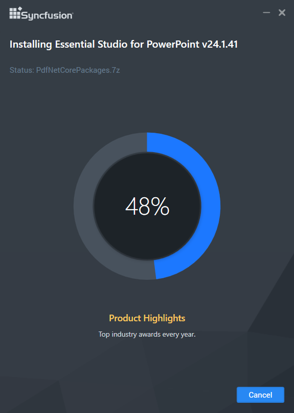
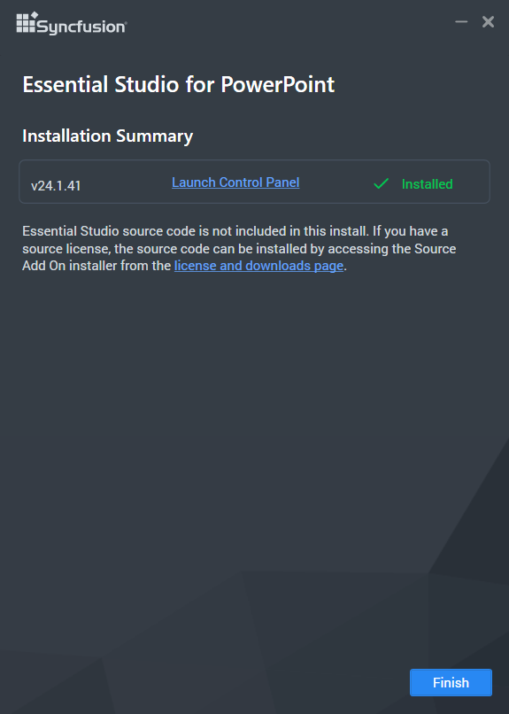
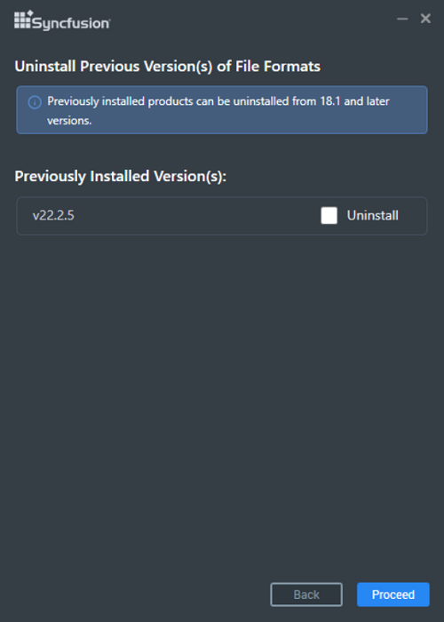
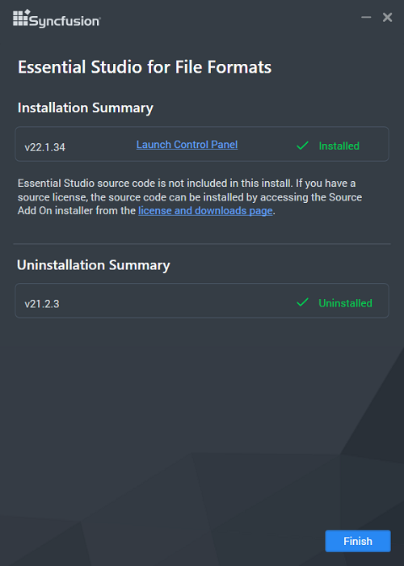

# Installing Syncfusion&reg; PowerPoint offline installer

## Installation Methods

Choose one of the following methods:

- [Installing with UI](#installing-with-ui) — Interactive installation using the wizard.
- [Installing in silent mode](#installing-in-silent-mode) — Unattended installation using the command line.

## Installing with UI

The steps below show how to install the Essential Studio&reg; PowerPoint installer.

### Extract the installer

Step 1: Open the Syncfusion&reg; PowerPoint offline installer file from the downloaded location by double-clicking it. The Installer Wizard automatically opens and extracts the package.

    

    N> The Installer wizard extracts the `syncfusionessentialpowerpoint_(version).exe` dialog, which displays the package's unzip operation.

Step 2: To unlock the Syncfusion&reg; offline installer, you have two options:

    * Login To Install

    * Use Unlock Key

    **Login To Install**

    You must enter your Syncfusion&reg; email address and password. If you do not already have a Syncfusion&reg; account, you can sign up for one by clicking **Create an account**. If you have forgotten your password, click on **Forgot Password** to create a new one. Once you have entered your Syncfusion&reg; email and password, click **Next**.

    

    **Use Unlock Key**

    Unlock keys are used to unlock the Syncfusion&reg; offline installer, and they are platform- and version-specific. You should use either a Syncfusion&reg; licensed or trial Unlock key to unlock the Syncfusion&reg; PowerPoint installer.

    Trial unlock keys expire after 30 days and will be rejected by the installer. Licensed unlock keys are valid for the duration of your subscription. Trial unlock keys are emailed after download; licensed keys are available from your Syncfusion&reg; account.

    To learn how to generate an unlock key for both trial and licensed products, see [How to generate an unlock key](https://www.syncfusion.com/kb/2326) Knowledge Base article.

    

Step 3: After reading the License Terms and Privacy Policy, select the **I agree to the License Terms and Privacy Policy** check box. Click the **Next** button.

Step 4: Change the install and sample locations here. You can also change the additional settings. Click **Next**, then click **Install** to install with the default settings.

    

    **Additional Settings**

    * Select the **Install Demos** check box to install Syncfusion&reg; samples to `{InstallPath}\Samples`, or leave the check box unchecked if you do not want to install Syncfusion&reg; samples.
    * Select the **Register Syncfusion&reg; Assemblies in GAC** check box to install the latest Syncfusion&reg; assemblies in GAC, or clear this check box when you do not want to install the latest assemblies in GAC.
    * Select the **Configure Syncfusion&reg; controls in Visual Studio** check box to configure the Syncfusion&reg; controls in the Visual Studio toolbox, or clear this check box when you do not want to configure the Syncfusion&reg; controls in the Visual Studio toolbox during installation. You must also select the **Register Syncfusion&reg; Assemblies in GAC** check box when you select this check box.
    * Select the **Configure Syncfusion&reg; Extensions controls in Visual Studio** check box to configure the Syncfusion&reg; Extensions in Visual Studio, or clear this check box when you do not want to configure the Syncfusion&reg; Extensions in Visual Studio.
    * Select the **Create Desktop Shortcut** check box to add a desktop shortcut for Syncfusion&reg; Control Panel.
    * Select the **Create Start Menu Shortcut** check box to add a shortcut to the Start menu for Syncfusion&reg; Control Panel.

Step 5: If any previous versions of the current product are installed, the **Uninstall Previous Version(s)** wizard will open. Select the **Uninstall** check box to uninstall the previous versions, then click the **Proceed** button.

    

    N> From version 18.1 onwards, Syncfusion&reg; provides the option to uninstall previous versions while installing the new version.

    N> If any version is selected to uninstall, a confirmation screen will appear. If you click **Continue**, the Progress screen displays the uninstall and install progress. If none of the versions are chosen to be uninstalled, only the installation progress will be displayed.

    **Uninstall Progress:**

    

    **Install Progress:**

    

    N> The Completed screen is displayed once the PowerPoint product is installed. If any version is selected to uninstall, the Completed screen displays both install and uninstall status.

    

Step 6: After installing, click the **Launch Control Panel** link to open the Syncfusion&reg; Control Panel. The Control Panel is the central utility for managing licenses, applying patches, and uninstalling Syncfusion&reg; products.

Step 7: Click the **Finish** button. Syncfusion&reg; Essential Studio&reg; PowerPoint has been installed successfully.

Step 8: **Verify the installation.** Open **Control Panel → Programs → Programs and Features** and confirm that **Syncfusion Essential Studio PowerPoint** is listed. You can also open the Syncfusion&reg; Control Panel from the Start menu.

## Installing in silent mode

The Syncfusion&reg; Essential Studio&reg; PowerPoint Installer supports installation and uninstallation via the command line.

### Command Line Installation

To install through the Command Line in Silent mode, follow the steps below.

1.	Run the Syncfusion&reg; PowerPoint installer by double-clicking it. The Installer Wizard automatically opens and extracts the package.
2.	The file syncfusionessentialpowerpoint_(version).exe file will be extracted into the Temp directory.
3.	Run %temp%. The Temp folder will be opened. The syncfusionessentialpowerpoint_(version).exe file will be located in one of the folders.
4.	Copy the extracted syncfusionessentialpowerpoint_(version).exe file in local drive.
5.	Exit the Wizard.
6.	Run Command Prompt in administrator mode and enter the following arguments.

   
    **Arguments:** “installer file path\SyncfusionEssentialStudio(platform)_(version).exe” /Install silent /UNLOCKKEY:“(product unlock key)” [/log “{Log file path}”] [/InstallPath:{Location to install}] [/InstallSamples:{true/false}] [/InstallAssemblies:{true/false}] [/UninstallExistAssemblies:{true/false}] [/InstallToolbox:{true/false}]

    N> [..] – Arguments inside the square brackets are optional.

    **Example:** “D:\Temp\syncfusionessentialpowerpoint_x.x.x.x.exe” /Install silent /UNLOCKKEY:“product unlock key” /log “C:\Temp\EssentialStudio_Platform.log” /InstallPath:C:\Syncfusion\x.x.x.x /InstallSamples:true /InstallAssemblies:true /UninstallExistAssemblies:true /InstallToolbox:true

	
7.  Essential Studio&reg; for PowerPoint is installed.

    N> x.x.x.x should be replaced with the Essential Studio&reg; version and the Product Unlock Key needs to be replaced with the Unlock Key for that version.
   

### Command Line Uninstallation

Syncfusion&reg; Essential&reg; PowerPoint can be uninstalled silently using the Command Line.

1.	Run the Syncfusion&reg; PowerPoint installer by double-clicking it. The Installer Wizard automatically opens and extracts the package.
2.	The file syncfusionessentialpowerpoint_(version).exe file will be extracted into the Temp directory.
3.	Run %temp%. The Temp folder will be opened. The syncfusionessentialpowerpoint_(version).exe file will be located in one of the folders.
4.	Copy the extracted syncfusionessentialpowerpoint_(version).exe file in local drive.
5.	Exit the Wizard.
6.	Run Command Prompt in administrator mode and enter the following arguments.
   
    **Arguments:** “Copied installer file path\syncfusionessentialpowerpoint_(version).exe” /uninstall silent 

    **Example:** “D:\Temp\syncfusionessentialpowerpoint_x.x.x.x.exe" /uninstall silent

7.  Essential Studio&reg; for PowerPoint is uninstalled.
   
   
