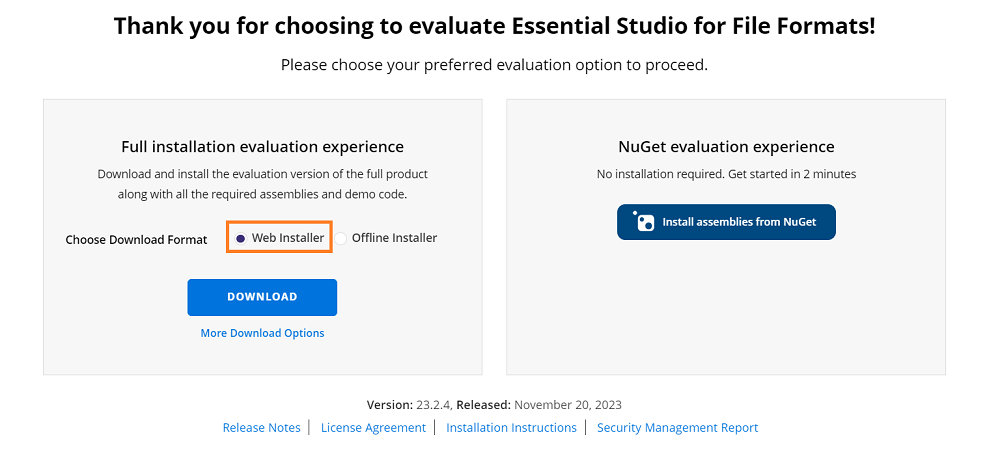
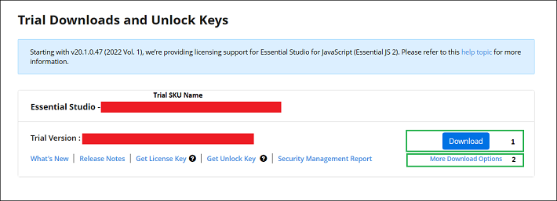
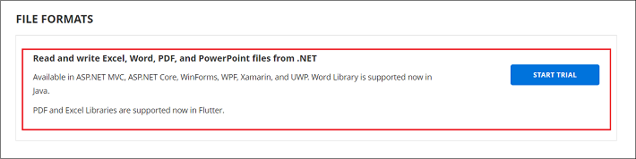
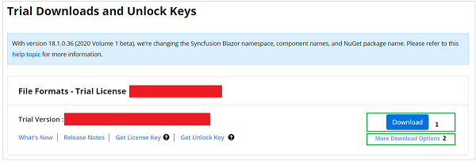
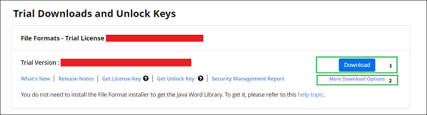
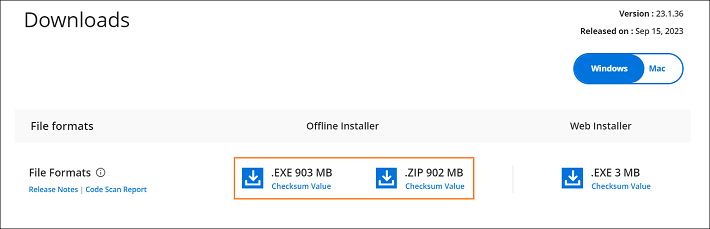

# How to Download Syncfusion PowerPoint Web Installer

[Presentation](https://www.syncfusion.com/document-sdk/net-powerpoint-library) controls are included in the Syncfusion&reg; PowerPoint installer. You can either download the licensed installer or try our trial installer, depending on your license. This page describes both download paths and the prerequisites for each.

> Before you begin, make sure you have a Syncfusion account. Trial and licensed installers are downloaded from the same account, and the web installer behavior is the same for both — only the entitlement differs.

- Trial Installer
- Licensed Installer

**Next step:** After downloading, follow the [Web installer installation guide](https://help.syncfusion.com/PowerPoint/installation/web-installer/how-to-install) for step-by-step installation.

## Download the Trial Version

Our 30-day trial can be downloaded in two ways.

   * Download Free Trial Setup
   * Start Trials if using components through [NuGet.org](https://www.nuget.org/packages?q=syncfusion)

### Download Free Trial Setup

1. You can evaluate our 30-day free trial by visiting the [Download Free Trial](https://www.syncfusion.com/downloads) page and selecting the PowerPoint platform.
2. After completing the required form or logging in with your registered Syncfusion account, you can download the PowerPoint trial installer from the confirmation page, as shown in the screenshot below.

   

3. With a trial license, only the latest version's trial installer is available for download.
4. After downloading, the PowerPoint trial installer can be unlocked using either the trial unlock key or your Syncfusion registered login credentials. More information on generating an unlock key can be found in the [unlock key](https://www.syncfusion.com/kb/8069/how-to-generate-unlock-key-for-essentials-studio-products) article.
5. You can re-download the trial installer at any time before the trial expires from your registered account's [Trials & Downloads](https://www.syncfusion.com/account/manage-trials/downloads) page, as shown in the screenshot below.
6. Click the **Download** button (element 1 in the screenshot below) to get the PowerPoint web installer.

   

### Start Trials if using components through [NuGet.org](https://www.nuget.org/packages?q=syncfusion)

You should initiate an evaluation if you have already obtained our components through [NuGet.org](https://www.nuget.org/packages?q=syncfusion).

1. You can start your 30-day free trial for PowerPoint from the [Start Trial](https://www.syncfusion.com/account/manage-trials/start-trials) page in your account.

   

2. To access this page, you must sign up/log in with your Syncfusion account.
3. Select the PowerPoint product to begin your trial.

N> If you've already used the trial products and they haven't expired, you won't be able to start the trial for the same product again.

4. After you've started the trial, go to the [Trials & Downloads](https://www.syncfusion.com/account/manage-trials/downloads) page to get the latest version trial installer, as shown in the screenshot below.

   

5. Generate the [unlock key](https://www.syncfusion.com/kb/8069/how-to-generate-unlock-key-for-essentials-studio-products) and [license key](https://help.syncfusion.com/document-processing/licensing/how-to-generate) at any time before the trial period expires.
6. You can find your current active trial products on the [Trials & Downloads](https://www.syncfusion.com/account/manage-trials/downloads) page.

## Download the License Version

> Prerequisite: An active Syncfusion license associated with your account is required to see the PowerPoint installer on the License & Downloads page.

### Latest Version

1. Sign in to your registered Syncfusion account and open the [License & Downloads](https://www.syncfusion.com/account/downloads) page.
2. Locate the PowerPoint (Presentation) product in the list. You can view all licenses (both active and expired) associated with your account.
3. Click the **Download** button (element 1 in the screenshot below) to download the installer. The most recent version of the installer will be downloaded from this page.

    

### Older Versions

1. To download an older version installer, go to [Older Versions](https://www.syncfusion.com/account/downloads/studio) (element 2 in the screenshot above).

### Other Platforms and Add-ons

1. To download installers for other platforms or add-ons, go to **More Downloads Options** (element 3 in the screenshot above).

### Re-download and Activation

1. You can re-download the installer at any time before the license expires from your registered account's [License & Downloads](https://www.syncfusion.com/account/downloads) page, as shown in the screenshot below.

   

2. After downloading, the PowerPoint web installer can be unlocked using your Syncfusion registered login credentials.

N> Syncfusion uses a single web installer for both trial and licensed products. Based on your account entitlement, the same installer is unlocked as a trial or licensed product during installation.

For step-by-step installation guidelines, see the [**Web installer installation guide**](https://help.syncfusion.com/PowerPoint/installation/web-installer/how-to-install).	