# Installing Syncfusion&reg; PowerPoint web installer

## Overview

For the Syncfusion&reg; Essential Studio&reg; PowerPoint product, Syncfusion&reg; offers a Web Installer. This installer avoids downloading a large package upfront by streaming only the required files. You can download and run the online installer, which is small in size, and the Web Installer will download and install the Syncfusion&reg; Essential Studio&reg; products you have chosen. You can get the most recent version of the Syncfusion&reg; Essential Studio&reg; Web Installer from the [Syncfusion Downloads (latest version)](https://www.syncfusion.com/downloads/latest-version) page.

> **Prerequisites:** A stable internet connection is required throughout installation, and the installer must be run with administrator privileges on Windows.

N> If you are in a restricted environment without reliable internet access, use the [Offline Installer](../offline-installer/how-to-install.md) instead.
 
## Installation

The steps below show how to install the Syncfusion&reg; Essential Studio&reg; PowerPoint Web Installer.

Step 1: Open the `syncfusionessentialpowerpointwebinstaller_{version}.exe` file from the downloaded location by double-clicking it. The Installer Wizard automatically opens and extracts the package.

    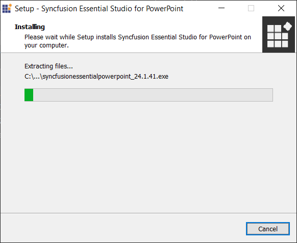

N> The installer wizard extracts the `syncfusionessentialpowerpointwebinstaller_{version}.exe` setup file, which displays the package's unzip operation.
    
Step 2: The Syncfusion&reg; PowerPoint Web Installer's welcome wizard will be displayed. Click the **Next** button.

    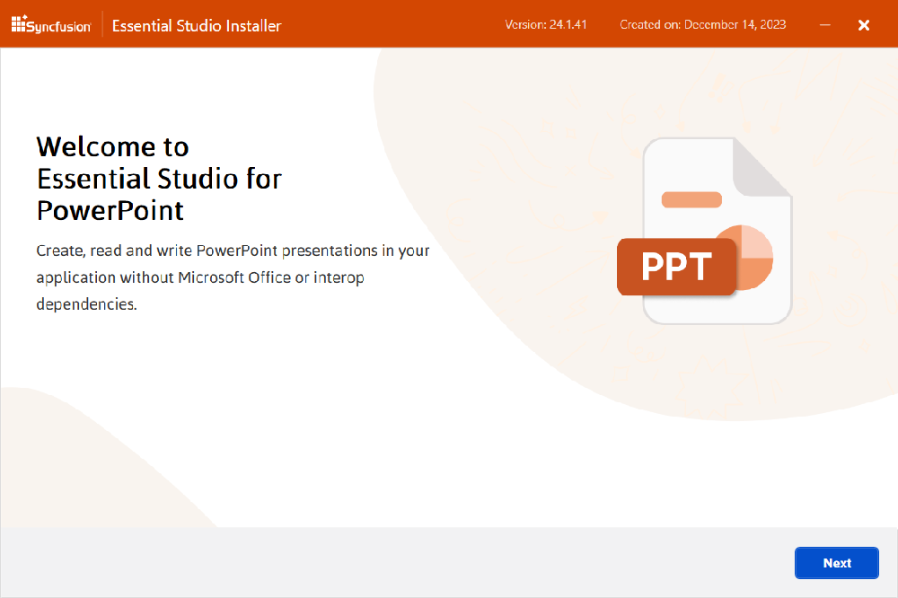

Step 3: The Platform Selection Wizard will appear. From the **Available** tab, select the products to be installed. Select the **Install All** checkbox to install all products.

	*Available*

	

	If you have multiple products installed in the same version, they will be listed under the **Installed** tab. You can also select which products to uninstall from the same version. Click the **Next** button.

	*Installed*

    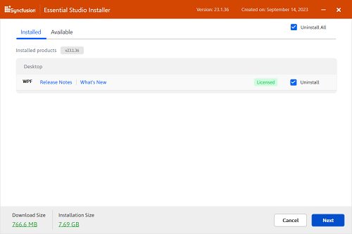

	I> If the required software for the selected product isn't already installed, the **Additional Software Required** alert will appear. You can, however, continue the installation and install the necessary software later. Common prerequisites include supported .NET runtimes (for example, .NET 6.0 or .NET 8.0) and the Visual Studio build tools.
	
	**Required Software**
	
	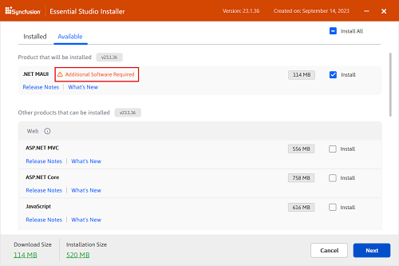
		
	
Step 4: If previous version(s) for the selected products are installed, the **Uninstall Previous Version** wizard will be displayed. You can see the list of previously installed versions for the products you've chosen here. To remove all versions, check the **Uninstall All** checkbox. Click the **Next** button.

	

N> From the 2021 Volume 1 release (v18.1), Syncfusion&reg; provides the option to uninstall the previous versions while installing the new version.

Step 5: A pop-up screen will be displayed to confirm the uninstallation of the selected previous versions.

	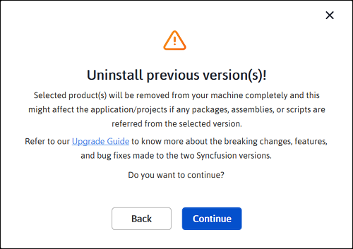

Step 6: The **Confirmation** wizard will appear with the list of products to be installed/uninstalled. You can view and modify the list of products that will be installed and uninstalled from this page.

    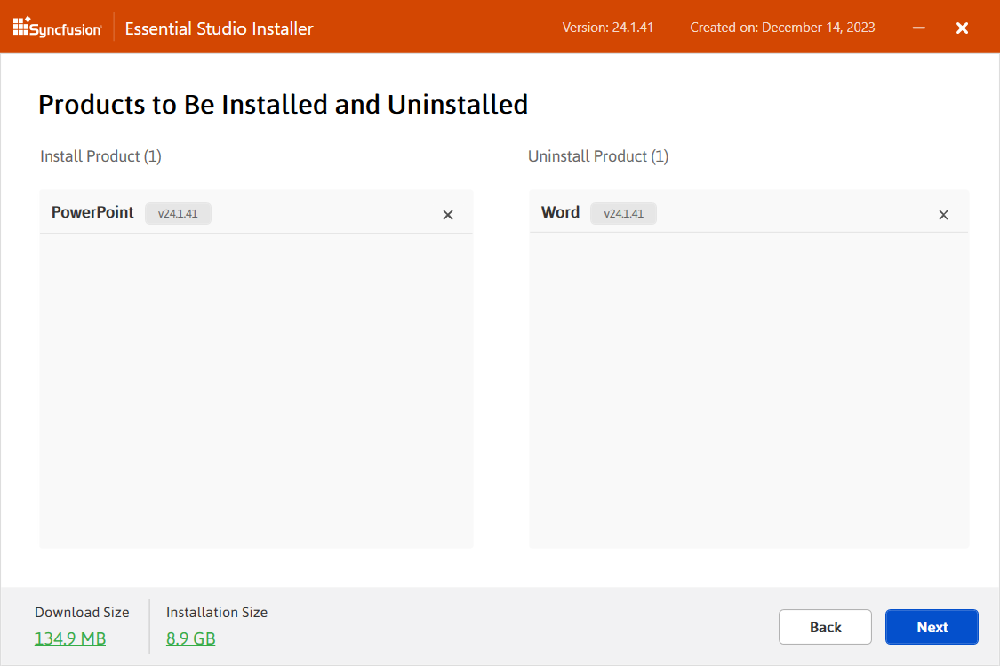

N> By clicking the **Download Size** and **Installation Size** links, you can determine the approximate size of the download and installation.

Step 7: The **Configuration** wizard will appear. You can change the **Download**, **Install**, and **Demos** locations from here. The default locations are:

	- **Download:** `%TEMP%\SyncfusionSetup`
	- **Install:** `C:\Program Files (x86)\Syncfusion\Essential Studio\{version}`
	- **Demos:** `C:\Users\<user>\Documents\Syncfusion\Essential Studio\{version}`

	You can also change the additional settings on a product-by-product basis. Click **Next** to install with the default settings.

    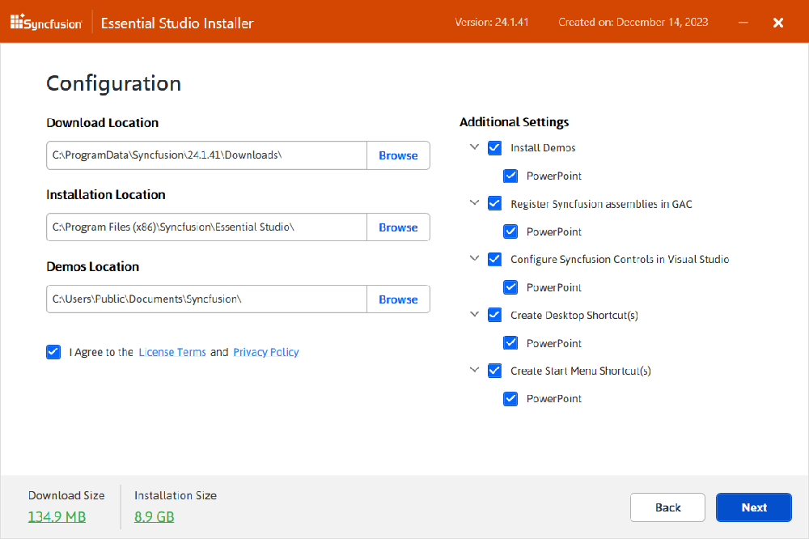

	**Additional settings**

	- Select the **Install Demos** check box to install Syncfusion&reg; samples, or leave the check box unchecked if you do not want to install Syncfusion&reg; samples.
	- Select the **Register Syncfusion&reg; Assemblies in GAC** check box to install the latest Syncfusion&reg; assemblies in GAC, or clear this check box when you do not want to install the latest assemblies in GAC.
	- Select the **Configure Syncfusion&reg; controls in Visual Studio** check box to configure the Syncfusion&reg; controls in the Visual Studio toolbox, or clear this check box when you do not want to configure the Syncfusion&reg; controls in the Visual Studio toolbox during installation. Note that you must also select the **Register Syncfusion&reg; Assemblies in GAC** check box when you select this check box.
	- Select the **Configure Syncfusion&reg; Extensions in Visual Studio** check box to configure the Syncfusion&reg; Extensions in Visual Studio, or clear this check box when you do not want to configure the Syncfusion&reg; Extensions in Visual Studio.
	- Check the **Create Desktop Shortcut** check box to add a desktop shortcut for the Syncfusion&reg; Control Panel.
	- Check the **Create Start Menu Shortcut** check box to add a shortcut to the start menu for the Syncfusion&reg; Control Panel.

Step 8: After reading the License Terms and Conditions, check the **I agree to the License Terms and Privacy Policy** check box. Click the **Next** button. The full License Terms and Privacy Policy are also available at [https://www.syncfusion.com/privacy-policy](https://www.syncfusion.com/privacy-policy).

Step 9: The **Login** wizard will appear. You must enter your Syncfusion&reg; email address and password. If you do not already have a Syncfusion&reg; account, you can create one by clicking **Create an Account**. If you have forgotten your password, click **Forgot Password** to create a new one. Click the **Install** button.

    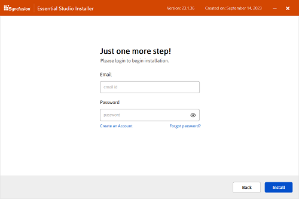

	I> The selected products will be installed based on your Syncfusion&reg; license (Trial or Paid). For more information about license types and applying license keys, refer to the [Syncfusion&reg; Licensing FAQ](https://www.syncfusion.com/sales/communitylicense).

Step 10: The download and installation/uninstallation progress will be displayed as shown below.

    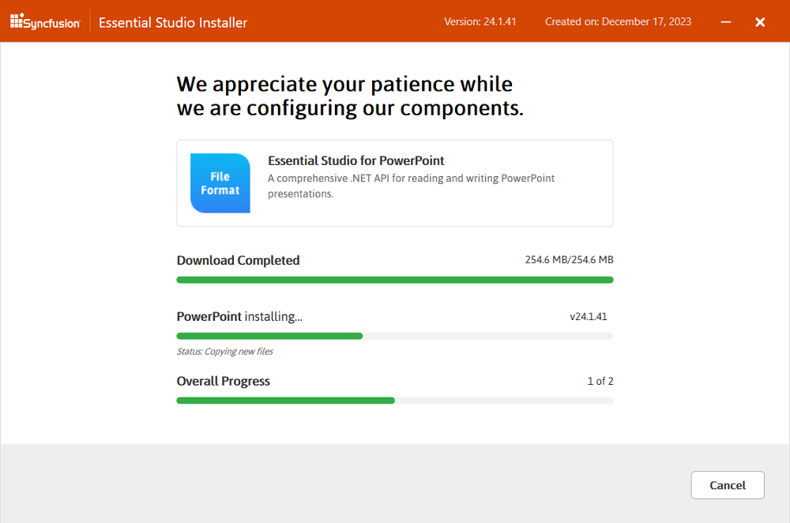

Step 11: When the installation is finished, the **Summary** wizard will appear. Here you can see the list of products that have been installed successfully and those that have failed. To close the **Summary** wizard, click **Finish**.

    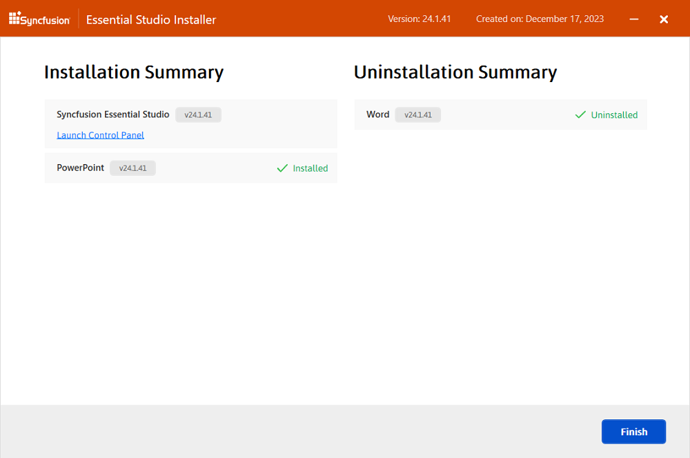

	- To open the Syncfusion&reg; Control Panel, click **Launch Control Panel**.

Step 12: After installation, there will be two Syncfusion&reg; Control Panel entries, as shown below. The **Essential Studio&reg;** entry will manage all Syncfusion&reg; products installed in the same version, while the **Product** entry will only uninstall the specific product setup.

    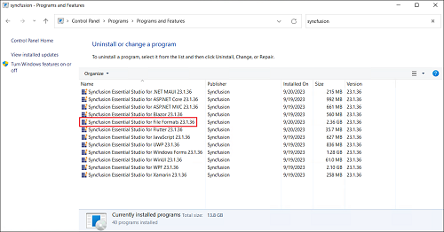

Step 13: Verify the installation.** To confirm a successful install, navigate to the install path shown in Install Step 7 and verify that the Syncfusion&reg; PowerPoint assemblies (for example, `Syncfusion.Presentation.Base.dll`) are present. The Syncfusion&reg; Control Panel can also be launched from the **Start** menu to review installed products.

## Related Links

- [Offline Installer for PowerPoint](../offline-installer/how-to-install)
- [NuGet Packages Required for PowerPoint](../../Assemblies-Required)
- [PowerPoint Getting Started](../../Getting-Started)
- [Syncfusion&reg; Licensing FAQ](https://www.syncfusion.com/sales/communitylicense)
	
	
	
## Uninstallation

The Syncfusion&reg; Essential Studio&reg; PowerPoint Web Installer can be uninstalled in two ways:

- **Option 1 (Quick uninstall, same version only):** Uninstall the PowerPoint products using the Syncfusion&reg; PowerPoint Web Installer.
- **Option 2 (Full uninstall):** Uninstall the PowerPoint products from the Windows Control Panel.

Follow either of the options below to uninstall the Syncfusion&reg; Essential Studio&reg; PowerPoint installer.

### Option 1: Quick uninstall using the Syncfusion&reg; PowerPoint Web Installer (same version only)

Syncfusion&reg; provides the option to uninstall products of the same version directly from the Web Installer application. Select the products to be uninstalled from the list, and the Web Installer will uninstall them one by one. To use this option, double-click the Web Installer executable again, then follow **Uninstall Steps 1–2** below, and then complete the wizard to finish.

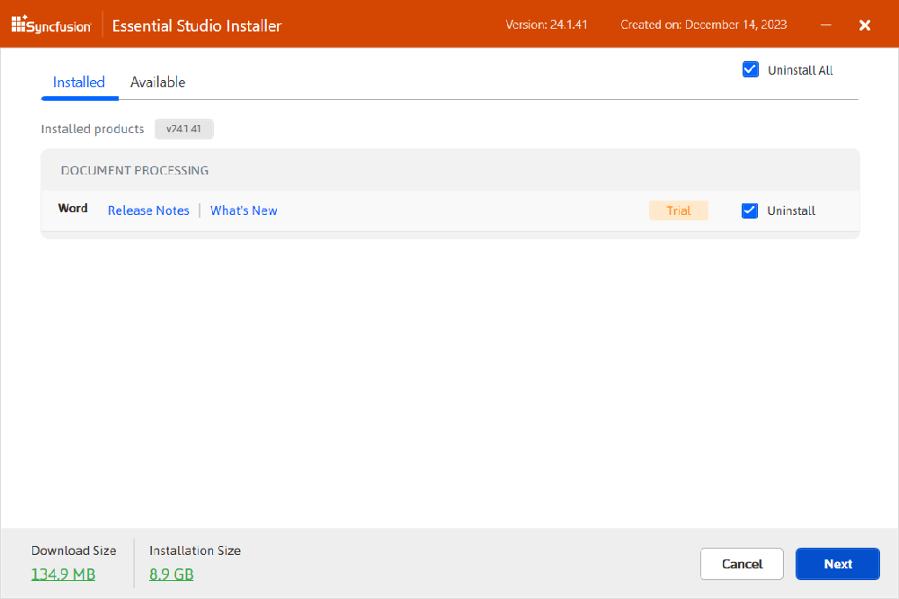

### Option 2: Uninstall the PowerPoint from the Windows Control Panel

You can uninstall all the installed products by selecting the **Syncfusion&reg; Essential Studio&reg; {version}** entry (element 1 in the below screenshot) from the Windows Control Panel, or you can uninstall PowerPoint alone by selecting the **Syncfusion&reg; Essential Studio&reg; for PowerPoint {version}** entry (element 2 in the below screenshot) from the Windows Control Panel.

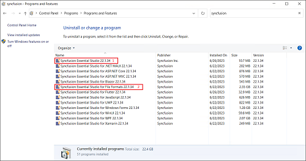

N> If the **Syncfusion&reg; Essential Studio&reg; for PowerPoint {version}** entry is selected from the Windows Control Panel, only the Syncfusion&reg; PowerPoint product will be removed and the Web Installer wizard below will be displayed.

Step 1: The Syncfusion&reg; PowerPoint Web Installer's welcome wizard will be displayed. Click the **Next** button.

    

Step 2: The **Platform Selection** wizard will appear. From the **Installed** tab, select the products to be uninstalled. To select all products, check the **Uninstall All** checkbox. Click the **Next** button.

	*Installed*

	

	You can also select the products to be installed from the **Available** tab. Click the **Next** button.

	*Available*

	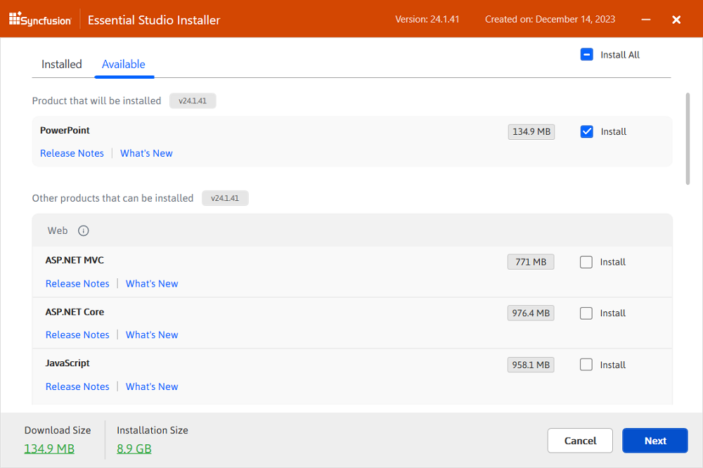

Step 3: If any other products are also selected for installation, the **Uninstall Previous Version** wizard will be displayed with the previous version(s) installed for the selected products. Here you can view the list of installed previous versions for the selected products. Select the **Uninstall All** checkbox to select all versions. Click **Next**.

	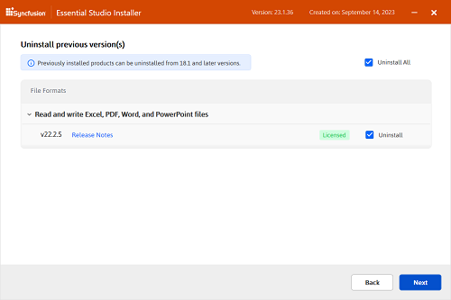

Step 4: A pop-up screen will be displayed to confirm the uninstallation of the selected previous versions.

	

Step 5: The **Confirmation** wizard will appear with the list of products to be installed/uninstalled. Here you can view and modify the list of products that will be installed/uninstalled.

    

	N> By clicking the **Download Size** and **Installation Size** links, you can determine the approximate size of the download and installation.

Step 6: The **Configuration** wizard will appear. You can change the **Download**, **Install**, and **Demos** locations from here. You can also change the additional settings on a product-by-product basis. Click **Next** to continue with the default settings.

    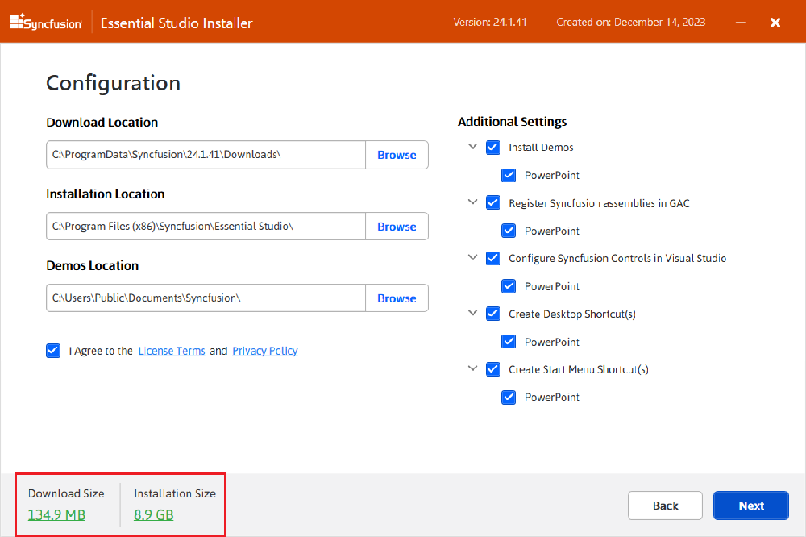

Step 7: After reading the License Terms and Conditions, check the **I agree to the License Terms and Privacy Policy** check box. Click the **Next** button.

Step 8: The **Login** wizard will appear. You must enter your Syncfusion&reg; email address and password. If you do not already have a Syncfusion&reg; account, you can create one by clicking **Create an Account**. If you have forgotten your password, click **Forgot Password** to create a new one. Click the **Install** button.

    

	I> The selected products will be installed/uninstalled based on your Syncfusion&reg; license (Trial or Paid).

Step 9: The download, installation, and uninstallation progress will be shown.

    

Step 10: When the uninstallation is finished, the **Summary** wizard will appear. Here you can see the list of products installed/uninstalled successfully and any that failed. To close the **Summary** wizard, click **Finish**.

    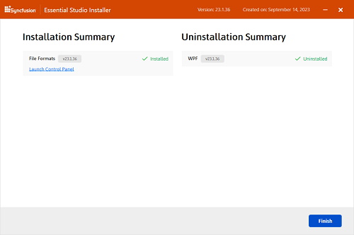
	
    - To open the Syncfusion&reg; Control Panel, click **Launch Control Panel**.