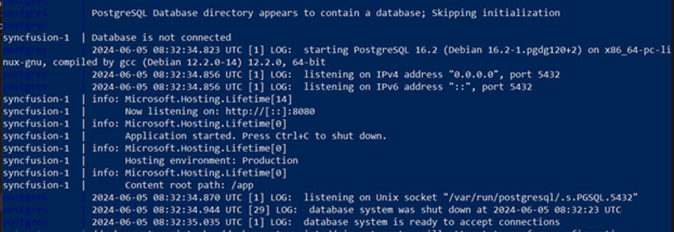

# Docker Image Hosting Guide

We aim to assist developers in reducing deployment time and simplifying the publishing process using Docker images. The [Syncfusion Document Processing API](https://hub.docker.com/r/syncfusion/document-processing-apis) is available as a ready-to-use Docker image for document processing APIs that ensures a seamless experience for Docker users. The following sections will guide you on how to run Docker commands or configure a YAML file for use with Docker Compose.

## Deployment requirement 

### Hardware requirement

The following hardware requirements are necessary to run document processing API
- Operating system - use document processing api Docker int the following operating system
  1. Linux
  2. Windows
  3. MAC
- CPU: 2-core
- Memory: 8GB RAM
- Disk space: 8GB or more

### Software requirements
The following software requirements are necessary to run document processing API
- Database: PostgreSQL 
- Application: [Docker](https://docs.docker.com/engine/) and [Docker Compose](https://docs.docker.com/compose/).
- Web Browser: Microsoft Edge, Mozilla Firefox, and Chrome.

## Steps to configure and run docker container

Step1: Create a docker-compose.yml file with the following configuration, to customize the configuration refer the below link.
[Environment variables of docker image](https://help.syncfusion.com/document-processing/web-apis/environment-variables-of-docker-image).

N> The Document Processing API uses Syncfusion® Document Processing Libraries and requires a valid license key for use in a production environment. To add your valid license key, set the SYNCFUSION_LICENSE_KEY environment variable in the docker-compose.yml file. To generate a valid license key, refer to this [link](https://help.syncfusion.com/document-processing/licensing/licensing-faq/where-can-i-get-a-license-key).

If the license key is not applied, a watermark will be added to the generated PDF documents. The license key is version specific. If you are upgrading the Docker image, you need to update the license key to match the new version.


```
networks:
  network:
    driver: bridge

services:
  syncfusion.api:
    container_name: document_processing
    image: syncfusion/document-processing-apis:latest 
    environment:
      - SYNCFUSION_LICENSE_KEY= {Your key here}     
      - ASPNETCORE_HTTP_PORTS=8080
      - PGHOST=database
      - PGUSER=postgres
      - PGPASSWORD=postgres
      - PGDATABASE=documentprocessing
      - PGPORT=5432
    depends_on:
      - database
    networks:
      - network
    volumes: 
      - ./storage:/FileData
      - ./fonts:/usr/local/share/fonts/
    ports:
      - "8003:8080"

  database:
    container_name: database
    image: postgres:latest
    environment:
      - POSTGRES_USER=postgres
      - POSTGRES_PASSWORD=postgres
      - POSTGRES_DB=documentprocessing
    volumes:
      - ./.containers/products-db:/var/lib/postgresql/data
    networks:
      - network
    ports:
      - "5432:5432"
```

Step2: Run the command below, this command will start the document processing service and Postgres SQL containers and display the logs.

```
docker-compose up -d
```




Step3: After successfully running the server, you'll encounter the following message upon opening the host URL in your browser http://localhost:8003/


**Deployment Options**

You can deploy the APIs as Docker containers on major cloud platforms. Follow the guides below to deploy quickly and efficiently:

- Microsoft Azure
Run the container using Azure Container Instances:
🔗 [Deploy to Azure](https://learn.microsoft.com/en-us/azure/container-instances/container-instances-quickstart)

- Amazon Web Services (AWS)
Deploy the container using Amazon ECS or other services:
🔗 [Deploy to AWS](https://aws.amazon.com/getting-started/hands-on/deploy-docker-containers/)

- Google Cloud Platform (GCP)
Use Google Cloud Run to deploy your containerized API:
🔗 [Deploy to Google Cloud](https://cloud.google.com/run/docs/deploying)