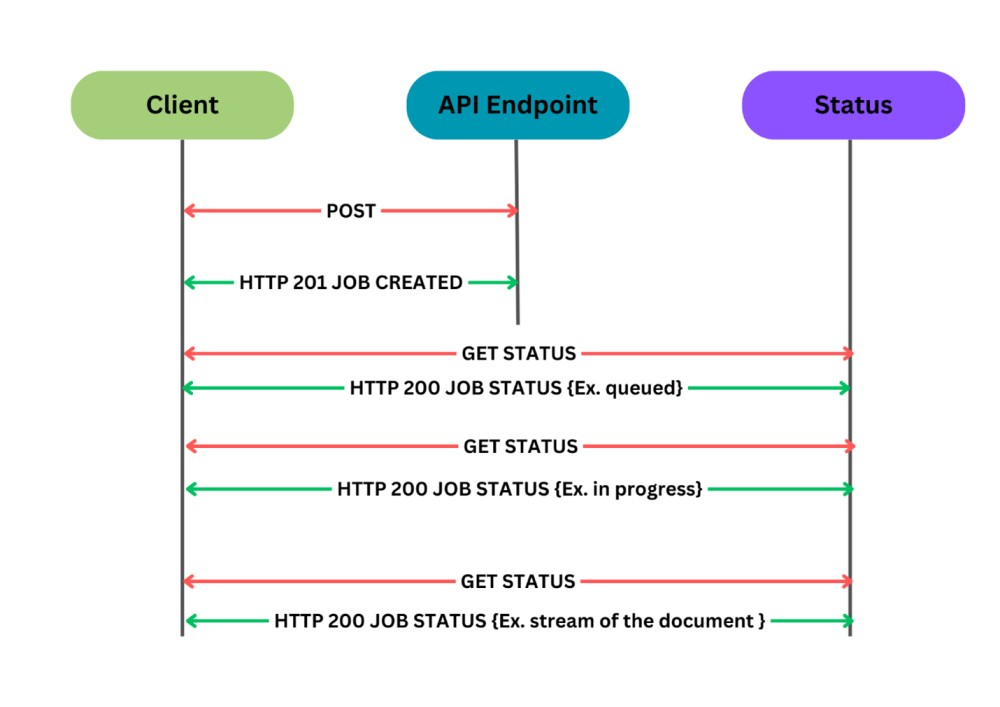

# Workflow of Document Processing Engine API

The document processing engine is designed to handle long-running tasks. A long-running task is an operation that requires a considerable amount of server resources and/or time. To avoid blocking the client, the task is completed asynchronously without a persistent connection between the client and the server.



## The workflow involves following steps:

**Step 1: Request Submission**

The client posts a request to the endpoint with the necessary input files. Once the request is received, a job is assigned to that request and a job ID is sent back to the client as follows:

```
{
    "jobID": "6be827c5-d86d-4fe5-9bd5-c8fd5887a455",
    "status": "requested",
    "createdAt": "2024-05-06T09:39:13.9505828Z"
}
```

**Step 2: Polling for Job Status**

The client continuously polls the status of the job by sending a request to /status/{jobID}. The client will receive the following responses until the job is completed. Once the job is completed, the client will receive the generated document from the same endpoint.

**Possible Status Responses:**

- Queued:

```
{
    "jobId": "6be827c5-d86d-4fe5-9bd5-c8fd5887a455",
    "status": "queued"
}
```
- In Progress:

```
{
    "jobId": "6be827c5-d86d-4fe5-9bd5-c8fd5887a455",
    "status": "in progress"
}
```
- Error:

```
{
    "jobId": "6be827c5-d86d-4fe5-9bd5-c8fd5887a455",
    "status": "errror",
    "code": "500",
    "message": "Failed to convert the document to PDF"        
}
```
**Step 3: Job Completion**

Once the job is completed, you will receive the document as a stream response with the following header parameters:

```
Content-Length: 105982
Content-Type: application/pdf
Content-Disposition: attachment; filename="file.pdf"
Date: Mon, 09 May 2024 12:00:00 GMT
api-supported-versions: 1.0
```
