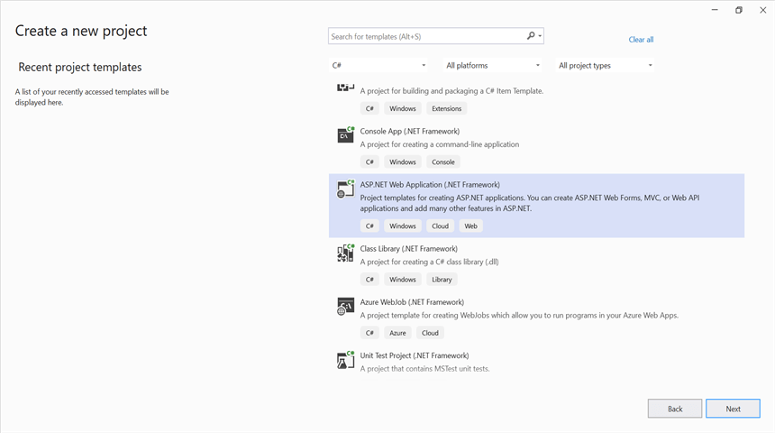
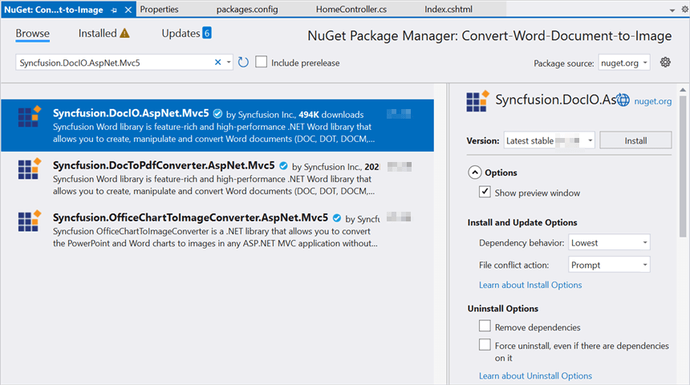
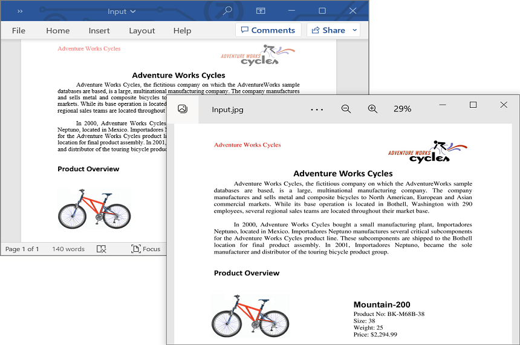
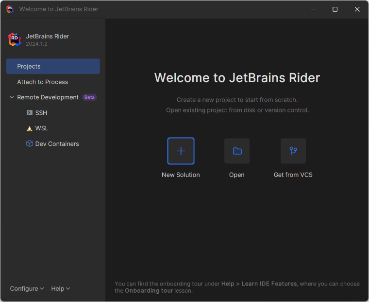
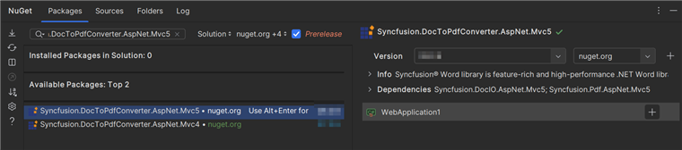
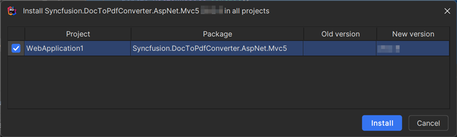

# Convert Word document to Image in ASP.NET MVC

Syncfusion&reg; Essential&reg; DocIO is a [.NET Word library](https://www.syncfusion.com/document-processing/word-framework/net/word-library) used to create, read, edit, and **convert Word documents** programmatically without **Microsoft Word** or interop dependencies. Using this library, you can **convert a Word document to image in ASP.NET MVC**.

## Steps to convert Word document to Image in C#





**Prerequisites:**

* Visual Studio 2022.
* Install **.NET desktop development** workload with necessary .NET Framework SDK.

Step 1: Create a new ASP.NET Web Application project.

Step 2: Select the **MVC** application.

Step 3: Install the [Syncfusion.DocIO.AspNet.Mvc5](https://www.nuget.org/packages/Syncfusion.DocIO.AspNet.Mvc5) NuGet package as a reference to your project from [NuGet.org](https://www.nuget.org/).

N> Starting with v16.2.0.x, if you reference Syncfusion&reg; assemblies from trial setup or from the NuGet feed, you also have to add "Syncfusion.Licensing" assembly reference and include a license key in your projects. Please refer to this [link](https://help.syncfusion.com/common/essential-studio/licensing/overview) to know about registering Syncfusion&reg; license key in your application to use our components.

Step 4: Include the following namespace in that **HomeController.cs** file.





using Syncfusion.DocIO;
using Syncfusion.DocIO.DLS;





Step 5: A default action method named Index will be present in HomeController.cs. Right click on Index method and select **Go To View** where you will be directed to its associated view page **Index.cshtml**.

Step 6: Add a new button in the Index.cshtml as shown below.




@{
    Html.BeginForm("ConvertWordtoImage", "Home", FormMethod.Get);
    {
         
        

            <input type="submit" value="Convert Word to Image" style="width:200px;height:27px" />
        

    }
    Html.EndForm();
}





Step 7: Add the below code snippet in **HomeController.cs** to **convert the Word document to image** and download it.





public void ConvertWordtoImage()
{
    //Open the file as Stream
    using (FileStream docStream = new FileStream(Server.MapPath("~/App_Data/Input.docx"), FileMode.Open, FileAccess.Read))
    {
        //Loads file stream into Word document
        using (WordDocument wordDocument = new WordDocument(docStream, FormatType.Docx))
        {                 
            //Convert the first page of the Word document into an image.
            Image image = wordDocument.RenderAsImages(0, ImageType.Bitmap);
            //Save the image as jpeg. 
            ExportAsImage(image, "WordToImage.Jpeg", ImageFormat.Jpeg, HttpContext.ApplicationInstance.Response);
        }
    }
}
//To download the image file
protected void ExportAsImage(Image image, string fileName, ImageFormat imageFormat, HttpResponse response)
{
    if (ControllerContext == null)
        throw new ArgumentNullException("Context");
    string disposition = "content-disposition";
    response.AddHeader(disposition, "attachment; filename=" + fileName);
    if (imageFormat != ImageFormat.Emf)
        image.Save(Response.OutputStream, imageFormat);
    Response.End();
}





Step 8: Build the project.

Click on Build → Build Solution or press <kbd>Ctrl</kbd>+<kbd>Shift</kbd>+<kbd>B</kbd> to build the project.

Step 9: Run the project.

Click the Start button (green arrow) or press <kbd>F5</kbd> to run the app.

You can download a complete working sample from [GitHub](https://github.com/SyncfusionExamples/DocIO-Examples/tree/main/Word-to-Image-conversion/Convert-Word-to-image/ASP.NET-MVC).

By executing the program, you will get the **image** as follows.





**Prerequisites:**

* JetBrains Rider.
* Install .NET Framework Developer Pack.

Step 1. Open JetBrains Rider and create a new ASP.NET MVC web application project.
* Launch JetBrains Rider.
* Click **New Solution** on the welcome screen.

* In the New Solution dialog, select **Project Type** as **Web**.
* Enter a project name and specify the location.
* Select the target framework as Full Framework and choose the desired version.
* Select **Template** as **Web App**.
* Click create.

Step 2: Install the NuGet package from [NuGet.org](https://www.nuget.org/).
* Click the NuGet icon in the Rider toolbar and type [Syncfusion.DocToPdfConverter.AspNet.Mvc5](https://www.nuget.org/packages/Syncfusion.DocToPdfConverter.AspNet.Mvc5/) in the search bar.
* Ensure that nuget.org is selected as the package source.
* Select the latest Syncfusion.DocToPdfConverter.AspNet.Mvc5 NuGet package from the list.
* Click the + (Add) button to add the package.

* Click the Install button to complete the installation.

N> Starting with v16.2.0.x, if you reference Syncfusion assemblies from trial setup or from the NuGet feed, you also have to add "Syncfusion.Licensing" assembly reference and include a license key in your projects. Please refer to this [link](https://help.syncfusion.com/common/essential-studio/licensing/overview) to know about registering Syncfusion license key in your application to use our components.

Step 3: Include the following namespace in that **HomeController.cs** file.





using Syncfusion.DocIO;
using Syncfusion.DocIO.DLS;





Step 4: A default action method named Index will be present in HomeController.cs. Right click on Index method and select **Go To View** where you will be directed to its associated view page **Index.cshtml**.

Step 5: Add a new button in the Index.cshtml as shown below.




@{
    Html.BeginForm("ConvertWordtoImage", "Home", FormMethod.Get);
    {
         
        

            <input type="submit" value="Convert Word to Image" style="width:200px;height:27px" />
        

    }
    Html.EndForm();
}





Step 6: Add the below code snippet in **HomeController.cs** to **convert the Word document to image** and download it.





public void ConvertWordtoImage()
{
    //Open the file as Stream
    using (FileStream docStream = new FileStream(Server.MapPath("~/App_Data/Input.docx"), FileMode.Open, FileAccess.Read))
    {
        //Loads file stream into Word document
        using (WordDocument wordDocument = new WordDocument(docStream, FormatType.Docx))
        {                 
            //Convert the first page of the Word document into an image.
            Image image = wordDocument.RenderAsImages(0, ImageType.Bitmap);
            //Save the image as jpeg. 
            ExportAsImage(image, "WordToImage.Jpeg", ImageFormat.Jpeg, HttpContext.ApplicationInstance.Response);
        }
    }
}
//To download the image file
protected void ExportAsImage(Image image, string fileName, ImageFormat imageFormat, HttpResponse response)
{
    if (ControllerContext == null)
        throw new ArgumentNullException("Context");
    string disposition = "content-disposition";
    response.AddHeader(disposition, "attachment; filename=" + fileName);
    if (imageFormat != ImageFormat.Emf)
        image.Save(Response.OutputStream, imageFormat);
    Response.End();
}





Step 7: Build the project.

Click the **Build** button in the toolbar or press <kbd>Ctrl</kbd>+<kbd>Shift</kbd>+<kbd>B</kbd> to build the project.

Step 8: Run the project.

Click the **Run** button (green arrow) in the toolbar or press <kbd>F5</kbd> to run the app.

You can download a complete working sample from [GitHub](https://github.com/SyncfusionExamples/DocIO-Examples/tree/main/Word-to-Image-conversion/Convert-Word-to-image/ASP.NET-MVC).

By executing the program, you will get the **image** as follows.





Click [here](https://www.syncfusion.com/document-processing/word-framework/net) to explore the rich set of Syncfusion&reg; Word library (DocIO) features. 

