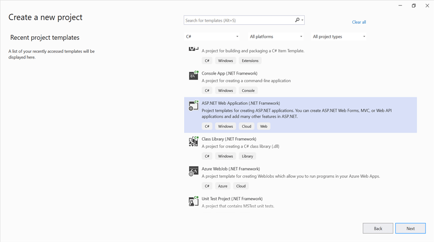

# Convert Word document to Image in ASP.NET

Syncfusion&reg; Essential&reg; DocIO is a [.NET Word library](https://www.syncfusion.com/document-processing/word-framework/net/word-library) used to used to create, read, edit, and **convert Word documents** programmatically without **Microsoft Word** or interop dependencies. Using this library, you can **convert a Word document to image in ASP.NET Web Forms**.

N> This ASP.NET Web Form platform is deprecated, you can use the same product from ASP.NET Core platform. For more information on migrating the .NET Word library from .NET Framework to .NET Core, refer [here](https://help.syncfusion.com/document-processing/word/word-library/net/faqs/migrate-from-net-framework-to-net-core).

## Steps to convert Word document to Image in C#

Step 1: Create a new ASP.NET Web application project.

Step 2: Select the Empty project.

Step 3: Install the [Syncfusion.DocIO.AspNet](https://www.nuget.org/packages/Syncfusion.DocIO.AspNet) NuGet package as a reference to your project from [NuGet.org](https://www.nuget.org/).

N> Starting with v16.2.0.x, if you reference Syncfusion&reg; assemblies from trial setup or from the NuGet feed, you also have to add "Syncfusion.Licensing" assembly reference and include a license key in your projects. Please refer to this [link](https://help.syncfusion.com/common/essential-studio/licensing/overview) to know about registering Syncfusion&reg; license key in your application to use our components.

Step 4: Add a new Web Form in your project. Right click on the project and select **Add > New Item** and add a Web Form from the list. Name it as MainPage.

Step 5: Add a new button in the **MainPage.aspx** as shown below.





<%@ Page Language="C#" AutoEventWireup="true" CodeBehind="MainPage.aspx.cs" Inherits="Convert_Word_Document_to_Image.MainPage" %>

<!DOCTYPE html>
<html xmlns="http://www.w3.org/1999/xhtml">
<head runat="server">
<title></title>
</head>
<body>
    <form id="form1" runat="server">
        

             <asp:Button ID="Button1" runat="server" Text="Convert Word to Image" OnClick="OnButtonClicked" />
        

    </form>
</body>
</html>





Step 6: Include the following namespace in your **MainPage.aspx.cs** file.





using Syncfusion.DocIO;
using Syncfusion.DocIO.DLS;





Step 7: Include the below code snippet in the click event of the button in **MainPage.aspx.cs**, to **convert the Word document to image** and download it.





protected void OnButtonClicked(object sender, EventArgs e)
{
    //Open existing Word document.
    using (FileStream docStream = new FileStream(Server.MapPath("~/App_Data/Input.docx"), FileMode.Open, FileAccess.Read))
    {
        //Loads file stream into Word document
        using (WordDocument wordDocument = new WordDocument(docStream, FormatType.Docx))
        {
            //Convert the first page of the Word document into an image.
            System.Drawing.Image image = wordDocument.RenderAsImages(0, ImageType.Bitmap);
            //Save the image as jpeg.
            ExportAsImage(image, "WordToImage.Jpeg", ImageFormat.Jpeg, HttpContext.Current.Response);
        }
    }
}

//Download the image file
protected void ExportAsImage(System.Drawing.Image image, string fileName, ImageFormat imageFormat, HttpResponse response)
{
    string disposition = "content-disposition";
    response.AddHeader(disposition, "attachment; filename=" + fileName);
    if (imageFormat != ImageFormat.Emf)
        image.Save(Response.OutputStream, imageFormat);
    Response.End();
}





You can download a complete working sample from [GitHub](https://github.com/SyncfusionExamples/DocIO-Examples/tree/main/Word-to-Image-conversion/Convert-Word-to-image/ASP.NET).

By executing the program, you will get the **image** as follows.

Click [here](https://www.syncfusion.com/document-processing/word-framework/net) to explore the rich set of Syncfusion&reg; Word library (DocIO) features. 

An online sample link to [convert Word document to image](https://document.syncfusion.com/demos/word/wordtoimage#/tailwind) in ASP.NET Core. 