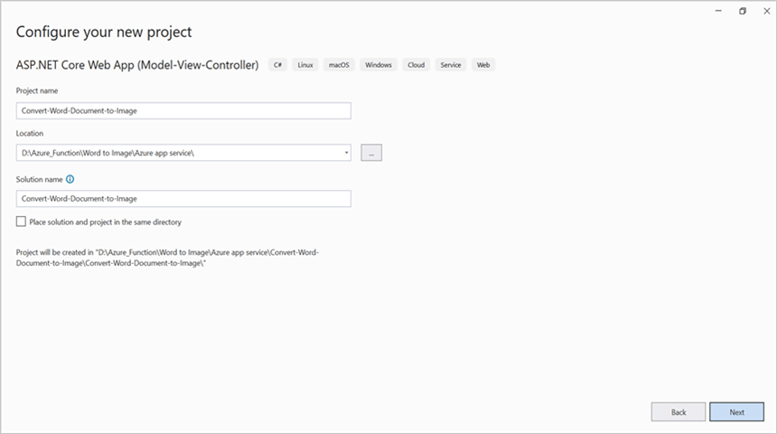
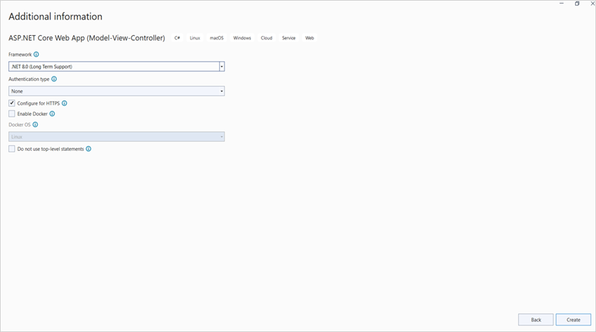
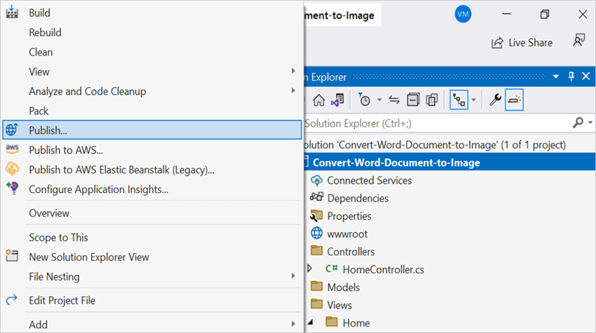
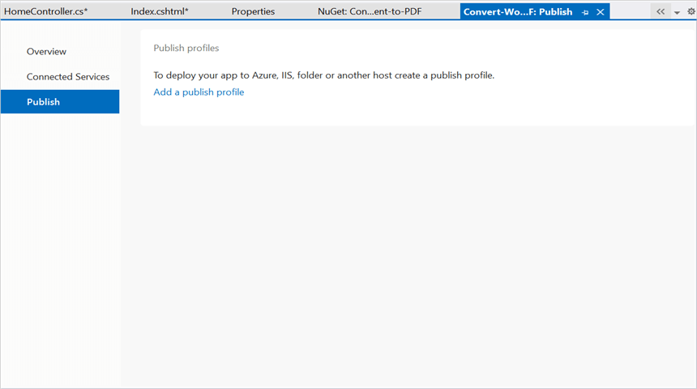
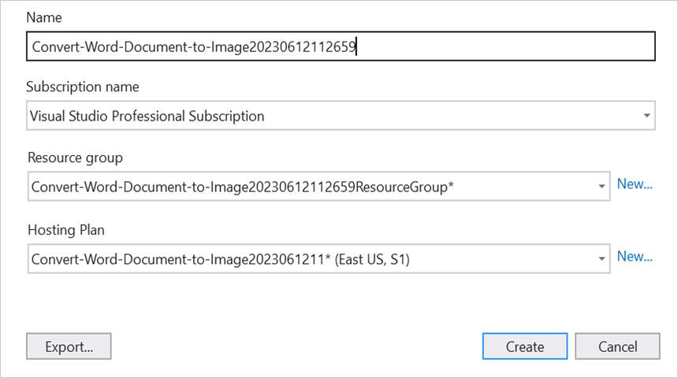
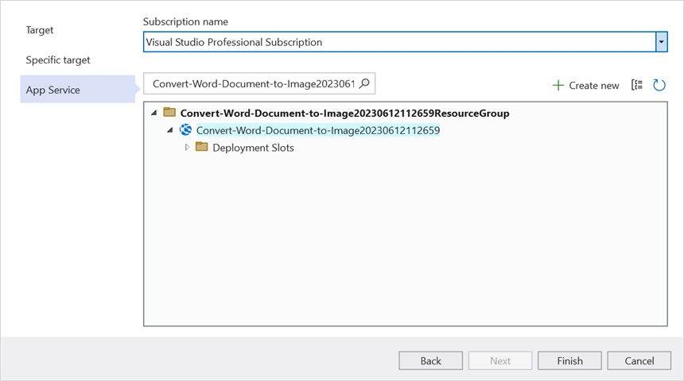
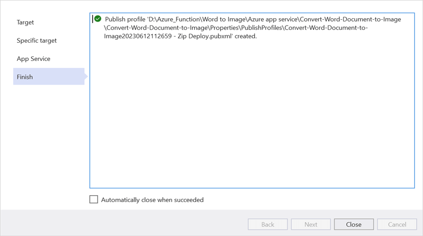
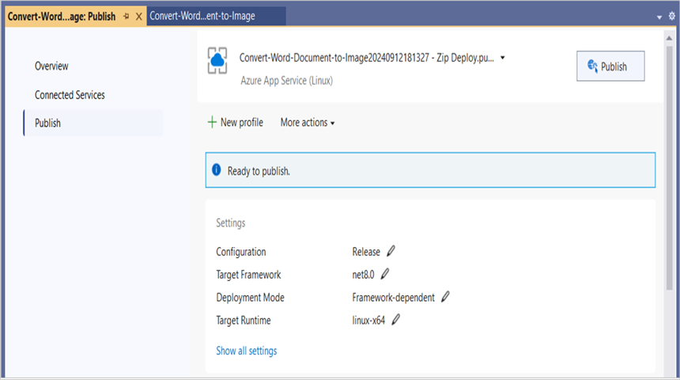
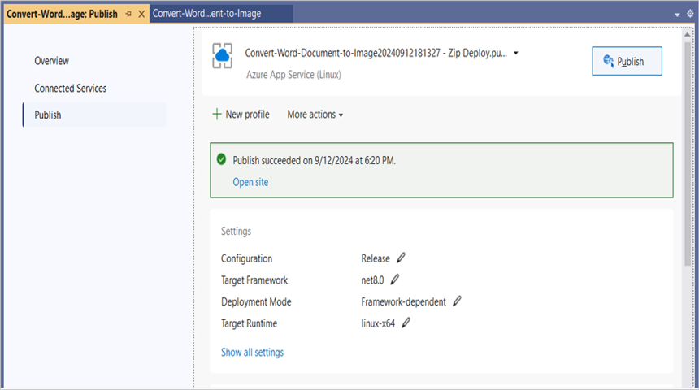
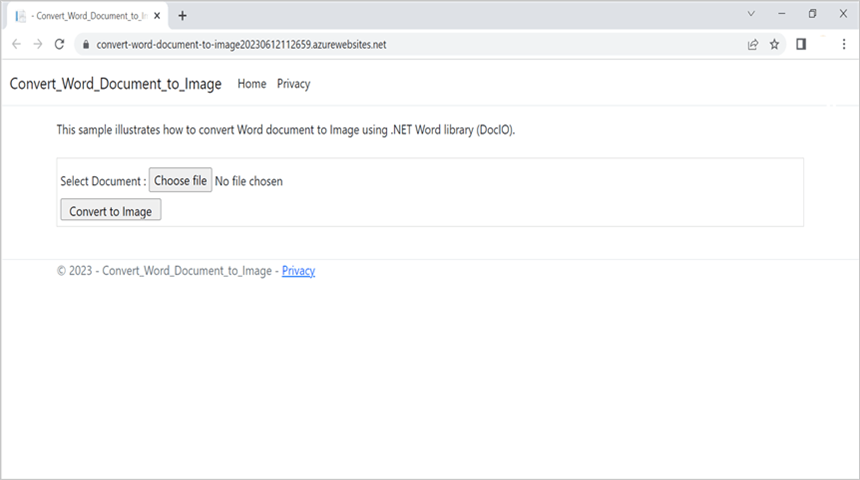

# Convert Word to Image in Azure App Service on Linux

Syncfusion DocIO is a [.NET Core Word library](https://www.syncfusion.com/document-processing/word-framework/net/word-library) used to create, read, edit and **convert Word documents** programmatically without **Microsoft Word** or interop dependencies. Using this library, you can **convert a Word document to image in Azure App Service on Linux**.

## Steps to convert Word document to Image in Azure App Service on Linux

Step 1: Create a new ASP.NET Core Web App (Model-View-Controller).

Step 2: Create a project name and select the location.

Step 3: Click **Create** button.

Step 4: Install the following **Nuget packages** in your application from [Nuget.org](https://www.nuget.org/).

* [Syncfusion.DocIORenderer.Net.Core](https://www.nuget.org/packages/Syncfusion.DocIORenderer.Net.Core) 
* [SkiaSharp.NativeAssets.Linux v2.88.6](https://www.nuget.org/packages/SkiaSharp.NativeAssets.Linux/2.88.6)
* [HarfBuzzSharp.NativeAssets.Linux v7.3.0](https://www.nuget.org/packages/HarfBuzzSharp.NativeAssets.Linux/7.3.0)

 
 
 

N> Starting with v16.2.0.x, if you reference Syncfusion assemblies from trial setup or from the NuGet feed, you also have to add "Syncfusion.Licensing" assembly reference and include a license key in your projects. Please refer to this [link](https://help.syncfusion.com/common/essential-studio/licensing/overview) to know about registering Syncfusion license key in your application to use our components.

Step 5: Add a new button in the **Index.cshtml** as shown below.




@{Html.BeginForm("WordToImage", "Home", FormMethod.Post, new { enctype = "multipart/form-data" });
{
    

        

            

                This sample illustrates how to convert Word document to image using .NET Word library (DocIO).
            

            &nbsp;
            
             
                

                    

                        Select Document :
                        @Html.TextBox("file", "", new { type = "file", accept = ".docx" })  
                    

                    

                    <input class="buttonStyle" type="submit" value="Convert to Image" name="button" style="width:150px;height:27px" />
                     
                    

                        @ViewBag.Message
                    

                

            

        

         
      

    

    Html.EndForm();
    }
}




Step 6: Include the following namespaces in **HomeController.cs**.





using Syncfusion.DocIO;
using Syncfusion.DocIO.DLS;
using Syncfusion.DocIORenderer;





Step 7: Include the below code snippet in **HomeController.cs** for **convert the Word document to image**. 





private Microsoft.AspNetCore.Hosting.IHostingEnvironment _env;
public HomeController(Microsoft.AspNetCore.Hosting.IHostingEnvironment env)
{
    _env = env;
}

/// 

/// Convert Word document to image
/// 

/// <param name="button"></param>
/// <returns></returns>
public IActionResult WordToImage(string button)
{
    if (button == null)
        return View("Index");

    if (Request.Form.Files != null)
    {
        if (Request.Form.Files.Count == 0)
        {
            ViewBag.Message = string.Format("Browse a Word document and then click the button to convert as a Image");
             return View("Index");
        }
        // Gets the extension from file.
        string extension = Path.GetExtension(Request.Form.Files[0].FileName).ToLower();
        // Compares extension with supported extensions.
        if (extension == ".docx")
        {
            MemoryStream stream = new MemoryStream();
            Request.Form.Files[0].CopyTo(stream);
            try
            {
                //Open using Syncfusion
                using (WordDocument document = new WordDocument(stream, FormatType.Docx))
                {
                    stream.Dispose();
                    // Creates a new instance of DocIORenderer class.
                    using (DocIORenderer render = new DocIORenderer())
                    {

                        //Convert the first page of the Word document into an image.
                        Stream imageStream = document.RenderAsImages(0, ExportImageFormat.Jpeg);
                        //Reset the stream position.
                        imageStream.Position = 0;
                        //Save the image file.
                        return File(imageStream, "application/jpeg", "WordToImage.Jpeg");
                    }
                }
            }
            catch (Exception ex)
            {
                ViewBag.Message = ex.ToString();
            }
        }
        else
        {
            ViewBag.Message = string.Format("Please choose Word format document to convert to image");
        }
    }
    else
    {
        ViewBag.Message = string.Format("Browse a Word document and then click the button to convert as a image document");
    }
    return View("Index");
}





## Steps to publish as Azure App Service on Linux

Step 1: Right-click the project and select **Publish** option.

Step 2: Click the **Add a Publish Profile** button.

Step 3: Select the publish target as **Azure**.

Step 4: Select the Specific target as **Azure App Service (Linux)**.

Step 5: To create a new app service, click **Create new** option.

Step 6: Click the **Create** button to proceed with **App Service** creation.

Step 7: Click the **Finish** button to finalize the **App Service** creation.

Step 8: Click **Close** button.

Step 9: Click the **Publish** button.

Step 10: Now, Publish has been succeeded.

Step 11: Now, the published webpage will open in the browser. 

Step 12: Select the Word document and Click **Convert to Image** to convert the given Word document to a image.You will get the output **image** as follows.

You can download a complete working sample from [GitHub](https://github.com/SyncfusionExamples/DocIO-Examples/tree/main/Word-to-Image-conversion/Convert-Word-to-image/Azure/Azure_App_Service).

Click [here](https://www.syncfusion.com/document-processing/word-framework/net-core) to explore the rich set of Syncfusion Word library (DocIO) features. 

An online sample link to [convert Word document to image](https://ej2.syncfusion.com/aspnetcore/Word/WordToImage#/material3) in ASP.NET Core. 
