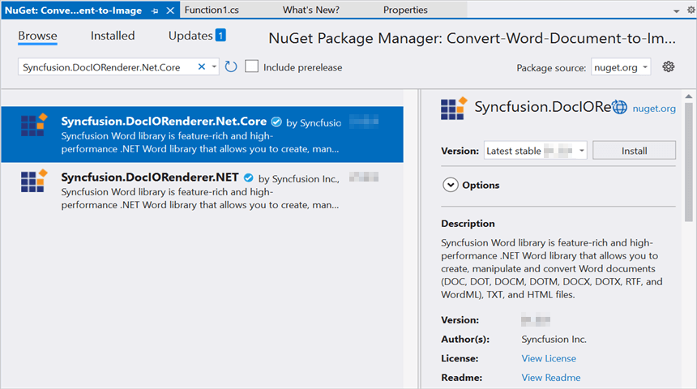
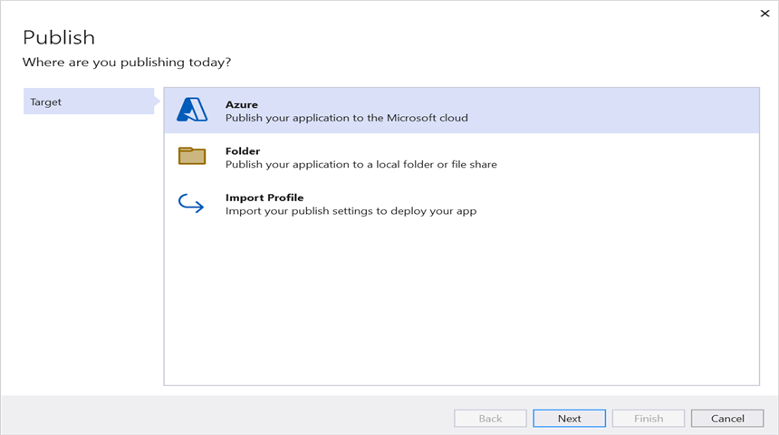

# Convert Word document to Image in Azure Functions v4

Syncfusion&reg; DocIO is a [.NET Core Word library](https://www.syncfusion.com/document-processing/word-framework/net/word-library) used to create, read, edit, and **convert Word documents** programmatically without **Microsoft Word** or interop dependencies. Using this library, you can **convert a Word document to image in Azure Functions v4**.

## Steps to convert a Word document to Image in Azure Functions v4

Step 1: Create a new Azure Functions project.

Step 2: Create a project name and select the location.

Step 3: Select function worker as **.NET 8.0(Long Term Support)**.

Step 4: Install the [Syncfusion.DocIORenderer.Net.Core](https://www.nuget.org/packages/Syncfusion.DocIORenderer.Net.Core) NuGet package as a reference to your project from [NuGet.org](https://www.nuget.org/).

N> Starting with v16.2.0.x, if you reference Syncfusion&reg; assemblies from trial setup or from the NuGet feed, you also have to add "Syncfusion.Licensing" assembly reference and include a license key in your projects. Please refer to this [link](https://help.syncfusion.com/common/essential-studio/licensing/overview) to know about registering Syncfusion&reg; license key in your application to use our components.

Step 5: Include the following namespaces in the **Function1.cs** file.



using Syncfusion.DocIO;
using Syncfusion.DocIO.DLS;
using Syncfusion.DocIORenderer;




Step 6: Add the following code snippet in **Run** method of **Function1** class to perform **convert Word to image** in Azure Functions and return the resultant **image** to client end.





//Gets the input Word document as stream from request
Stream stream = req.Content.ReadAsStreamAsync().Result;
//Loads an existing Word document
using (WordDocument document = new WordDocument(stream, FormatType.Docx))
{
    //Creates an instance of the DocIORenderer
    using (DocIORenderer render = new DocIORenderer())
    {
        Stream imageStream = document.RenderAsImages(0, ExportImageFormat.Jpeg);
        //Reset the stream position.
        imageStream.Position = 0;
        MemoryStream memoryStream = new MemoryStream();
        //Saves the image file 
        imageStream.CopyTo(memoryStream);
        //Reset the memory stream position
        memoryStream.Position = 0;
        //Create the response to return
        HttpResponseMessage response = new HttpResponseMessage(HttpStatusCode.OK);
        //Set the Word document saved stream as content of response
        response.Content = new ByteArrayContent(memoryStream.ToArray());
        //Set the contentDisposition as attachment
        response.Content.Headers.ContentDisposition = new ContentDispositionHeaderValue("attachment")
        {
            FileName = "WordToImage.Jpeg"
        };
        //Set the content type as Word document mime type
        response.Content.Headers.ContentType = new System.Net.Http.Headers.MediaTypeHeaderValue("application/jpeg");
        //Return the response with output Word document stream
        return response;
    }
}





Step 7: Right click the project and select **Publish**. Then, create a new profile in the Publish Window.

Step 8: Select the target as **Azure** and click **Next** button.

Step 9: Select the **Create new** button.

Step 10: Click **Create** button. 

Step 11: After creating app service then click **Finish** button. 

Step 12: Click the **Publish** button.

Step 13: Publish has been succeed.

Step 14: Now, go to Azure portal and select the App Services. After running the service, click **Get function URL by copying it**. Then, paste it in the below client sample (which will request the Azure Functions, to perform **Word to image conversion** using the template Word document). You will get the output **image** as follows.

## Steps to post the request to Azure Functions

Step 1: Create a console application to request the Azure Functions API.

Step 2: Add the following code snippet into **Main** method to post the request to Azure Functions with template Word document and get the resultant **image** document.




//Reads the template Word document.
FileStream fs = new FileStream("Input.docx", FileMode.Open, FileAccess.ReadWrite, FileShare.ReadWrite);
fs.Position = 0;
//Saves the Word document in memory stream.
MemoryStream inputStream = new MemoryStream();
fs.CopyTo(inputStream);
inputStream.Position = 0;
try
{
    Console.WriteLine("Please enter your Azure Functions URL :");
    string functionURL = Console.ReadLine();
    //Create HttpWebRequest with hosted azure functions URL.                
    HttpWebRequest req = (HttpWebRequest)WebRequest.Create(functionURL);
    //Set request method as POST
    req.Method = "POST";
    //Get the request stream to save the Word document stream
    Stream stream = req.GetRequestStream();
    //Write the Word document stream into request stream
    stream.Write(inputStream.ToArray(), 0, inputStream.ToArray().Length);
    //Gets the responce from the Azure Functions.
    HttpWebResponse res = (HttpWebResponse)req.GetResponse();
    //Saves the image stream.
    FileStream fileStream = File.Create("WordToImage.Jpeg");
    res.GetResponseStream().CopyTo(fileStream);
    //Dispose the streams
    inputStream.Dispose();
    fileStream.Dispose();
}
catch (Exception ex)
{
    throw;
}




From GitHub, you can download the [console application](https://github.com/SyncfusionExamples/DocIO-Examples/tree/main/Word-to-Image-conversion/Convert-Word-to-image/Azure/Azure_Functions/Console_Application) and [Azure Functions v4](https://github.com/SyncfusionExamples/DocIO-Examples/tree/main/Word-to-Image-conversion/Convert-Word-to-image/Azure/Azure_Functions/Azure_Functions_v4).

Click [here](https://www.syncfusion.com/document-processing/word-framework/net-core) to explore the rich set of Syncfusion&reg; Word library (DocIO) features. 

An online sample link to [convert Word document to image](https://ej2.syncfusion.com/aspnetcore/Word/WordToImage#/material3) in ASP.NET Core. 

