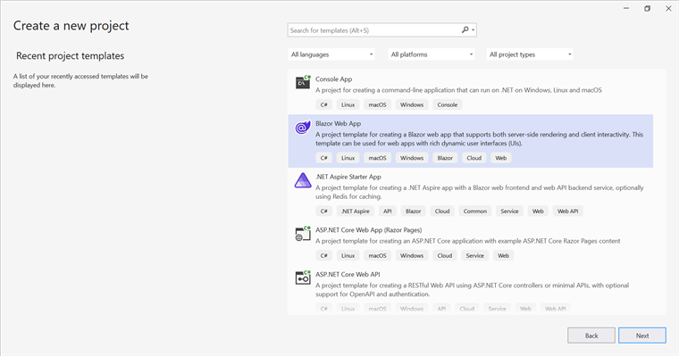
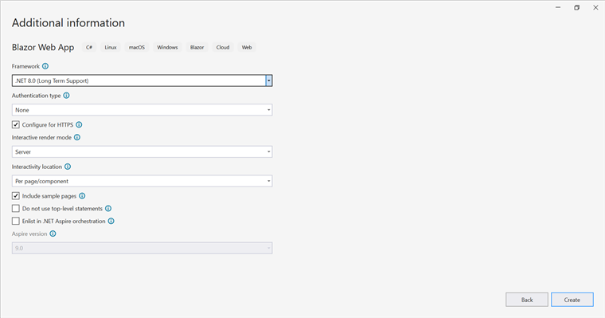

# Convert Word Document to Image in Blazor

Syncfusion&reg; DocIO is a [Blazor Word library](https://www.syncfusion.com/document-processing/word-framework/blazor/word-library) used to create, read, edit, and **convert Word documents** programmatically without **Microsoft Word** or interop dependencies. Using this library, a **convert a Word document to image in Blazor**.

## Word to Image in Blazor Web App Server Application

**Prerequisites:**

*   Visual Studio 2022.
*   Install [.NET 8 SDK](https://dotnet.microsoft.com/en-us/download/dotnet/8.0) or later.

Step 1: Create a new C# Blazor Web app project.
*   Select "Blazor Web App" from the template and click **Next**.

*   Name the project and click **Next**.

*   Select the framework and click **Create** button.

Step 2: Install the `Syncfusion.DocIORenderer.Net.Core` NuGet package.
To **convert a Word document to image in Web App Server**, install [Syncfusion.DocIORenderer.Net.Core](https://www.nuget.org/packages/Syncfusion.DocIORenderer.Net.Core) into the Blazor project.

N> 1. If deploying the application in a Linux environment, refer to the [documentation](https://help.syncfusion.com/document-processing/word/conversions/word-to-image/net/nuget-packages-required-word-to-image#additional-nuget-packages-required-for-linux) for the required additional NuGet packages.
N> 2. Starting with v16.2.0.x, if Syncfusion&reg; assemblies are referenced from trial setup or from the NuGet feed, the "Syncfusion.Licensing" assembly reference must also be added and a license key included in projects. Refer to this [link](https://help.syncfusion.com/common/essential-studio/licensing/overview) to know about registering Syncfusion&reg; license key in an application to use Syncfusion components.

Step 3: Create a Razor file named `DocIO.razor` in the `Pages` folder, which is located inside the `Components` folder.
Include the following namespaces in the file:




@rendermode InteractiveServer
@page "/DocIO"
@using System.IO;
@using Convert_Word_Document_to_Image;
@inject Convert_Word_Document_to_Image.Data.WordService service
@inject Microsoft.JSInterop.IJSRuntime JS




Step 4: Add a button to `DocIO.razor`.
Include the following code to create a new button that triggers the Word to Image conversion:




<h2>Syncfusion DocIO Library </h2>

The Syncfusion DocIO library is a Blazor DocIO library used to create, read, edit, and convert Word files in applications without Microsoft Office dependencies.

<button class="btn btn-primary" @onclick="@ConvertWordtoImage">Convert Word to Image</button>




Step 5: Implement `ConvertWordtoImage` method in `DocIO.razor`.
Add the following code to convert the Word document to an image and download it:



@code {
    MemoryStream documentStream;
    /// 

    /// Convert Word to image and download the image file
    /// 

    protected async void ConvertWordtoImage()
    {
        documentStream = service.ConvertWordtoImage();
        await JS.SaveAs("WordToImage.Jpeg", documentStream.ToArray());
    }
}



Step 6: Create a new cs file `WordService.cs` in the `Data` folder.
Include the following namespaces in the file:





using Syncfusion.DocIO;
using Syncfusion.DocIO.DLS;
using Syncfusion.DocIORenderer;





Step 7: Implement the `ConvertWordtoImage` method in `WordService.cs`.
Create a new `MemoryStream` method named `ConvertWordtoImage` in the `WordService` class, and include the following code snippet to **convert a Word document to an image** Web App Server:									





// Open the file as Stream
using (FileStream sourceStreamPath = new FileStream(@"wwwroot/Template.docx", FileMode.Open, FileAccess.Read, FileShare.ReadWrite))
{
    // Open an existing Word document.
    using (WordDocument document = new WordDocument(sourceStreamPath, FormatType.Docx))
    {
        // Instantiation of DocIORenderer for Word to image conversion
        using (DocIORenderer render = new DocIORenderer())
        {
            Stream imageStream = document.RenderAsImages(0, ExportImageFormat.Jpeg);
            // Reset the stream position.
            imageStream.Position = 0;
            return (MemoryStream)imageStream;
        }
    }
}





Step 8: Add the service in `Program.cs`.
Add the following line to the `Program.cs` file to register `WordService` as a scoped service in the Blazor application.




builder.Services.AddScoped<Convert_Word_Document_to_Image.Data.WordService>();




Step 9: Create `FileUtils.cs` for JavaScript interoperability.
Create a new class file named `FileUtils` in the project and add the following code to invoke the JavaScript action for file download in the browser.





public static class FileUtils
{
    public static ValueTask<object> SaveAs(this IJSRuntime js, string filename, byte[] data)
    => js.InvokeAsync<object>(
           "saveAsFile",
           filename,
           Convert.ToBase64String(data));
}




Step 10: Add JavaScript function to `App.razor`.
Add the following JavaScript function in the `App.razor` file located in the `Pages` folder.









Step 11: Add navigation link.
Add the following code snippet to the Navigation menu's Razor file in the `Shared` folder.





    <NavLink class="nav-link" href="docio">
         Convert Word to Image
    </NavLink>





Step 12: Build the project.

Click on **Build** → **Build Solution** or press <kbd>Ctrl</kbd>+<kbd>Shift</kbd>+<kbd>B</kbd> to build the project.

Step 13: Run the project.

Click the Start button (green arrow) or press <kbd>F5</kbd> to run the application.

A complete working sample is available on [GitHub](https://github.com/SyncfusionExamples/DocIO-Examples/tree/main/Word-to-Image-conversion/Convert-Word-to-image/Blazor/Blazor-Web-Server-app).

Upon executing the program, the **image** will be generated as follows.

Click [here](https://www.syncfusion.com/document-processing/word-framework/blazor) to explore the rich set of Syncfusion&reg; Word library (DocIO) features.

## Word to Image in Blazor WASM Standalone Application

**Prerequisites:**

*   Visual Studio 2022.
*   Install [.NET 8 SDK](https://dotnet.microsoft.com/en-us/download/dotnet/8.0) or later.

Step 1: Create a new C# Blazor WASM app project.
Select "Blazor WebAssembly App" from the template and click the **Next** button.

Step 2: Install the following **Nuget packages** in application from [Nuget.org](https://www.nuget.org/).
* [Syncfusion.DocIORenderer.Net.Core](https://www.nuget.org/packages/Syncfusion.DocIORenderer.Net.Core)
* [SkiaSharp.Views.Blazor v3.116.1](https://www.nuget.org/packages/SkiaSharp.Views.Blazor/3.116.1)

N> 1. If deploying the application in a Linux environment, refer to the [documentation](https://help.syncfusion.com/document-processing/word/conversions/word-to-image/net/nuget-packages-required-word-to-image#additional-nuget-packages-required-for-linux) for the required additional NuGet packages.
N> 2. Starting with v16.2.0.x, if Syncfusion&reg; assemblies are referenced from trial setup or from the NuGet feed, the "Syncfusion.Licensing" assembly reference must also be added and a license key included in projects. Refer to this [link](https://help.syncfusion.com/common/essential-studio/licensing/overview) to know about registering Syncfusion&reg; license key in an application to use Syncfusion components.
N> 3. Install this wasm-tools and wasm-tools-net6 by using the "dotnet workload install wasm-tools" and "dotnet workload install wasm-tools-net6" commands in your command prompt respectively if you are facing issues related to Skiasharp during runtime. After installing wasm tools using the above commands, please restart your machine.

Step 3: Create a Razor file named `DocIO.razor` in the `Pages` folder.
Add the following namespaces in the file:




@page "/docio"
@using Syncfusion.DocIO
@using Syncfusion.DocIORenderer
@using Syncfusion.DocIO.DLS
@inject Microsoft.JSInterop.IJSRuntime JS
@inject HttpClient client




Step 4: Add a button to `DocIO.razor`.
Add the following code to create a new button that triggers the Word to Image conversion:





<h2>Syncfusion DocIO Library (Essential DocIO)</h2>

The Syncfusion Blazor DocIO library (Essential DocIO) used to create, read, edit, and convert DocIO files in your applications without Microsoft Office dependencies.

<button class="btn btn-primary" @onclick="@WordToImage">Convert Word to Image</button>





Step 5: Implement `WordToImage` method in `DocIO.razor`.
Create a new `async` method named `WordToImage` and include the following code snippet to **convert a Word document to image in Blazor** WASM Standalone app.





//Open the file as Stream
using (FileStream sourceStreamPath = new FileStream(@"wwwroot/Template.docx", FileMode.Open, FileAccess.Read, FileShare.ReadWrite))
{
    // Open an existing Word document.
    using (WordDocument document = new WordDocument(sourceStreamPath, FormatType.Docx))
    {
        // Instantiation of DocIORenderer for Word to image conversion
        using (DocIORenderer render = new DocIORenderer())
        {
            MemoryStream imageStream = (MemoryStream)document.RenderAsImages(0, ExportImageFormat.Jpeg);
            // Reset the stream position.
            imageStream.Position = 0;
            // Download image file in the browser.
            await JS.SaveAs("WordToImage.Jpeg", imageStream.ToArray());
        }
    }
}





Step 6: Create `FileUtils.cs` for JavaScript interoperability.
Create a class file named `FileUtils` and add the following code to invoke the JavaScript action for file download in the browser.





public static class FileUtils
{
    public static ValueTask<object> SaveAs(this IJSRuntime js, string filename, byte[] data)
        => js.InvokeAsync<object>(
            "saveAsFile",
            filename,
            Convert.ToBase64String(data));
}





Step 7: Add JavaScript function to `index.html`.
Add the following JavaScript function in the `index.html` file present under `wwwroot`.









Step 8: Add navigation link.
Add the following code snippet to the Navigation menu's Razor file in the `Shared` folder.





 

    <NavLink class="nav-link" href="docio">
         Word to Image
    </NavLink>





Step 9: Build the project.

Click on **Build** → **Build Solution** or press <kbd>Ctrl</kbd>+<kbd>Shift</kbd>+<kbd>B</kbd> to build the project.

Step 10: Run the project.

Click the Start button (green arrow) or press <kbd>F5</kbd> to run the application.

A complete working sample is available on [GitHub](https://github.com/SyncfusionExamples/DocIO-Examples/tree/main/Word-to-Image-conversion/Convert-Word-to-image/Blazor/Blazor-WASM-Standalone-app).

Upon executing the program, the **image** will be generated as follows.

N> To convert Word to image, it is necessary to access the font stream internally. However, this cannot be done automatically in a Blazor WASM application. Therefore, it is recommended to use a Server app, even though Word to image conversion works in a WASM Standalone app.

Click [here](https://www.syncfusion.com/document-processing/word-framework/blazor) to explore the rich set of Syncfusion&reg; Word library (DocIO) features. 
 
