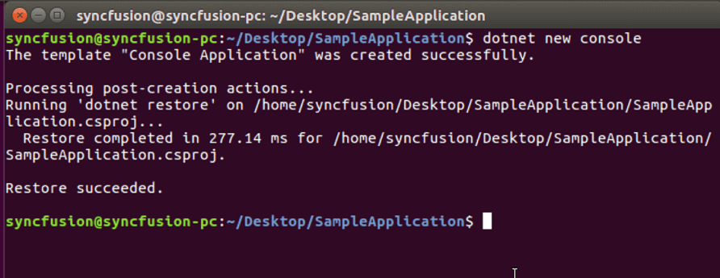
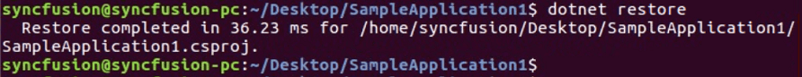
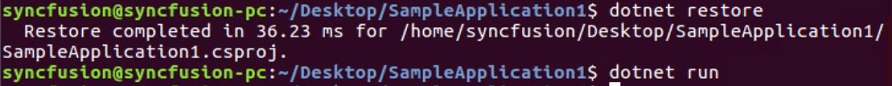
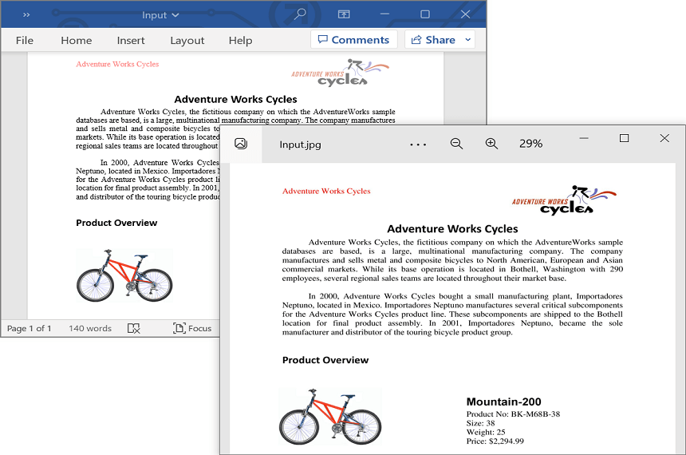
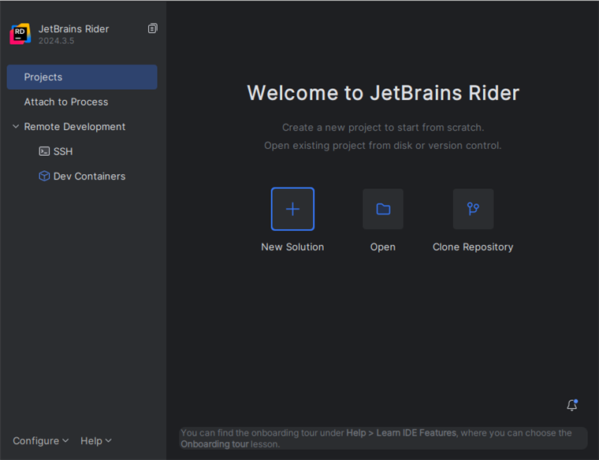
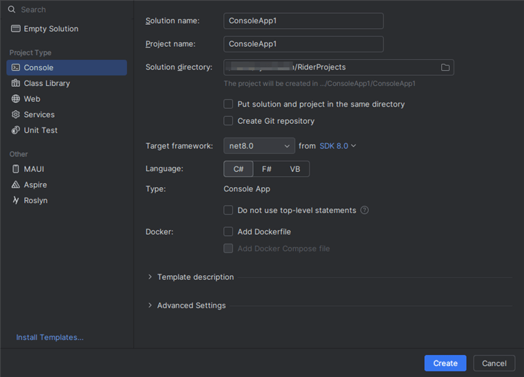
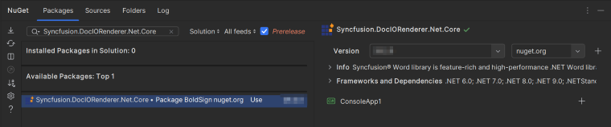
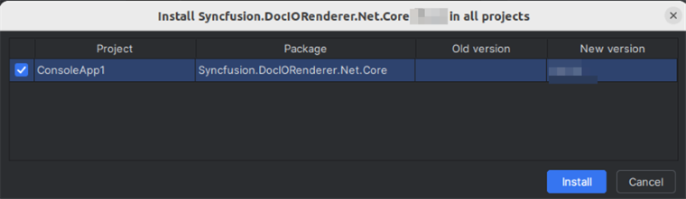

# Convert Word document to Image in Linux

Syncfusion DocIO is a [.NET Core Word library](https://www.syncfusion.com/document-processing/word-framework/net-core/word-library) used to create, read, edit, and **convert Word documents** programmatically without **Microsoft Word** or interop dependencies. Using this library, you can **convert a Word document to image in .NET Core application on Linux**.

## Steps to convert a Word document to Image in .NET Core application on Linux





**Prerequisites:**

* Visual Studio 2022.
* Install [.NET 8 SDK](https://dotnet.microsoft.com/en-us/download/dotnet/8.0) or later.

Step 1: Execute the following command in **Linux terminal** to create a new .NET Core Console application.




dotnet new console




Step 2: Install the following **Nuget packages** in your application from [Nuget.org](https://www.nuget.org/) by execute the following command.

* [Syncfusion.DocIORenderer.Net.Core](https://www.nuget.org/packages/Syncfusion.DocIORenderer.Net.Core) 
* [SkiaSharp.NativeAssets.Linux v3.116.1](https://www.nuget.org/packages/SkiaSharp.NativeAssets.Linux/3.116.1)
* [HarfBuzzSharp.NativeAssets.Linux v8.3.0.1](https://www.nuget.org/packages/HarfBuzzSharp.NativeAssets.Linux/8.3.0.1)




dotnet add package Syncfusion.DocIORenderer.Net.Core -v 22.1.34 -s https://www.nuget.org/
dotnet add package SkiaSharp.NativeAssets.Linux -v 3.116.1 -s https://www.nuget.org/
dotnet add package HarfBuzzSharp.NativeAssets.Linux -v 8.3.0.1 -s https://www.nuget.org/




N> 1. For other Linux environments, refer to the [documentation](https://help.syncfusion.com/document-processing/word/conversions/word-to-image/net/nuget-packages-required-word-to-image#additional-nuget-packages-required-for-linux) for detailed information on the additional NuGet packages required. 
N> 2. Starting with v16.2.0.x, if you reference Syncfusion&reg; assemblies from trial setup or from the NuGet feed, you also have to add "Syncfusion.Licensing" assembly reference and include a license key in your projects. Please refer to this [link](https://help.syncfusion.com/common/essential-studio/licensing/overview) to know about registering Syncfusion&reg; license key in your applications to use our components.

Step 3: Add the following Namespaces in **Program.cs** file.




using Syncfusion.DocIO;
using Syncfusion.DocIO.DLS;
using Syncfusion.DocIORenderer;




Step 4: Add the following code snippet in **Program.cs** file.




//Open the file as Stream
using (FileStream docStream = new FileStream("Data/Input.docx", FileMode.Open, FileAccess.Read))
{
    //Loads an existing Word document
    using (WordDocument wordDocument = new WordDocument(docStream, FormatType.Docx))
    {
        //Instantiation of DocIORenderer for Word to image conversion
        using (DocIORenderer render = new DocIORenderer())
        {
            //Convert the first page of the Word document into an image.
            Stream imageStream = wordDocument.RenderAsImages(0, ExportImageFormat.Jpeg);
            //Reset the stream position.
            imageStream.Position = 0;
            //Create FileStream to save the image file.
            using (FileStream fileStreamOutput = new FileStream("WordToImage.Jpeg", FileMode.Create, FileAccess.ReadWrite, FileShare.ReadWrite))
            {
                imageStream.CopyTo(fileStreamOutput);
            }
        }
    }
}




Step 5: Execute the following command to **restore** the NuGet packages.




dotnet restore




Step 6: Execute the following command in **terminal** to **run the application**.




dotnet run




You can download a complete working sample from [GitHub](https://github.com/SyncfusionExamples/DocIO-Examples/tree/main/Word-to-Image-conversion/Convert-Word-to-image/Linux/Convert-Word-Document-to-Image).

By executing the program, you will get the **image** as follows. The output will be saved in parallel to program.cs file.





**Prerequisites:**

* JetBrains Rider.
* Install .NET 8 SDK or later.

Step 1: Open JetBrains Rider and create a new .NET Core console application project.
* Launch JetBrains Rider.
* Click **New Solution** on the welcome screen.

* In the New Solution dialog, select **Project Type** as **Console**.
* Select the target framework (e.g., .NET 8.0, .NET 9.0).
* Enter a project name and specify the location.
* Click create.

Step 2: Install the NuGet package from [NuGet.org](https://www.nuget.org/).
* Click the NuGet icon in the Rider toolbar and type [Syncfusion.DocIORenderer.Net.Core](https://www.nuget.org/packages/Syncfusion.DocIORenderer.Net.Core) in the search bar.
* Ensure that nuget.org is selected as the package source.
* Select the latest Syncfusion.DocIORenderer.Net.Core NuGet package from the list.
* Click the + (Add) button to add the package.

* Click the **Install** button to complete the installation.

N> 1. For other Linux environments, refer to the [documentation](https://help.syncfusion.com/document-processing/word/conversions/word-to-image/net/nuget-packages-required-word-to-image#additional-nuget-packages-required-for-linux) for detailed information on the additional NuGet packages required. 
N> 2. Starting with v16.2.0.x, if you reference Syncfusion&reg; assemblies from trial setup or from the NuGet feed, you also have to add "Syncfusion.Licensing" assembly reference and include a license key in your projects. Please refer to this [link](https://help.syncfusion.com/common/essential-studio/licensing/overview) to know about registering Syncfusion&reg; license key in your applications to use our components.

Step 3: Add the following Namespaces in **Program.cs** file.




using Syncfusion.DocIO;
using Syncfusion.DocIO.DLS;
using Syncfusion.DocIORenderer;




Step 4: Add the following code snippet in **Program.cs** file.




//Open the file as Stream
using (FileStream docStream = new FileStream("Data/Input.docx", FileMode.Open, FileAccess.Read))
{
    //Loads an existing Word document
    using (WordDocument wordDocument = new WordDocument(docStream, FormatType.Docx))
    {
        //Instantiation of DocIORenderer for Word to image conversion
        using (DocIORenderer render = new DocIORenderer())
        {
            //Convert the first page of the Word document into an image.
            Stream imageStream = wordDocument.RenderAsImages(0, ExportImageFormat.Jpeg);
            //Reset the stream position.
            imageStream.Position = 0;
            //Create FileStream to save the image file.
            using (FileStream fileStreamOutput = new FileStream("WordToImage.Jpeg", FileMode.Create, FileAccess.ReadWrite, FileShare.ReadWrite))
            {
                imageStream.CopyTo(fileStreamOutput);
            }
        }
    }
}




Step 5: Build the project.

Click the **Build** button in the toolbar or press <kbd>Ctrl</kbd>+<kbd>Shift</kbd>+<kbd>B</kbd> to build the project.

Step 6: Run the project.

Click the **Run** button (green arrow) in the toolbar or press <kbd>F5</kbd> to run the app.

You can download a complete working sample from [GitHub](https://github.com/SyncfusionExamples/DocIO-Examples/tree/main/Word-to-Image-conversion/Convert-Word-to-image/Linux/Convert-Word-Document-to-Image).

By executing the program, you will get the **image** as follows. The output will be saved in parallel to program.cs file.





Click [here](https://www.syncfusion.com/document-processing/word-framework/net-core) to explore the rich set of Syncfusion&reg; Word library (DocIO) features. 

An online sample link to [convert Word document to image](https://document.syncfusion.com/demos/word/wordtoimage#/tailwind) in ASP.NET Core.

## Frequently Asked Questions

* [What are the NuGet packages to be installed to perform Word to Image conversion in Linux OS?](https://help.syncfusion.com/document-processing/word/word-library/net/faqs/linux-faqs#what-are-the-nuget-packages-to-be-installed-to-perform-word-to-image-conversion-in-linux-os)
* [How to resolve LibSkiaSharp not found exception?](https://help.syncfusion.com/document-processing/word/word-library/net/faqs/linux-faqs#how-to-resolve-libskiasharp-not-found-exception)

