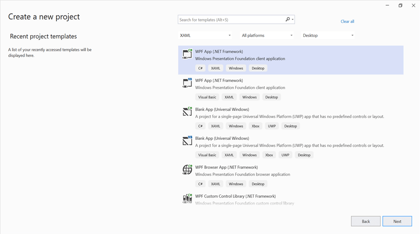
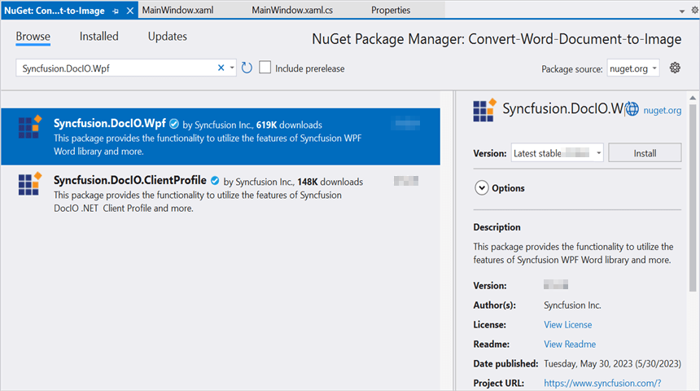
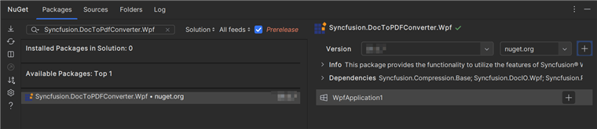
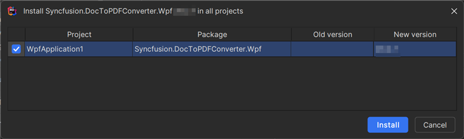

# Convert Word document to Image in WPF

Syncfusion&reg; DocIO is a [.NET Word library](https://www.syncfusion.com/document-processing/word-framework/net/word-library) used to create, read, edit, and **convert Word documents** programmatically without **Microsoft Word** or interop dependencies. Using this library, you can **convert a Word document to image in WPF**.

## Steps to convert Word document to Image in WPF





**Prerequisites:**

* Visual Studio 2022.
* Install **.NET desktop development** workload with necessary .NET Framework SDK.

Step 1: Create a new WPF application project.

Step 2: Install the [Syncfusion.DocIO.Wpf](https://www.nuget.org/packages/Syncfusion.DocIO.Wpf) NuGet package as a reference to your WPF application from [NuGet.org](https://www.nuget.org/).

N> Starting with v16.2.0.x, if you reference Syncfusion&reg; assemblies from trial setup or from the NuGet feed, you also have to add "Syncfusion.Licensing" assembly reference and include a license key in your projects. Please refer to this [link](https://help.syncfusion.com/common/essential-studio/licensing/overview) to know about registering Syncfusion&reg; license key in your application to use our components.

Step 3: Include the following namespaces in the **MainWindow.xaml.cs** file.





using Syncfusion.DocIO;
using Syncfusion.DocIO.DLS;





Step 4: Add a new button in **MainWindow.xaml** to **convert Word document to image** file as follows.




<Button Click="btnConvert_Click" VerticalAlignment="Center" Height="30" BorderBrush="LightBlue" HorizontalAlignment="Center" Width="150">
    <Button.Background>
        <LinearGradientBrush EndPoint="0.5,-0.04" StartPoint="0.5,1.04">
            <GradientStop Color="#FFD9E9F7" Offset="0"/>
            <GradientStop Color="#FFEFF8FF" Offset="1"/>
        </LinearGradientBrush>
    </Button.Background>
    <StackPanel Orientation="Horizontal" Height="23" Margin="0,0,0,-2.52" VerticalAlignment="Bottom" HorizontalAlignment="Right" Width="100" RenderTransformOrigin="0.5,0.5">
        <StackPanel.RenderTransform>
            <TransformGroup>
                <ScaleTransform/>
                <SkewTransform/>
                <RotateTransform Angle="-0.226"/>
                <TranslateTransform/>
            </TransformGroup>
        </StackPanel.RenderTransform>
    <Image Name="image2" Margin="2" HorizontalAlignment="Center" VerticalAlignment="Center" />
    <TextBlock Text="Word to Image" Height="38" Width="187" Margin="0,4,0,3" TextWrapping="WrapWithOverflow" />
</StackPanel>
</Button>




Step 5: Add the following code in **btnConvert_Click** to **convert Word document to image** with simple text.





using (WordDocument document = new WordDocument("Input.docx", FormatType.Docx))
{
    //Convert the first page of the Word document into an image.
    System.Drawing.Image image = document.RenderAsImages(0, ImageType.Bitmap);
    //Save the image as jpeg.
    image.Save("WordToImage.Jpeg", ImageFormat.Jpeg);
}





Step 6: Build the project.

Click on Build → Build Solution or press <kbd>Ctrl</kbd>+<kbd>Shift</kbd>+<kbd>B</kbd> to build the project.

Step 7: Run the project.

Click the Start button (green arrow) or press <kbd>F5</kbd> to run the app.

You can download a complete working sample from [GitHub](https://github.com/SyncfusionExamples/DocIO-Examples/tree/main/Word-to-Image-conversion/Convert-Word-to-image/WPF).

By executing the program, you will get the **image** as follows.





**Prerequisites:**

* JetBrains Rider.
* Install .NET Framework Developer Pack.

Step 1. Open JetBrains Rider and create a new WPF application project.
* Launch JetBrains Rider.
* Click **New Solution** on the welcome screen.

* In the New Solution dialog, select **Project Type** as **Desktop**.
* Enter a project name and specify the location.
* Select the target framework as **Full Framework** and choose the desired version.
* Select **Template** as **WPF Application**.
* Click create.

Step 2: Install the NuGet package from [NuGet.org](https://www.nuget.org/).
* Click the NuGet icon in the Rider toolbar and type [Syncfusion.DocToPdfConverter.Wpf](https://www.nuget.org/packages/Syncfusion.DocToPdfConverter.Wpf/) in the search bar.
* Ensure that nuget.org is selected as the package source.
* Select the latest Syncfusion.DocToPdfConverter.Wpf NuGet package from the list.
* Click the + (Add) button to add the package.

* Click the Install button to complete the installation.

N> Starting with v16.2.0.x, if you reference Syncfusion assemblies from trial setup or from the NuGet feed, you also have to add "Syncfusion.Licensing" assembly reference and include a license key in your projects. Please refer to this [link](https://help.syncfusion.com/common/essential-studio/licensing/overview) to know about registering Syncfusion license key in your application to use our components.

Step 3: Include the following namespaces in the **MainWindow.xaml.cs** file.





using Syncfusion.DocIO;
using Syncfusion.DocIO.DLS;





Step 4: Add a new button in **MainWindow.xaml** to **convert Word document to image** file as follows.




<Button Click="btnConvert_Click" VerticalAlignment="Center" Height="30" BorderBrush="LightBlue" HorizontalAlignment="Center" Width="150">
    <Button.Background>
        <LinearGradientBrush EndPoint="0.5,-0.04" StartPoint="0.5,1.04">
            <GradientStop Color="#FFD9E9F7" Offset="0"/>
            <GradientStop Color="#FFEFF8FF" Offset="1"/>
        </LinearGradientBrush>
    </Button.Background>
    <StackPanel Orientation="Horizontal" Height="23" Margin="0,0,0,-2.52" VerticalAlignment="Bottom" HorizontalAlignment="Right" Width="100" RenderTransformOrigin="0.5,0.5">
        <StackPanel.RenderTransform>
            <TransformGroup>
                <ScaleTransform/>
                <SkewTransform/>
                <RotateTransform Angle="-0.226"/>
                <TranslateTransform/>
            </TransformGroup>
        </StackPanel.RenderTransform>
    <Image Name="image2" Margin="2" HorizontalAlignment="Center" VerticalAlignment="Center" />
    <TextBlock Text="Word to Image" Height="38" Width="187" Margin="0,4,0,3" TextWrapping="WrapWithOverflow" />
</StackPanel>
</Button>




Step 5: Add the following code in **btnConvert_Click** to **convert Word document to image** with simple text.





using (WordDocument document = new WordDocument("Input.docx", FormatType.Docx))
{
    //Convert the first page of the Word document into an image.
    System.Drawing.Image image = document.RenderAsImages(0, ImageType.Bitmap);
    //Save the image as jpeg.
    image.Save("WordToImage.Jpeg", ImageFormat.Jpeg);
}





Step 6: Build the project.

Click the **Build** button in the toolbar or press <kbd>Ctrl</kbd>+<kbd>Shift</kbd>+<kbd>B</kbd> to build the project.

Step 7: Run the project.

Click the **Run** button (green arrow) in the toolbar or press <kbd>F5</kbd> to run the app.

You can download a complete working sample from [GitHub](https://github.com/SyncfusionExamples/DocIO-Examples/tree/main/Word-to-Image-conversion/Convert-Word-to-image/WPF).

By executing the program, you will get the **image** as follows.





Click [here](https://www.syncfusion.com/document-processing/word-framework/net) to explore the rich set of Syncfusion&reg; Word library (DocIO) features. 

An online sample link to [convert Word document to image](https://document.syncfusion.com/demos/word/wordtoimage#/tailwind) in ASP.NET Core. 