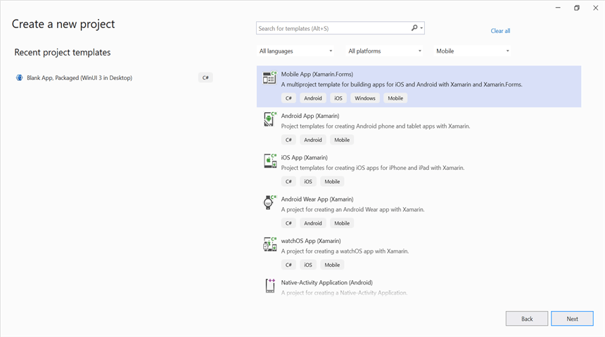

# Convert Word Document to Image in Xamarin

Syncfusion® DocIO is a [Xamarin Word library](https://www.syncfusion.com/document-processing/word-framework/xamarin/word-library) used to create, read, edit, and **convert Word documents** programmatically without **Microsoft Word** or **interop** dependencies. Using this library, you can **convert a Word document to image in Xamarin**.

## Steps to convert Word document to Image in Xamarin

Step 1: Create a new Xamarin.Forms application project.

Step 2: Select a project template and required platforms to deploy the application. In this application the portable assemblies to be shared across multiple platforms, the .NET Standard code sharing strategy has been selected. For more details about code sharing refer [here](https://learn.microsoft.com/en-us/xamarin/cross-platform/app-fundamentals/code-sharing).

N> If .NET Standard is not available in the code sharing strategy, the Portable Class Library (PCL) can be selected.

Step 3: Install [Syncfusion.Xamarin.DocIORenderer ](https://www.nuget.org/packages/Syncfusion.Xamarin.DocIORenderer) NuGet package as a reference to the .NET Standard project in your application from [NuGet.org](https://www.nuget.org/).

N> Starting with v16.2.0.x, if you reference Syncfusion® assemblies from trial setup or from the NuGet feed, you also have to add "Syncfusion.Licensing" assembly reference and include a license key in your projects. Please refer to this [link](https://help.syncfusion.com/common/essential-studio/licensing/overview) to know about registering Syncfusion® license key in your application to use our components.

Step 4: Add new Forms XAML page in **portable project**. If there is no XAML page is defined in the App class. Otherwise proceed to the next step.
<ul>
<li>
To add the new XAML page, right click on the project and select <b>Add > New Item</b> and add a Forms XAML Page from the list. Name it as MainXamlPage.
</li>
<li>
In App class of <b>portable project</b> (App.cs), replace the existing constructor of App class with the code snippet given below which invokes the <b>MainXamlPage</b>.
</li>
</ul>




public App()
{
  // The root page of your application
  MainPage = new MainXamlPage();
}




Step 5: In the MainXamlPage.xaml add new button as shown below.





<?xml version="1.0" encoding="utf-8" ?>
<ContentPage xmlns="http://xamarin.com/schemas/2014/forms"
             xmlns:x="http://schemas.microsoft.com/winfx/2009/xaml"
             x:Class="Convert_Word_Document_to_Image.MainPage">

    <StackLayout VerticalOptions="Center">
        <Button Text="Convert WordtoImage" Clicked="OnButtonClicked" HorizontalOptions="Center"/>
    </StackLayout>
</ContentPage>





Step 6: Include the following namespace in the **MainXamlPage.xaml.cs** file.





using Syncfusion.DocIO;
using Syncfusion.DocIO.DLS;
using Syncfusion.DocIORenderer;





Step 7: Include the below code snippet in the click event of the button in **MainXamlPage.xaml.cs** to **convert Word document to image**.





//Loading an existing Word document
Assembly assembly = typeof(App).GetTypeInfo().Assembly;

using (WordDocument document = new WordDocument(assembly.GetManifestResourceStream("Convert-Word-Document-to-Image.Assets.Input.docx", FormatType.Docx))
{
  //Instantiation of DocIORenderer for Word to image conversion
   using (DocIORenderer render = new DocIORenderer())
  {
    //Convert the first page of the Word document into an image.
    Stream imageStream = document.RenderAsImages(0, ExportImageFormat.Jpeg);
    //Reset the stream position.
    imageStream.Position = 0;
    //Save the stream as file.
    Xamarin.Forms.DependencyService.Get<ISave>().SaveAndView("WordToImage.Jpeg", "application/jpeg", imageStream as MemoryStream);                  
  }
}





## Helper files for Xamarin

Refer the below helper files and add them into the mentioned project. These helper files allow you to save the stream as a physical file and open the file for viewing.

<table>
  <tr>
  <td>
    <b>Project</b>
  </td>
  <td>
    <b>File Name</b>
  </td>
  <td>
    <b>Summary</b>
  </td>
  </tr>
  <tr>
  <td>
    {{'[Portable project](https://github.com/SyncfusionExamples/DocIO-Examples/tree/main/Word-to-Image-conversion/Convert-Word-to-image/Xamarin/Convert-Word-Document-to-Image/Convert-Word-Document-to-Image)'| markdownify }}
  </td>
  <td>
    {{'[ISave.cs](https://github.com/SyncfusionExamples/DocIO-Examples/blob/main/Word-to-Image-conversion/Convert-Word-to-image/Xamarin/Convert-Word-Document-to-Image/Convert-Word-Document-to-Image/ISave.cs)'| markdownify }}
  </td>
  <td>Represent the base interface for save operation
  </td>
  </tr>
  <tr>
  <td rowspan="2">
    {{'[iOS Project](https://github.com/SyncfusionExamples/DocIO-Examples/tree/main/Word-to-Image-conversion/Convert-Word-to-image/Xamarin/Convert-Word-Document-to-Image/Convert-Word-Document-to-Image.iOS)'| markdownify }}
  </td>
  <td>
    {{'[SaveIOS.cs](https://github.com/SyncfusionExamples/DocIO-Examples/blob/main/Word-to-Image-conversion/Convert-Word-to-image/Xamarin/Convert-Word-Document-to-Image/Convert-Word-Document-to-Image.iOS/SaveIOS.cs)'| markdownify }}
  </td>
  <td>
    Save implementation for iOS device
  </td>
  </tr>
  <tr>
  <td>
    {{'[PreviewControllerDS.cs](https://github.com/SyncfusionExamples/DocIO-Examples/blob/main/Word-to-Image-conversion/Convert-Word-to-image/Xamarin/Convert-Word-Document-to-Image/Convert-Word-Document-to-Image.iOS/PreviewControllerDS.cs)'| markdownify }}
  </td>
  <td>
    Helper class for viewing the <b>Word document</b> in iOS device
  </td>
  </tr>
  <tr>
  <td>
    {{'[Android project](https://github.com/SyncfusionExamples/DocIO-Examples/tree/main/Word-to-Image-conversion/Convert-Word-to-image/Xamarin/Convert-Word-Document-to-Image/Convert-Word-Document-to-Image.Android)'| markdownify }}
  </td>
  <td>
   {{'[SaveAndroid.cs](https://github.com/SyncfusionExamples/DocIO-Examples/blob/main/Word-to-Image-conversion/Convert-Word-to-image/Xamarin/Convert-Word-Document-to-Image/Convert-Word-Document-to-Image.Android/SaveAndroid.cs)'| markdownify }}
  </td>
  <td>Save implementation for Android device
  </td>
  </tr>
  <tr>
  <td>
    {{'[UWP project](https://github.com/SyncfusionExamples/DocIO-Examples/tree/main/Word-to-Image-conversion/Convert-Word-to-image/Xamarin/Convert-Word-Document-to-Image/Convert-Word-Document-to-Image.UWP)'| markdownify }}
  </td>
  <td>
    {{'[SaveWindows.cs](https://github.com/SyncfusionExamples/DocIO-Examples/blob/main/Word-to-Image-conversion/Convert-Word-to-image/Xamarin/Convert-Word-Document-to-Image/Convert-Word-Document-to-Image.UWP/SaveWindows.cs)'| markdownify }}
  </td>
  <td>Save implementation for UWP device.
  </td>
  </tr>
</table>

Compile and execute the application. Now this application **convert a Word document to image**.

You can download a complete working sample from [GitHub](https://github.com/SyncfusionExamples/DocIO-Examples/tree/main/Word-to-Image-conversion/Convert-Word-to-image/Xamarin).

By executing the program, you will get the **image** as follows.

      

Click [here](https://www.syncfusion.com/document-processing/word-framework/xamarin) to explore the rich set of Syncfusion® Word library (DocIO) features. 

An online sample link to [convert Word document to image](https://ej2.syncfusion.com/aspnetcore/Word/WordToImage#/material3) in ASP.NET Core. 