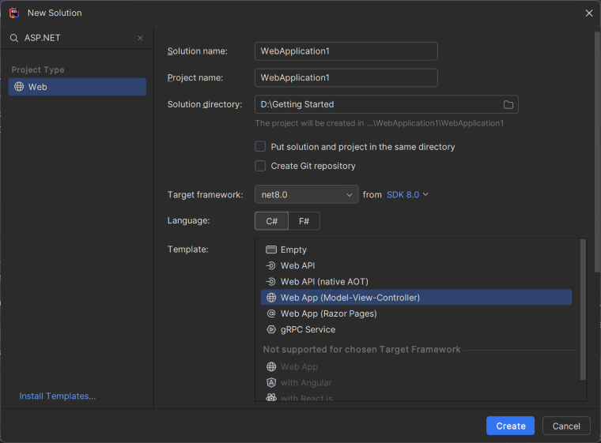

# Convert Word document to PDF in ASP.NET Core

Syncfusion<sup>&reg;</sup> Essential<sup>&reg;</sup> DocIO is a [.NET Core Word library](https://www.syncfusion.com/document-processing/word-framework/net-core/word-library) used to create, read, edit, and **convert Word documents** programmatically without **Microsoft Word** or interop dependencies. Using this library, you can **convert a Word document to PDF in ASP.NET Core**.

## Steps to convert word document to PDF in C#:





Step 1: Create a new ASP.NET Core Web application (Model-View-Controller) project.


Step 2: Install the [Syncfusion.DocIORenderer.Net.Core](https://www.nuget.org/packages/Syncfusion.DocIORenderer.Net.Core) NuGet package as a reference to your project from [NuGet.org](https://www.nuget.org/).


N> 1. If you're deploying the application in a Linux environment, refer to the [documentation](https://help.syncfusion.com/document-processing/word/conversions/word-to-pdf/net/nuget-packages-required-word-to-pdf#additional-nuget-packages-required-for-linux) for the required additional NuGet packages.
N> 2. Starting with v16.2.0.x, if you reference Syncfusion<sup>&reg;</sup> assemblies from trial setup or from the NuGet feed, you also have to add "Syncfusion.Licensing" assembly reference and include a license key in your projects. Please refer to this [link](https://help.syncfusion.com/common/essential-studio/licensing/overview) to know about registering Syncfusion<sup>&reg;</sup> license key in your application to use our components.

Step 3: Include the following namespaces in the HomeController.cs file.





using Syncfusion.DocIO;
using Syncfusion.DocIO.DLS;
using Syncfusion.DocIORenderer;
using Syncfusion.Pdf;





Step 4: A default action method named Index will be present in HomeController.cs. Right click on Index method and select **Go To View** where you will be directed to its associated view page **Index.cshtml**.

Step 6: Add a new button in the Index.cshtml as shown below.





@{Html.BeginForm("ConvertWordtoPDF", "Home", FormMethod.Get);
{
<div>
    <input type="submit" value="Convert Word Document to PDF" style="width:220px;height:27px" />
</div>
}
Html.EndForm();
}





Step 5: Add a new action method **ConvertWordDocumentToPdf** in HomeController.cs and include the below code snippet to **convert the Word document to Pdf** and download it.





//Open the file as Stream
using (FileStream docStream = new FileStream(Path.GetFullPath("Data/Template.docx"), FileMode.Open, FileAccess.Read))
{
    //Loads file stream into Word document
    using (WordDocument wordDocument = new WordDocument(docStream, FormatType.Docx))
    {
        //Instantiation of DocIORenderer for Word to PDF conversion
        using (DocIORenderer render = new DocIORenderer())
        {
            //Converts Word document into PDF document
            PdfDocument pdfDocument = render.ConvertToPDF(wordDocument);

            //Saves the PDF document to MemoryStream.
            MemoryStream stream = new MemoryStream();
            pdfDocument.Save(stream);
            stream.Position = 0;

            //Download PDF document in the browser.
            return File(stream, "application/pdf", "Sample.pdf");
        }
    }
}





Step 6: Build the project.

Click on Build → Build Solution or press <kbd>Ctrl</kbd>+<kbd>Shift</kbd>+<kbd>B</kbd> to build the project.

Step 7: Run the project.

Click the Start button (green arrow) or press <kbd>F5</kbd> to run the app.

You can download a complete working sample from [GitHub](https://github.com/SyncfusionExamples/DocIO-Examples/tree/main/Word-to-PDF-Conversion/Convert-Word-document-to-PDF/ASP.NET-Core).

By executing the program, you will get the **PDF document** as follows.



 


**Prerequisites:**

* Visual Studio Code.
* Install [.NET 8 SDK](https://dotnet.microsoft.com/en-us/download/dotnet/8.0) or later.
* Open Visual Studio Code and install the [C# for Visual Studio Code extension](https://marketplace.visualstudio.com/items?itemName=ms-dotnettools.csharp) from the Extensions Marketplace.

Step 1: Create a new ASP.NET Core Web application project.
* Open the command palette by pressing <kbd>Ctrl</kbd>+<kbd>Shift</kbd>+<kbd>P</kbd> and type **.NET:New Project** and enter.
* Choose the **ASP.NET Core Web App( Model-View-Controller) MVC** template.


* Select the project location, type the project name and press enter.
* Then choose **Create project**.

Step 2: To **convert a Word document to PDF in ASP.NET Core Web app**, install [Syncfusion.DocIORenderer.Net.Core](https://www.nuget.org/packages/Syncfusion.DocIORenderer.Net.Core) to the ASP.NET Core project.
* Press <kbd>Ctrl</kbd> + <kbd>`</kbd> (backtick) to open the integrated terminal in Visual Studio Code.
* Ensure you're in the project root directory where your .csproj file is located.
* Run the command `dotnet add package Syncfusion.DocIORenderer.Net.Core` to install the NuGet package.


N> 1. If you're deploying the application in a Linux environment, refer to the [documentation](https://help.syncfusion.com/document-processing/word/conversions/word-to-pdf/net/nuget-packages-required-word-to-pdf#additional-nuget-packages-required-for-linux) for the required additional NuGet packages.
N> 2. Starting with v16.2.0.x, if you reference Syncfusion<sup>&reg;</sup> assemblies from trial setup or from the NuGet feed, you also have to add "Syncfusion.Licensing" assembly reference and include a license key in your projects. Please refer to this [link](https://help.syncfusion.com/common/essential-studio/licensing/overview) to know about registering Syncfusion<sup>&reg;</sup> license key in your application to use our components.

Step 3: Include the following namespaces in the HomeController.cs file.





using Syncfusion.DocIO;
using Syncfusion.DocIO.DLS;
using Syncfusion.DocIORenderer;
using Syncfusion.Pdf;





Step 4: A default action method named Index will be present in HomeController.cs. Right click on Index method and select **Go To View** where you will be directed to its associated view page **Index.cshtml**.

Step 5: Add a new button in the Index.cshtml as shown below.





@{Html.BeginForm("ConvertWordtoPDF", "Home", FormMethod.Get);
{
<div>
    <input type="submit" value="Convert Word Document to PDF" style="width:220px;height:27px" />
</div>
}
Html.EndForm();
}





Step 6: Add a new action method **ConvertWordDocumentToPdf** in HomeController.cs and include the below code snippet to **convert the Word document to Pdf** and download it.





//Open the file as Stream
using (FileStream docStream = new FileStream(Path.GetFullPath("Data/Template.docx"), FileMode.Open, FileAccess.Read))
{
    //Loads file stream into Word document
    using (WordDocument wordDocument = new WordDocument(docStream, FormatType.Docx))
    {
        //Instantiation of DocIORenderer for Word to PDF conversion
        using (DocIORenderer render = new DocIORenderer())
        {
            //Converts Word document into PDF document
            PdfDocument pdfDocument = render.ConvertToPDF(wordDocument);

            //Saves the PDF document to MemoryStream.
            MemoryStream stream = new MemoryStream();
            pdfDocument.Save(stream);
            stream.Position = 0;

            //Download PDF document in the browser.
            return File(stream, "application/pdf", "Sample.pdf");
        }
    }
}





Step 7: Build the project.

Run the following command in terminal to build the project.

```
dotnet build
```

Step 8: Run the project.

Run the following command in terminal to run the project.

```
dotnet run
```

You can download a complete working sample from [GitHub](https://github.com/SyncfusionExamples/DocIO-Examples/tree/main/Word-to-PDF-Conversion/Convert-Word-document-to-PDF/ASP.NET-Core).

By executing the program, you will get the **PDF document** as follows.



 


**Prerequisites:**

* JetBrains Rider.
* Install .NET 8 SDK or later.

Step 1. Open JetBrains Rider and create a new ASP.NET Core Web application project.
* Launch JetBrains Rider.
* Click new solution on the welcome screen.


* In the new Solution dialog, select Project Type as Web.
* Select the target framework (e.g., .NET 8.0, .NET 9.0) and template as **Web App(Model-View-Controller)**. 
* Enter a project name and specify the location.
* Click create.



Step 2: Install the NuGet package from [NuGet.org](https://www.nuget.org/).
* Click the NuGet icon in the Rider toolbar and type [Syncfusion.DocIORenderer.Net.Core](https://www.nuget.org/packages/Syncfusion.DocIORenderer.Net.Core) in the search bar.
* Ensure that "nuget.org" is selected as the package source.
* Select the latest Syncfusion.DocIORenderer.Net.Core NuGet package from the list.
* Click the + (Add) button to add the package.


* Click the Install button to complete the installation.


N> 1. If you're deploying the application in a Linux environment, refer to the [documentation](https://help.syncfusion.com/document-processing/word/conversions/word-to-pdf/net/nuget-packages-required-word-to-pdf#additional-nuget-packages-required-for-linux) for the required additional NuGet packages.
N> 2. Starting with v16.2.0.x, if you reference Syncfusion assemblies from trial setup or from the NuGet feed, you also have to add "Syncfusion.Licensing" assembly reference and include a license key in your projects. Please refer to this [link](https://help.syncfusion.com/common/essential-studio/licensing/overview) to know about registering Syncfusion license key in your application to use our components.

Step 3: Include the following namespaces in the HomeController.cs file.





using Syncfusion.DocIO;
using Syncfusion.DocIO.DLS;
using Syncfusion.DocIORenderer;
using Syncfusion.Pdf;





Step 4: A default action method named Index will be present in HomeController.cs. Right click on Index method and select **Go To View** where you will be directed to its associated view page **Index.cshtml**.

Step 5: Add a new button in the Index.cshtml as shown below.





@{Html.BeginForm("ConvertWordtoPDF", "Home", FormMethod.Get);
{
<div>
    <input type="submit" value="Convert Word Document to PDF" style="width:220px;height:27px" />
</div>
}
Html.EndForm();
}





Step 6: Add a new action method **ConvertWordDocumentToPdf** in HomeController.cs and include the below code snippet to **convert the Word document to Pdf** and download it.





//Open the file as Stream
using (FileStream docStream = new FileStream(Path.GetFullPath("Data/Template.docx"), FileMode.Open, FileAccess.Read))
{
    //Loads file stream into Word document
    using (WordDocument wordDocument = new WordDocument(docStream, FormatType.Docx))
    {
        //Instantiation of DocIORenderer for Word to PDF conversion
        using (DocIORenderer render = new DocIORenderer())
        {
            //Converts Word document into PDF document
            PdfDocument pdfDocument = render.ConvertToPDF(wordDocument);

            //Saves the PDF document to MemoryStream.
            MemoryStream stream = new MemoryStream();
            pdfDocument.Save(stream);
            stream.Position = 0;

            //Download PDF document in the browser.
            return File(stream, "application/pdf", "Sample.pdf");
        }
    }
}





Step 7: Build the project.

Click the **Build** button in the toolbar or press <kbd>Ctrl</kbd>+<kbd>Shift</kbd>+<kbd>B</kbd> to build the project.

Step 8: Run the project.

Click the **Run** button (green arrow) in the toolbar or press <kbd>F5</kbd> to run the app.

You can download a complete working sample from [GitHub](https://github.com/SyncfusionExamples/DocIO-Examples/tree/main/Word-to-PDF-Conversion/Convert-Word-document-to-PDF/ASP.NET-Core).

By executing the program, you will get the **PDF document** as follows.






Click [here](https://www.syncfusion.com/document-processing/word-framework/net-core) to explore the rich set of Syncfusion<sup>&reg;</sup> Word library (DocIO) features. 

An online sample link to [convert Word document to PDF](https://ej2.syncfusion.com/aspnetcore/Word/WordToPDF#/material3) in ASP.NET Core.
