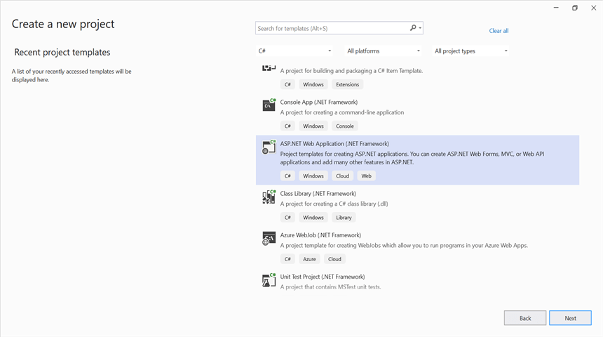
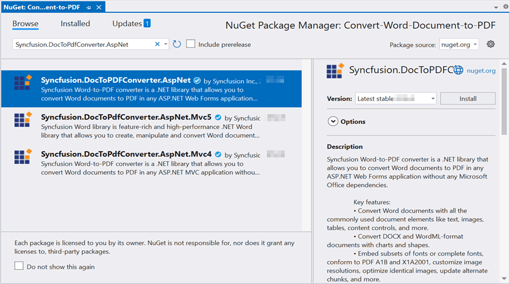

# Convert Word document to PDF in ASP.NET

> **Note:** ASP.NET Web Forms is deprecated. We recommend using the [ASP.NET Core](convert-word-document-to-pdf-in-asp-net-core) platform for new development. For more information on migrating the .NET Word library from .NET Framework to .NET Core, refer [here](https://help.syncfusion.com/document-processing/word/word-library/net/faqs/migrate-from-net-framework-to-net-core).

Syncfusion&reg; Essential&reg; DocIO is a [.NET Word library](https://www.syncfusion.com/document-sdk/net-word-library) used to create, read, edit, and **convert Word documents** programmatically without **Microsoft Word** or interop dependencies. Using this library, you can **convert a Word document to PDF in ASP.NET Web Forms on the .NET Framework**.

## Prerequisites

* Visual Studio with the **ASP.NET and web development** workload installed.
* .NET Framework 4.5 or later.
* A sample Word document named `Template.docx` available in your project (placed under the `App_Data` folder, as referenced in the code below).

## Steps to convert Word document to PDF in C#

Step 1: Create a new **ASP.NET Web Application (.NET Framework)** project in Visual Studio.

Step 2: Select the **Empty** project template.

Step 3: Install the [Syncfusion.DocToPDFConverter.AspNet](https://www.nuget.org/packages/Syncfusion.DocToPDFConverter.AspNet) NuGet package as a reference to your project from [NuGet.org](https://www.nuget.org/).

N> Starting with v16.2.0.x, if you reference Syncfusion&reg; assemblies from trial setup or from the NuGet feed, you also have to add "Syncfusion.Licensing" assembly reference and include a license key in your projects. Please refer to this [link](https://help.syncfusion.com/common/essential-studio/licensing/overview) to know about registering Syncfusion&reg; license key in your application to use our components.

Step 4: Add a new Web Form in your project. Right click on the project and select **Add > New Item** and add a Web Form from the list. Name it as MainPage.

Step 5: Add a new button in the **MainPage.aspx** as shown below.





<%@ Page Language="C#" AutoEventWireup="true" CodeBehind="MainPage.aspx.cs" Inherits="Convert_Word_Document_to_PDF.WebForm1" %>

<!DOCTYPE html>

<html xmlns="http://www.w3.org/1999/xhtml">
<head runat="server">
    <title></title>
</head>
<body>
    <form id="form1" runat="server">
        

             <asp:Button ID="Button1" runat="server" Text="Convert Word to PDF" OnClick="OnButtonClicked" />
        

    </form>
</body>
</html>





Step 6: Include the following namespaces in your **MainPage.aspx.cs** file.





using System.IO;
using Syncfusion.DocIO;
using Syncfusion.DocIO.DLS;
using Syncfusion.DocToPDFConverter;
using Syncfusion.Pdf;





Step 7: Include the below code snippet in the click event of the button in **MainPage.aspx.cs**, to **convert the Word document to PDF** and download it.

N> This sample uses `Server.MapPath` and `HttpContext.Current`, which are available only in the .NET Framework ASP.NET Web Forms environment. Ensure a sample Word document named **Template.docx** exists in the `App_Data` folder of your project.





//Open an existing Word document.
string filePath = Server.MapPath("~/App_Data/Template.docx");

//Loads file into Word document
using (WordDocument document = new WordDocument(filePath))
{
    //Instantiation of DocToPDFConverter for Word to PDF conversion
    using (DocToPDFConverter converter = new DocToPDFConverter())
    {
        //Converts Word document into PDF document
        using (PdfDocument pdfDocument = converter.ConvertToPDF(document))
        {
            //Saves the PDF document to MemoryStream.
            MemoryStream stream = new MemoryStream();
            pdfDocument.Save("sample.pdf", HttpContext.Current.Response, HttpReadType.Save);
            stream.Position = 0;
        }                   
    }
}





You can download a complete working sample from [GitHub](https://github.com/SyncfusionExamples/DocIO-Examples/tree/main/Word-to-PDF-Conversion/Convert-Word-document-to-PDF/ASP.NET).

Step 8: Build the project.

Click on **Build → Build Solution** or press <kbd>Ctrl</kbd>+<kbd>Shift</kbd>+<kbd>B</kbd> to build the project.

Step 9: Run the project.

Click the **Start** button (green arrow) or press <kbd>F5</kbd> to run the app.

By executing the program, you will get the **PDF document** as follows.

## See also

* [.NET Word Library](https://www.syncfusion.com/document-sdk/net-word-library) — Full overview, features, pricing, and documentation. 

