# Convert Word document to PDF in AWS Elastic Beanstalk

Syncfusion&reg; Essential&reg; DocIO is a [.NET Core Word library](https://www.syncfusion.com/document-sdk/net-word-library) used to create, read, edit, and convert Word documents programmatically without Microsoft Word or interop dependencies. Using this library, you can convert a Word document to PDF in AWS Elastic Beanstalk.

## Prerequisites

* An active AWS account with permissions to create and deploy Elastic Beanstalk applications and IAM roles.
* Visual Studio with the **AWS Toolkit for Visual Studio** installed.
* **.NET 8.0** or later.
* A valid Syncfusion&reg; license key. Refer to this [link](https://help.syncfusion.com/common/essential-studio/licensing/overview) to generate and register your license key.

## Steps to convert Word document to PDF in AWS Elastic Beanstalk

Step 1: Create a new **ASP.NET Core Web App (Model-View-Controller)** project targeting **.NET 8.0** or later.

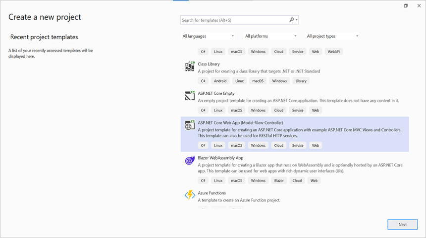

Step 2: Install the following **NuGet packages** in your application from [NuGet.org](https://www.nuget.org/).

* [Syncfusion.DocIORenderer.Net.Core](https://www.nuget.org/packages/Syncfusion.DocIORenderer.Net.Core) 
* [SkiaSharp.NativeAssets.Linux.NoDependencies v3.119.1](https://www.nuget.org/packages/SkiaSharp.NativeAssets.Linux.NoDependencies/3.119.1)
* [Syncfusion.Licensing](https://www.nuget.org/packages/Syncfusion.Licensing) (required for v16.2.0.x and later)

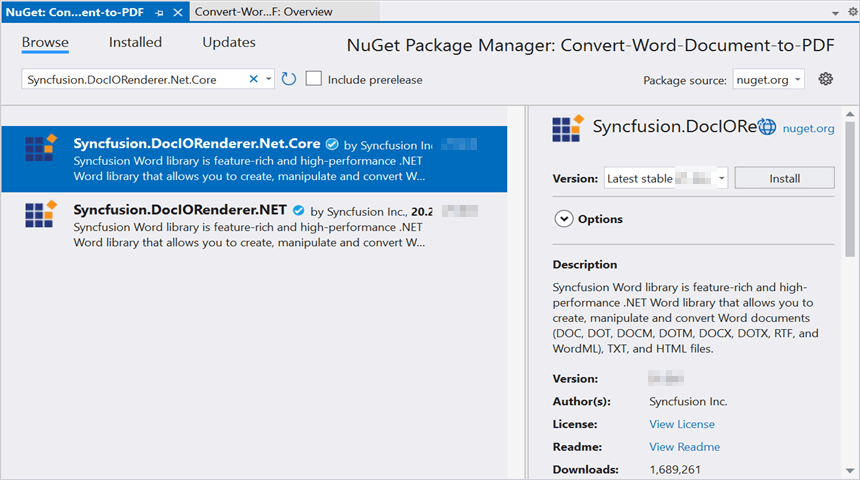
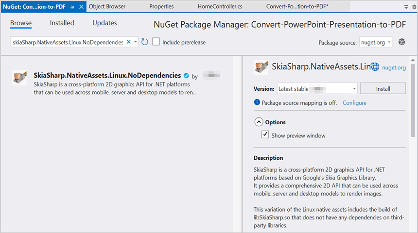

N> Starting with v16.2.0.x, if you reference Syncfusion&reg; assemblies from trial setup or from the NuGet feed, you also have to add a **Syncfusion.Licensing** NuGet package reference and include a license key in your projects. Please refer to this [link](https://help.syncfusion.com/common/essential-studio/licensing/overview) to know about registering a Syncfusion&reg; license key in your application to use our components.

Step 3: Include the following namespaces in the **HomeController.cs** file.




using Syncfusion.DocIO;
using Syncfusion.DocIO.DLS;
using Syncfusion.DocIORenderer;
using Syncfusion.Pdf;




Step 4: A default action method named Index is present in HomeController.cs. Right-click the Index method and select **Go To View** to navigate to the associated view page **Index.cshtml**.

Step 5: Add a new button in the **Index.cshtml** as shown below.




@{
    Html.BeginForm("ConvertWordtoPDF", "Home", FormMethod.Get);
    {
        

            <input type="submit" value="Convert Word to PDF" style="width:150px;height:27px" />
        

    }
    Html.EndForm();
}




Step 6: Include the below code snippet in the **HomeController.cs** file to **convert a Word document to PDF** and download it.




public IActionResult ConvertWordtoPDF()
{
    try
    {
        using (FileStream fileStreamPath = new FileStream(Path.GetFullPath("wwwroot/Data/Input.docx"), FileMode.Open, FileAccess.Read, FileShare.ReadWrite))
        {
            //Loads the template document.
            using (WordDocument document = new WordDocument(fileStreamPath, FormatType.Docx))
            {
                //Hooks the font substitution event.
                document.FontSettings.SubstituteFont += FontSettings_SubstituteFont;
                using (DocIORenderer render = new DocIORenderer())
                {
                    // Converts Word document into PDF document. 
                    using (PdfDocument pdf = render.ConvertToPDF(document))
                    {
                        MemoryStream memoryStream = new MemoryStream();
                        //Saves the PDF file.
                        pdf.Save(memoryStream);
                        //Unhooks the font substitution event after converting to PDF.
                        document.FontSettings.SubstituteFont -= FontSettings_SubstituteFont;
                        memoryStream.Position = 0;
                        //Download PDF document in the browser
                        return File(memoryStream, "application/pdf", "Sample.pdf");
                    }                               
                }                           
            }                      
        }                 
    }
    catch (Exception ex)
    {
        ViewBag.Message = ex.ToString();
    }
    return View("Index");
}

private static void FontSettings_SubstituteFont(object sender, SubstituteFontEventArgs args)
{
    if (args.OrignalFontName == "Calibri" && args.FontStyle == FontStyle.Regular)
    {
        args.AlternateFontStream = new FileStream(Path.GetFullPath("wwwroot/Fonts/calibri.ttf"), FileMode.Open, FileAccess.Read, FileShare.ReadWrite);
    }
}




## Steps to publish as AWS Elastic Beanstalk

N> This walkthrough uses the **Publish to AWS Elastic Beanstalk (Legacy)** option in the AWS Toolkit for Visual Studio. AWS is deprecating the legacy publish flow in newer Toolkit versions; if you do not see the legacy option, use the **AWS Elastic Beanstalk** publish profile or the EB CLI. See the [AWS Toolkit for Visual Studio documentation](https://docs.aws.amazon.com/toolkit-for-visual-studio/latest/user-guide/welcome.html) for the current recommended approach.

Step 1: Right-click the project and select **Publish to AWS Elastic Beanstalk (Legacy)** option.
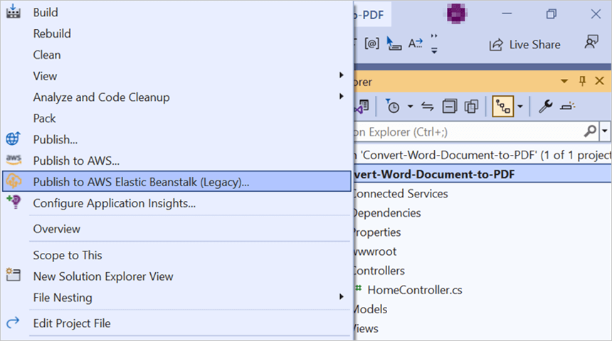

Step 2: Select the **Deployment Target** as **Create a new application environment** and click **Next**.
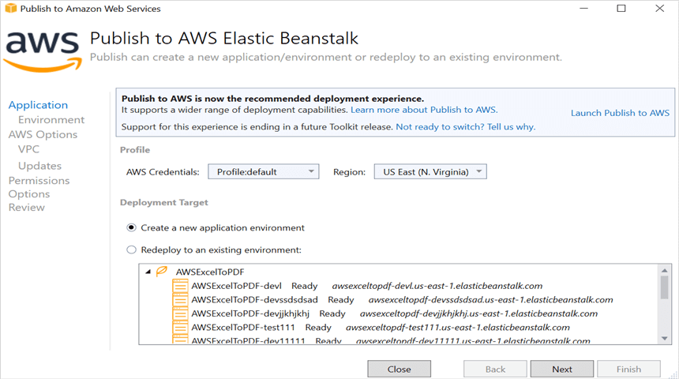

Step 3: Choose the **Environment Name** from the dropdown list. The **URL** is automatically assigned; if it is available, click **Next**. Otherwise, change the **URL** until an available one is found.
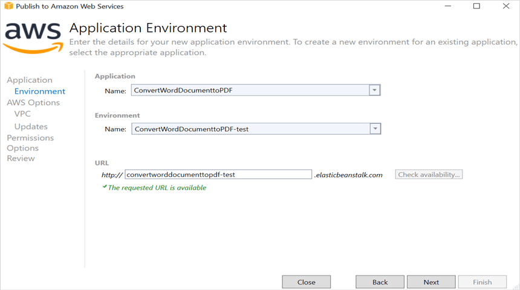

Step 4: Select the instance type **t3a.micro** from the dropdown list and click **Next**.

N> `t3a.micro` is suitable for the bundled sample. For production workloads or large Word documents, choose a larger instance (for example, `t3a.small` or higher) to avoid memory pressure during PDF conversion.
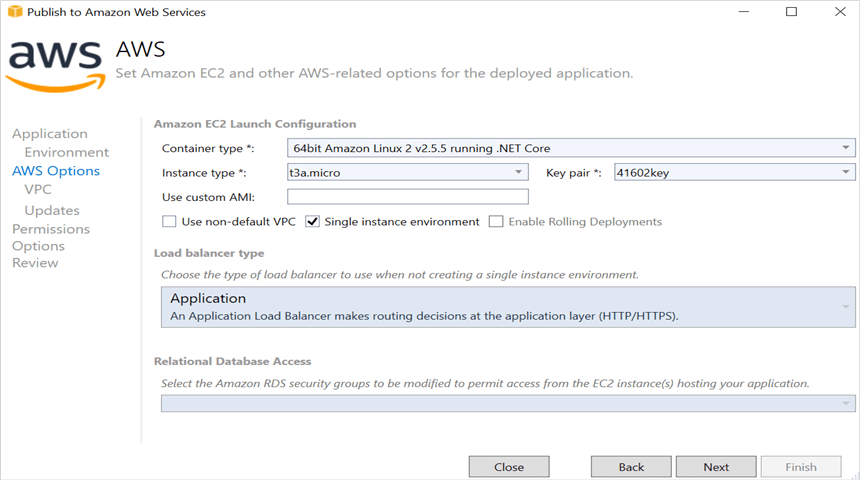

Step 5: Review the **Permissions** screen and click **Next** to continue.
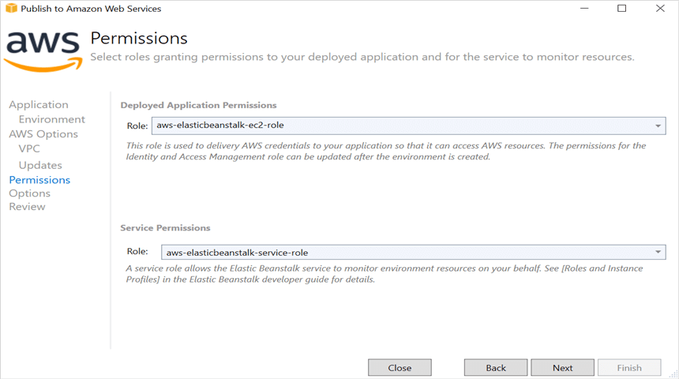

Step 6: Review the **Application Options** screen and click **Next** to continue.
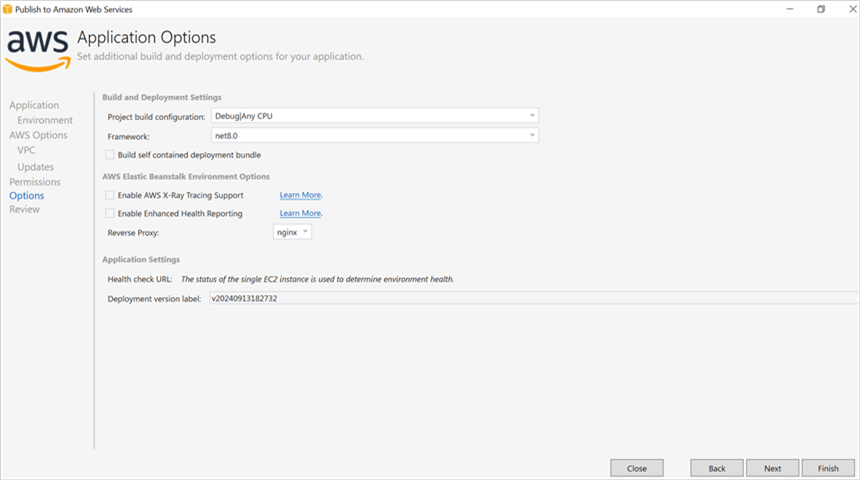

Step 7: On the **Review** screen, verify the configuration summary and click **Deploy** to deploy the sample to AWS Elastic Beanstalk.
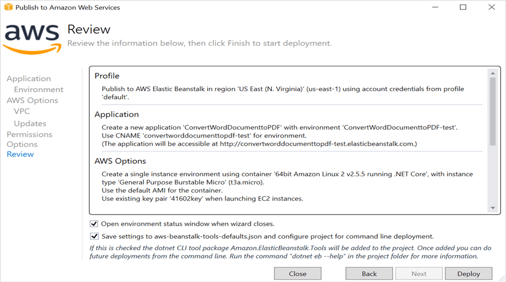

Step 8: Wait for the environment status to change from **Updating** to **Environment is healthy**, then click the **Environment URL** displayed at the top of the dashboard.

N> If the status remains **Updating** or transitions to **Severe**/**Degraded**, open the **Logs** link on the environment dashboard to view the deployment and application logs. The first deployment may take several minutes.
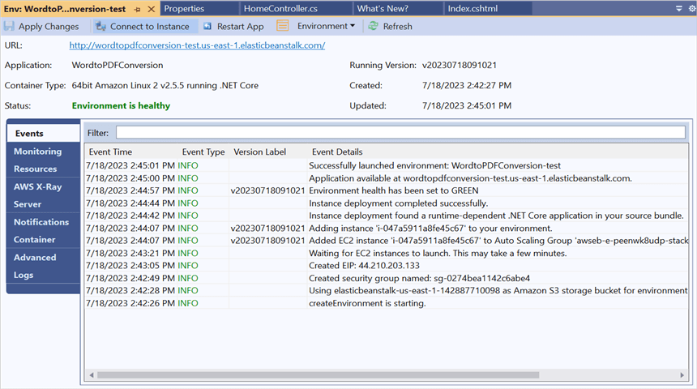

Step 9: After opening the provided **URL**, click the **Convert Word to PDF** button to download the PDF document.
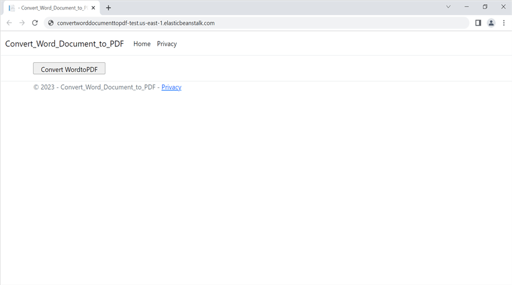

When the conversion is complete, the **PDF document** is downloaded by the browser as shown below.

## Related links

You can download a complete working sample from [GitHub](https://github.com/SyncfusionExamples/DocIO-Examples/tree/main/Word-to-PDF-Conversion/Convert-Word-document-to-PDF/AWS/AWS_Elastic_Beanstalk).

Looking for the full .NET Word Library overview, features, pricing, and documentation? Visit the [.NET Word Library](https://www.syncfusion.com/document-sdk/net-word-library) page.