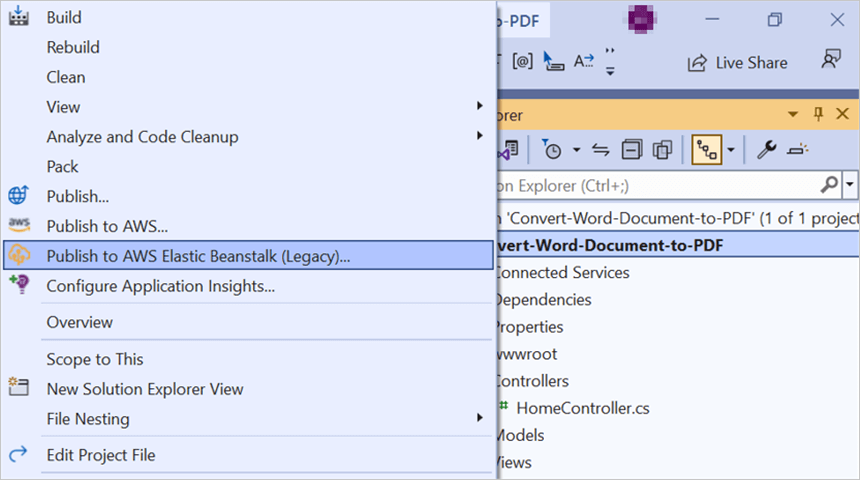
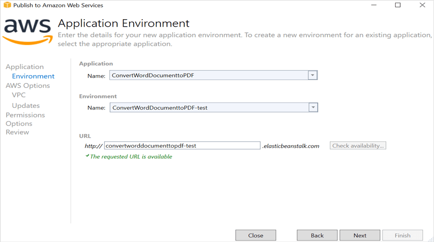
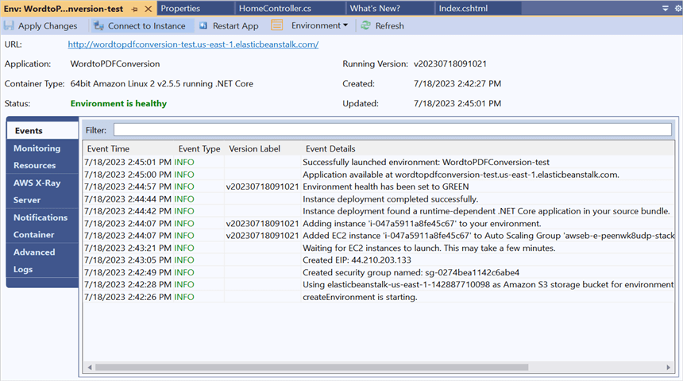
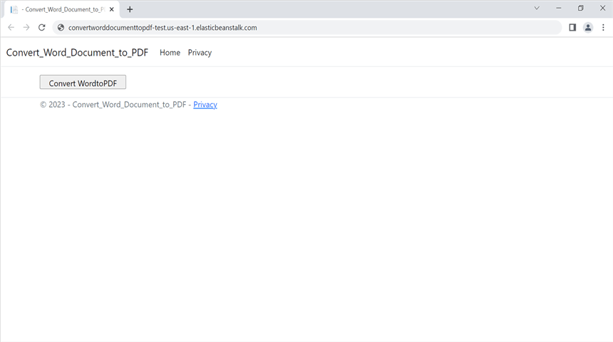

# Convert Word document to PDF in AWS Elastic Beanstalk

Syncfusion&reg; Essential&reg; DocIO is a [.NET Core Word library](https://www.syncfusion.com/document-processing/word-framework/net-core/word-library) used to create, read, edit, and **convert Word documents** programmatically without **Microsoft Word** or interop dependencies. Using this library, you can **convert a Word document to PDF in AWS Elastic Beanstalk**.

## Steps to convert word document to PDF in AWS Elastic Beanstalk

Step 1: Create a new ASP.NET Core Web application (Model-View-Controller) project.

Step 2: Install the following **Nuget packages** in your application from [Nuget.org](https://www.nuget.org/).

* [Syncfusion.DocIORenderer.Net.Core](https://www.nuget.org/packages/Syncfusion.DocIORenderer.Net.Core) 
* [SkiaSharp.NativeAssets.Linux.NoDependencies v3.116.1](https://www.nuget.org/packages/SkiaSharp.NativeAssets.Linux.NoDependencies/3.116.1)

N> Starting with v16.2.0.x, if you reference Syncfusion&reg; assemblies from trial setup or from the NuGet feed, you also have to add "Syncfusion.Licensing" assembly reference and include a license key in your projects. Please refer to this [link](https://help.syncfusion.com/common/essential-studio/licensing/overview) to know about registering Syncfusion&reg; license key in your application to use our components.

Step 3: Include the following namespaces in the **HomeController.cs** file.




using Syncfusion.DocIO;
using Syncfusion.DocIO.DLS;
using Syncfusion.DocIORenderer;
using Syncfusion.Pdf;




Step 4: A default action method named Index will be present in HomeController.cs. Right click on Index method and select **Go To View** where you will be directed to its associated view page **Index.cshtml**.

Step 5: Add a new button in the **Index.cshtml** as shown below.




@{
    Html.BeginForm("ConvertWordtoPDF", "Home", FormMethod.Get);
    {
        

            <input type="submit" value="Convert WordtoPDF" style="width:150px;height:27px" />
        

    }
    Html.EndForm();
}




Step 6: Include the below code snippet in the **Homecontroller.cs** file to **convert a Word document to Pdf** and download it.




public IActionResult ConvertWordtoPDF()
{
    try
    {
        using (FileStream fileStreamPath = new FileStream(Path.GetFullPath("wwwroot/Data/Input.docx"), FileMode.Open, FileAccess.Read, FileShare.ReadWrite))
        {
            //Loads the template document.
            using (WordDocument document = new WordDocument(fileStreamPath, FormatType.Docx))
            {
                //Hooks the font substitution event.
                document.FontSettings.SubstituteFont += FontSettings_SubstituteFont;
                using (DocIORenderer render = new DocIORenderer())
                {
                    // Converts Word document into PDF document. 
                    using (PdfDocument pdf = render.ConvertToPDF(document))
                    {
                        MemoryStream memoryStream = new MemoryStream();
                        //Saves the PDF file.
                        pdf.Save(memoryStream);
                        //Unhooks the font substitution event after converting to PDF.
                        document.FontSettings.SubstituteFont -= FontSettings_SubstituteFont;
                        memoryStream.Position = 0;
                        //Download PDF document in the browser
                        return File(memoryStream, "application/pdf", "Sample.pdf");
                    }                               
                }                           
            }                      
        }                 
    }
    catch (Exception ex)
    {
        ViewBag.Message = ex.ToString();
    }
    return View("Index");
}

private static void FontSettings_SubstituteFont(object sender, SubstituteFontEventArgs args)
{
    if (args.OrignalFontName == "Calibri" && args.FontStyle == FontStyle.Regular)
    {
        args.AlternateFontStream = new FileStream(Path.GetFullPath("wwwroot/Fonts/calibri.ttf"), FileMode.Open, FileAccess.Read, FileShare.ReadWrite);
    }
}




## Steps to publish as AWS Elastic Beanstalk

Step 1: Right-click the project and select **Publish to AWS Elastic Beanstalk (Legacy)** option.

Step 2: Select the **Deployment Target** as **Create a new application environment** and click **Next** button.

Step 3: Choose the **Environment Name** in the dropdown list and the **URL** will be automatically assign and check the URL is available, if available click next otherwise change the **URL**. 

Step 4: Select the instance type in **t3a.micro** from the dropdown list and click next.

Step 5: Click the **Next** button to proceed further.

Step 6: Click the **Next** button.

Step 7: Click the **Deploy** button to deploy the sample on AWS Elastic Beanstalk.

Step 8: After changing the status from **Updating** to **Environment is healthy**, click the **URL**.

Step 9: After opening the provided **URL**, click **Convert WordtoPDF** button to download the PDF document.

You can download a complete working sample from [GitHub](https://github.com/SyncfusionExamples/DocIO-Examples/tree/main/Word-to-PDF-Conversion/Convert-Word-document-to-PDF/AWS/AWS_Elastic_Beanstalk).

By executing the program, you will get the **PDF document** as follows.

Click [here](https://www.syncfusion.com/document-processing/word-framework/net-core) to explore the rich set of Syncfusion&reg; Word library (DocIO) features. 

An online sample link to [convert Word document to PDF](https://ej2.syncfusion.com/aspnetcore/Word/WordToPDF#/material3) in ASP.NET Core.