# Convert Word Document to PDF in AWS Lambda

Syncfusion&reg; DocIO is a [.NET Core Word library](https://www.syncfusion.com/document-sdk/net-word-library) used to create, read, edit, and convert Word documents programmatically without Microsoft Word or interop dependencies. Using this library, you can convert a Word document to PDF in AWS Lambda.

## Prerequisites

* An active AWS account with permissions to create and publish Lambda functions and IAM roles.
* Visual Studio with the **AWS Toolkit for Visual Studio** installed.
* **.NET 8.0** or later (compatible with the Syncfusion&reg; DocIORenderer.Net.Core package).
* A valid Syncfusion&reg; license key. Refer to this [link](https://help.syncfusion.com/common/essential-studio/licensing/overview) to generate and register your license key.

## Steps to convert Word document to PDF in AWS Lambda

Step 1: Create a new **AWS Lambda project** in Visual Studio and then click **Next**.
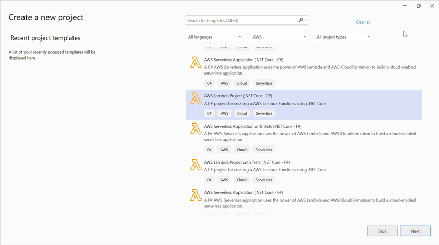

Step 2: Select **Blueprint as Empty Function** and click **Finish**.
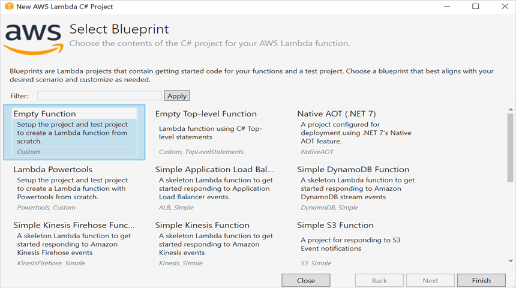

Step 3: Install the following **NuGet packages** in your application from [NuGet.org](https://www.nuget.org/).

* [Syncfusion.DocIORenderer.Net.Core](https://www.nuget.org/packages/Syncfusion.DocIORenderer.Net.Core) 
* [SkiaSharp.NativeAssets.Linux.NoDependencies v3.119.1](https://www.nuget.org/packages/SkiaSharp.NativeAssets.Linux.NoDependencies/3.119.1)

N> Starting with v16.2.0.x, if you reference Syncfusion&reg; assemblies from trial setup or from the NuGet feed, you also have to add "Syncfusion.Licensing" assembly reference and include a license key in your projects. Please refer to this [link](https://help.syncfusion.com/common/essential-studio/licensing/overview) to know about registering Syncfusion&reg; license key in your application to use our components.

Step 4: Create a **Data** folder in the project and copy the required data files into it, then include the files in the project. The following files are required:

* `Adventure.docx` — the input Word document.
* `calibri.ttf`, `arial.ttf`, `times.ttf` — fallback fonts used by the font substitution handler.

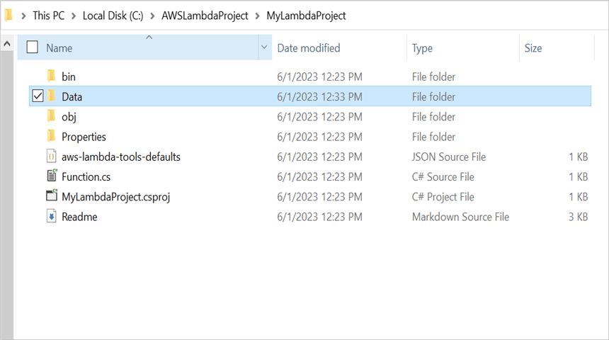

Step 5: Set the **Copy to Output Directory** property to **Copy if newer** for all the data files.
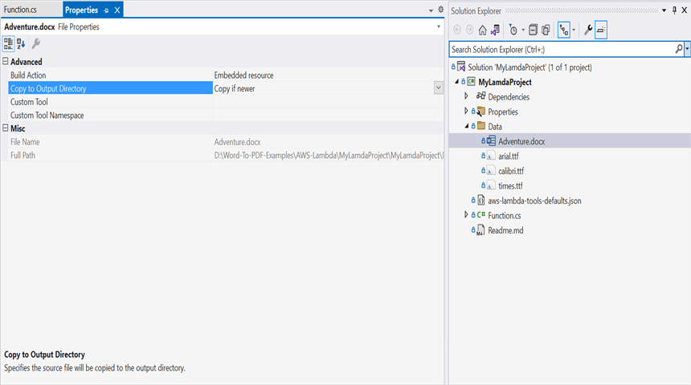

Step 6: In the **aws-lambda-tools-defaults.json** file, set the **function-handler** to your project's assembly and `FunctionHandler` method (for example, `MyLamdaProject::MyLamdaProject.Function::FunctionHandler`) and add the following environment variable to specify the library search paths for the AWS Lambda function. This configuration sets the **LD_LIBRARY_PATH** so the application can locate the required native libraries at runtime.





"function-handler": "MyLamdaProject::MyLamdaProject.Function::FunctionHandler",
"environment-variables": "\"LD_LIBRARY_PATH\"=\"/var/task:/tmp:/lib64:/usr/lib64\""





Step 7: Include the following namespaces in **Function.cs** file.





using Syncfusion.DocIO;
using Syncfusion.DocIO.DLS;
using Syncfusion.DocIORenderer;
using Syncfusion.Pdf;
using Syncfusion.Drawing;





Step 8: Add the following code snippet in **Function.cs** to convert a Word document to PDF.





/// 

/// A simple function that converts the bundled Word document to PDF and returns the PDF as a Base64 string.
/// 

/// <param name="input">The Lambda input payload (not used by this sample).</param>
/// <param name="context">The ILambdaContext that provides Lambda runtime information.</param>
/// <returns>The PDF document content as a Base64-encoded string.</returns>
public string FunctionHandler(string input, ILambdaContext context)
{
    string filePath = Path.GetFullPath(@"Data/Adventure.docx");    
    //Load the file from the disk
    FileStream fileStream = new FileStream(filePath, FileMode.Open, FileAccess.Read);
 
    WordDocument document = new WordDocument(fileStream, FormatType.Docx);
    //Hooks the font substitution event
    document.FontSettings.SubstituteFont += FontSettings_SubstituteFont;	
    DocIORenderer render = new DocIORenderer();
    PdfDocument pdf = render.ConvertToPDF(document);
    //Unhooks the font substitution event after converting to PDF
    document.FontSettings.SubstituteFont -= FontSettings_SubstituteFont;
    
    //Save the document into stream
    MemoryStream stream = new MemoryStream();
    //Save the PDF document  
    pdf.Save(stream);

    //Releases all resources used by the Word document and DocIO Renderer objects
    document.Close();
    render.Dispose();
    //Closes the PDF document
    pdf.Close();
    return Convert.ToBase64String(stream.ToArray());
}

//Set the alternate font when a specified font is not installed in the production environment.
private void FontSettings_SubstituteFont(object sender, SubstituteFontEventArgs args)
{
    if (args.OriginalFontName == "Calibri")
        args.AlternateFontStream = new FileStream(Path.GetFullPath(@"Data/calibri.ttf"), FileMode.Open, FileAccess.Read);
    else if (args.OriginalFontName == "Arial")
        args.AlternateFontStream = new FileStream(Path.GetFullPath(@"Data/arial.ttf"), FileMode.Open, FileAccess.Read);
    else
        args.AlternateFontStream = new FileStream(Path.GetFullPath(@"Data/times.ttf"), FileMode.Open, FileAccess.Read);
}





N> If using an older version of Syncfusion and Skiasharp NuGet as v2.88.8, there is a chance of encountering a libSkiaSharp not found exception during the conversion process.
To resolve this, refer to the code snippet provided in the documentation [here]( https://help.syncfusion.com/document-processing/faq/how-to-resolve-libskiasharp-not-found-exception-in-net8-and-net9-on-linux).

N> The sample above is designed for a manual Lambda invoke and is not wired to an API Gateway trigger. To expose the function over HTTPS, configure an API Gateway trigger with a proxy integration.

Step 9: Right-click the project and select **Publish to AWS Lambda**.
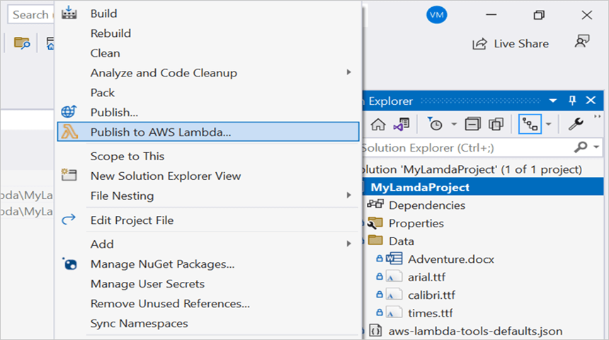

Step 10: In the Upload Lambda Function window, create a new AWS profile (or use an existing one) and enter a name for the Lambda function to publish. Then, click **Next**.
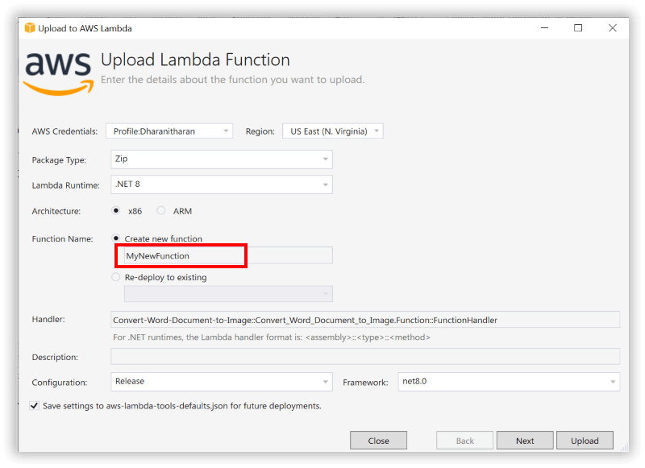

Step 11: In the Advanced Function Details window, attach an AWS-managed role (for example, a role with the `AWSLambdaBasicExecutionRole` managed policy) by entering its name in the **Role Name** field. After selecting the role, click the **Upload** button to deploy your application.
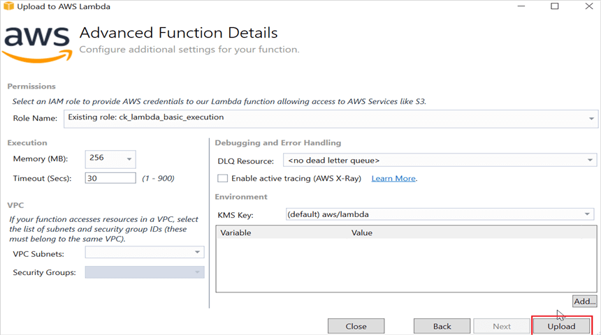

Step 12: After deploying the application, you can see the published Lambda function in **AWS console**.
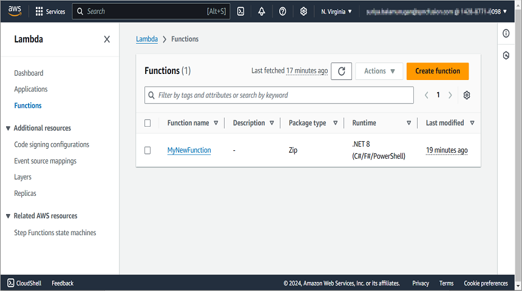

Step 13: Edit Memory size and Timeout as maximum in General configuration of the AWS Lambda function.
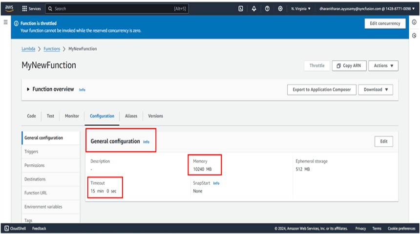

## Steps to post the request to AWS Lambda

After publishing the function, you can invoke it from a client application as follows.

Step 1: Create a new **.NET Core console project**.
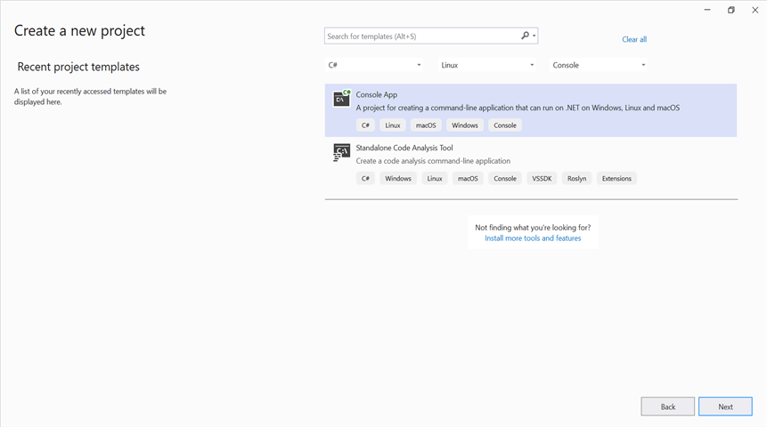

Step 2: Install the following **NuGet packages** in your application from [NuGet.org](https://www.nuget.org/).

* [AWSSDK.Core](https://www.nuget.org/packages/AWSSDK.Core/)
* [AWSSDK.Lambda](https://www.nuget.org/packages/AWSSDK.Lambda/)
* [Newtonsoft.Json](https://www.nuget.org/packages/Newtonsoft.Json/)
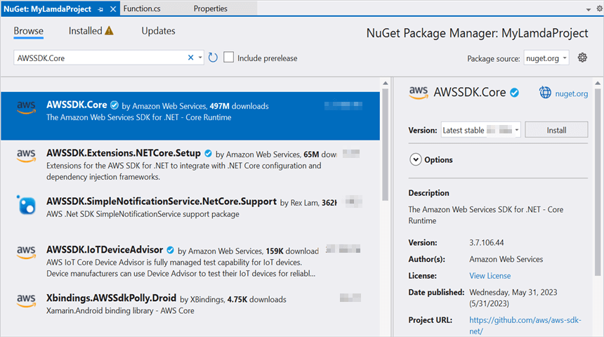
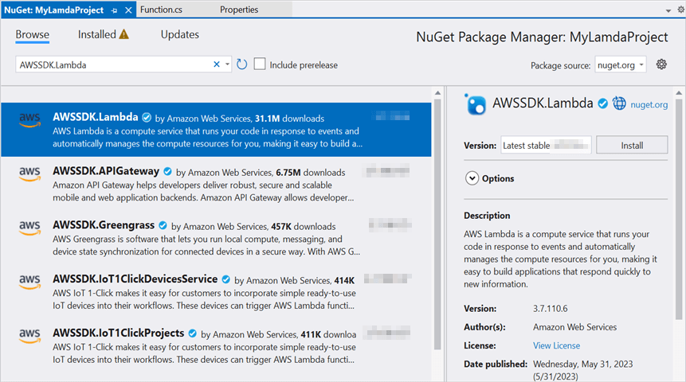
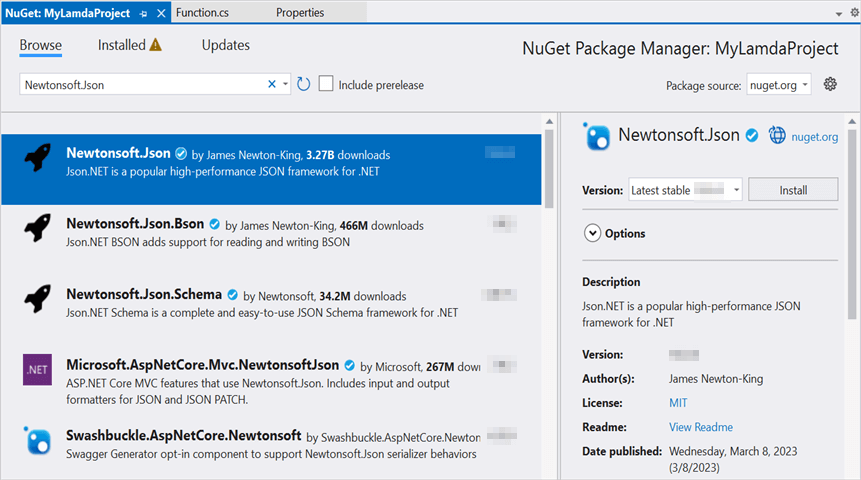

Step 3: Configure your AWS credentials (access key, secret key, and region) using the AWS credentials file, environment variables, or an IAM role. Avoid hard-coding credentials in source code.

Step 4: Include the following namespaces in **Program.cs** file.





using Amazon;
using Amazon.Lambda;
using Amazon.Lambda.Model;
using Newtonsoft.Json;





Step 4: Add the following code snippet in **Program.cs** to invoke the published AWS Lambda function using the function name and access keys.




//Create a new AmazonLambdaClient
AmazonLambdaClient client = new AmazonLambdaClient("awsaccessKeyID", "awsSecreteAccessKey", RegionEndpoint.USEast2);
 
//Create new InvokeRequest with published function name.
InvokeRequest invoke = new InvokeRequest
{
    FunctionName = "MyNewFunction",
    InvocationType = InvocationType.RequestResponse,
    Payload = "\"Test\""
};
//Get the InvokeResponse from client InvokeRequest.
InvokeResponse response = client.Invoke(invoke);
 
//Read the response stream
var stream = new StreamReader(response.Payload);
JsonReader reader = new JsonTextReader(stream);
var serilizer = new JsonSerializer();
var responseText = serilizer.Deserialize(reader);
//Convert Base64String into PDF document
byte[] bytes = Convert.FromBase64String(responseText.ToString());
FileStream fileStream = new FileStream("Sample.pdf", FileMode.Create);
BinaryWriter writer = new BinaryWriter(fileStream);
writer.Write(bytes, 0, bytes.Length);
writer.Close();
System.Diagnostics.Process.Start("Sample.pdf");





By executing the program, you will get the **PDF document** as follows.

From GitHub, you can download the [console application](https://github.com/SyncfusionExamples/DocIO-Examples/tree/main/Word-to-PDF-Conversion/Convert-Word-document-to-PDF/AWS/Console-App-.NET-Core) and [AWS Lambda](https://github.com/SyncfusionExamples/DocIO-Examples/tree/main/Word-to-PDF-Conversion/Convert-Word-document-to-PDF/AWS/MyLamdaProject) project.

Looking for the full .NET Word Library overview, features, pricing, and documentation? Visit the [.NET Word Library](https://www.syncfusion.com/document-sdk/net-word-library) page.

An online sample link to [convert Word document to PDF](https://document.syncfusion.com/demos/word/wordtopdf#/tailwind) in ASP.NET Core. 