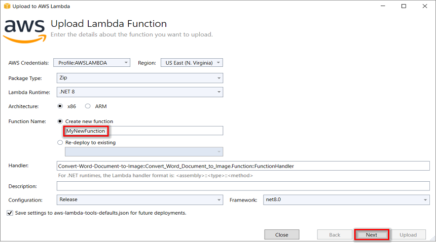
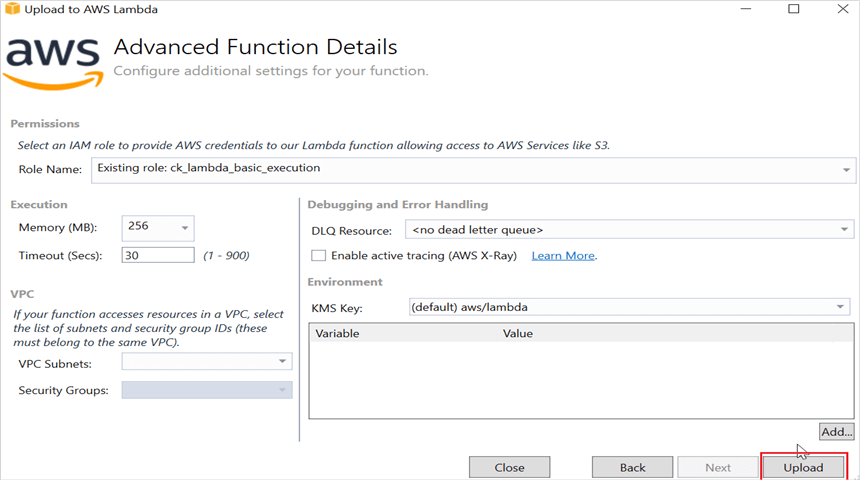
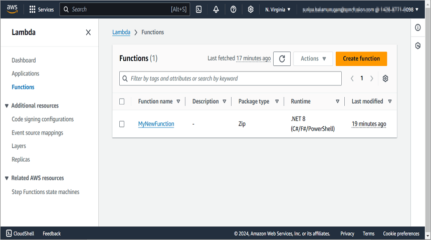

# Convert Word Document to PDF in AWS Lambda

Syncfusion&reg; DocIO is a [.NET Core Word library](https://www.syncfusion.com/document-processing/word-framework/net-core/word-library) used to create, read, edit and **convert Word documents** programmatically without **Microsoft Word** or interop dependencies. Using this library, you can **convert a Word document to PDF in AWS Lambda**.

## Steps to convert Word document to PDF in AWS Lambda

Step 1: Create a new **AWS Lambda project** as follows.

Step 2: Select Blueprint as Empty Function and click **Finish**.

Step 3: Install the following **Nuget packages** in your application from [Nuget.org](https://www.nuget.org/).

* [Syncfusion.DocIORenderer.Net.Core](https://www.nuget.org/packages/Syncfusion.DocIORenderer.Net.Core) 
* [SkiaSharp.NativeAssets.Linux.NoDependencies v2.88.8](https://www.nuget.org/packages/SkiaSharp.NativeAssets.Linux.NoDependencies/2.88.8)

N> Starting with v16.2.0.x, if you reference Syncfusion&reg; assemblies from trial setup or from the NuGet feed, you also have to add "Syncfusion.Licensing" assembly reference and include a license key in your projects. Please refer to this [link](https://help.syncfusion.com/common/essential-studio/licensing/overview) to know about registering Syncfusion&reg; license key in your application to use our components.

Step 4: Create a folder and copy the required data files and include the files to the project.

Step 5: Set the **copy to output directory** to **Copy if newer** to all the data files.

Step 6: Add the following environment variable in the **aws-lambda-tools-defaults.json** file to specify the library search paths for the AWS Lambda function. This configuration sets the **LD_LIBRARY_PATH**, allowing the application to locate the required native libraries at runtime.





"environment-variables": "\"LD_LIBRARY_PATH\"=\"/var/task:/tmp:/lib64:/usr/lib64\""





Step 7: Defining library paths in an AWS Lambda project enables the application to locate the necessary native libraries at runtime. This is essential for ensuring that the application functions correctly across different environments. The following code snippet illustrates how to define these paths.





//Path to the original library file.
string originalLibraryPath = "/lib64/libdl.so.2";

//Path to the symbolic link where the library will be copied.
string symlinkLibraryPath = "/tmp/libdl.so";





Step 8: Include the following namespaces in **Function.cs** file.





using Syncfusion.DocIO;
using Syncfusion.DocIO.DLS;
using Syncfusion.DocIORenderer;
using Syncfusion.Pdf;
using Syncfusion.Drawing;





step 9: Add the following code snippet in **Function.cs** to convert a Word document to PDF.





/// 

/// A simple function that takes a string and does a ToUpper
/// 

/// <param name="input"></param>
/// <param name="context"></param>
/// <returns></returns>
public string FunctionHandler(string input, ILambdaContext context)
{
    //Path to the original library file.
    string originalLibraryPath = "/lib64/libdl.so.2";

    //Path to the symbolic link where the library will be copied.
    string symlinkLibraryPath = "/tmp/libdl.so";

    //Check if the original library file exists.
    if (File.Exists(originalLibraryPath))
    {
        //Copy the original library file to the symbolic link path, overwriting if it already exists.
        File.Copy(originalLibraryPath, symlinkLibraryPath, true);
    }

    string filePath = Path.GetFullPath(@"Data/Adventure.docx");    
    //Load the file from the disk
    FileStream fileStream = new FileStream(filePath, FileMode.Open, FileAccess.Read);
 
    WordDocument document = new WordDocument(fileStream, FormatType.Docx);
    //Hooks the font substitution event
    document.FontSettings.SubstituteFont += FontSettings_SubstituteFont;	
    DocIORenderer render = new DocIORenderer();
    PdfDocument pdf = render.ConvertToPDF(document);
    //Unhooks the font substitution event after converting to PDF
    document.FontSettings.SubstituteFont -= FontSettings_SubstituteFont;
    
    //Save the document into stream
    MemoryStream stream = new MemoryStream();
    //Save the PDF document  
    pdf.Save(stream);

    //Releases all resources used by the Word document and DocIO Renderer objects
    document.Close();
    render.Dispose();
    //Closes the PDF document
    pdf.Close();
    return Convert.ToBase64String(stream.ToArray());
}

//Set the alternate font when a specified font is not installed in the production environment.
private void FontSettings_SubstituteFont(object sender, SubstituteFontEventArgs args)
{
    if (args.OriginalFontName == "Calibri")
        args.AlternateFontStream = new FileStream(Path.GetFullPath(@"Data/calibri.ttf"), FileMode.Open, FileAccess.Read);
    else if (args.OriginalFontName == "Arial")
        args.AlternateFontStream = new FileStream(Path.GetFullPath(@"Data/arial.ttf"), FileMode.Open, FileAccess.Read);
    else
        args.AlternateFontStream = new FileStream(Path.GetFullPath(@"Data/times.ttf"), FileMode.Open, FileAccess.Read);
}





Step 10: Right-click the project and select **Publish to AWS Lambda**.

Step 11: Create a new AWS profile in the Upload Lambda Function Window. After creating the profile, add a name for the Lambda function to publish. Then, click **Next**.

Step 12: In the Advanced Function Details window, specify the **Role Name** as based on AWS Managed policy. After selecting the role, click the **Upload** button to deploy your application.

Step 13: After deploying the application, you can see the published Lambda function in **AWS console**.

Step 14: Edit Memory size and Timeout as maximum in General configuration of the AWS Lambda function.

## Steps to post the request to AWS Lambda

Step 1: Create a new console project.

step 2: Install the following **Nuget packages** in your application from [Nuget.org](https://www.nuget.org/).

* [AWSSDK.Core](https://www.nuget.org/packages/AWSSDK.Core/)
* [AWSSDK.Lambda](https://www.nuget.org/packages/AWSSDK.Lambda/)
* [Newtonsoft.Json](https://www.nuget.org/packages/Newtonsoft.Json/)

Step 3: Include the following namespaces in **Program.cs** file.





using Amazon;
using Amazon.Lambda;
using Amazon.Lambda.Model;
using Newtonsoft.Json;





Step 4: Add the following code snippet in **Program.cs** to invoke the published AWS Lambda function using the function name and access keys.




//Create a new AmazonLambdaClient
AmazonLambdaClient client = new AmazonLambdaClient("awsaccessKeyID", "awsSecreteAccessKey", RegionEndpoint.USEast2);
 
//Create new InvokeRequest with published function name.
InvokeRequest invoke = new InvokeRequest
{
    FunctionName = "MyNewFunction",
    InvocationType = InvocationType.RequestResponse,
    Payload = "\"Test\""
};
//Get the InvokeResponse from client InvokeRequest.
InvokeResponse response = client.Invoke(invoke);
 
//Read the response stream
var stream = new StreamReader(response.Payload);
JsonReader reader = new JsonTextReader(stream);
var serilizer = new JsonSerializer();
var responseText = serilizer.Deserialize(reader);
//Convert Base64String into PDF document
byte[] bytes = Convert.FromBase64String(responseText.ToString());
FileStream fileStream = new FileStream("Sample.pdf", FileMode.Create);
BinaryWriter writer = new BinaryWriter(fileStream);
writer.Write(bytes, 0, bytes.Length);
writer.Close();
System.Diagnostics.Process.Start("Sample.pdf");





By executing the program, you will get the **PDF document** as follows.

From GitHub, you can download the [console application](https://github.com/SyncfusionExamples/DocIO-Examples/tree/main/Word-to-PDF-Conversion/Convert-Word-document-to-PDF/AWS/Console-App-.NET-Core) and [AWS Lambda](https://github.com/SyncfusionExamples/DocIO-Examples/tree/main/Word-to-PDF-Conversion/Convert-Word-document-to-PDF/AWS/MyLamdaProject) project.

Click [here](https://www.syncfusion.com/document-processing/word-framework/net-core) to explore the rich set of Syncfusion&reg; Word library (DocIO) features. 

An online sample link to [convert Word document to PDF](https://ej2.syncfusion.com/aspnetcore/Word/WordToPDF#/material3) in ASP.NET Core. 